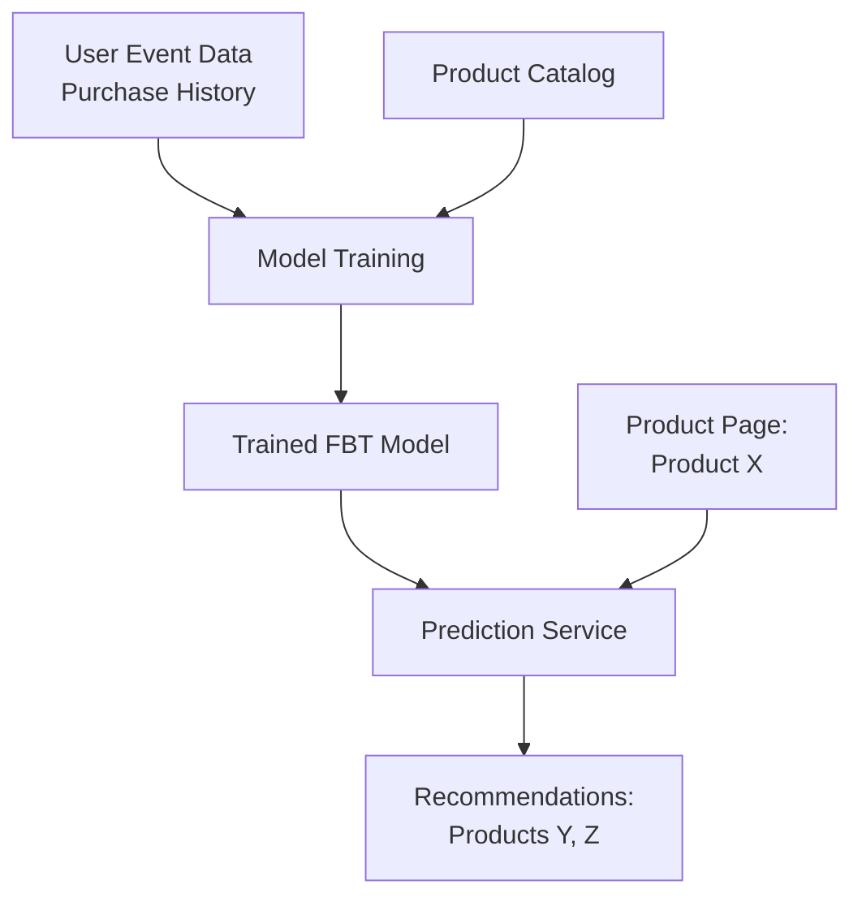

# How to Train a Frequently Bought Together Recommendation Model with Vertex AI Search for Commerce

Author: [nawazdhandala](https://www.github.com/nawazdhandala)

Tags: GCP, Vertex AI, Search for Commerce, Recommendations, E-Commerce, Machine Learning, Google Cloud

Description: Train a frequently bought together recommendation model using Vertex AI Search for Commerce to increase cross-sell revenue on your e-commerce platform.

---

"Frequently bought together" recommendations are responsible for a significant chunk of e-commerce revenue. Amazon famously attributes a large portion of its sales to recommendations. Building these models from scratch requires collecting purchase history, mining association rules or training collaborative filtering models, and serving predictions at low latency. Vertex AI Search for Commerce handles all of this for you - you feed it user event data and product catalog information, and it trains a model that returns product recommendations.

In this post, I will cover the full workflow: preparing your data, training the recommendation model, evaluating it, and serving predictions in your application.

## How It Works

The "frequently bought together" model analyzes co-purchase patterns across your customer base. When customer A buys products X, Y, and Z together, and hundreds of other customers also buy X and Y together, the model learns that X and Y are strongly associated. This is different from "recommended for you" personalization, which considers individual user preferences.



## Prerequisites

You need:

- Vertex AI Search for Commerce set up with a product catalog imported
- At least 30 days of user event data (searches, product views, add-to-cart, purchases)
- Minimum of 100 unique purchase events for meaningful recommendations
- The Retail API enabled on your project

## Step 1: Record Purchase Events

The model needs purchase data to learn co-purchase patterns. If you are just starting out, you need to begin collecting this data immediately. The more data you have, the better the recommendations.

This script records purchase events with all the details the model needs:

```python
from google.cloud import retail_v2
import time

def record_purchase(project_id, visitor_id, order_id, products):
    """Records a purchase event with multiple products.

    Args:
        products: List of dicts with 'id', 'quantity', and 'price' keys
    """
    client = retail_v2.UserEventServiceClient()
    parent = f"projects/{project_id}/locations/global/catalogs/default_catalog"

    # Build product details for each item in the order
    product_details = []
    for product in products:
        product_details.append(
            retail_v2.ProductDetail(
                product=retail_v2.Product(id=product["id"]),
                quantity={"value": product["quantity"]},
            )
        )

    # Create the purchase event
    user_event = retail_v2.UserEvent(
        event_type="purchase-complete",
        visitor_id=visitor_id,
        event_time={"seconds": int(time.time())},
        product_details=product_details,
        purchase_transaction=retail_v2.PurchaseTransaction(
            id=order_id,
            revenue=sum(p["price"] * p["quantity"] for p in products),
            currency_code="USD",
        ),
    )

    response = client.write_user_event(
        parent=parent,
        user_event=user_event,
    )
    print(f"Purchase event recorded for order {order_id}")
    return response

# Example: Record a purchase with multiple items
record_purchase(
    "my-project",
    "visitor-456",
    "order-789",
    [
        {"id": "sku-running-shoes", "quantity": 1, "price": 129.99},
        {"id": "sku-running-socks", "quantity": 2, "price": 12.99},
        {"id": "sku-shoe-insoles", "quantity": 1, "price": 24.99},
    ]
)
```

For bulk importing historical events, use the batch import:

```python
def import_historical_events(project_id, gcs_bucket, events_file):
    """Imports historical user events from Cloud Storage."""
    client = retail_v2.UserEventServiceClient()
    parent = f"projects/{project_id}/locations/global/catalogs/default_catalog"

    # Configure the GCS source for batch import
    input_config = retail_v2.UserEventInputConfig(
        gcs_source=retail_v2.GcsSource(
            input_uris=[f"gs://{gcs_bucket}/{events_file}"],
            data_schema="user_event",
        )
    )

    request = retail_v2.ImportUserEventsRequest(
        parent=parent,
        input_config=input_config,
    )

    # This is a long-running operation for large event files
    operation = client.import_user_events(request=request)
    print("Importing historical events...")
    result = operation.result(timeout=3600)
    print(f"Import complete. Success: {result.import_summary.joined_events_count}")
    return result

import_historical_events("my-project", "my-events-bucket", "purchase_events.json")
```

## Step 2: Verify Event Data Quality

Before training, check that your event data meets the minimum requirements and is properly linked to products in your catalog.

This script checks your event data quality:

```python
from google.cloud import retail_v2

def check_event_data(project_id):
    """Checks the quality and quantity of recorded user events."""
    client = retail_v2.UserEventServiceClient()
    parent = f"projects/{project_id}/locations/global/catalogs/default_catalog"

    # Use the rejoin API to check for unjoined events
    # Unjoined events reference products not in the catalog
    request = retail_v2.RejoinUserEventsRequest(
        parent=parent,
        user_event_rejoin_scope=retail_v2.RejoinUserEventsRequest.UserEventRejoinScope.UNJOINED_EVENTS,
    )

    operation = client.rejoin_user_events(request=request)
    result = operation.result(timeout=300)
    print(f"Rejoined events: {result.rejoined_user_events_count}")

check_event_data("my-project")
```

## Step 3: Create and Train the Model

Now create a recommendation model of type "frequently-bought-together". The training process analyzes your purchase data and builds the association model.

This script creates and trains the FBT model:

```python
from google.cloud import retail_v2

def train_fbt_model(project_id, catalog_id="default_catalog"):
    """Creates and trains a frequently bought together model."""
    client = retail_v2.ModelServiceClient()
    parent = f"projects/{project_id}/locations/global/catalogs/{catalog_id}"

    # Define the model configuration
    model = retail_v2.Model(
        display_name="frequently-bought-together-v1",
        type_="frequently-bought-together",
        optimization_objective="ctr",
        # The data time range for training
        training_state=retail_v2.Model.TrainingState.TRAINING,
        # Periodic retraining keeps the model fresh
        periodic_tuning_state=retail_v2.Model.PeriodicTuningState.PERIODIC_TUNING_ENABLED,
    )

    # Create and train the model
    operation = client.create_model(
        parent=parent,
        model=model,
    )

    print("Model training started. This may take several hours...")
    result = operation.result(timeout=86400)  # Up to 24 hours
    print(f"Model training complete: {result.name}")
    print(f"Serving state: {result.serving_state}")
    return result

train_fbt_model("my-project")
```

## Step 4: Check Model Training Status

Model training can take several hours. Monitor the status periodically.

```python
from google.cloud import retail_v2

def check_model_status(project_id, model_name):
    """Checks the current status of a recommendation model."""
    client = retail_v2.ModelServiceClient()

    full_name = (
        f"projects/{project_id}/locations/global"
        f"/catalogs/default_catalog/models/{model_name}"
    )

    model = client.get_model(name=full_name)
    print(f"Model: {model.display_name}")
    print(f"Type: {model.type_}")
    print(f"Training state: {model.training_state}")
    print(f"Serving state: {model.serving_state}")
    print(f"Last tune time: {model.last_tune_time}")
    return model

check_model_status("my-project", "frequently-bought-together-v1")
```

## Step 5: Serve Predictions

Once the model is trained and serving, you can request recommendations for any product.

This function fetches FBT recommendations for a given product:

```python
from google.cloud import retail_v2

def get_fbt_recommendations(project_id, product_id, visitor_id, num_results=5):
    """Gets frequently bought together recommendations for a product."""
    client = retail_v2.PredictionServiceClient()

    # The placement points to your trained model's serving config
    placement = (
        f"projects/{project_id}/locations/global"
        f"/catalogs/default_catalog/placements/product_detail"
    )

    # Build the prediction request
    request = retail_v2.PredictRequest(
        placement=placement,
        user_event=retail_v2.UserEvent(
            event_type="detail-page-view",
            visitor_id=visitor_id,
            product_details=[
                retail_v2.ProductDetail(
                    product=retail_v2.Product(id=product_id)
                )
            ],
        ),
        page_size=num_results,
        params={
            "returnProduct": True,
        },
    )

    response = client.predict(request=request)

    # Process recommendations
    recommendations = []
    for result in response.results:
        product = result.product
        recommendations.append({
            "id": product.id,
            "title": product.title,
            "price": product.price_info.price if product.price_info else None,
            "image": product.images[0].uri if product.images else None,
        })

    return recommendations

# Get recommendations for a running shoe product page
recs = get_fbt_recommendations("my-project", "sku-running-shoes", "visitor-123")
for rec in recs:
    print(f"  Recommended: {rec['title']} - ${rec['price']}")
```

## Step 6: Integrate with Your Frontend

Here is a simple frontend integration using a REST API endpoint and JavaScript:

```javascript
// Fetch and display FBT recommendations on the product page
async function loadFBTRecommendations(productId) {
  // Call your backend API that wraps the Retail API
  const response = await fetch(`/api/recommendations/fbt?product=${productId}`);
  const data = await response.json();

  const container = document.getElementById('fbt-recommendations');
  container.innerHTML = '<h3>Frequently Bought Together</h3>';

  // Render each recommended product
  data.recommendations.forEach(product => {
    const card = document.createElement('div');
    card.className = 'product-card';
    card.innerHTML = `
      
      <h4>${product.title}</h4>
      <p>$${product.price.toFixed(2)}</p>
      <button onclick="addToCart('${product.id}')">Add to Cart</button>
    `;
    container.appendChild(card);
  });
}

// Load recommendations when the product page loads
document.addEventListener('DOMContentLoaded', () => {
  const productId = document.getElementById('product-detail').dataset.productId;
  loadFBTRecommendations(productId);
});
```

## Summary

Training a frequently bought together model with Vertex AI Search for Commerce comes down to three things: good product data, sufficient purchase history, and proper event recording. The model handles the heavy lifting of finding co-purchase patterns across your customer base. Start collecting purchase events as early as possible, aim for at least 30 days of data before training, and set up periodic retraining to keep recommendations fresh as buying patterns shift seasonally. The ROI on cross-sell recommendations is well documented, and Vertex AI Search for Commerce makes it accessible without a dedicated ML team.
