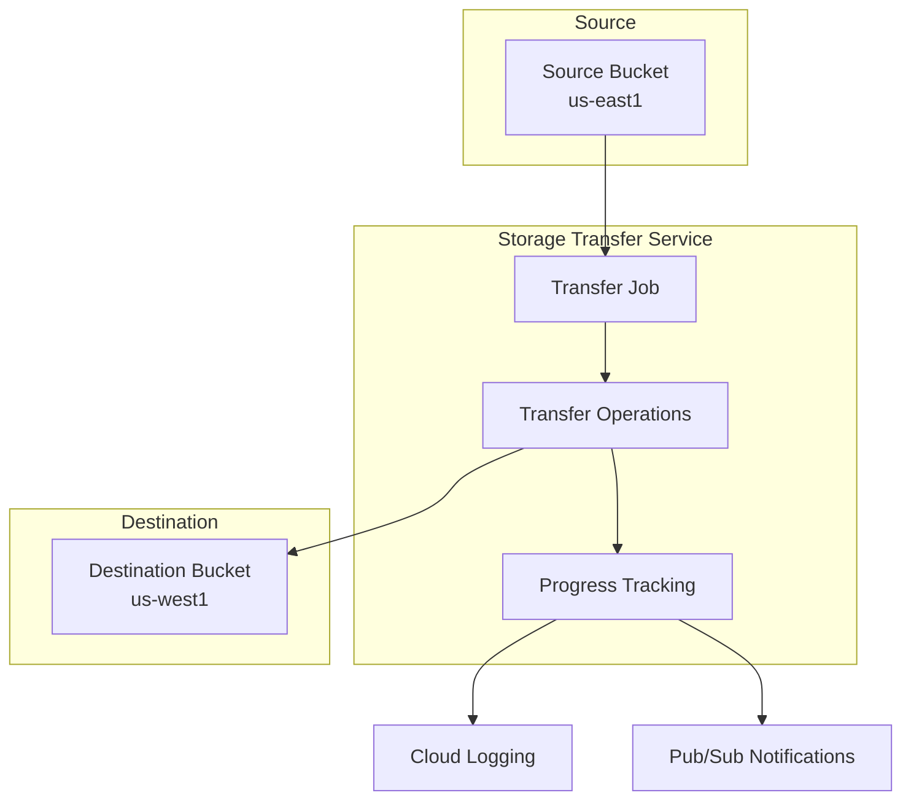

# How to Transfer Data Between Buckets Using Google Cloud Storage Transfer Service

Author: [nawazdhandala](https://www.github.com/nawazdhandala)

Tags: GCP, Google Cloud Storage, Storage Transfer Service, Data Migration, Cloud Operations

Description: A practical guide to using Google Cloud Storage Transfer Service to move and sync data between buckets, across regions, and from other cloud providers.

---

Moving data between Cloud Storage buckets sounds simple until you need to transfer terabytes of data, schedule regular syncs, or move data between different regions or projects. The Storage Transfer Service handles all of this, running server-side transfers that are faster and more reliable than downloading and re-uploading through your local machine.

This guide covers how to set up transfers between GCS buckets, schedule recurring jobs, and handle common migration scenarios.

## When to Use Storage Transfer Service

Use Storage Transfer Service instead of `gcloud storage cp` when you need to:

- Transfer large amounts of data (hundreds of GB or more)
- Schedule recurring data syncs
- Move data between different GCP projects
- Transfer from other cloud providers (AWS S3, Azure Blob Storage)
- Apply filters to transfer only specific objects
- Run transfers without tying up a local machine or VM

For small, one-off transfers (under a few GB), `gcloud storage cp` is simpler. For everything else, Storage Transfer Service is the better tool.

## Setting Up Permissions

The Storage Transfer Service uses a Google-managed service account. You need to grant it the right permissions on both the source and destination buckets.

```bash
# Find the Storage Transfer Service account for your project
gcloud transfer service-account --project=my-project-id
```

This returns a service account like `project-123456789@storage-transfer-service.iam.gserviceaccount.com`.

Grant it access to both buckets:

```bash
# Grant read access on the source bucket
gcloud storage buckets add-iam-policy-binding gs://source-bucket \
  --member="serviceAccount:project-123456789@storage-transfer-service.iam.gserviceaccount.com" \
  --role="roles/storage.objectViewer"

# Grant write access on the destination bucket
gcloud storage buckets add-iam-policy-binding gs://destination-bucket \
  --member="serviceAccount:project-123456789@storage-transfer-service.iam.gserviceaccount.com" \
  --role="roles/storage.objectCreator"
```

If you want the transfer to delete objects from the source after copying:

```bash
# Grant delete permission on the source bucket (if needed)
gcloud storage buckets add-iam-policy-binding gs://source-bucket \
  --member="serviceAccount:project-123456789@storage-transfer-service.iam.gserviceaccount.com" \
  --role="roles/storage.objectAdmin"
```

## Creating a One-Time Transfer

The simplest transfer copies everything from one bucket to another:

```bash
# Create a one-time transfer job between two buckets
gcloud transfer jobs create \
  gs://source-bucket \
  gs://destination-bucket \
  --name=my-migration-job \
  --description="Migrate data from source to destination"
```

The job starts immediately and runs until all objects are transferred.

## Transferring with Prefix Filters

To transfer only objects under a specific path:

```bash
# Transfer only objects under the data/2026/ prefix
gcloud transfer jobs create \
  gs://source-bucket \
  gs://destination-bucket \
  --name=transfer-2026-data \
  --include-prefixes="data/2026/"
```

You can also exclude specific prefixes:

```bash
# Transfer everything except temp files
gcloud transfer jobs create \
  gs://source-bucket \
  gs://destination-bucket \
  --name=transfer-excluding-temp \
  --exclude-prefixes="tmp/,temp/,cache/"
```

## Scheduling Recurring Transfers

For regular data syncs, schedule the transfer to run on a recurring basis:

```bash
# Schedule a daily transfer at 2:00 AM UTC
gcloud transfer jobs create \
  gs://source-bucket \
  gs://destination-bucket \
  --name=daily-sync-job \
  --schedule-starts="2026-02-17T02:00:00Z" \
  --schedule-repeats-every="1d"
```

To schedule with a start and end date:

```bash
# Run daily from Feb 17 to Mar 17, 2026
gcloud transfer jobs create \
  gs://source-bucket \
  gs://destination-bucket \
  --name=monthly-sync \
  --schedule-starts="2026-02-17T02:00:00Z" \
  --schedule-repeats-every="1d" \
  --schedule-repeats-until="2026-03-17T02:00:00Z"
```

## Transfer Options

### Overwrite Behavior

By default, the transfer service checks if the destination object exists and has the same data before transferring. You can control this:

```bash
# Always overwrite destination objects, even if they are the same
gcloud transfer jobs create \
  gs://source-bucket \
  gs://destination-bucket \
  --name=force-overwrite-job \
  --overwrite-when=always
```

Options for `--overwrite-when`:
- `different` (default) - only transfer if source and destination differ
- `always` - always overwrite
- `never` - skip objects that exist at the destination

### Delete After Transfer

To move data (copy then delete from source):

```bash
# Move objects: copy to destination, then delete from source
gcloud transfer jobs create \
  gs://source-bucket \
  gs://destination-bucket \
  --name=move-data-job \
  --delete-from=source-after-transfer
```

### Delete Extra Destination Objects

To make the destination an exact mirror of the source:

```bash
# Sync destination to match source exactly (delete extra objects)
gcloud transfer jobs create \
  gs://source-bucket \
  gs://destination-bucket \
  --name=mirror-sync-job \
  --delete-from=destination-if-unique
```

## Monitoring Transfer Jobs

Check the status of a running transfer:

```bash
# List all transfer jobs
gcloud transfer jobs list

# Describe a specific job to see its status and progress
gcloud transfer jobs describe my-migration-job

# Monitor a running transfer operation
gcloud transfer jobs monitor my-migration-job
```

The monitor command shows real-time progress including bytes transferred, objects transferred, and estimated completion time.

## Transfer Between Different Projects

To transfer between buckets in different projects, you need to:

1. Grant the source project's transfer service account access to the destination bucket
2. Or grant the destination project's transfer service account access to the source bucket

```bash
# Example: Transfer from project-a bucket to project-b bucket
# Using project-b's transfer service account

# Get project-b's transfer service account
gcloud transfer service-account --project=project-b

# Grant it read access on the source bucket in project-a
gcloud storage buckets add-iam-policy-binding gs://project-a-bucket \
  --member="serviceAccount:project-B_NUMBER@storage-transfer-service.iam.gserviceaccount.com" \
  --role="roles/storage.objectViewer" \
  --project=project-a

# Create the transfer job from project-b
gcloud transfer jobs create \
  gs://project-a-bucket \
  gs://project-b-bucket \
  --name=cross-project-transfer \
  --project=project-b
```

## Using the Python Client Library

For programmatic control over transfers:

```python
from google.cloud import storage_transfer_v1
from google.protobuf.duration_pb2 import Duration
from datetime import datetime

def create_transfer_job(project_id, source_bucket, dest_bucket, description):
    """Create a one-time transfer job between two GCS buckets."""
    client = storage_transfer_v1.StorageTransferServiceClient()

    now = datetime.utcnow()

    # Define the transfer job configuration
    transfer_job = storage_transfer_v1.TransferJob(
        project_id=project_id,
        description=description,
        transfer_spec=storage_transfer_v1.TransferSpec(
            gcs_data_source=storage_transfer_v1.GcsData(
                bucket_name=source_bucket,
                path="data/",  # Optional: only transfer from this prefix
            ),
            gcs_data_sink=storage_transfer_v1.GcsData(
                bucket_name=dest_bucket,
            ),
            transfer_options=storage_transfer_v1.TransferOptions(
                overwrite_objects_already_existing_in_sink=False,
            ),
        ),
        # Schedule to run immediately
        schedule=storage_transfer_v1.Schedule(
            schedule_start_date={
                "year": now.year,
                "month": now.month,
                "day": now.day,
            },
            schedule_end_date={
                "year": now.year,
                "month": now.month,
                "day": now.day,
            },
        ),
        status=storage_transfer_v1.TransferJob.Status.ENABLED,
    )

    result = client.create_transfer_job(
        storage_transfer_v1.CreateTransferJobRequest(
            transfer_job=transfer_job
        )
    )

    print(f"Created transfer job: {result.name}")
    return result

# Create the transfer
create_transfer_job(
    "my-project-id",
    "source-bucket",
    "destination-bucket",
    "Migrate data directory to new bucket"
)
```

## Transfer Architecture Overview



## Performance Tips

**Transfers run server-side.** Data moves within Google's network, so cross-region transfers are much faster than downloading and re-uploading.

**Bandwidth is managed automatically.** The service scales based on the amount of data. Large transfers can move terabytes efficiently.

**Use prefix filters.** If you only need a subset of data, filtering reduces transfer time and avoids unnecessary copies.

**Schedule off-peak transfers.** If the source bucket is actively serving traffic, schedule transfers during low-usage periods to avoid impacting performance.

**Monitor with Cloud Logging.** Transfer operations generate detailed logs that you can query in Cloud Logging for troubleshooting.

## Cleaning Up

To delete a transfer job:

```bash
# Delete a transfer job that is no longer needed
gcloud transfer jobs delete my-migration-job
```

To pause a recurring job without deleting it:

```bash
# Disable a transfer job (pauses future runs)
gcloud transfer jobs update my-daily-sync \
  --status=disabled
```

Storage Transfer Service takes the pain out of moving data between buckets. Whether you are migrating to a new region, setting up cross-project data sharing, or maintaining regular backups, it handles the heavy lifting reliably and efficiently.
