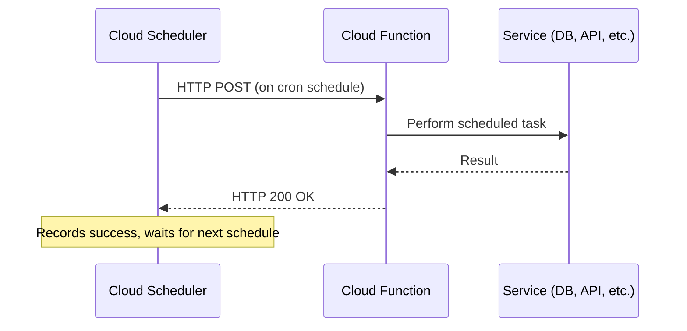

# How to Trigger a Cloud Function on a Schedule Using Cloud Scheduler

Author: [nawazdhandala](https://www.github.com/nawazdhandala)

Tags: GCP, Cloud Functions, Cloud Scheduler, Cron, Serverless

Description: Step-by-step guide to triggering Google Cloud Functions on a recurring schedule using Cloud Scheduler with proper authentication and configuration.

---

One of the most common patterns in cloud development is running a function on a schedule. Clean up old files every night, sync data every hour, send a weekly report - these are all tasks that fit perfectly into a Cloud Function triggered by Cloud Scheduler. In this post, I will walk you through setting this up from scratch, including the function deployment, scheduler configuration, and authentication setup.

## How the Integration Works

Cloud Scheduler triggers a Cloud Function by making an HTTP request to the function's URL on a defined cron schedule. For HTTP-triggered Cloud Functions, the scheduler sends a request (typically POST) with optional headers and body data. The function processes the request and returns a response. If the function returns an error, Cloud Scheduler can retry based on your retry configuration.



## Step 1: Write the Cloud Function

Let me create a practical example - a function that cleans up expired user sessions from a Firestore database.

```javascript
// index.js
// Cloud Function that cleans up expired sessions from Firestore
const { Firestore } = require("@google-cloud/firestore");

const firestore = new Firestore();

exports.cleanupExpiredSessions = async (req, res) => {
  // Log the invocation source for debugging
  console.log("Session cleanup triggered", {
    scheduledTime: req.headers["x-cloudscheduler-scheduletime"] || "manual",
    jobName: req.headers["x-cloudscheduler-jobname"] || "unknown",
  });

  try {
    // Calculate the cutoff time (24 hours ago)
    const cutoffTime = new Date(Date.now() - 24 * 60 * 60 * 1000);

    // Query for expired sessions
    const expiredSessions = await firestore
      .collection("sessions")
      .where("expiresAt", "<", cutoffTime)
      .limit(500) // Process in batches to avoid timeouts
      .get();

    if (expiredSessions.empty) {
      console.log("No expired sessions found");
      res.status(200).json({ deleted: 0, message: "No expired sessions" });
      return;
    }

    // Delete expired sessions in a batch
    const batch = firestore.batch();
    let deleteCount = 0;

    expiredSessions.forEach((doc) => {
      batch.delete(doc.ref);
      deleteCount++;
    });

    await batch.commit();

    console.log(`Deleted ${deleteCount} expired sessions`);
    res
      .status(200)
      .json({ deleted: deleteCount, message: "Cleanup complete" });
  } catch (error) {
    console.error("Cleanup failed:", error);
    // Return 500 so Cloud Scheduler knows to retry
    res.status(500).json({ error: error.message });
  }
};
```

And the package.json.

```json
{
  "name": "session-cleanup",
  "version": "1.0.0",
  "dependencies": {
    "@google-cloud/firestore": "^7.0.0"
  }
}
```

## Step 2: Deploy the Cloud Function

Deploy the function with an HTTP trigger.

```bash
# Deploy the Cloud Function (2nd gen)
gcloud functions deploy cleanup-expired-sessions \
  --gen2 \
  --runtime=nodejs20 \
  --region=us-central1 \
  --source=. \
  --entry-point=cleanupExpiredSessions \
  --trigger-http \
  --timeout=120s \
  --memory=256MB \
  --no-allow-unauthenticated \
  --service-account=function-sa@YOUR_PROJECT_ID.iam.gserviceaccount.com
```

The `--no-allow-unauthenticated` flag is important. It means only authenticated callers can invoke the function, which is exactly what we want when Cloud Scheduler is the trigger.

## Step 3: Set Up the Service Account

Create a service account for Cloud Scheduler that has permission to invoke the function.

```bash
# Create the scheduler service account
gcloud iam service-accounts create scheduler-invoker \
  --display-name="Cloud Scheduler Function Invoker"

# Grant it the Cloud Functions Invoker role
gcloud functions add-invoker-policy-binding cleanup-expired-sessions \
  --region=us-central1 \
  --member="serviceAccount:scheduler-invoker@YOUR_PROJECT_ID.iam.gserviceaccount.com"
```

For 2nd gen functions (which run on Cloud Run under the hood), you may also need:

```bash
# For 2nd gen functions, grant Cloud Run invoker role
gcloud run services add-iam-policy-binding cleanup-expired-sessions \
  --region=us-central1 \
  --member="serviceAccount:scheduler-invoker@YOUR_PROJECT_ID.iam.gserviceaccount.com" \
  --role="roles/run.invoker"
```

## Step 4: Create the Cloud Scheduler Job

Now create the scheduler job that triggers the function.

```bash
# Get the function URL
FUNCTION_URL=$(gcloud functions describe cleanup-expired-sessions \
  --region=us-central1 \
  --format="value(serviceConfig.uri)")

# Create the scheduler job to run every night at 3 AM UTC
gcloud scheduler jobs create http session-cleanup-nightly \
  --location=us-central1 \
  --schedule="0 3 * * *" \
  --uri="${FUNCTION_URL}" \
  --http-method=POST \
  --message-body='{"source": "scheduler"}' \
  --headers="Content-Type=application/json" \
  --oidc-service-account-email=scheduler-invoker@YOUR_PROJECT_ID.iam.gserviceaccount.com \
  --oidc-token-audience="${FUNCTION_URL}" \
  --time-zone="UTC" \
  --attempt-deadline="180s" \
  --max-retry-attempts=3 \
  --min-backoff="30s" \
  --description="Nightly cleanup of expired user sessions"
```

A few things to note:
- We use `--oidc-service-account-email` because Cloud Functions (especially 2nd gen) expect OIDC tokens for authentication
- The `--oidc-token-audience` should match the function URL
- `--attempt-deadline` gives the function 3 minutes to complete
- `--max-retry-attempts=3` means it will retry up to 3 times if the function returns a 5xx error

## Step 5: Test the Setup

Run the scheduler job manually to verify everything works.

```bash
# Trigger the job manually
gcloud scheduler jobs run session-cleanup-nightly \
  --location=us-central1

# Check the function logs to see if it executed
gcloud functions logs read cleanup-expired-sessions \
  --region=us-central1 \
  --limit=10
```

## Passing Dynamic Data to the Function

Sometimes you want to pass configuration to the function via the scheduler. The message body is perfect for this.

```bash
# Create a scheduler job with custom configuration in the body
gcloud scheduler jobs create http data-sync-hourly \
  --location=us-central1 \
  --schedule="0 * * * *" \
  --uri="https://us-central1-my-project.cloudfunctions.net/sync-data" \
  --http-method=POST \
  --message-body='{"tables": ["users", "orders", "products"], "mode": "incremental", "lookback_hours": 2}' \
  --headers="Content-Type=application/json" \
  --oidc-service-account-email=scheduler-invoker@YOUR_PROJECT_ID.iam.gserviceaccount.com \
  --time-zone="UTC"
```

In your function, access this data from the request body.

```javascript
// Access scheduler payload in the function
exports.syncData = async (req, res) => {
  // Parse the configuration from the scheduler
  const { tables, mode, lookback_hours } = req.body;

  console.log(`Syncing tables: ${tables.join(", ")}`);
  console.log(`Mode: ${mode}, lookback: ${lookback_hours}h`);

  // Process each table
  for (const table of tables) {
    await syncTable(table, mode, lookback_hours);
  }

  res.status(200).json({ synced: tables.length });
};
```

## Common Scheduling Patterns

Here are some real-world scheduling patterns you might use.

```bash
# Every 5 minutes - good for monitoring or polling
gcloud scheduler jobs create http monitor-check \
  --schedule="*/5 * * * *" \
  --uri="${FUNCTION_URL}" --http-method=POST \
  --oidc-service-account-email=scheduler-sa@PROJECT.iam.gserviceaccount.com \
  --location=us-central1

# Weekdays at 9 AM - good for business hour tasks
gcloud scheduler jobs create http weekday-report \
  --schedule="0 9 * * 1-5" \
  --uri="${FUNCTION_URL}" --http-method=POST \
  --oidc-service-account-email=scheduler-sa@PROJECT.iam.gserviceaccount.com \
  --location=us-central1 --time-zone="America/New_York"

# First of the month - good for monthly aggregations
gcloud scheduler jobs create http monthly-rollup \
  --schedule="0 2 1 * *" \
  --uri="${FUNCTION_URL}" --http-method=POST \
  --oidc-service-account-email=scheduler-sa@PROJECT.iam.gserviceaccount.com \
  --location=us-central1
```

## Troubleshooting

If your scheduler job is failing, check these common issues:

1. **Authentication errors (401/403)**: Make sure the scheduler service account has the invoker role on the function, and that you are using OIDC (not OAuth) for Cloud Functions
2. **Timeout errors**: Increase the `--attempt-deadline` and make sure your function's `--timeout` is long enough
3. **Function not found (404)**: Verify the function URL is correct and the function is deployed in the right region
4. **Retry storms**: If your function is failing consistently, retries can pile up. Set reasonable `--max-retry-attempts` values

## Wrapping Up

Triggering Cloud Functions on a schedule is one of the most practical patterns in GCP. The combination of Cloud Scheduler and Cloud Functions gives you a fully serverless cron system with automatic retries, authentication, and monitoring - all without managing a single server. The key steps are: deploy your function with `--no-allow-unauthenticated`, set up a service account with the invoker role, and create a scheduler job with OIDC authentication pointing to your function URL.
