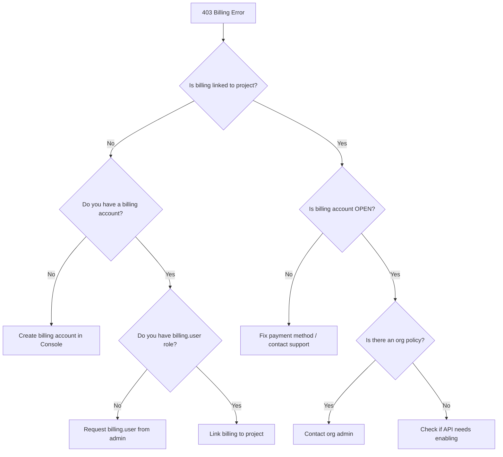

# How to Troubleshoot 403 Forbidden Billing Errors on a New GCP Project

Author: [nawazdhandala](https://www.github.com/nawazdhandala)

Tags: GCP, Billing, Troubleshooting, Cloud Console, Project Setup

Description: Step-by-step guide to diagnosing and fixing 403 forbidden billing errors when setting up a new Google Cloud Platform project, including billing account linking and permission fixes.

---

You just created a fresh GCP project, tried to spin up a resource, and got slapped with a 403 error about billing. It is confusing because you might already have a billing account set up - so why is GCP complaining?

This error is incredibly common for new projects and new GCP users. The problem is almost always that the project is not linked to an active billing account, or that you do not have the right permissions to link billing. Let me break down the different scenarios and how to fix each one.

## The Error

The typical error looks like this:

```
ERROR: (gcloud.compute.instances.create) PERMISSION_DENIED:
Access Not Configured. Compute Engine API has not been used in project 123456789
before or it is disabled. Enable it by visiting
https://console.developers.google.com/apis/api/compute.googleapis.com/overview?project=123456789
then retry. If you enabled this API recently, wait a few minutes for the action
to propagate to our systems and retry.

Billing must be enabled for activation of service
```

Or more directly:

```
ERROR: (gcloud.services.enable) FAILED_PRECONDITION:
Billing must be enabled for activation of service 'compute.googleapis.com'
in project 'my-new-project'
```

## Step 1: Check If Billing Is Linked

The first thing to check is whether your project actually has a billing account linked to it:

```bash
# Check if the project has a billing account linked
gcloud billing projects describe my-new-project
```

If the output shows `billingAccountName: ''` or `billingEnabled: false`, your project does not have billing set up. That is your problem.

## Step 2: List Available Billing Accounts

Before you can link billing, you need to know which billing accounts you have access to:

```bash
# List all billing accounts you have access to
gcloud billing accounts list
```

This will show something like:

```
ACCOUNT_ID            NAME                 OPEN   MASTER_ACCOUNT_ID
0X0X0X-0X0X0X-0X0X0X  My Billing Account   True
```

If this list is empty, you either do not have any billing accounts or you do not have permission to view them. More on that below.

## Step 3: Link the Billing Account

If you have a billing account available, link it to your project:

```bash
# Link a billing account to the project
# Replace the account ID with your actual billing account ID
gcloud billing projects link my-new-project \
    --billing-account=0X0X0X-0X0X0X-0X0X0X
```

If this succeeds, you are done. Try your original command again and it should work.

## Common Reasons the Link Fails

### You Do Not Have Permission

Linking a billing account requires the `billing.resourceAssociations.create` permission on the billing account AND `resourcemanager.projects.createBillingAssignment` on the project.

The error looks like:

```
ERROR: (gcloud.billing.projects.link) PERMISSION_DENIED:
The caller does not have permission
```

To fix this, ask a billing admin to grant you access:

```bash
# A billing admin needs to run this
# Grant the Billing Account User role on the billing account
gcloud billing accounts add-iam-policy-binding 0X0X0X-0X0X0X-0X0X0X \
    --member="user:developer@example.com" \
    --role="roles/billing.user"
```

The `roles/billing.user` role is the minimum needed to link projects to billing accounts. It does not give access to view or modify the billing account itself.

### The Billing Account Is Closed or Suspended

If your billing account is not in the "OPEN" state, you cannot link new projects to it:

```bash
# Check the status of your billing account
gcloud billing accounts describe 0X0X0X-0X0X0X-0X0X0X
```

Common reasons a billing account gets suspended:
- Payment method expired or declined
- Reached a spending limit
- Fraud detection triggered
- Terms of service violation

To reopen a suspended billing account, go to the Cloud Console billing section and update your payment method or resolve any outstanding issues.

### Organization Policy Restrictions

Enterprise organizations often restrict which billing accounts can be used with which projects:

```bash
# Check for billing-related org policies
gcloud resource-manager org-policies describe \
    constraints/billing.restrictBillingAccountUsage \
    --project=my-new-project 2>/dev/null
```

If an org policy is restricting billing account usage, you need to work with your organization admin to either update the policy or use an approved billing account.

## The Free Tier Trap

If you signed up for GCP with the free trial, there is a subtlety. The free trial creates a billing account with credits, but it has restrictions. Some services or configurations are not available until you upgrade to a paid account.

```bash
# Check if your billing account is a free trial
gcloud billing accounts describe 0X0X0X-0X0X0X-0X0X0X \
    --format="value(open, masterBillingAccount)"
```

To upgrade from the free trial:
1. Go to the Cloud Console
2. Click on Billing
3. Click "Upgrade" to convert to a paid account
4. You keep your remaining free credits

## Debugging Flowchart

Here is the systematic approach to troubleshooting billing errors:



## Setting Up Billing for Terraform Projects

If you are using Terraform to manage projects, include billing linking in your configuration:

```hcl
# Create a project with billing account linked
resource "google_project" "my_project" {
  name            = "My Project"
  project_id      = "my-new-project"
  org_id          = var.org_id
  billing_account = var.billing_account_id
}

# Enable required APIs after billing is linked
resource "google_project_service" "compute" {
  project = google_project.my_project.project_id
  service = "compute.googleapis.com"

  # Depend on the project being created (which includes billing)
  depends_on = [google_project.my_project]
}
```

## Monitoring Billing Status

To avoid billing surprises, set up budget alerts:

```bash
# Create a budget alert for your project
# This sends notifications when spending reaches 50%, 90%, and 100% of budget
gcloud billing budgets create \
    --billing-account=0X0X0X-0X0X0X-0X0X0X \
    --display-name="Project Budget" \
    --budget-amount=1000 \
    --threshold-rules=percent=0.5 \
    --threshold-rules=percent=0.9 \
    --threshold-rules=percent=1.0 \
    --filter-projects="projects/my-new-project"
```

## Quick Resolution Summary

Nine times out of ten, the fix for a 403 billing error on a new GCP project is:

1. Check if billing is linked: `gcloud billing projects describe PROJECT_ID`
2. Find your billing account: `gcloud billing accounts list`
3. Link it: `gcloud billing projects link PROJECT_ID --billing-account=ACCOUNT_ID`

If step 3 fails, it is a permissions issue. Get `roles/billing.user` on the billing account from your billing admin.

The error message could be clearer, but once you know the pattern, it takes about 30 seconds to fix. Make sure to include billing account linking in your project setup automation so you never have to deal with this manually again.
