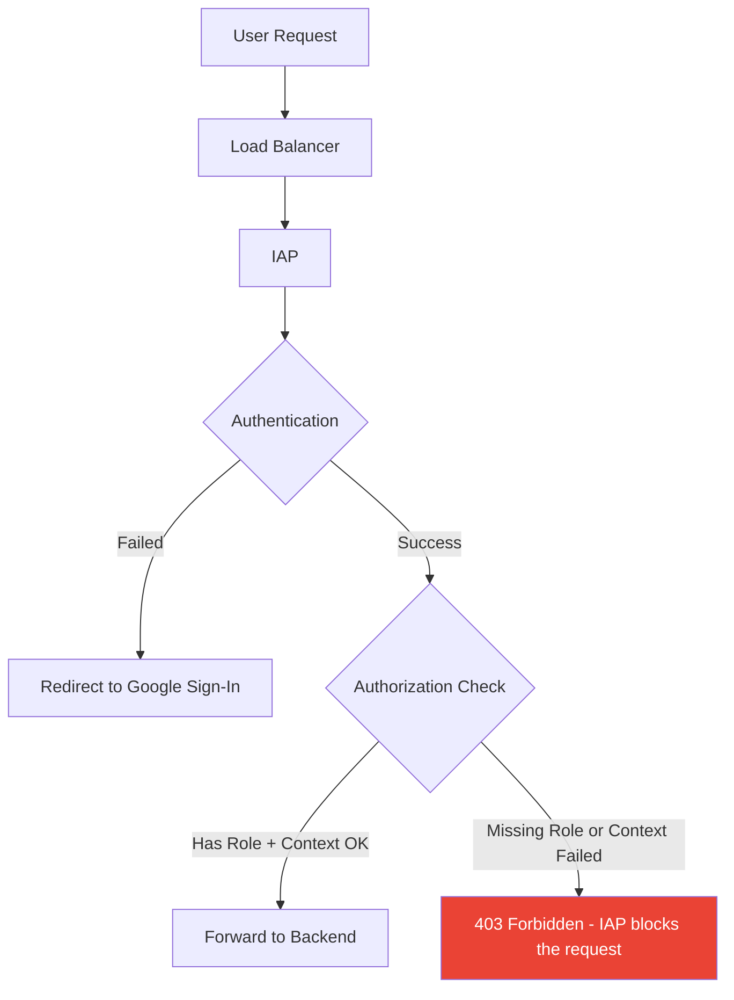

# How to Troubleshoot 403 Forbidden Errors When Accessing IAP-Protected Applications in GCP

Author: [nawazdhandala](https://www.github.com/nawazdhandala)

Tags: GCP, IAP, Troubleshooting, 403 Forbidden, Authentication, Access Control

Description: A comprehensive troubleshooting guide for resolving 403 Forbidden errors when accessing Identity-Aware Proxy protected applications in Google Cloud Platform.

---

You have IAP enabled on your application, a user tries to access it, authenticates successfully through Google Sign-In, and then hits a 403 Forbidden page. This is one of the most common IAP issues, and the frustrating part is that the error page does not tell you much about what went wrong.

The 403 means the user's identity was verified, but they were not authorized. The root cause could be a missing IAM binding, an access level condition that was not met, a misconfigured backend service, or several other things. Let me walk through the systematic approach to diagnosing and fixing these errors.

## Understanding the 403 in IAP Context

A 403 from IAP is different from a 403 from your application. IAP returns 403 before the request even reaches your backend. Your application never sees the request.



## Step 1: Confirm It Is an IAP 403

First, make sure the 403 is coming from IAP and not from your application.

IAP 403 pages have a distinctive look - they show a Google-branded error page that says something like "You don't have access to this resource." If you see a custom 403 page from your application, the issue is in your app, not IAP.

You can also check the response headers:

```bash
# Check if the 403 response includes IAP headers
curl -v -H "Authorization: Bearer $(gcloud auth print-identity-token)" \
    https://my-app.company.com/ 2>&1 | grep -i "x-goog"
```

If you see `X-Goog-IAP-Generated-Response: true` in the response headers, the 403 came from IAP.

## Step 2: Check IAM Bindings

The most common cause of 403 errors is the user not having the `roles/iap.httpsResourceAccessor` role on the backend service.

```bash
# View IAP IAM policy for the backend service
gcloud iap web get-iam-policy \
    --resource-type=backend-services \
    --service=my-backend-service \
    --project=my-project-id
```

Look for the user's email (or a group they belong to) in the output with the `roles/iap.httpsResourceAccessor` role.

If the user is not listed, add them:

```bash
# Grant the user access to the IAP-protected resource
gcloud iap web add-iam-policy-binding \
    --resource-type=backend-services \
    --service=my-backend-service \
    --member="user:affected-user@company.com" \
    --role="roles/iap.httpsResourceAccessor" \
    --project=my-project-id
```

## Step 3: Check Group Membership

If access is granted through a Google Group, verify the user is actually in that group.

```bash
# Check if the user is in the group (requires admin access)
gcloud identity groups memberships search-transitive-memberships \
    --group-email="authorized-users@company.com" \
    --member-email="affected-user@company.com"
```

Common issues with group-based access:
- User was removed from the group
- User is in a nested group but transitive membership is not resolving
- Wrong group is listed in the IAM binding

## Step 4: Check Access Level Conditions

If IAM bindings have conditions (for context-aware access), those conditions must be satisfied for access to be granted.

```bash
# View IAP IAM policy with full condition details
gcloud iap web get-iam-policy \
    --resource-type=backend-services \
    --service=my-backend-service \
    --project=my-project-id \
    --format=json
```

Look for bindings with `condition` blocks. Common conditions that fail:

- **IP-based conditions**: User is not on the expected network
- **Device policy conditions**: Endpoint Verification data is stale or device is non-compliant
- **Time-based conditions**: Access window has expired

## Step 5: Check the Audit Logs

Cloud Audit Logs contain detailed information about IAP authorization decisions, including why access was denied.

```bash
# Search for IAP authorization failures in audit logs
gcloud logging read \
    'resource.type="iap_web" AND protoPayload.methodName="AuthorizeUser" AND severity>=WARNING' \
    --limit=20 \
    --project=my-project-id \
    --format="table(timestamp, protoPayload.authenticationInfo.principalEmail, protoPayload.status.message)"
```

The `status.message` field often contains the specific reason for the denial, such as:

- `PERMISSION_DENIED: The user does not have permission`
- `PERMISSION_DENIED: Access level requirement not met`
- `PERMISSION_DENIED: Device policy not satisfied`

For more detailed information:

```bash
# Get full audit log details for a specific denial
gcloud logging read \
    'resource.type="iap_web" AND protoPayload.authenticationInfo.principalEmail="affected-user@company.com" AND severity>=WARNING' \
    --limit=5 \
    --project=my-project-id \
    --format=json
```

## Step 6: Check for Multiple IAM Bindings

If a user has multiple IAM bindings on the same resource (e.g., one unconditional and one with a condition), be aware that IAM evaluates all bindings. If ANY binding grants access, the user gets in. But if the only applicable binding has a condition that is not met, they get denied.

```bash
# View all bindings including conditions
gcloud iap web get-iam-policy \
    --resource-type=backend-services \
    --service=my-backend-service \
    --project=my-project-id \
    --format=yaml
```

Look for conflicting or overlapping bindings that might cause confusion.

## Step 7: Check the OAuth Consent Screen Configuration

For external users, verify:

1. The app is published (not in testing mode) or the user is a test user
2. The user type matches (internal vs external)

```bash
# Check the IAP brand configuration
gcloud iap oauth-brands list --project=my-project-id
```

If the brand is set to "Internal" and the user is outside your organization, they will get a 403.

## Step 8: Verify the Backend Service Configuration

Make sure IAP is enabled on the correct backend service.

```bash
# Check if IAP is enabled on the backend service
gcloud compute backend-services describe my-backend-service \
    --global \
    --format="value(iap.enabled)" \
    --project=my-project-id
```

If you have multiple backend services (e.g., one per URL path), make sure the user has access to the specific backend service handling their request, not just the default one.

```bash
# List all backend services to identify which one handles the request
gcloud compute url-maps describe my-url-map \
    --global \
    --project=my-project-id \
    --format=json
```

## Common Scenarios and Solutions

### Scenario 1: User Just Added but Still Getting 403

IAM changes can take up to 7 minutes to propagate. Wait a few minutes and try again. The user should also clear their browser cache or try in an incognito window to make sure they are not using a stale session.

### Scenario 2: Works for Some Users, Not Others

Compare the working and non-working users:
- Are they in the same Google Group?
- Are they accessing from the same network? (relevant if access levels are in use)
- Are they using the same device type? (relevant if device policies are in use)

### Scenario 3: Was Working Yesterday, Broken Today

Check for recent IAM changes:

```bash
# View recent IAM changes in audit logs
gcloud logging read \
    'protoPayload.methodName="SetIamPolicy" AND resource.type="iap_web"' \
    --limit=10 \
    --project=my-project-id \
    --format="table(timestamp, protoPayload.authenticationInfo.principalEmail)"
```

Also check if any access levels were modified or if group membership changed.

### Scenario 4: 403 After Signing In with the Wrong Account

If a user has multiple Google accounts, they might authenticate with the wrong one. The 403 page does not show which account was used. Have the user:

1. Go to `https://my-app.company.com/_gcp_iap/clear_login_cookie`
2. Sign in again with the correct account

### Scenario 5: Service Account Getting 403

For programmatic access, make sure:
- The service account has `iap.httpsResourceAccessor`
- You are sending an ID token (not an access token)
- The token audience matches the IAP OAuth client ID

```bash
# Test with a properly formatted ID token
TOKEN=$(gcloud auth print-identity-token \
    --audiences=CLIENT_ID \
    --impersonate-service-account=SA_EMAIL)

curl -H "Authorization: Bearer ${TOKEN}" https://my-app.company.com/
```

## Quick Diagnostic Script

Here is a script that checks the most common 403 causes.

```bash
#!/bin/bash
# Quick IAP 403 diagnostic script

PROJECT="my-project-id"
BACKEND="my-backend-service"
USER_EMAIL="affected-user@company.com"

echo "=== Checking IAP status ==="
gcloud compute backend-services describe "$BACKEND" \
    --global --format="value(iap.enabled)" --project="$PROJECT"

echo ""
echo "=== Checking IAM bindings ==="
gcloud iap web get-iam-policy \
    --resource-type=backend-services \
    --service="$BACKEND" \
    --project="$PROJECT"

echo ""
echo "=== Checking recent auth failures ==="
gcloud logging read \
    "resource.type=\"iap_web\" AND protoPayload.authenticationInfo.principalEmail=\"$USER_EMAIL\" AND severity>=WARNING" \
    --limit=5 --project="$PROJECT" \
    --format="table(timestamp, protoPayload.status.message)"

echo ""
echo "=== Checking recent IAM changes ==="
gcloud logging read \
    "protoPayload.methodName=\"SetIamPolicy\" AND resource.type=\"iap_web\"" \
    --limit=5 --project="$PROJECT" \
    --format="table(timestamp, protoPayload.authenticationInfo.principalEmail)"
```

## Summary

When you hit a 403 on an IAP-protected application, work through this checklist: verify the IAM binding exists, check group membership, examine access level conditions, review audit logs, and verify the OAuth consent screen configuration. In most cases, the fix is adding the missing `iap.httpsResourceAccessor` role. For persistent issues, the audit logs are your best friend - they show exactly why IAP denied the request. Keep the diagnostic script handy for quick troubleshooting.
