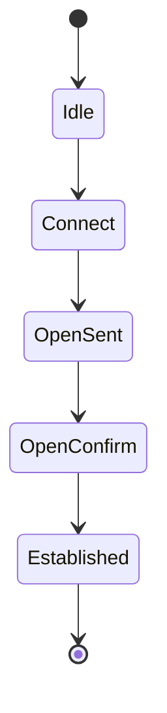

# How to Troubleshoot BGP Session Flapping on GCP Cloud VPN

Author: [nawazdhandala](https://www.github.com/nawazdhandala)

Tags: GCP, BGP, Cloud VPN, Troubleshooting, Cloud Router

Description: Diagnose and resolve BGP session flapping issues on GCP Cloud VPN that cause route instability, intermittent connectivity, and traffic disruption between networks.

---

BGP session flapping is when a BGP session repeatedly goes up and down. On a Cloud VPN connection, this causes route instability - routes are added, removed, added again, creating intermittent connectivity that is maddening to debug. Users experience random connection drops, increased latency, and unpredictable routing behavior. The root cause can be on the GCP side, the on-premises side, or in the network path between them.

This guide provides a systematic approach to diagnosing and fixing BGP flapping on Cloud VPN.

## Understanding BGP Session Lifecycle

A healthy BGP session goes through these states once and stays established:



A flapping session oscillates between Established and Idle/Connect, sometimes many times per hour. Each transition causes routes to be withdrawn and re-advertised, which disrupts traffic.

## Step 1: Confirm Flapping Is Happening

Check the BGP session status and history:

```bash
# Check current BGP peer status
gcloud compute routers get-status your-router \
  --region=us-central1 \
  --format="yaml(result.bgpPeerStatus)" \
  --project=your-project-id
```

Look for `uptimeSeconds` - if this value is low or resets frequently, the session is flapping.

Check Cloud Router logs for session state changes:

```bash
# Look for BGP session state changes in logs
gcloud logging read \
  'resource.type="gce_router" AND jsonPayload.event:"BGP"' \
  --project=your-project-id \
  --freshness=24h \
  --format="table(timestamp, jsonPayload.event, jsonPayload.message)" \
  --limit=50
```

You will see entries like "BGP session down" and "BGP session up" repeating if flapping is occurring.

## Step 2: Check the VPN Tunnel Status

BGP flapping is often a symptom of VPN tunnel instability. If the tunnel drops, the BGP session drops with it:

```bash
# Check tunnel status
gcloud compute vpn-tunnels describe your-tunnel \
  --region=us-central1 \
  --format="yaml(status, detailedStatus)" \
  --project=your-project-id

# Look for tunnel state changes in logs
gcloud logging read \
  'resource.type="vpn_gateway" AND jsonPayload.event:"tunnel"' \
  --project=your-project-id \
  --freshness=24h \
  --format="table(timestamp, jsonPayload.event, jsonPayload.message)" \
  --limit=30
```

If the tunnel is also flapping, fix the tunnel first. The BGP flapping is a secondary symptom.

## Common Cause 1: IKE/IPsec Rekeying Issues

VPN tunnels periodically rekey their encryption keys. If the rekeying process fails or takes too long, the tunnel briefly drops, causing a BGP session reset.

### Diagnosis

Look for IKE rekey events in the tunnel logs:

```bash
# Check for IKE events
gcloud logging read \
  'resource.type="vpn_gateway" AND (jsonPayload.event:"IKE" OR jsonPayload.event:"rekey")' \
  --project=your-project-id \
  --freshness=24h \
  --format="table(timestamp, jsonPayload.event, jsonPayload.message)"
```

### Fix

- Make sure both sides use the same IKE version (IKE v2 is recommended)
- Verify cipher suite compatibility between GCP and your on-premises device
- Update your on-premises VPN device firmware to fix known rekeying bugs
- Check that IKE SA lifetime and IPsec SA lifetime settings are compatible

```bash
# Verify tunnel is using IKE v2
gcloud compute vpn-tunnels describe your-tunnel \
  --region=us-central1 \
  --format="value(ikeVersion)" \
  --project=your-project-id
```

## Common Cause 2: BGP Hold Timer Expiry

BGP peers send keepalive messages at regular intervals. If three consecutive keepalives are missed (the hold timer expires), the session is declared down. The default hold timer is 60 seconds, with keepalives every 20 seconds.

### Diagnosis

If BGP sessions drop exactly at the hold timer interval, the keepalives are not getting through. This can happen due to:
- High CPU on the on-premises router causing delayed keepalive processing
- Packet loss on the VPN tunnel
- MTU issues causing keepalive packets to be dropped

### Fix

Check for packet loss on the tunnel:

```bash
# Check tunnel packet loss from a VM
gcloud compute ssh your-vm \
  --zone=us-central1-a \
  --command="ping -c 100 169.254.0.2" \
  --project=your-project-id
```

The 169.254.x.x address is the BGP peer IP on the on-premises side. Packet loss here directly impacts BGP keepalives.

If there is packet loss, investigate:
- Internet path quality between GCP and your on-premises site
- On-premises router CPU and memory utilization
- Bandwidth saturation on the VPN tunnel or the underlying internet link

## Common Cause 3: MTU Issues

VPN tunnels have a reduced MTU due to encryption overhead. If large BGP update messages exceed the tunnel MTU and get fragmented or dropped, it can cause session instability.

### Diagnosis

Test the effective MTU through the tunnel:

```bash
# Test MTU from a VM (adjust size until packets get through)
gcloud compute ssh your-vm \
  --zone=us-central1-a \
  --command="ping -c 5 -M do -s 1400 169.254.0.2" \
  --project=your-project-id
```

Start with 1400 and decrease if packets are dropped. The effective MTU through a GCP VPN tunnel is typically 1460 bytes.

### Fix

Set the correct MTU on your on-premises tunnel interface. For GCP VPN:

```bash
# On the on-premises router, set tunnel MTU to 1460
# The exact command depends on your router vendor
# Example for Linux:
# ip link set dev vti0 mtu 1460
```

Also consider enabling TCP MSS clamping on the tunnel interface to prevent TCP sessions from using packets larger than the tunnel MTU.

## Common Cause 4: Overlapping ASN or IP Conflicts

If the BGP ASNs or link-local IP addresses conflict with other BGP sessions, routing loops or session conflicts can cause flapping.

### Diagnosis

```bash
# Check Cloud Router BGP configuration
gcloud compute routers describe your-router \
  --region=us-central1 \
  --format=yaml \
  --project=your-project-id
```

Verify:
- The Cloud Router ASN does not conflict with the peer ASN
- BGP link-local IPs (169.254.x.x) are unique across all tunnels
- No other BGP sessions use the same peer IP addresses

### Fix

If there is a conflict, update the BGP configuration:

```bash
# Update BGP peer IP addresses if there is a conflict
gcloud compute routers update-bgp-peer your-router \
  --peer-name=your-peer \
  --ip-address=169.254.5.1 \
  --peer-ip-address=169.254.5.2 \
  --region=us-central1 \
  --project=your-project-id
```

## Common Cause 5: Route Limit Exceeded

Cloud Router has limits on the number of routes it can learn. If the on-premises network advertises too many routes, Cloud Router may reject them, causing session instability.

### Diagnosis

```bash
# Check the number of learned routes
gcloud compute routers get-status your-router \
  --region=us-central1 \
  --format="yaml(result.bestRoutes)" \
  --project=your-project-id
```

The default limit is 100 learned routes per BGP session (can be increased to 1000 with custom quota).

### Fix

- Summarize routes on the on-premises side before advertising to GCP
- Increase the route limit by requesting a quota increase
- Filter unnecessary routes from being advertised

## Common Cause 6: On-Premises Router Issues

Sometimes the flapping is entirely caused by the on-premises router:

- High CPU causing delayed BGP processing
- Memory pressure causing BGP table corruption
- Software bugs in the router firmware
- Conflicting routing policies

### Diagnosis

Check on-premises router logs for BGP events that coincide with the GCP-side flapping timestamps. Compare timestamps carefully.

### Fix

- Update router firmware to the latest stable version
- Check CPU and memory utilization during flapping events
- Simplify routing policies that might conflict with the BGP session
- Consider using BFD (Bidirectional Forwarding Detection) for faster failure detection instead of relying on BGP keepalives

## Setting Up Monitoring for BGP Flapping

Create alerts to catch flapping early:

```bash
# Create a log-based metric for BGP session state changes
gcloud logging metrics create bgp-session-changes \
  --project=your-project-id \
  --description="BGP session state changes" \
  --log-filter='resource.type="gce_router" AND jsonPayload.event:"BGP" AND (jsonPayload.message:"up" OR jsonPayload.message:"down")'
```

Build an alert that fires when BGP state changes happen more than a threshold (for example, more than 4 changes in an hour indicates flapping).

## Quick Diagnostic Checklist

When BGP is flapping, run through this checklist:

1. Is the VPN tunnel stable? Check tunnel status and logs
2. Is there packet loss on the tunnel? Ping the BGP peer IP
3. Are keepalives getting through? Check hold timer expiry in logs
4. Is the MTU correct? Test with different packet sizes
5. Are there IKE rekeying issues? Check for IKE events in logs
6. Is the on-premises router healthy? Check CPU, memory, firmware
7. Are there ASN or IP conflicts? Verify BGP configuration
8. Are route limits being exceeded? Check learned route count

## Wrapping Up

BGP session flapping on Cloud VPN is almost always caused by either tunnel instability or network path issues between GCP and on-premises. The tunnel itself is the most common culprit - fix IKE/IPsec issues first, then look at MTU, packet loss, and BGP-specific configuration. Good monitoring that alerts on BGP state changes helps you catch flapping early, before users start reporting intermittent connectivity. When in doubt, start with the VPN tunnel health and work up the stack from there.
