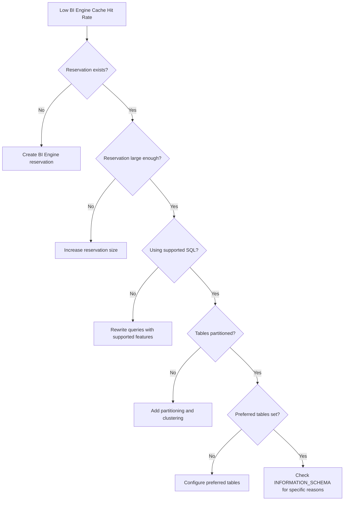

# How to Troubleshoot BigQuery BI Engine Cache Hit Rate Low and Queries Not Accelerated

Author: [nawazdhandala](https://www.github.com/nawazdhandala)

Tags: GCP, BigQuery, BI Engine, Performance, Caching, Data Analytics

Description: Practical steps to diagnose and improve BigQuery BI Engine cache hit rates when your queries are not being accelerated as expected.

---

BigQuery BI Engine is supposed to make your queries faster by caching table data in memory. But what happens when you have BI Engine enabled and your queries are still running at normal speed? A low cache hit rate defeats the purpose of using BI Engine, and the reasons are not always obvious. Let me walk through how to figure out what is going on and how to fix it.

## How BI Engine Works

BI Engine maintains an in-memory cache of BigQuery table data. When a query runs, BigQuery checks if the required data is already cached in BI Engine. If it is, the query runs much faster because it reads from memory instead of scanning storage. The key metric is the "cache hit rate" - the percentage of bytes served from cache vs. total bytes scanned.

## Checking Your BI Engine Status

First, verify that BI Engine is actually enabled and has capacity allocated.

```bash
# Check BI Engine reservations
bq ls --reservation --location=us --project=my-project

# Get detailed BI Engine reservation info
bq show --reservation --location=us --project=my-project my-bi-engine-reservation
```

You should see a reservation with `BI_ENGINE` type and the allocated memory in GB.

## Step 1: Check Query Acceleration Status in INFORMATION_SCHEMA

The most direct way to see if BI Engine is accelerating your queries is through the INFORMATION_SCHEMA views.

```sql
-- Check BI Engine statistics for recent queries
SELECT
  job_id,
  creation_time,
  total_bytes_processed,
  bi_engine_statistics.bi_engine_mode,
  bi_engine_statistics.acceleration_mode,
  bi_engine_statistics.bi_engine_reasons
FROM
  `region-us`.INFORMATION_SCHEMA.JOBS
WHERE
  creation_time > TIMESTAMP_SUB(CURRENT_TIMESTAMP(), INTERVAL 1 HOUR)
  AND job_type = 'QUERY'
  AND bi_engine_statistics IS NOT NULL
ORDER BY creation_time DESC
LIMIT 20;
```

The `acceleration_mode` field tells you exactly what happened:

- `FULL` - entire query was accelerated
- `PARTIAL` - only some parts were accelerated
- `DISABLED` - BI Engine was not used at all

The `bi_engine_reasons` field explains why acceleration was limited or disabled.

## Step 2: Understand Common Reasons for Low Cache Hits

Run this query to get a breakdown of why BI Engine is not fully accelerating your queries:

```sql
-- Aggregate BI Engine rejection reasons
SELECT
  reason.code,
  reason.message,
  COUNT(*) as occurrence_count
FROM
  `region-us`.INFORMATION_SCHEMA.JOBS,
  UNNEST(bi_engine_statistics.bi_engine_reasons) AS reason
WHERE
  creation_time > TIMESTAMP_SUB(CURRENT_TIMESTAMP(), INTERVAL 24 HOUR)
  AND job_type = 'QUERY'
GROUP BY reason.code, reason.message
ORDER BY occurrence_count DESC;
```

Common reason codes include:

- `TABLE_TOO_LARGE` - the table exceeds BI Engine cache capacity
- `UNSUPPORTED_SQL_TEXT` - the query uses features BI Engine does not support
- `NO_RESERVATION` - no BI Engine reservation exists for this project
- `INPUT_TOO_LARGE` - the query scans too much data
- `OTHER_BILLING_ACCOUNT` - the table is in a different billing account

## Step 3: Ensure Sufficient Memory Reservation

BI Engine needs enough memory to cache the tables you query most frequently. If your tables are larger than your reservation, only a portion gets cached.

```bash
# Check current reservation size
bq show --reservation --location=us my-bi-engine-reservation

# Update the reservation to allocate more memory (in GB)
bq update --reservation \
    --location=us \
    --bi_engine_preferred_tables="my-project:my_dataset.table1,my-project:my_dataset.table2" \
    --reservation_size=10 \
    my-bi-engine-reservation
```

You can also specify preferred tables to tell BI Engine which tables to prioritize caching:

```bash
# Set preferred tables for caching priority
bq update --reservation \
    --location=us \
    --bi_engine_preferred_tables="my-project.my_dataset.dashboard_metrics,my-project.my_dataset.user_events" \
    my-bi-engine-reservation
```

## Step 4: Use Supported SQL Features Only

BI Engine does not support every BigQuery SQL feature. Queries that use unsupported features will fall back to regular BigQuery execution. Features that prevent acceleration include:

- JavaScript UDFs
- STRUCT types in certain positions
- Some complex window functions
- Queries across multiple datasets in different regions
- DML statements (INSERT, UPDATE, DELETE)
- Queries using TABLESAMPLE

Rewrite your queries to avoid unsupported features when possible:

```sql
-- Instead of JavaScript UDFs, use built-in functions
-- Bad: Uses JS UDF, BI Engine cannot accelerate
-- CREATE TEMP FUNCTION extractDomain(url STRING)
-- RETURNS STRING LANGUAGE js AS 'return url.split("/")[2]';

-- Good: Uses built-in REGEXP_EXTRACT, BI Engine can accelerate
SELECT
  REGEXP_EXTRACT(url, r'://([^/]+)') AS domain,
  COUNT(*) as page_views
FROM `my-project.my_dataset.web_events`
GROUP BY domain
ORDER BY page_views DESC;
```

## Step 5: Optimize Table Structure for Caching

BI Engine works best with certain table structures. Here are tips to improve cache efficiency:

Use partitioning to reduce the data that needs to be cached:

```sql
-- Query only the partitions you need
-- BI Engine only caches the scanned partitions
SELECT
  user_id,
  SUM(purchase_amount) as total_spend
FROM `my-project.my_dataset.transactions`
WHERE
  -- Partition filter limits what BI Engine needs to cache
  transaction_date BETWEEN '2026-02-01' AND '2026-02-17'
GROUP BY user_id;
```

Use clustering to improve cache locality:

```sql
-- Create a table that is both partitioned and clustered
-- This helps BI Engine cache only the relevant data blocks
CREATE TABLE `my-project.my_dataset.optimized_events`
PARTITION BY DATE(event_timestamp)
CLUSTER BY user_id, event_type
AS
SELECT * FROM `my-project.my_dataset.raw_events`;
```

## Step 6: Monitor BI Engine Performance Over Time

Set up a monitoring query that you run periodically to track BI Engine effectiveness:

```sql
-- Daily BI Engine acceleration report
SELECT
  DATE(creation_time) as query_date,
  bi_engine_statistics.acceleration_mode,
  COUNT(*) as query_count,
  SUM(total_bytes_processed) as total_bytes,
  AVG(total_slot_ms) as avg_slot_ms
FROM
  `region-us`.INFORMATION_SCHEMA.JOBS
WHERE
  creation_time > TIMESTAMP_SUB(CURRENT_TIMESTAMP(), INTERVAL 7 DAY)
  AND job_type = 'QUERY'
  AND bi_engine_statistics IS NOT NULL
GROUP BY query_date, acceleration_mode
ORDER BY query_date DESC, query_count DESC;
```



## Key Takeaways

BI Engine acceleration is not automatic - it requires the right configuration, sufficient memory, compatible SQL, and optimized table structures. Start by checking the INFORMATION_SCHEMA for the specific reason your queries are not being accelerated, and work from there. In most cases, either increasing the reservation size or specifying preferred tables resolves the issue.
