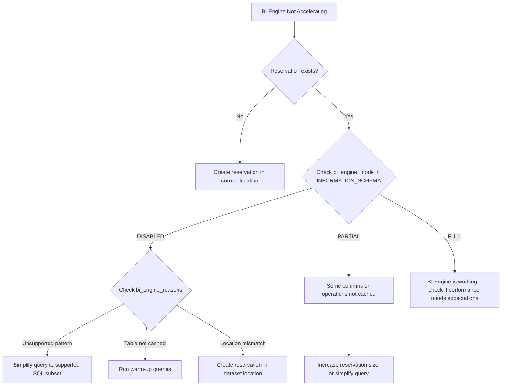

# How to Troubleshoot BigQuery BI Engine Reservation Not Accelerating Queries

Author: [nawazdhandala](https://www.github.com/nawazdhandala)

Tags: GCP, BigQuery, BI Engine, Query Acceleration, Performance, Reservations

Description: Troubleshoot BigQuery BI Engine reservations that are not accelerating queries, covering reservation setup, table compatibility, and query pattern requirements.

---

You set up a BigQuery BI Engine reservation expecting faster queries, but your queries are still taking the same amount of time. BI Engine is supposed to keep data in memory and serve queries in sub-second response times, but getting it to actually work requires meeting several conditions that are not always obvious.

Let me walk through why BI Engine might not be accelerating your queries and how to fix it.

## What BI Engine Does

BigQuery BI Engine is an in-memory analysis service that caches data from BigQuery tables in a fast-access layer. When a query hits a table that is cached by BI Engine, the query is served from memory instead of reading from storage, which can be 10-100x faster for interactive analytics workloads.

BI Engine works automatically - you create a reservation, and BigQuery decides which tables and columns to cache based on query patterns. You do not explicitly choose which tables to cache.

## Step 1 - Verify the Reservation Exists

First, confirm that your BI Engine reservation is actually set up and active.

```bash
# List BI Engine reservations
bq ls --reservation --project_id=my-project --location=US --bi_reservation

# Or using gcloud
gcloud alpha bq reservations list --location=US
```

If no reservation exists, create one.

```bash
# Create a BI Engine reservation with 10 GB of memory
bq update --bi_reservation --location=US --reservation_size=10000000000
```

The size is in bytes, so 10 GB = 10,000,000,000 bytes.

## Step 2 - Check If BI Engine Is Being Used

After running a query, check whether BI Engine was involved.

```sql
-- Check BI Engine statistics for recent queries
SELECT
  job_id,
  creation_time,
  bi_engine_statistics.bi_engine_mode,
  bi_engine_statistics.bi_engine_reasons,
  total_bytes_processed,
  TIMESTAMP_DIFF(end_time, start_time, MILLISECOND) as duration_ms
FROM `region-us`.INFORMATION_SCHEMA.JOBS_BY_PROJECT
WHERE creation_time > TIMESTAMP_SUB(CURRENT_TIMESTAMP(), INTERVAL 1 HOUR)
  AND job_type = 'QUERY'
  AND bi_engine_statistics IS NOT NULL
ORDER BY creation_time DESC
LIMIT 20;
```

The `bi_engine_mode` field tells you what happened:
- `FULL` - the entire query was accelerated by BI Engine
- `PARTIAL` - some parts were accelerated, others were not
- `DISABLED` - BI Engine was not used at all

The `bi_engine_reasons` field explains why BI Engine was not fully used.

## Step 3 - Understand Why BI Engine Is Not Engaged

### Reason 1 - Unsupported Query Pattern

BI Engine supports a specific subset of SQL. If your query uses unsupported features, it falls back to regular BigQuery execution.

Supported:
- Simple SELECT with filters
- Aggregations (SUM, COUNT, AVG, MIN, MAX, COUNT DISTINCT)
- GROUP BY
- ORDER BY with LIMIT
- Simple JOINs
- WHERE clause filters

Not supported or limited:
- Complex window functions
- ARRAY and STRUCT operations
- User-defined functions (UDFs)
- Queries on views with complex logic
- CROSS JOIN
- Certain analytical functions

```sql
-- This simple query is likely to be accelerated
SELECT
  region,
  SUM(revenue) as total_revenue,
  COUNT(*) as order_count
FROM `my_dataset.sales`
WHERE sale_date >= '2024-01-01'
GROUP BY region
ORDER BY total_revenue DESC
LIMIT 100;

-- This complex query might not be accelerated
SELECT
  region,
  SUM(revenue) as total_revenue,
  PERCENTILE_CONT(revenue, 0.5) OVER (PARTITION BY region) as median_revenue
FROM `my_dataset.sales`
WHERE sale_date >= '2024-01-01'
GROUP BY region;
```

### Reason 2 - Table Too Large for Reservation

BI Engine caches tables based on access patterns and available memory. If your table is larger than your reservation, only the most frequently accessed columns and partitions are cached.

```bash
# Check the size of your table
bq show --format=prettyjson my_dataset.my_table | python3 -c "
import json, sys
table = json.load(sys.stdin)
size_bytes = int(table.get('numBytes', 0))
size_gb = size_bytes / (1024**3)
print(f'Table size: {size_gb:.2f} GB')
num_rows = int(table.get('numRows', 0))
print(f'Row count: {num_rows:,}')
"
```

If your table is 50 GB but your BI Engine reservation is 10 GB, only 20% of the data can be cached. Increase the reservation or partition your table and query specific partitions.

```bash
# Increase the BI Engine reservation
bq update --bi_reservation --location=US --reservation_size=53687091200  # 50 GB
```

### Reason 3 - Data Not Yet Cached

BI Engine populates its cache based on query access patterns. The first few queries against a table will not be accelerated because the data has not been cached yet. Subsequent queries should be faster.

Run a warm-up query.

```sql
-- Warm-up query to populate the BI Engine cache
SELECT *
FROM `my_dataset.frequently_queried_table`
WHERE partition_date >= DATE_SUB(CURRENT_DATE(), INTERVAL 7 DAY)
LIMIT 1;
```

After this, subsequent queries on the same data should benefit from BI Engine acceleration.

### Reason 4 - Wrong Location

The BI Engine reservation must be in the same location as your dataset. If your data is in `US` but your reservation is in `EU`, it will not work.

```bash
# Check dataset location
bq show --format=prettyjson my_dataset | python3 -c "
import json, sys
ds = json.load(sys.stdin)
print(f'Dataset location: {ds.get(\"location\", \"unknown\")}')
"

# Check reservation location
bq ls --reservation --bi_reservation --project_id=my-project --location=US
```

### Reason 5 - Connected Sheets or BI Tools Not Configured

If you are using BI Engine with Looker, Connected Sheets, or other BI tools, the tool needs to send queries through the BigQuery API in a way that BI Engine can intercept.

For Looker, make sure the connection uses the BigQuery Standard SQL driver.

For Connected Sheets, BI Engine integration is automatic for supported query patterns.

## Step 4 - Optimize for BI Engine

### Use Preferred Tables

You can tell BI Engine which tables to prioritize for caching.

```sql
-- Specify preferred tables when creating the reservation
-- This is done through the API or Cloud Console
```

In the Cloud Console, go to BigQuery, then BI Engine, and configure preferred tables to ensure your most important tables are cached.

### Partition Your Tables

BI Engine can cache specific partitions more effectively than entire unpartitioned tables.

```sql
-- Create a partitioned table for better BI Engine performance
CREATE TABLE `my_dataset.sales_partitioned`
PARTITION BY DATE(sale_date)
CLUSTER BY region, product_category
AS SELECT * FROM `my_dataset.sales`;
```

Then always include partition filters in your queries.

```sql
-- BI Engine can efficiently cache just the recent partitions
SELECT region, SUM(revenue)
FROM `my_dataset.sales_partitioned`
WHERE sale_date >= DATE_SUB(CURRENT_DATE(), INTERVAL 30 DAY)
GROUP BY region;
```

### Keep Queries Simple

The simpler your query, the more likely BI Engine will accelerate it fully.

```sql
-- Simple pattern that BI Engine handles well
SELECT
  product_category,
  COUNT(*) as sales_count,
  SUM(revenue) as total_revenue,
  AVG(revenue) as avg_revenue
FROM `my_dataset.sales_partitioned`
WHERE sale_date >= '2024-01-01'
  AND region = 'US'
GROUP BY product_category
ORDER BY total_revenue DESC;
```

## Monitoring BI Engine Performance

```sql
-- BI Engine usage summary over the last 24 hours
SELECT
  bi_engine_statistics.bi_engine_mode as mode,
  COUNT(*) as query_count,
  AVG(TIMESTAMP_DIFF(end_time, start_time, MILLISECOND)) as avg_duration_ms,
  SUM(total_bytes_processed) / (1024*1024*1024) as total_gb_processed
FROM `region-us`.INFORMATION_SCHEMA.JOBS_BY_PROJECT
WHERE creation_time > TIMESTAMP_SUB(CURRENT_TIMESTAMP(), INTERVAL 24 HOUR)
  AND job_type = 'QUERY'
  AND bi_engine_statistics IS NOT NULL
GROUP BY mode
ORDER BY query_count DESC;
```

## Troubleshooting Flow



## Summary

BI Engine not accelerating queries is usually caused by unsupported query patterns, insufficient reservation size, wrong location, or the cache not being warmed up yet. Check the `bi_engine_statistics` in INFORMATION_SCHEMA to see exactly why BI Engine was or was not used for each query. Keep queries simple, use partitioned tables, and make sure your reservation is large enough to cache the data you query most frequently.
