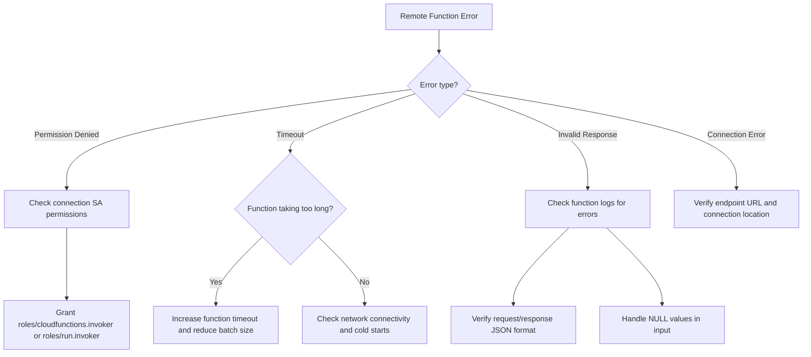

# How to Troubleshoot BigQuery Remote Function Invocation Timeout and Permission Errors

Author: [nawazdhandala](https://www.github.com/nawazdhandala)

Tags: GCP, BigQuery, Remote Functions, Cloud Functions, Timeout, Permissions

Description: Troubleshoot BigQuery remote function invocation failures including timeout errors, permission denied issues, and Cloud Function configuration problems.

---

BigQuery remote functions let you call external services - typically Cloud Functions or Cloud Run - directly from SQL queries. It is a powerful feature for extending BigQuery with custom logic like ML inference, geocoding, or data enrichment. But when something goes wrong, the error messages can be confusing and the debugging process is not obvious.

Let me walk through the most common failures and how to fix them.

## How Remote Functions Work

A BigQuery remote function is a SQL function that sends data to an external HTTP endpoint (usually a Cloud Function), processes it, and returns the result. When you call the function in a query, BigQuery batches the input rows and sends them as JSON to your endpoint.


## Problem 1 - Permission Denied Errors

### Missing Connection Permissions

Remote functions use BigQuery connections to reach external services. The connection's service account needs the right permissions.

```bash
# List your BigQuery connections
bq ls --connection --project_id=my-project --location=US

# Show connection details to find the service account
bq show --connection --project_id=my-project --location=US my-connection
```

The output shows the service account used by the connection. This service account needs the `roles/cloudfunctions.invoker` role for Cloud Functions or `roles/run.invoker` for Cloud Run.

```bash
# Grant Cloud Functions invoker role to the connection's service account
gcloud functions add-invoker-policy-binding my-function \
    --region=us-central1 \
    --member="serviceAccount:connection-sa@my-project.iam.gserviceaccount.com"

# Or for Cloud Run
gcloud run services add-iam-policy-binding my-service \
    --region=us-central1 \
    --member="serviceAccount:connection-sa@my-project.iam.gserviceaccount.com" \
    --role="roles/run.invoker"
```

### Missing BigQuery Connection Admin Role

The user creating the remote function needs the `roles/bigquery.connectionAdmin` role.

```bash
# Grant connection admin role
gcloud projects add-iam-policy-binding my-project \
    --member="user:developer@company.com" \
    --role="roles/bigquery.connectionAdmin"
```

### Function-Level Permissions

Make sure the Cloud Function does not require authentication that the connection service account cannot provide, or that it allows the connection service account.

```bash
# Check the Cloud Function's IAM policy
gcloud functions get-iam-policy my-function --region=us-central1
```

## Problem 2 - Timeout Errors

Remote function calls can time out for several reasons: the Cloud Function is too slow, the data batch is too large, or there are network issues.

### Cloud Function Timeout

The default Cloud Function timeout is 60 seconds. If your function processes large batches, it might need more time.

```bash
# Increase the Cloud Function timeout
gcloud functions deploy my-function \
    --timeout=540 \
    --region=us-central1 \
    --runtime=python311
```

### BigQuery Remote Function Timeout

BigQuery also has a timeout for remote function calls. You can set it when creating the function.

```sql
-- Create a remote function with an extended timeout
CREATE OR REPLACE FUNCTION `my_dataset.my_remote_function`(input STRING)
RETURNS STRING
REMOTE WITH CONNECTION `my-project.us.my-connection`
OPTIONS (
  endpoint = 'https://us-central1-my-project.cloudfunctions.net/my-function',
  max_batching_rows = 100  -- Reduce batch size to avoid timeouts
);
```

### Reduce Batch Size

BigQuery sends rows in batches to the remote function. Smaller batches process faster and are less likely to time out.

```sql
-- Recreate with smaller batch size
CREATE OR REPLACE FUNCTION `my_dataset.my_remote_function`(input STRING)
RETURNS STRING
REMOTE WITH CONNECTION `my-project.us.my-connection`
OPTIONS (
  endpoint = 'https://us-central1-my-project.cloudfunctions.net/my-function',
  max_batching_rows = 50  -- Smaller batches for faster processing
);
```

## Problem 3 - Cloud Function Errors

The Cloud Function might be returning errors that surface as cryptic messages in BigQuery.

### Check Cloud Function Logs

```bash
# Check the Cloud Function logs for errors
gcloud functions logs read my-function \
    --region=us-central1 \
    --limit=50
```

### Validate the Request/Response Format

BigQuery sends requests in a specific JSON format and expects responses in a specific format. If your function does not match, you get errors.

Expected request format from BigQuery.

```json
{
  "requestId": "unique-request-id",
  "caller": "//bigquery.googleapis.com/projects/my-project/datasets/my_dataset/routines/my_function",
  "sessionUser": "user@company.com",
  "userDefinedContext": {},
  "calls": [
    ["input_value_1"],
    ["input_value_2"],
    ["input_value_3"]
  ]
}
```

Expected response format to BigQuery.

```json
{
  "replies": [
    "output_value_1",
    "output_value_2",
    "output_value_3"
  ]
}
```

Here is a correct Cloud Function implementation in Python.

```python
import functions_framework
import json

@functions_framework.http
def my_remote_function(request):
    """Handle BigQuery remote function calls.

    Receives batched rows, processes them, and returns results.
    """
    try:
        request_json = request.get_json()
        calls = request_json.get('calls', [])

        replies = []
        for call in calls:
            # Each call is a list of arguments matching the function signature
            input_value = call[0]

            # Process the input (your custom logic here)
            result = process_input(input_value)
            replies.append(result)

        return json.dumps({"replies": replies}), 200, {'Content-Type': 'application/json'}

    except Exception as e:
        return json.dumps({"errorMessage": str(e)}), 400, {'Content-Type': 'application/json'}


def process_input(value):
    """Your custom processing logic."""
    if value is None:
        return None
    return value.upper()  # Simple example: uppercase the input
```

### Handle NULL Values

BigQuery might send NULL values in the calls array. Your function must handle them.

```python
def my_remote_function(request):
    """Handle remote function calls including NULL values."""
    request_json = request.get_json()
    calls = request_json.get('calls', [])

    replies = []
    for call in calls:
        input_value = call[0]

        # Handle NULL values explicitly
        if input_value is None:
            replies.append(None)
        else:
            replies.append(process_input(input_value))

    return json.dumps({"replies": replies}), 200, {'Content-Type': 'application/json'}
```

## Problem 4 - Connection Configuration Issues

### Wrong Endpoint URL

The endpoint URL in the remote function definition must exactly match your Cloud Function or Cloud Run service URL.

```bash
# Get the Cloud Function URL
gcloud functions describe my-function \
    --region=us-central1 \
    --format="value(httpsTrigger.url)"
```

```sql
-- Verify the endpoint in the remote function definition
SELECT
  routine_name,
  routine_type,
  remote_function_options
FROM `my_dataset.INFORMATION_SCHEMA.ROUTINES`
WHERE routine_type = 'FUNCTION';
```

### Connection in Wrong Location

The BigQuery connection must be in the same location as your dataset.

```bash
# Check connection location
bq show --connection --project_id=my-project --location=US my-connection

# Create a connection in the correct location
bq mk --connection \
    --connection_type=CLOUD_RESOURCE \
    --project_id=my-project \
    --location=US \
    my-new-connection
```

## Problem 5 - Data Type Mismatches

The data types in your remote function definition must match what the Cloud Function returns.

```sql
-- Make sure the return type matches what your function actually returns
-- If your function returns a number but the function is defined as STRING, you get an error

-- String function
CREATE FUNCTION `my_dataset.uppercase`(input STRING)
RETURNS STRING
REMOTE WITH CONNECTION `my-project.us.my-connection`
OPTIONS (endpoint = 'https://...');

-- JSON function (for complex return types)
CREATE FUNCTION `my_dataset.enrich_data`(input STRING)
RETURNS JSON
REMOTE WITH CONNECTION `my-project.us.my-connection`
OPTIONS (endpoint = 'https://...');
```

## Debugging Workflow



## Summary

BigQuery remote function failures come down to three categories: permission issues (the connection service account needs invoker permissions on the target function), timeout issues (reduce batch size and increase function timeout), and response format issues (the function must return JSON with a "replies" array matching the number of input rows). Check Cloud Function logs for the actual error, verify the connection service account permissions, and test your function independently before using it in a BigQuery query.
