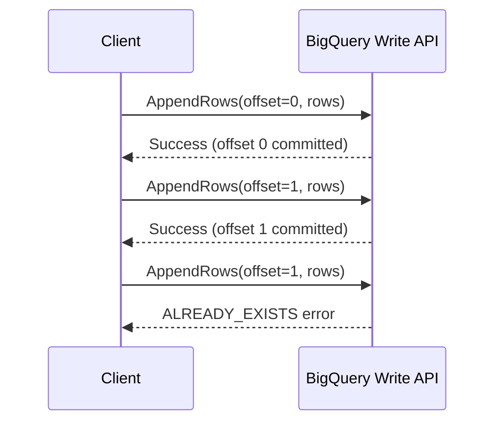

# How to Troubleshoot BigQuery Storage Write API CommitStream Offset Already Exists Error

Author: [nawazdhandala](https://www.github.com/nawazdhandala)

Tags: GCP, BigQuery, Storage Write API, Streaming, Data Ingestion, Troubleshooting

Description: A practical guide to diagnosing and resolving the CommitStream offset already exists error when using BigQuery Storage Write API for data ingestion.

---

The BigQuery Storage Write API is a high-performance data ingestion interface that gives you more control over exactly-once semantics compared to the legacy streaming API. But when you run into the "offset already exists" error during a CommitStream call, it can be confusing - especially if you think your offsets are correct. Let me walk you through what causes this and how to fix it.

## What the Error Looks Like

When this error occurs, you will typically see something like:

```
ALREADY_EXISTS: The offset 42 has already been committed to stream
projects/my-project/datasets/my_dataset/tables/my_table/streams/_default
```

Or in your application logs:

```
com.google.api.gax.rpc.AlreadyExistsException: io.grpc.StatusRuntimeException:
ALREADY_EXISTS: Offset already exists.
```

This means BigQuery has already processed and committed data at the offset you are trying to write to.

## How the Write API Offset System Works

Before diving into fixes, it helps to understand how offsets work in the Storage Write API.

The Write API supports three modes:

1. **Default stream** - at-least-once semantics, no offset management needed
2. **Committed type** - exactly-once semantics within a stream, requires offset tracking
3. **Buffered type** - exactly-once with the ability to flush on demand

For committed and buffered streams, each AppendRows request includes an offset that acts as a sequence number. BigQuery tracks the last committed offset per stream, and if you send a request with an offset that has already been committed, you get this error.



## Common Causes

### 1. Retrying Without Checking the Previous Response

The most common cause is retrying a write request that actually succeeded. Your client sent data at offset N, the server committed it, but the response was lost due to a network issue. Your retry logic then sends offset N again, and BigQuery rejects it because it was already committed.

### 2. Multiple Writers Sharing a Stream Without Coordination

If two processes or threads are writing to the same stream and both try to use the same offset, one will succeed and the other will get this error.

### 3. Incorrect Offset Tracking After Application Restart

When your application restarts, it might lose track of the last committed offset and start from a stale value.

## Fix 1: Handle ALREADY_EXISTS as a Success

The simplest and most important fix is to treat the ALREADY_EXISTS error as a success case in your retry logic. If BigQuery tells you the offset already exists, it means your data was already committed.

Here is a Python example showing proper handling:

```python
from google.cloud import bigquery_storage_v1
from google.api_core import exceptions

def append_rows_with_retry(write_client, stream_name, proto_rows, offset, max_retries=3):
    """Append rows with proper handling of ALREADY_EXISTS errors."""
    for attempt in range(max_retries):
        try:
            request = bigquery_storage_v1.types.AppendRowsRequest(
                write_stream=stream_name,
                offset=bigquery_storage_v1.types.Int64Value(value=offset),
                proto_rows=proto_rows,
            )
            response = write_client.append_rows(iter([request]))

            # Process the response
            for resp in response:
                if resp.error.code != 0:
                    raise Exception(f"Append failed: {resp.error.message}")
                return resp.append_result.offset.value

        except exceptions.AlreadyExists:
            # This offset was already committed - the data is safe
            # Treat this as a success and move to the next offset
            print(f"Offset {offset} already committed, moving on")
            return offset

        except exceptions.ServiceUnavailable:
            # Transient error - safe to retry with same offset
            print(f"Transient error on attempt {attempt + 1}, retrying...")
            continue

    raise Exception(f"Failed after {max_retries} retries")
```

## Fix 2: Track Offsets Durably

Instead of keeping offsets only in memory, persist them somewhere durable so your application can recover the correct offset after a restart.

```python
import json
import os

class OffsetTracker:
    """Track committed offsets in a local file for recovery after restarts."""

    def __init__(self, checkpoint_file):
        self.checkpoint_file = checkpoint_file
        self.offsets = self._load()

    def _load(self):
        # Load previously saved offsets from disk
        if os.path.exists(self.checkpoint_file):
            with open(self.checkpoint_file, 'r') as f:
                return json.load(f)
        return {}

    def save(self, stream_name, offset):
        # Persist the latest committed offset
        self.offsets[stream_name] = offset
        with open(self.checkpoint_file, 'w') as f:
            json.dump(self.offsets, f)

    def get_next_offset(self, stream_name):
        # Return the next offset to use for this stream
        last = self.offsets.get(stream_name, -1)
        return last + 1
```

For production workloads, use something more robust than a local file - Cloud Datastore, Cloud SQL, or Redis work well.

## Fix 3: Use the Default Stream When Exactly-Once Is Not Required

If your use case does not strictly require exactly-once semantics, switch to the default stream. It does not use offsets and sidesteps this problem entirely.

```python
from google.cloud import bigquery_storage_v1

def write_to_default_stream(project_id, dataset_id, table_id, rows):
    """Write to the default stream - no offset management needed."""
    client = bigquery_storage_v1.BigQueryWriteClient()

    # The default stream path
    stream_name = f"projects/{project_id}/datasets/{dataset_id}/tables/{table_id}/streams/_default"

    request = bigquery_storage_v1.types.AppendRowsRequest(
        write_stream=stream_name,
        # Note: no offset field set - BigQuery handles ordering
        proto_rows=rows,
    )

    response = client.append_rows(iter([request]))
    for resp in response:
        print(f"Rows written successfully: {resp.append_result}")
```

The default stream provides at-least-once delivery, which is fine for most analytics workloads where a small number of duplicate rows is acceptable.

## Fix 4: Use Exclusive Streams for Parallel Writers

When you have multiple writers, create a separate stream for each writer instead of sharing one.

```python
def create_exclusive_stream(client, table_path):
    """Create a dedicated write stream for a single writer."""
    write_stream = bigquery_storage_v1.types.WriteStream(
        type_=bigquery_storage_v1.types.WriteStream.Type.COMMITTED,
    )

    # Each writer gets its own stream with independent offsets
    stream = client.create_write_stream(
        parent=table_path,
        write_stream=write_stream,
    )

    print(f"Created stream: {stream.name}")
    return stream.name
```

With exclusive streams, each writer manages its own offset counter starting from 0, so there is no conflict between writers.

## Fix 5: Query the Stream to Find the Last Committed Offset

If you have lost track of where you left off, you can check the stream to find the current committed offset.

```python
def get_current_offset(client, stream_name):
    """Get the current state of a write stream."""
    stream = client.get_write_stream(name=stream_name)

    # The commit count tells you how many rows have been committed
    print(f"Stream type: {stream.type_}")
    print(f"Stream create time: {stream.create_time}")
    print(f"Committed row count: {stream.commit_count}")

    return stream.commit_count
```

## Monitoring for This Error

Set up a log-based metric and alert so you know when this error is happening frequently.

```bash
# Create a log-based metric for offset already exists errors
gcloud logging metrics create bigquery-offset-already-exists \
    --description="Count of BigQuery Write API offset already exists errors" \
    --log-filter='resource.type="bigquery_resource" AND "offset already exists"' \
    --project=my-project
```

A few occasional ALREADY_EXISTS errors during retries are normal and expected. But if you see a high rate, it usually indicates a bug in your offset tracking logic or uncoordinated parallel writers.

## Summary

The ALREADY_EXISTS error on offsets is not a data loss event - it is actually BigQuery telling you the data is already safely committed. The key takeaways are:

- Always handle ALREADY_EXISTS as a success in your retry logic
- Persist your offsets durably to survive application restarts
- Use exclusive streams for parallel writers
- Consider the default stream if you do not need exactly-once semantics
- Monitor the error rate to catch systemic issues early

Getting the offset management right is the hardest part of using the Storage Write API, but once you have it figured out, the API is extremely reliable and performant.
