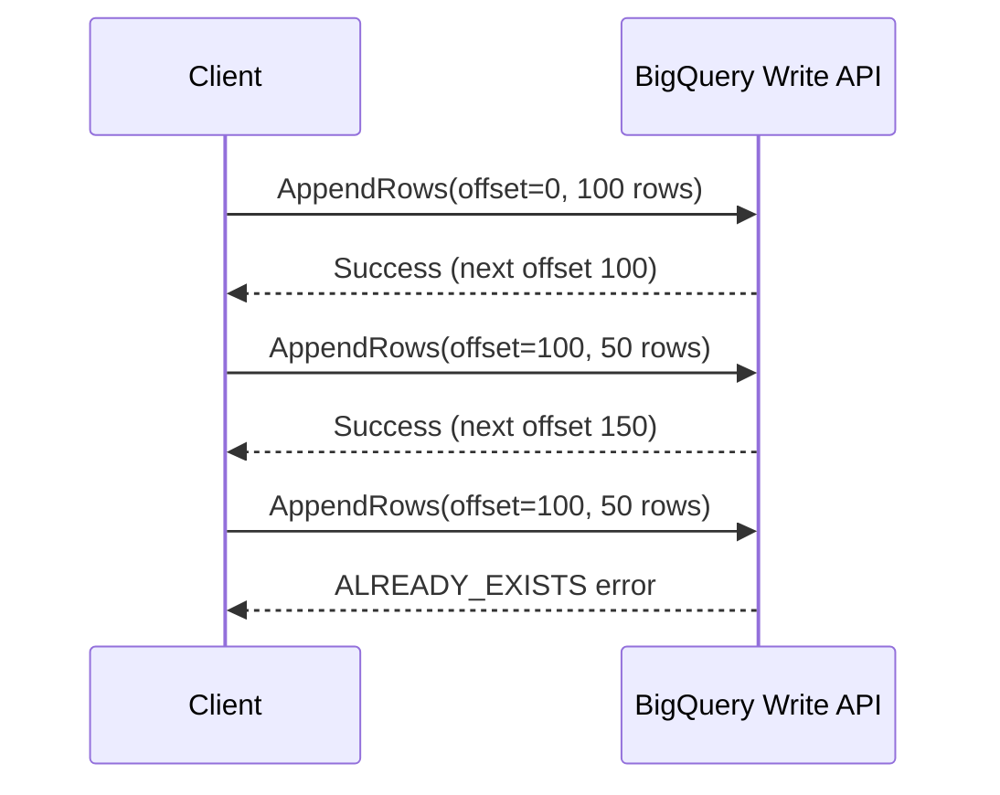

# Troubleshoot BigQuery Storage Write API CommitStream Offset Already Exists Error

Author: [nawazdhandala](https://www.github.com/nawazdhandala)

Tags: GCP, BigQuery, Storage Write API, Streaming, Data Ingestion, Troubleshooting

Description: A practical guide to diagnosing and resolving the CommitStream offset already exists error when using BigQuery Storage Write API for data ingestion.

---

The BigQuery Storage Write API is a high-performance data ingestion interface that gives you more control over exactly-once semantics compared to the legacy streaming API. But when you run into the "offset already exists" error during an AppendRows call, it can be confusing - especially if you think your offsets are correct. Let me walk you through what causes this and how to fix it.

## What the Error Looks Like

When this error occurs, you will typically see something like:

```text
ALREADY_EXISTS: The offset 42 has already been written to stream
projects/my-project/datasets/my_dataset/tables/my_table/streams/writer_1
```

Or in your application logs:

```text
com.google.api.gax.rpc.AlreadyExistsException: io.grpc.StatusRuntimeException:
ALREADY_EXISTS: Offset already exists.
```

This means BigQuery has already processed data at the offset you are trying to write to. Note that offsets are not allowed on the default stream, so if you see this error it is normally on an application-created stream.

## How the Write API Offset System Works

Before diving into fixes, it helps to understand how offsets work in the Storage Write API.

The Write API provides a default stream and three application-created stream types:

1. **Default stream** - at-least-once semantics, no offset management needed
2. **Committed type** - records are available immediately, and offsets can provide exactly-once semantics within a stream
3. **Pending type** - records are committed atomically when the stream is finalized and batch-committed
4. **Buffered type** - an advanced type where records are buffered until rows are committed by flushing the stream

For application-created streams, an AppendRows request can include an offset from the start of the stream. The offset is a row position, not a request counter: if you append 100 rows at offset 0, the next offset is 100. BigQuery only allows writes at the current end of the stream, and if you send a request with an offset that has already been written, you get this error.


```mermaid
sequenceDiagram
    participant Client
    participant WriteAPI as BigQuery Write API
    Client->>WriteAPI: AppendRows(offset=0, 100 rows)
    WriteAPI-->>Client: Success (next offset 100)
    Client->>WriteAPI: AppendRows(offset=100, 50 rows)
    WriteAPI-->>Client: Success (next offset 150)
    Client->>WriteAPI: AppendRows(offset=100, 50 rows)
    WriteAPI-->>Client: ALREADY_EXISTS error
```

## Common Causes

### 1. Retrying Without Checking the Previous Response

The most common cause is retrying a write request that actually succeeded. Your client sent data at offset N, the server wrote it, but the response was lost due to a network issue. Your retry logic then sends offset N again, and BigQuery rejects it because rows already exist there.

### 2. Multiple Writers Sharing a Stream Without Coordination

If two processes or threads are writing to the same stream and both try to use the same offset, one will succeed and the other will get this error.

### 3. Incorrect Offset Tracking After Application Restart

When your application restarts, it might lose track of the next offset to write and start from a stale value.

## Fix 1: Handle ALREADY_EXISTS as a Success

The simplest and most important fix is to treat the ALREADY_EXISTS error as a success case when you are retrying the same batch at the same offset. If BigQuery tells you the offset already exists, it means rows were already written at that offset. If there are multiple writers or your offset state is suspect, first confirm that the retry batch really matches the original write.

Here is a Python example showing proper handling:

```python
from google.cloud import bigquery_storage_v1
from google.api_core import exceptions

def append_rows_with_retry(write_client, stream_name, proto_data, offset, row_count, max_retries=3):
    """Append rows with proper handling of ALREADY_EXISTS errors."""
    for attempt in range(max_retries):
        try:
            request = bigquery_storage_v1.types.AppendRowsRequest(
                write_stream=stream_name,
                offset=offset,
                proto_rows=proto_data,  # Include writer_schema on the first request.
            )
            response = write_client.append_rows(iter([request]))

            # Process the response
            for resp in response:
                if resp.error.code == bigquery_storage_v1.types.StorageError.StorageErrorCode.OFFSET_ALREADY_EXISTS:
                    print(f"Offset {offset} already written, moving on")
                    return offset + row_count
                if resp.error.code:
                    raise Exception(f"Append failed: {resp.error.message}")
                return offset + row_count

        except exceptions.AlreadyExists:
            # This offset was already written - the data is safe for this retry
            # Treat this as a success and move to the next offset
            print(f"Offset {offset} already written, moving on")
            return offset + row_count

        except exceptions.ServiceUnavailable:
            # Transient error - safe to retry with same offset
            print(f"Transient error on attempt {attempt + 1}, retrying...")
            continue

    raise Exception(f"Failed after {max_retries} retries")
```

## Fix 2: Track Offsets Durably

Instead of keeping offsets only in memory, persist them somewhere durable so your application can recover the correct offset after a restart.

```python
import json
import os

class OffsetTracker:
    """Track next offsets in a local file for recovery after restarts."""

    def __init__(self, checkpoint_file):
        self.checkpoint_file = checkpoint_file
        self.offsets = self._load()

    def _load(self):
        # Load previously saved offsets from disk
        if os.path.exists(self.checkpoint_file):
            with open(self.checkpoint_file, 'r') as f:
                return json.load(f)
        return {}

    def save(self, stream_name, next_offset):
        # Persist the next offset to write
        self.offsets[stream_name] = next_offset
        with open(self.checkpoint_file, 'w') as f:
            json.dump(self.offsets, f)

    def get_next_offset(self, stream_name):
        # Return the next offset to use for this stream
        return self.offsets.get(stream_name, 0)
```

For production workloads, use something more robust than a local file - Cloud Datastore, Cloud SQL, or Redis work well.

## Fix 3: Use the Default Stream When Exactly-Once Is Not Required

If your use case does not strictly require exactly-once semantics, switch to the default stream. It does not use offsets and sidesteps this problem entirely.

```python
from google.cloud import bigquery_storage_v1

def write_to_default_stream(project_id, dataset_id, table_id, rows):
    """Write to the default stream - no offset management needed."""
    client = bigquery_storage_v1.BigQueryWriteClient()

    # The default stream path
    stream_name = f"projects/{project_id}/datasets/{dataset_id}/tables/{table_id}/streams/_default"

    request = bigquery_storage_v1.types.AppendRowsRequest(
        write_stream=stream_name,
        # Note: no offset field set - BigQuery handles ordering
        proto_rows=bigquery_storage_v1.types.AppendRowsRequest.ProtoData(rows=rows),
    )

    response = client.append_rows(iter([request]))
    for resp in response:
        print(f"Rows written successfully: {resp.append_result}")
```

The default stream provides at-least-once delivery, which is fine for most analytics workloads where a small number of duplicate rows is acceptable.

## Fix 4: Use Exclusive Streams for Parallel Writers

When you have multiple writers, create a separate stream for each writer instead of sharing one.

```python
def create_exclusive_stream(client, table_path):
    """Create a dedicated write stream for a single writer."""
    write_stream = bigquery_storage_v1.types.WriteStream(
        type_=bigquery_storage_v1.types.WriteStream.Type.COMMITTED,
    )

    # Each writer gets its own stream with independent offsets
    stream = client.create_write_stream(
        parent=table_path,
        write_stream=write_stream,
    )

    print(f"Created stream: {stream.name}")
    return stream.name
```

With exclusive streams, each writer manages its own offset counter starting from 0, so there is no conflict between writers.

## Fix 5: Finalize a Stream to Confirm Its Row Count

If you are done writing to an application-created stream, you can finalize it to stop future appends and get the number of rows in the finalized stream. This is not a general-purpose recovery mechanism for a still-active stream, so you should still rely on durable checkpoints for ongoing offset recovery.

```python
def finalize_stream(client, stream_name):
    """Finalize a stream and return its row count."""
    response = client.finalize_write_stream(name=stream_name)

    print(f"Finalized row count: {response.row_count}")

    return response.row_count
```

## Monitoring for This Error

Set up a log-based metric and alert so you know when this error is happening frequently.

```bash
# Create a log-based metric for offset already exists errors

gcloud logging metrics create bigquery-offset-already-exists \
    --description="Count of BigQuery Write API offset already exists errors" \
    --log-filter='resource.type="bigquery_resource" AND "offset already exists"' \
    --project=my-project
```

A few occasional ALREADY_EXISTS errors during retries are normal and expected. But if you see a high rate, it usually indicates a bug in your offset tracking logic or uncoordinated parallel writers.

## Summary

The ALREADY_EXISTS error on offsets is not a data loss event when it happens during an idempotent retry - it is BigQuery telling you rows already exist at that offset. The key takeaways are:

- Handle ALREADY_EXISTS as a success only when retrying the same batch at the same offset
- Persist your offsets durably to survive application restarts
- Use exclusive streams for parallel writers
- Consider the default stream if you do not need exactly-once semantics
- Monitor the error rate to catch systemic issues early

Getting the offset management right is the hardest part of using the Storage Write API, but once you have it figured out, the API is extremely reliable and performant.
