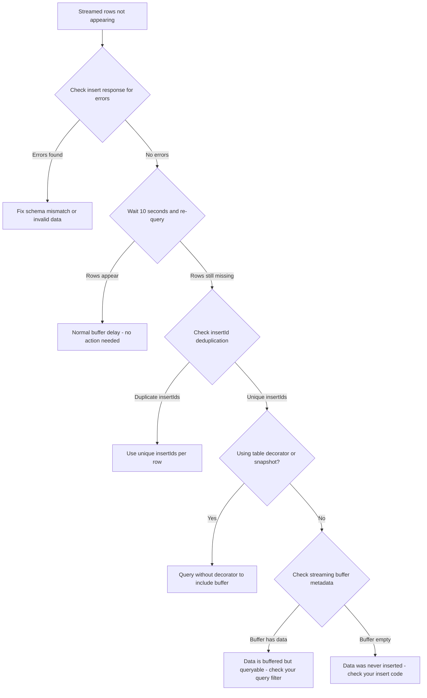

# How to Troubleshoot BigQuery Streaming Insert Rows Not Appearing in Table Queries

Author: [nawazdhandala](https://www.github.com/nawazdhandala)

Tags: GCP, BigQuery, Streaming Insert, Data Ingestion, Buffering, Troubleshooting

Description: Diagnose and fix issues where BigQuery streaming insert rows are not appearing in query results, covering buffer behavior, deduplication, and error handling.

---

You are streaming rows into a BigQuery table and they are not showing up when you query the table. Or maybe some rows appear but others are missing. This is one of the most confusing behaviors in BigQuery, and it catches almost everyone the first time they use the streaming insert API.

The streaming buffer in BigQuery has specific behaviors that differ from regular loaded data. Let me explain what is happening and how to troubleshoot it.

## How the Streaming Buffer Works

When you use the streaming insert API (insertAll or the Storage Write API), rows go into a streaming buffer before being merged into the table's permanent storage. During this buffer period, the rows are queryable but behave differently than permanent rows.

Key behaviors of the streaming buffer:
- Rows are available for querying within a few seconds of insertion
- Buffered rows are not visible to table copy operations or export operations
- Buffered rows cannot be updated or deleted with DML until they are flushed to permanent storage
- Buffer flush time is typically up to 90 minutes but can be longer
- Table decorators and snapshots do not include buffered rows

```bash
# Check if a table has data in the streaming buffer
bq show --format=prettyjson my_dataset.my_table | python3 -c "
import json, sys
table = json.load(sys.stdin)
streaming = table.get('streamingBuffer', {})
if streaming:
    print(f'Estimated rows in buffer: {streaming.get(\"estimatedRows\", \"unknown\")}')
    print(f'Estimated bytes in buffer: {streaming.get(\"estimatedBytes\", \"unknown\")}')
    print(f'Oldest entry time: {streaming.get(\"oldestEntryTime\", \"unknown\")}')
else:
    print('No streaming buffer data')
"
```

## Problem 1 - Rows Are in the Buffer but Not Yet Queryable

In rare cases, there can be a delay of a few seconds between when rows are inserted and when they appear in query results.

```python
from google.cloud import bigquery
import time

client = bigquery.Client()

# Insert rows
errors = client.insert_rows_json(
    'my_dataset.my_table',
    [{'id': 'test-1', 'value': 42, 'timestamp': '2024-06-15T10:00:00'}]
)

if errors:
    print(f"Insert errors: {errors}")
else:
    # Wait a moment for the buffer to become queryable
    time.sleep(5)

    # Now query
    query = "SELECT * FROM `my_dataset.my_table` WHERE id = 'test-1'"
    results = client.query(query).result()
    for row in results:
        print(row)
```

## Problem 2 - Rows Silently Failed to Insert

The streaming insert API can return success (HTTP 200) while individual rows fail. You must check the response for per-row errors.

```python
from google.cloud import bigquery

client = bigquery.Client()
table_ref = client.dataset('my_dataset').table('my_table')

rows = [
    {'id': 'row-1', 'value': 42, 'timestamp': '2024-06-15T10:00:00'},
    {'id': 'row-2', 'value': 'not_a_number', 'timestamp': '2024-06-15T10:00:01'},  # Type mismatch
    {'id': 'row-3', 'value': 17, 'timestamp': 'invalid_timestamp'},  # Invalid timestamp
]

errors = client.insert_rows_json(table_ref, rows)

if errors:
    # errors is a list of dictionaries, one per failed row
    for error in errors:
        print(f"Row insert error: {error}")
else:
    print("All rows inserted successfully")
```

Common reasons for silent row failures:
- Schema mismatch (wrong data types)
- Required fields missing
- Invalid values (like malformed timestamps)
- Rows exceeding the maximum size (10 MB per request, 1 MB per row)

## Problem 3 - Deduplication Removing Rows

BigQuery uses the `insertId` field to deduplicate streaming inserts. If you accidentally reuse the same `insertId` for different rows, BigQuery will silently drop the duplicates.

```python
from google.cloud import bigquery
import uuid

client = bigquery.Client()
table_ref = client.dataset('my_dataset').table('my_table')

# Bad: using a static insertId causes deduplication
rows_bad = [
    {'insertId': 'static-id', 'json': {'id': 'row-1', 'value': 1}},
    {'insertId': 'static-id', 'json': {'id': 'row-2', 'value': 2}},  # Will be deduped!
]

# Good: use unique insertIds (or let the client generate them)
rows_good = [
    {'id': 'row-1', 'value': 1},
    {'id': 'row-2', 'value': 2},
]

# The Python client auto-generates unique insertIds when using insert_rows_json
errors = client.insert_rows_json(table_ref, rows_good)
```

If you want to disable deduplication entirely (useful when you handle duplicates yourself).

```python
from google.cloud import bigquery

client = bigquery.Client()
table_ref = client.dataset('my_dataset').table('my_table')

# Disable deduplication by not sending insertIds
# Note: this means retries can cause duplicate rows
rows = [
    bigquery.table.TableRow(values={'id': 'row-1', 'value': 1}),
]
```

## Problem 4 - Table Schema Changed After Streaming Started

If you alter a table's schema while there is data in the streaming buffer, the behavior can be unpredictable. New fields might not appear in buffered rows, and type changes can cause issues.

```bash
# Check the streaming buffer status before schema changes
bq show --format=prettyjson my_dataset.my_table | grep -A5 streamingBuffer
```

Best practice: wait for the streaming buffer to empty before making schema changes. You can check this by monitoring the `streamingBuffer` metadata until it disappears.

```python
from google.cloud import bigquery
import time

client = bigquery.Client()

def wait_for_buffer_flush(dataset_id, table_id, timeout=7200):
    """Wait for the streaming buffer to be flushed to permanent storage."""
    table_ref = client.dataset(dataset_id).table(table_id)
    start_time = time.time()

    while time.time() - start_time < timeout:
        table = client.get_table(table_ref)

        if table.streaming_buffer is None:
            print("Streaming buffer is empty")
            return True

        print(f"Buffer still has ~{table.streaming_buffer.estimated_rows} rows. Waiting...")
        time.sleep(60)

    print("Timeout waiting for buffer flush")
    return False
```

## Problem 5 - Querying with Table Decorators or Snapshots

Table decorators (used for time-travel queries) and table snapshots do not include streaming buffer data.

```sql
-- This might miss recently streamed rows because it queries a snapshot
SELECT * FROM `my_dataset.my_table`
FOR SYSTEM_TIME AS OF TIMESTAMP_SUB(CURRENT_TIMESTAMP(), INTERVAL 1 HOUR);

-- This queries the current state including the streaming buffer
SELECT * FROM `my_dataset.my_table`;
```

## Problem 6 - Export and Copy Miss Buffered Rows

If you export a table to Cloud Storage or copy it to another table, buffered rows are not included.

```bash
# This export might miss streaming buffer rows
bq extract my_dataset.my_table gs://my-bucket/export/data-*.csv

# Wait for the buffer to flush first, or use a query-based export
bq query --use_legacy_sql=false "
EXPORT DATA OPTIONS(
  uri='gs://my-bucket/export/data-*.parquet',
  format='PARQUET',
  overwrite=true
) AS
SELECT * FROM \`my_dataset.my_table\`;
"
# The query-based export includes buffered rows
```

## Debugging Workflow



## Best Practices for Streaming Inserts

1. Always check the response for per-row errors
2. Use unique `insertId` values or let the client generate them
3. Validate data types before sending to BigQuery
4. Allow a few seconds delay before querying newly inserted data
5. Use query-based exports instead of extract when buffer data matters
6. Wait for buffer flush before schema changes or table copies
7. Monitor the streaming buffer size as a health metric

## Summary

Streaming insert rows not appearing in BigQuery queries is usually caused by one of these issues: silent per-row insert errors, insertId deduplication, schema mismatches, or querying through decorators or snapshots that do not include the buffer. Always check the insert response for errors, use unique insert IDs, and be aware that the streaming buffer has different behavior than permanent storage. For export and copy operations, use query-based approaches that include the buffer.
