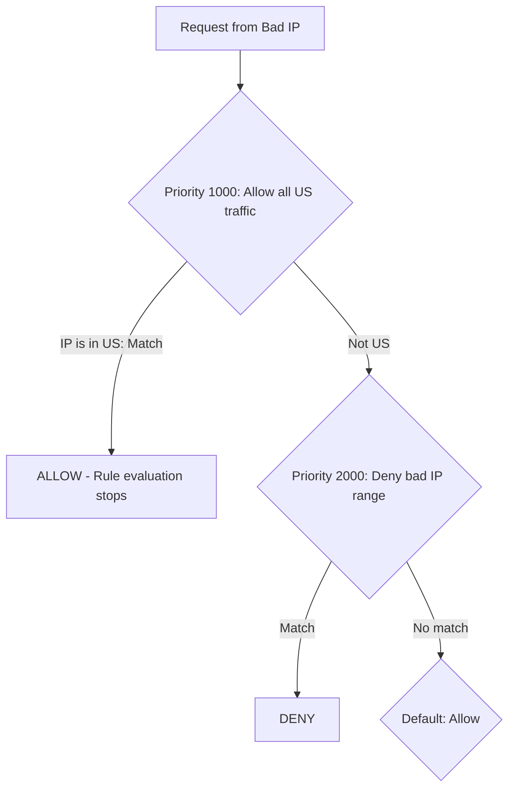

# How to Troubleshoot Cloud Armor Rules That Are Not Matching Expected Traffic in GCP

Author: [nawazdhandala](https://www.github.com/nawazdhandala)

Tags: GCP, Cloud Armor, Troubleshooting, Security Policies, Debugging

Description: Diagnose and fix Cloud Armor rules that fail to match expected traffic patterns, covering common issues with rule priority, CEL expressions, and logging analysis.

---

You have written your Cloud Armor rules, attached the policy to your backend service, and traffic is still getting through when it should be blocked - or getting blocked when it should be allowed. This is one of the most frustrating issues to debug because the rules look correct on paper. The problem is usually subtle: a priority ordering issue, a CEL expression that does not match what you think it does, or traffic that is not flowing through the path you expect.

This guide walks through a systematic approach to diagnosing and fixing Cloud Armor rule matching issues.

## Start with the Basics: Is the Policy Attached?

The most common reason rules do not match is that the security policy is not actually attached to the right backend service:

```bash
# Check which security policy is attached to your backend service
gcloud compute backend-services describe your-backend-service \
  --global \
  --format="yaml(securityPolicy, edgeSecurityPolicy)" \
  --project=your-project-id
```

If the output shows no security policy, that is your answer. Attach it:

```bash
# Attach the security policy
gcloud compute backend-services update your-backend-service \
  --security-policy=your-policy-name \
  --global \
  --project=your-project-id
```

Also verify you are looking at the right backend service. If your load balancer has multiple backend services, the request might be routing to a different one than you expect:

```bash
# List all backend services and their security policies
gcloud compute backend-services list \
  --format="table(name, securityPolicy, edgeSecurityPolicy)" \
  --project=your-project-id
```

## Check Rule Priority Order

Cloud Armor evaluates rules by priority, lowest number first. Once a rule matches, evaluation stops. This means a higher-priority rule can prevent a lower-priority rule from ever being evaluated.

```bash
# List all rules in your security policy, ordered by priority
gcloud compute security-policies rules list \
  --security-policy=your-policy-name \
  --format="table(priority, action, description)" \
  --project=your-project-id
```

A common mistake is having a broad allow rule at a lower priority number (higher priority) that matches before your deny rule gets a chance:



In this example, if the bad IP is in the US, the allow rule at priority 1000 matches first, and the deny rule at 2000 never runs.

**Fix:** Reorder your rules so deny rules for known bad actors have lower priority numbers (higher priority) than broad allow rules.

## Examine the Logs

Cloud Armor logs every request evaluation. The logs tell you exactly which rule matched and what action was taken:

```bash
# Get detailed Cloud Armor enforcement logs
gcloud logging read \
  'resource.type="http_load_balancer" AND jsonPayload.enforcedSecurityPolicy.name="your-policy-name"' \
  --project=your-project-id \
  --limit=20 \
  --format=json
```

Look for these fields in the log entries:

- `enforcedSecurityPolicy.name` - which policy was evaluated
- `enforcedSecurityPolicy.priority` - which rule matched
- `enforcedSecurityPolicy.configuredAction` - what action was taken
- `enforcedSecurityPolicy.matchedFieldType` - what part of the request matched
- `enforcedSecurityPolicy.matchedFieldValue` - the actual value that matched

If the priority in the log is `2147483647`, that means the default rule matched, which means none of your custom rules are matching the traffic.

## Debug CEL Expressions

CEL expression issues are the most common cause of rules not matching. Here are the typical problems:

### Missing has() Check

If you access a header that does not exist, the expression fails silently:

```bash
# Wrong - fails if user-agent header is missing
--expression="request.headers['user-agent'].matches('.*bot.*')"

# Right - check if header exists first
--expression="has(request.headers['user-agent']) && request.headers['user-agent'].matches('.*bot.*')"
```

### Case Sensitivity

Header values are case-sensitive in CEL. A User-Agent of "Googlebot" will not match a pattern looking for "googlebot":

```bash
# This will miss "Googlebot", "GOOGLEBOT", etc.
--expression="request.headers['user-agent'].matches('.*googlebot.*')"

# Use case-insensitive matching
--expression="request.headers['user-agent'].lower().matches('.*googlebot.*')"
```

### Regex Escaping

CEL uses RE2 regex, which requires proper escaping:

```bash
# Wrong - dot matches any character
--expression="request.path.matches('/api/v1.0/data')"

# Right - escape the dot to match literally
--expression="request.path.matches('/api/v1\\.0/data')"
```

### Testing Expressions

Use preview mode to test your expressions without affecting traffic:

```bash
# Create a test rule in preview mode
gcloud compute security-policies rules create 500 \
  --security-policy=your-policy-name \
  --expression="your-cel-expression-here" \
  --action=deny-403 \
  --preview \
  --description="Testing: rule for debugging"
```

Then check the logs to see if the preview rule would have matched:

```bash
# Check preview rule matches
gcloud logging read \
  'resource.type="http_load_balancer" AND jsonPayload.previewSecurityPolicy.priority=500' \
  --project=your-project-id \
  --limit=10 \
  --format=json
```

## Check If Traffic Is Actually Hitting the Load Balancer

Sometimes the traffic you are trying to match is not going through the load balancer at all. Common reasons:

- DNS is pointing to an old IP address
- Client is hitting the backend directly, bypassing the load balancer
- A CDN or proxy in front of the load balancer is caching or blocking the request before it reaches Cloud Armor

Verify that requests are hitting your load balancer:

```bash
# Check load balancer request logs
gcloud logging read \
  'resource.type="http_load_balancer" AND httpRequest.requestUrl:"your-expected-path"' \
  --project=your-project-id \
  --limit=10 \
  --format="table(timestamp, httpRequest.remoteIp, httpRequest.requestUrl, httpRequest.status)"
```

## IP Address Issues

If your IP-based rules are not matching, the source IP Cloud Armor sees might not be what you expect.

### Client Behind a Proxy

If the client is behind a proxy, NAT, or VPN, the source IP will be the proxy's IP, not the client's:

```bash
# Check what source IP Cloud Armor is seeing
gcloud logging read \
  'resource.type="http_load_balancer"' \
  --project=your-project-id \
  --limit=5 \
  --format="table(httpRequest.remoteIp)"
```

### CDN in Front of Load Balancer

If you have a CDN in front of your load balancer, the source IP will be the CDN's edge server IP. You might need to inspect the `X-Forwarded-For` header instead:

```bash
# Match based on X-Forwarded-For header instead of source IP
gcloud compute security-policies rules create 1000 \
  --security-policy=your-policy-name \
  --expression="has(request.headers['x-forwarded-for']) && request.headers['x-forwarded-for'].matches('203\\.0\\.113\\..*')" \
  --action=deny-403 \
  --description="Block traffic from specific IP range via XFF header"
```

## Geographic Matching Issues

If geographic rules are not matching as expected, keep in mind that GeoIP databases are not perfect. Some IPs may not have accurate country assignments, especially for VPN and cloud provider IPs:

```bash
# Log the region code Cloud Armor assigns to requests
gcloud logging read \
  'resource.type="http_load_balancer"' \
  --project=your-project-id \
  --limit=10 \
  --format="table(httpRequest.remoteIp, jsonPayload.enforcedSecurityPolicy.matchedFieldValue)"
```

## The Systematic Debugging Checklist

When a rule is not matching, go through this checklist in order:

1. Is the policy attached to the correct backend service?
2. Is the rule priority correct relative to other rules?
3. Is the CEL expression syntactically valid?
4. Are you using `has()` checks for optional fields?
5. Is the regex correct and properly escaped?
6. Is the traffic actually hitting the load balancer?
7. Is the source IP what you expect?
8. Are you looking at the right logs?

Following this checklist systematically will resolve the vast majority of Cloud Armor rule matching issues. Start from the top and work your way down - the answer is almost always in one of the first few steps.

## Wrapping Up

Debugging Cloud Armor rules comes down to understanding the evaluation flow and having good visibility into what is happening. The logs are your best friend here. Between checking policy attachment, rule priorities, CEL expression correctness, and actual traffic patterns, you can diagnose almost any rule matching issue. When in doubt, use preview mode to test rules without risk, and always verify your assumptions by checking the logs rather than guessing.
