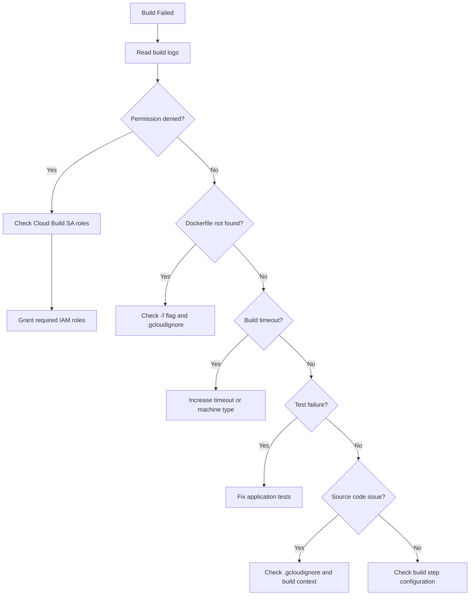

# How to Troubleshoot Cloud Build Failures Due to Permission and Source Code Errors

Author: [nawazdhandala](https://www.github.com/nawazdhandala)

Tags: GCP, Cloud Build, CI/CD, Permissions, Troubleshooting

Description: How to diagnose and fix Cloud Build failures caused by permission issues and source code errors, including service account configuration, build log analysis, and common fixes.

---

Cloud Build is GCP's CI/CD service for building containers, running tests, and deploying applications. When builds fail, the errors can range from obvious (syntax error in your Dockerfile) to maddening (permission denied on some API you did not even know was involved). Let me walk through the common failure categories and how to fix them.

## Reading Build Logs

The first step with any Cloud Build failure is reading the logs:

```bash
# List recent builds and their status
gcloud builds list --limit=10 --format="table(id, status, startTime, source.repoSource.repoName)"

# Get detailed logs for a specific build
gcloud builds log BUILD_ID

# Stream logs for a running build
gcloud builds log BUILD_ID --stream
```

The logs show each build step and where it failed. Pay attention to the step number and the error message.

## Permission Errors

### Cloud Build Service Account

Cloud Build uses a service account to execute build steps. By default, this is `PROJECT_NUMBER@cloudbuild.gserviceaccount.com`. This account needs permissions for whatever your build does.

```bash
# Find the Cloud Build service account
gcloud projects describe my-project --format="value(projectNumber)"
# The SA is: PROJECT_NUMBER@cloudbuild.gserviceaccount.com

# Check its current roles
gcloud projects get-iam-policy my-project \
    --flatten="bindings[].members" \
    --filter="bindings.members:serviceAccount:PROJECT_NUMBER@cloudbuild.gserviceaccount.com" \
    --format="table(bindings.role)"
```

Common roles the Cloud Build SA needs depending on what your build does:

```bash
# If your build pushes to Artifact Registry
gcloud projects add-iam-binding my-project \
    --member="serviceAccount:PROJECT_NUMBER@cloudbuild.gserviceaccount.com" \
    --role="roles/artifactregistry.writer"

# If your build deploys to Cloud Run
gcloud projects add-iam-binding my-project \
    --member="serviceAccount:PROJECT_NUMBER@cloudbuild.gserviceaccount.com" \
    --role="roles/run.admin"

# If your build deploys to GKE
gcloud projects add-iam-binding my-project \
    --member="serviceAccount:PROJECT_NUMBER@cloudbuild.gserviceaccount.com" \
    --role="roles/container.developer"

# If your build deploys Cloud Functions
gcloud projects add-iam-binding my-project \
    --member="serviceAccount:PROJECT_NUMBER@cloudbuild.gserviceaccount.com" \
    --role="roles/cloudfunctions.developer"

# If your build accesses Secret Manager
gcloud projects add-iam-binding my-project \
    --member="serviceAccount:PROJECT_NUMBER@cloudbuild.gserviceaccount.com" \
    --role="roles/secretmanager.secretAccessor"
```

### actAs Permission for Deployments

When Cloud Build deploys to Cloud Run or Cloud Functions, it needs `iam.serviceAccounts.actAs` on the runtime service account:

```bash
# Grant actAs for Cloud Run deployments
gcloud iam service-accounts add-iam-policy-binding \
    PROJECT_NUMBER-compute@developer.gserviceaccount.com \
    --member="serviceAccount:PROJECT_NUMBER@cloudbuild.gserviceaccount.com" \
    --role="roles/iam.serviceAccountUser"
```

### Container Registry vs Artifact Registry

If your build pushes to Container Registry (gcr.io), the Cloud Build SA needs `storage.admin` on the storage bucket. For Artifact Registry, it needs `artifactregistry.writer`:

```bash
# For Artifact Registry (recommended)
gcloud projects add-iam-binding my-project \
    --member="serviceAccount:PROJECT_NUMBER@cloudbuild.gserviceaccount.com" \
    --role="roles/artifactregistry.writer"

# For legacy Container Registry
# The SA usually has this by default, but verify
gcloud projects add-iam-binding my-project \
    --member="serviceAccount:PROJECT_NUMBER@cloudbuild.gserviceaccount.com" \
    --role="roles/storage.admin"
```

## Source Code Errors

### Dockerfile Not Found

```
ERROR: unable to prepare context: unable to evaluate symlinks in Dockerfile path:
lstat /workspace/Dockerfile: no such file or directory
```

This means Cloud Build cannot find your Dockerfile. Check the location:

```yaml
# cloudbuild.yaml - specify the Dockerfile location if it is not in the root
steps:
- name: 'gcr.io/cloud-builders/docker'
  args: ['build', '-t', 'us-docker.pkg.dev/$PROJECT_ID/my-repo/my-app:$COMMIT_SHA',
         '-f', 'docker/Dockerfile',  # Specify path to Dockerfile
         '.']
```

### Source Not Uploading Correctly

Cloud Build uploads your source code to a GCS bucket before building. If files are missing, check your `.gcloudignore` file:

```bash
# Check what files are being ignored
cat .gcloudignore

# Verify the source directory structure
ls -la
```

A common mistake is having `node_modules/` in `.gcloudignore` but your Dockerfile does a `COPY . .` that expects `node_modules` to exist. The fix: run `npm install` inside the Dockerfile, not before.

### Build Context Too Large

```
ERROR: context size (512MB) exceeds limit (500MB)
```

Your build context is too big. Use `.gcloudignore` to exclude unnecessary files:

```
# .gcloudignore
.git/
node_modules/
*.log
test/
docs/
.env
```

## Build Step Failures

### Step Dependencies

Build steps can depend on each other. If a step fails, subsequent steps are skipped:

```yaml
# cloudbuild.yaml with proper step ordering
steps:
  # Step 0: Install dependencies
  - name: 'node:20'
    entrypoint: 'npm'
    args: ['install']

  # Step 1: Run tests (depends on step 0)
  - name: 'node:20'
    entrypoint: 'npm'
    args: ['test']

  # Step 2: Build Docker image (depends on step 1)
  - name: 'gcr.io/cloud-builders/docker'
    args: ['build', '-t', 'us-docker.pkg.dev/$PROJECT_ID/my-repo/my-app:$COMMIT_SHA', '.']

  # Step 3: Push image
  - name: 'gcr.io/cloud-builders/docker'
    args: ['push', 'us-docker.pkg.dev/$PROJECT_ID/my-repo/my-app:$COMMIT_SHA']
```

### Timeout During Build

Builds have a default timeout of 10 minutes. Complex builds may need more:

```yaml
# Increase the build timeout in cloudbuild.yaml
timeout: '1800s'  # 30 minutes

steps:
  - name: 'gcr.io/cloud-builders/docker'
    args: ['build', '-t', 'my-image', '.']
```

Or via the CLI:

```bash
# Submit a build with a custom timeout
gcloud builds submit --timeout=1800 --tag us-docker.pkg.dev/my-project/my-repo/my-app
```

### Memory Issues During Build

If your build runs out of memory, increase the machine type:

```yaml
# Use a higher-memory build machine
options:
  machineType: 'E2_HIGHCPU_8'  # 8 vCPUs, more memory than default

steps:
  - name: 'gcr.io/cloud-builders/docker'
    args: ['build', '-t', 'my-image', '.']
```

Available machine types: `E2_MEDIUM` (default), `E2_HIGHCPU_8`, `E2_HIGHCPU_32`.

## Using Secret Manager in Builds

If your build needs secrets (API keys, credentials), use Secret Manager instead of environment variables:

```yaml
# Access secrets from Secret Manager during build
steps:
  - name: 'gcr.io/cloud-builders/docker'
    args: ['build',
           '--build-arg', 'API_KEY=$$API_KEY',
           '-t', 'my-image', '.']
    secretEnv: ['API_KEY']

availableSecrets:
  secretManager:
  - versionName: projects/$PROJECT_ID/secrets/my-api-key/versions/latest
    env: 'API_KEY'
```

## Debugging Flowchart



## Quick Permission Setup Script

Here is a script that sets up all commonly needed permissions for the Cloud Build service account:

```bash
#!/bin/bash
# Grant Cloud Build all commonly needed permissions
PROJECT_ID=$1
PROJECT_NUMBER=$(gcloud projects describe $PROJECT_ID --format="value(projectNumber)")
CB_SA="${PROJECT_NUMBER}@cloudbuild.gserviceaccount.com"

echo "Setting up permissions for: $CB_SA"

roles=(
    "roles/run.admin"
    "roles/cloudfunctions.developer"
    "roles/artifactregistry.writer"
    "roles/container.developer"
    "roles/secretmanager.secretAccessor"
    "roles/iam.serviceAccountUser"
)

for role in "${roles[@]}"; do
    echo "Granting $role..."
    gcloud projects add-iam-binding $PROJECT_ID \
        --member="serviceAccount:$CB_SA" \
        --role="$role" --quiet
done

echo "Done."
```

Cloud Build failures are usually either permission issues (easy to fix once you know what role to add) or source code issues (check your .gcloudignore and Dockerfile paths). The build logs always tell you what went wrong - read them carefully before making changes.
