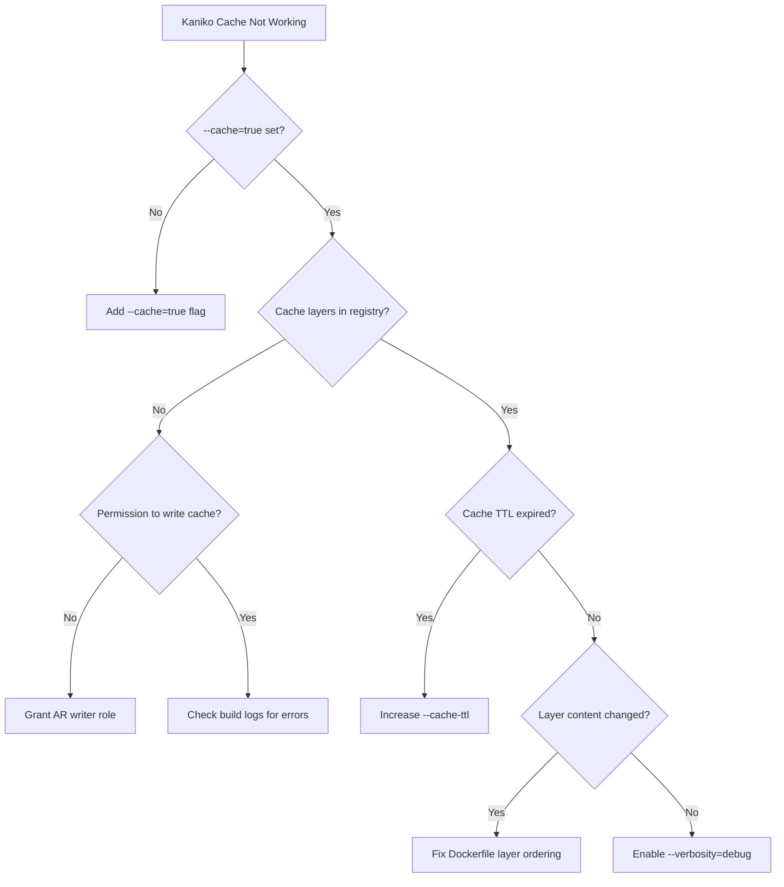

# How to Troubleshoot Cloud Build Kaniko Cache Not Being Reused Between Builds

Author: [nawazdhandala](https://www.github.com/nawazdhandala)

Tags: GCP, Cloud Build, Kaniko, Docker, CI/CD

Description: Diagnose and fix issues where Kaniko cache layers are not being reused between Google Cloud Build builds, causing slow repeat builds.

---

You set up Kaniko in Cloud Build to cache Docker layers and speed up your builds. The first build runs and pushes cache layers. But the next build still takes just as long - it is rebuilding everything from scratch instead of using the cached layers. Kaniko caching should dramatically reduce build times for repeat builds, but there are several reasons it silently fails to use the cache. This post walks through each one.

## How Kaniko Caching Works

Kaniko builds Docker images without needing a Docker daemon. It builds each layer, hashes it, and stores the result in a container registry (your cache repo). On subsequent builds, Kaniko checks the cache repo for each layer hash before building. If a cached layer matches, it pulls it instead of rebuilding.

The cache key for each layer is derived from the Dockerfile instruction and the files it references. If anything about the instruction or its inputs changes, the cache key changes and the layer is rebuilt.

## Step 1: Verify Cache Is Enabled

Check your `cloudbuild.yaml` to make sure caching flags are correct:

```yaml
# Kaniko step with caching enabled
steps:
  - name: 'gcr.io/kaniko-project/executor:latest'
    args:
      - '--destination=us-central1-docker.pkg.dev/$PROJECT_ID/my-repo/my-image:$COMMIT_SHA'
      - '--cache=true'                    # Enable caching
      - '--cache-ttl=168h'               # Cache TTL (7 days)
      - '--cache-repo=us-central1-docker.pkg.dev/$PROJECT_ID/my-repo/my-image/cache'
```

The `--cache=true` flag is required. Without it, Kaniko does not read from or write to the cache. Also, `--cache-repo` must point to a valid path in your container registry.

## Step 2: Check That Cache Layers Exist

After a build, verify that cache layers were actually pushed:

```bash
# List images in the cache repo path
gcloud artifacts docker images list \
    us-central1-docker.pkg.dev/your-project/your-repo/your-image/cache \
    --format="table(package, version, createTime)"
```

If no cache layers exist, the first build did not push them. Check the build logs for Kaniko output:

```bash
# Check build logs for caching-related messages
gcloud builds log BUILD_ID 2>&1 | grep -i "cache"
```

Look for messages like:
- "Pushing layer to cache"
- "Using cacheFrom"
- "No cached layer found"

## Step 3: Check Cache Repo Permissions

Kaniko needs both read and write access to the cache repo. The Cloud Build service account needs `roles/artifactregistry.writer` on the repository:

```bash
# Check permissions on the artifact registry repo
gcloud artifacts repositories get-iam-policy your-repo \
    --location=us-central1 \
    --format="json(bindings)"

# Grant writer access if missing
gcloud artifacts repositories add-iam-policy-binding your-repo \
    --location=us-central1 \
    --member="serviceAccount:PROJECT_NUMBER@cloudbuild.gserviceaccount.com" \
    --role="roles/artifactregistry.writer"
```

If Kaniko can build and push the final image but cannot write cache layers, it might have permission to the image path but not the cache path. Make sure the permissions cover both.

## Step 4: Understand Cache Invalidation

The most common reason for cache misses is unintentional cache invalidation. Every Dockerfile instruction creates a layer, and the cache key depends on:

1. The instruction text itself
2. Any files referenced by ADD or COPY instructions (content hash)
3. All preceding layers (a chain - if layer N changes, layers N+1 onward are invalidated)

Here is a Dockerfile that accidentally invalidates cache every time:

```dockerfile
# Bad: COPY . early means ANY file change invalidates everything below
FROM python:3.11-slim
COPY . /app/                          # Any code change invalidates this
RUN pip install -r /app/requirements.txt  # Always rebuilds even if requirements unchanged
RUN python -m pytest /app/tests/
```

Fix by separating stable and volatile content:

```dockerfile
# Good: Copy dependency file first, install, then copy code
FROM python:3.11-slim
WORKDIR /app

# Layer 1: System deps (rarely change)
RUN apt-get update && apt-get install -y build-essential && rm -rf /var/lib/apt/lists/*

# Layer 2: Python deps (change occasionally)
COPY requirements.txt .
RUN pip install --no-cache-dir -r requirements.txt

# Layer 3: Application code (changes frequently)
COPY . .
```

With this structure, if only your application code changes, Kaniko reuses cached layers 1 and 2 and only rebuilds layer 3.

## Step 5: Check for Non-Deterministic Instructions

Some Dockerfile instructions produce different results each time, which prevents cache hits:

```dockerfile
# Bad: These instructions produce different output every build
RUN apt-get update                           # Package lists change daily
RUN pip install some-package                  # Version can change
RUN echo "Build time: $(date)" > /build-info # Always different
RUN curl -O https://example.com/data.tar.gz  # Content might change
```

Fix by pinning versions and avoiding time-dependent commands:

```dockerfile
# Good: Deterministic instructions that produce consistent cache keys
RUN apt-get update && apt-get install -y \
    build-essential=12.9ubuntu3 \
    && rm -rf /var/lib/apt/lists/*
RUN pip install some-package==1.2.3
ARG BUILD_SHA
RUN echo "Build: ${BUILD_SHA}" > /build-info  # Only changes when SHA changes
```

Note that `apt-get update` combined with `apt-get install` in a single RUN instruction is cached as one layer. If you separate them, the `update` layer gets cached and the `install` might use stale package lists.

## Step 6: Check the Cache TTL

Cache layers have a time-to-live (TTL). The default Kaniko cache TTL is 6 hours. If your builds are more than 6 hours apart, the cache expires:

```yaml
# Set a longer cache TTL
steps:
  - name: 'gcr.io/kaniko-project/executor:latest'
    args:
      - '--destination=us-central1-docker.pkg.dev/$PROJECT_ID/my-repo/my-image:$COMMIT_SHA'
      - '--cache=true'
      - '--cache-ttl=720h'  # 30 days
      - '--cache-repo=us-central1-docker.pkg.dev/$PROJECT_ID/my-repo/my-image/cache'
```

Set the TTL based on how often your base layers change. If your requirements file changes weekly, a 7-day TTL is appropriate. If it changes monthly, use 30 days.

## Step 7: Verify the Kaniko Version

Older Kaniko versions had bugs with caching. Use the latest version:

```yaml
# Pin to a specific recent Kaniko version
steps:
  - name: 'gcr.io/kaniko-project/executor:v1.23.0'
    args:
      - '--destination=us-central1-docker.pkg.dev/$PROJECT_ID/my-repo/my-image:$COMMIT_SHA'
      - '--cache=true'
      - '--cache-ttl=168h'
      - '--cache-repo=us-central1-docker.pkg.dev/$PROJECT_ID/my-repo/my-image/cache'
```

Check the Kaniko release notes for cache-related bug fixes if you are using an older version.

## Step 8: Debug Cache Behavior with Verbose Logging

Enable verbose logging to see exactly why Kaniko is not using the cache:

```yaml
# Enable verbose Kaniko logging
steps:
  - name: 'gcr.io/kaniko-project/executor:latest'
    args:
      - '--destination=us-central1-docker.pkg.dev/$PROJECT_ID/my-repo/my-image:$COMMIT_SHA'
      - '--cache=true'
      - '--cache-ttl=168h'
      - '--cache-repo=us-central1-docker.pkg.dev/$PROJECT_ID/my-repo/my-image/cache'
      - '--verbosity=debug'
      - '--log-format=text'
```

The debug output shows:
- The cache key computed for each layer
- Whether a cache hit or miss occurred
- The reason for cache misses
- Network errors when accessing the cache repo

Look for lines like "Found cached layer" (hit) or "No cached layer found for cmd" (miss).

## Step 9: Use Snapshot Mode for Better Performance

Kaniko's snapshot mode affects how it detects file changes. The default `full` mode scans the entire filesystem, which is slow. The `redo` mode is faster:

```yaml
steps:
  - name: 'gcr.io/kaniko-project/executor:latest'
    args:
      - '--destination=us-central1-docker.pkg.dev/$PROJECT_ID/my-repo/my-image:$COMMIT_SHA'
      - '--cache=true'
      - '--cache-repo=us-central1-docker.pkg.dev/$PROJECT_ID/my-repo/my-image/cache'
      - '--snapshotMode=redo'  # Faster filesystem snapshots
      - '--use-new-run'        # Optimized RUN instruction handling
```

## Caching Troubleshooting Checklist



## Monitoring Build Performance

Track your build times with [OneUptime](https://oneuptime.com) to verify that Kaniko caching is working. A properly cached build should be significantly faster than a cold build. If you see build times regressing, it usually means the cache is not being used effectively.

Kaniko caching can reduce build times by 50-80% when configured correctly. The key is getting the Dockerfile layer ordering right, setting appropriate TTLs, and making sure permissions are in place for both reading and writing cache layers.
