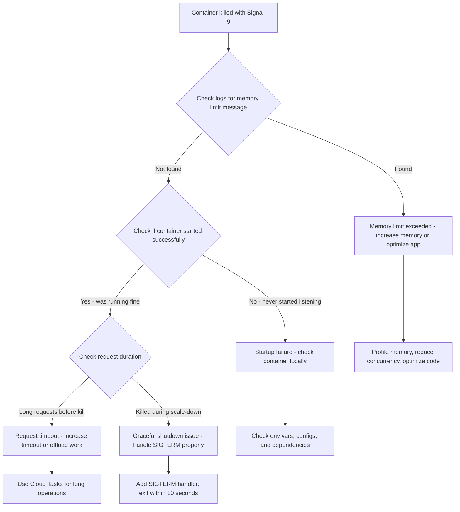

# How to Troubleshoot Cloud Run Container Exiting with Signal 9 SIGKILL

Author: [nawazdhandala](https://www.github.com/nawazdhandala)

Tags: GCP, Cloud Run, Containers, SIGKILL, Debugging, Troubleshooting

Description: A guide to diagnosing why your Cloud Run container is being killed with SIGKILL signal 9, covering memory limits, health checks, and timeout issues.

---

There are few things more frustrating than a container that just vanishes. No error message, no stack trace, no graceful shutdown - just "Container terminated with signal 9." SIGKILL is the operating system telling your process to die immediately, with no opportunity to catch the signal or clean up. On Cloud Run, this happens more often than you might expect, and the causes are not always obvious.

Let me walk through the common reasons Cloud Run sends SIGKILL to your container and how to fix each one.

## What SIGKILL Means on Cloud Run

Signal 9 (SIGKILL) is an uncatchable, unblockable kill signal. Unlike SIGTERM (signal 15), which your application can intercept and handle gracefully, SIGKILL terminates the process immediately. On Cloud Run, you will see this in your logs.

```
Container called exit(137).
```

Exit code 137 means the process was killed by SIGKILL (128 + 9 = 137). You might also see exit code 143, which means SIGTERM (128 + 15 = 143) - but that is a different problem with a different solution.

## Cause 1 - Memory Limit Exceeded

This is the most common cause of SIGKILL on Cloud Run. When your container uses more memory than its configured limit, the Linux OOM killer steps in and sends SIGKILL.

Check your logs for memory-related messages.

```bash
# Search for memory limit errors in Cloud Logging
gcloud logging read \
    'resource.type="cloud_run_revision" AND resource.labels.service_name="my-service" AND textPayload:"memory"' \
    --project=my-project \
    --limit=50 \
    --format="table(timestamp, textPayload)"
```

If you see "Container exceeded memory limit" alongside the SIGKILL, the fix is straightforward.

```bash
# Increase memory allocation
gcloud run services update my-service \
    --memory=1Gi \
    --region=us-central1
```

But before just increasing memory, profile your application to understand why it is using so much. Common culprits include loading large files into memory, unbounded caches, and handling too many concurrent requests.

## Cause 2 - Startup Timeout

Cloud Run gives your container a limited time to start and begin listening on the configured port. If your container does not start in time, Cloud Run kills it with SIGKILL.

The default startup timeout depends on your configuration, but you can adjust it.

```bash
# Set a longer startup timeout (up to 3600 seconds)
gcloud run services update my-service \
    --timeout=300 \
    --region=us-central1
```

You can also configure startup probes to give Cloud Run better visibility into your application startup process.

```yaml
# service.yaml with startup probe configuration
apiVersion: serving.knative.dev/v1
kind: Service
metadata:
  name: my-service
spec:
  template:
    metadata:
      annotations:
        run.googleapis.com/startup-cpu-boost: "true"
    spec:
      containers:
        - image: gcr.io/my-project/my-service:latest
          # Startup probe checks if the app is ready
          startupProbe:
            httpGet:
              path: /health
              port: 8080
            initialDelaySeconds: 5
            periodSeconds: 5
            failureThreshold: 30
            timeoutSeconds: 3
```

## Cause 3 - Request Timeout

If a request takes too long, Cloud Run will terminate the container instance. The default request timeout is 300 seconds (5 minutes), but you can configure it up to 3600 seconds.

```bash
# Check the current timeout setting
gcloud run services describe my-service \
    --region=us-central1 \
    --format="value(spec.template.spec.timeoutSeconds)"

# Increase the timeout if needed
gcloud run services update my-service \
    --timeout=600 \
    --region=us-central1
```

For long-running operations, consider using Cloud Tasks to offload the work instead of holding the HTTP connection open.

## Cause 4 - Graceful Shutdown Window Expired

When Cloud Run needs to shut down your instance (scale-down, redeployment, etc.), it first sends SIGTERM to give your application a chance to finish current requests and clean up. If your application does not exit within 10 seconds after receiving SIGTERM, Cloud Run sends SIGKILL.

Handle SIGTERM properly in your application.

```javascript
// Node.js graceful shutdown handler
const server = app.listen(process.env.PORT || 8080);

process.on('SIGTERM', () => {
  console.log('SIGTERM received, starting graceful shutdown');

  // Stop accepting new connections
  server.close(() => {
    console.log('All connections closed, exiting');
    process.exit(0);
  });

  // Force exit if cleanup takes too long (leave buffer before SIGKILL)
  setTimeout(() => {
    console.error('Graceful shutdown timed out, forcing exit');
    process.exit(1);
  }, 8000); // Exit after 8 seconds, before the 10-second SIGKILL
});
```

For Python applications using Flask or FastAPI.

```python
import signal
import sys

def graceful_shutdown(signum, frame):
    """Handle SIGTERM by cleaning up and exiting within 10 seconds."""
    print("SIGTERM received, shutting down gracefully")
    # Close database connections, flush buffers, etc.
    cleanup_resources()
    sys.exit(0)

# Register the SIGTERM handler
signal.signal(signal.SIGTERM, graceful_shutdown)
```

## Cause 5 - Container Crash During Startup

If your container crashes during startup (before it starts listening on the port), Cloud Run will retry it a few times and then give up. The restart attempts might show as SIGKILL in the logs if the container is killed during a failed startup.

Check your container startup locally first.

```bash
# Run the container locally with the same environment variables
docker run --rm -p 8080:8080 \
    -e PORT=8080 \
    gcr.io/my-project/my-service:latest

# Check if the container actually starts and listens on the port
curl http://localhost:8080/health
```

Common startup failures include missing environment variables, failed database connections, invalid configuration, and permission issues on files.

## Cause 6 - Out of Disk Space in /tmp

Cloud Run provides in-memory storage for /tmp. This means writes to /tmp consume your container memory allocation. If your application writes large temporary files, it can push you over the memory limit and trigger SIGKILL.

```bash
# Check how much memory your /tmp usage is consuming
# (run inside the container during development)
du -sh /tmp
```

If you need persistent or large temporary storage, use Cloud Storage instead of /tmp.

```python
from google.cloud import storage

def process_large_file(source_blob_name, bucket_name):
    """Process a large file using Cloud Storage instead of local /tmp."""
    client = storage.Client()
    bucket = client.bucket(bucket_name)
    blob = bucket.blob(source_blob_name)

    # Stream the file instead of downloading to /tmp
    with blob.open("r") as f:
        for line in f:
            process_line(line)
```

## Debugging Workflow

Here is the systematic approach I use when diagnosing SIGKILL issues on Cloud Run.



## Key Metrics to Monitor

Set up monitoring for these metrics to catch issues before they impact users.

```bash
# Monitor container instance count and restarts
gcloud run services describe my-service \
    --region=us-central1 \
    --format="value(status.traffic)"

# Check container instance logs for restarts
gcloud logging read \
    'resource.type="cloud_run_revision" AND resource.labels.service_name="my-service" AND severity>=ERROR' \
    --project=my-project \
    --limit=20 \
    --format="table(timestamp, severity, textPayload)"
```

## Prevention Checklist

Here is a quick checklist to prevent SIGKILL issues on Cloud Run.

1. Set memory limits with at least 20% headroom above your peak usage
2. Handle SIGTERM in your application and exit within 8 seconds
3. Set appropriate request timeouts for your use case
4. Do not write large files to /tmp since it uses your memory allocation
5. Reduce concurrency if each request uses significant memory
6. Use startup probes so Cloud Run knows when your app is ready
7. Monitor memory utilization and set up alerts at 80% usage
8. Test locally with the same memory constraints using docker run with the memory flag

## Summary

SIGKILL on Cloud Run almost always comes down to one of three things: your container used too much memory, it took too long to start or respond, or it did not shut down fast enough when asked. The good news is that all of these are fixable. Start by checking logs for memory limit messages, then work through the other causes systematically. Proper SIGTERM handling and memory management will prevent most of these issues from happening in the first place.
