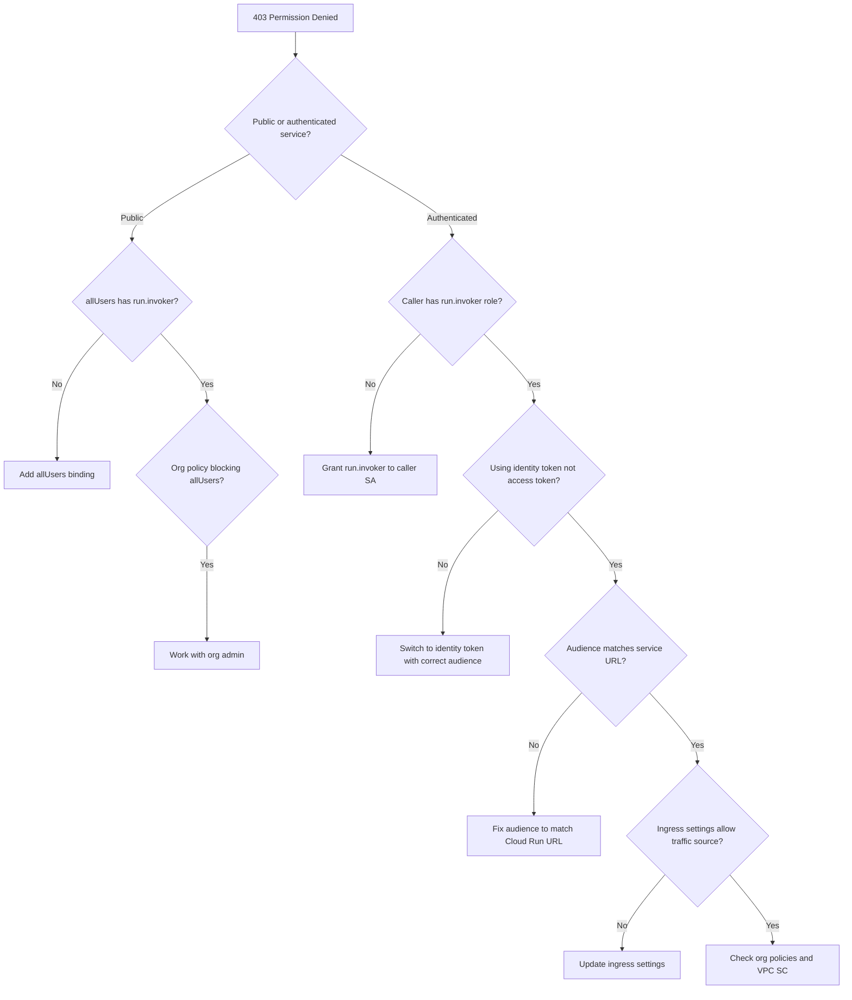

# How to Troubleshoot Cloud Run IAM Invoker Permission Denied Errors

Author: [nawazdhandala](https://www.github.com/nawazdhandala)

Tags: GCP, Cloud Run, IAM, Authentication, Permission Denied, Security

Description: Step-by-step troubleshooting guide for Cloud Run IAM invoker permission denied errors, covering service accounts, identity tokens, and ingress settings.

---

You deployed your Cloud Run service and tried to call it, but instead of your expected response you got a 403 Forbidden error. The message says something about missing authentication or the caller not having the `run.invoker` permission. This is one of the most common issues people hit with Cloud Run, especially when working with service-to-service communication.

The good news is that Cloud Run authentication is actually pretty straightforward once you understand the model. Let me break down every scenario that leads to permission denied errors and how to fix each one.

## How Cloud Run Authentication Works

Cloud Run has two layers of access control:

1. **Ingress settings** - control which networks can reach your service (all traffic, internal only, or internal + Cloud Load Balancing)
2. **IAM authentication** - controls who can invoke your service

When you create a Cloud Run service, you choose whether it requires authentication or allows unauthenticated access. If authentication is required (the default for services created via gcloud), every request must include a valid identity token with the appropriate IAM role.

```bash
# Check the current IAM policy for your service
gcloud run services get-iam-policy my-service \
    --region=us-central1
```

## Scenario 1 - You Want Public Access but Authentication Is Required

If your service should be publicly accessible (like an API endpoint or web application), you need to allow unauthenticated invocations.

```bash
# Allow unauthenticated access to a Cloud Run service
gcloud run services add-iam-policy-binding my-service \
    --region=us-central1 \
    --member="allUsers" \
    --role="roles/run.invoker"
```

You can also set this during deployment.

```bash
# Deploy with unauthenticated access
gcloud run deploy my-service \
    --image=gcr.io/my-project/my-service:latest \
    --region=us-central1 \
    --allow-unauthenticated
```

Note that if your organization has the `constraints/iam.allowedPolicyMemberDomains` organization policy constraint, it might block the `allUsers` binding. In that case, you need to work with your org admin to add an exception or use a Cloud Load Balancer with Identity-Aware Proxy instead.

## Scenario 2 - Service-to-Service Authentication

This is where most people struggle. When one Cloud Run service (or Cloud Function, or any GCP service) needs to call another Cloud Run service, the caller needs:

1. A service account with the `roles/run.invoker` role on the target service
2. An identity token (not an access token) with the correct audience

First, grant the invoker role to the calling service's service account.

```bash
# Grant the invoker role to the calling service's service account
gcloud run services add-iam-policy-binding target-service \
    --region=us-central1 \
    --member="serviceAccount:caller-sa@my-project.iam.gserviceaccount.com" \
    --role="roles/run.invoker"
```

Then, in the calling service, generate an identity token and include it in the request.

```python
import google.auth.transport.requests
import google.oauth2.id_token
import requests

def call_target_service():
    """Call another Cloud Run service with proper authentication."""
    target_url = "https://target-service-xxxxx.run.app/api/data"

    # Get an identity token with the target service URL as the audience
    auth_req = google.auth.transport.requests.Request()
    id_token = google.oauth2.id_token.fetch_id_token(auth_req, target_url)

    # Include the token in the Authorization header
    headers = {"Authorization": f"Bearer {id_token}"}
    response = requests.get(target_url, headers=headers)

    return response.json()
```

For Node.js applications.

```javascript
const { GoogleAuth } = require('google-auth-library');

async function callTargetService() {
  const targetUrl = 'https://target-service-xxxxx.run.app/api/data';

  // Create an authenticated client with the target URL as the audience
  const auth = new GoogleAuth();
  const client = await auth.getIdTokenClient(targetUrl);

  // The client automatically adds the Authorization header
  const response = await client.request({ url: targetUrl });
  return response.data;
}
```

### Common Mistake - Using Access Tokens Instead of Identity Tokens

This is the most common mistake I see. GCP has two types of tokens:
- **Access tokens** - used for GCP API calls (like calling the BigQuery API)
- **Identity tokens** - used for authenticating to Cloud Run, Cloud Functions, and similar services

If you are using an access token to call Cloud Run, you will get a 403. Cloud Run requires an identity token (a JWT) with the service URL as the audience.

## Scenario 3 - Cloud Scheduler or Cloud Tasks Calling Cloud Run

When Cloud Scheduler or Cloud Tasks calls a Cloud Run service, you need to configure the job or task with a service account and the correct token type.

```bash
# Create a Cloud Scheduler job that calls a Cloud Run service
gcloud scheduler jobs create http my-job \
    --schedule="*/5 * * * *" \
    --uri="https://my-service-xxxxx.run.app/cron/process" \
    --http-method=POST \
    --oidc-service-account-email=scheduler-sa@my-project.iam.gserviceaccount.com \
    --oidc-token-audience="https://my-service-xxxxx.run.app"
```

The critical flags are `--oidc-service-account-email` (the service account to use) and `--oidc-token-audience` (the audience for the identity token, which should be the Cloud Run service URL).

Make sure the service account has the invoker role.

```bash
# Grant the scheduler service account the invoker role
gcloud run services add-iam-policy-binding my-service \
    --region=us-central1 \
    --member="serviceAccount:scheduler-sa@my-project.iam.gserviceaccount.com" \
    --role="roles/run.invoker"
```

## Scenario 4 - Ingress Settings Blocking Traffic

Even with correct IAM permissions, your request can be blocked by ingress settings.

```bash
# Check the ingress settings for your service
gcloud run services describe my-service \
    --region=us-central1 \
    --format="value(spec.template.metadata.annotations['run.googleapis.com/ingress'])"
```

If ingress is set to `internal` or `internal-and-cloud-load-balancing`, requests from outside GCP or from other GCP projects will be blocked regardless of IAM permissions.

```bash
# Update ingress settings to allow all traffic
gcloud run services update my-service \
    --ingress=all \
    --region=us-central1
```

## Scenario 5 - Organization Policy Restrictions

Some organizations restrict who can be granted IAM roles. Check for organization policies that might be blocking your IAM bindings.

```bash
# List organization policies that might affect IAM
gcloud resource-manager org-policies list --project=my-project
```

Specifically look for:
- `constraints/iam.allowedPolicyMemberDomains` - restricts which domains can have IAM bindings
- `constraints/run.allowedIngress` - restricts Cloud Run ingress settings

## Debugging Checklist

Here is the systematic approach I use when debugging Cloud Run permission denied errors.



## Testing Authentication Locally

You can test your authentication setup without deploying by generating a token locally.

```bash
# Generate an identity token for testing
TOKEN=$(gcloud auth print-identity-token --audiences="https://my-service-xxxxx.run.app")

# Call the Cloud Run service with the token
curl -H "Authorization: Bearer $TOKEN" \
    https://my-service-xxxxx.run.app/health
```

If this works but your service-to-service calls do not, the issue is with the service account, not the IAM binding.

## Summary

Cloud Run permission denied errors come down to three things: the IAM binding is missing or wrong, the token type or audience is incorrect, or ingress settings are blocking the request. Start by checking the IAM policy on the target service, verify you are using identity tokens (not access tokens), ensure the audience matches the service URL, and check ingress settings. Following the debugging checklist above will get you to the root cause quickly.
