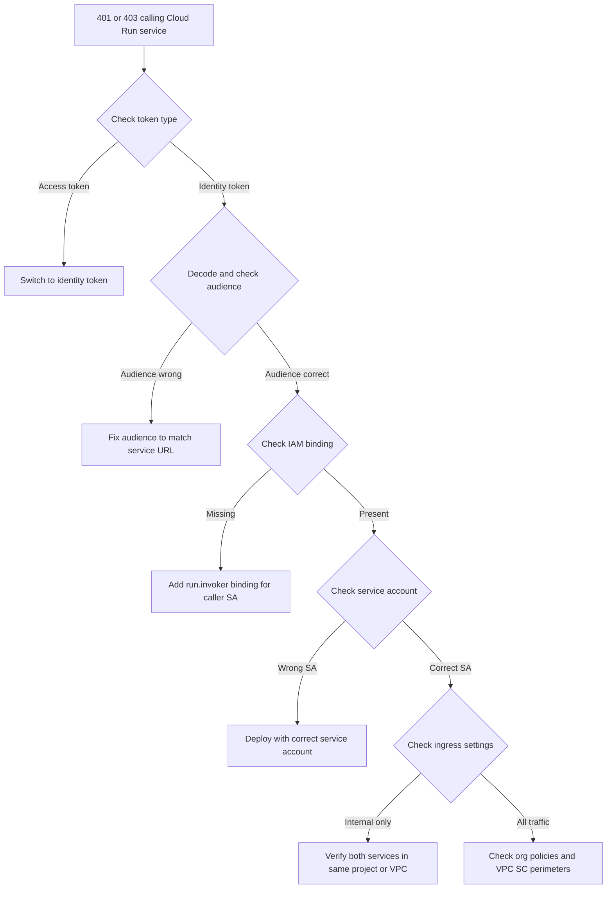

# How to Troubleshoot Cloud Run Service-to-Service Authentication Failures with Identity Tokens

Author: [nawazdhandala](https://www.github.com/nawazdhandala)

Tags: GCP, Cloud Run, Authentication, Identity Tokens, Service Accounts, IAM

Description: Troubleshoot Cloud Run service-to-service authentication failures involving identity tokens, audience mismatches, and service account permissions.

---

Service-to-service authentication on Cloud Run is one of those things that should be simple but trips up almost everyone at least once. You have two Cloud Run services, Service A needs to call Service B, and Service B requires authentication. You set up the IAM binding, generate an identity token, send the request, and get a 403 Forbidden or 401 Unauthorized error. What went wrong?

I have seen this play out dozens of times, and the issues fall into a few specific categories. Let me walk through each one with concrete examples and fixes.

## How Service-to-Service Auth Works

When Service A calls Service B, it needs to include an identity token (OIDC token) in the Authorization header. This token is a JWT that includes the identity of the caller (the service account running Service A) and an audience claim that must match Service B's URL.

Cloud Run validates the token by checking:
1. The token is valid and not expired
2. The audience matches the Cloud Run service URL
3. The service account in the token has the `roles/run.invoker` role on Service B

If any of these checks fail, you get an error.

## Problem 1 - Wrong Token Type

This is the most common mistake. GCP has two types of tokens, and people regularly confuse them.

**Access tokens** are used to call Google APIs (BigQuery, Cloud Storage, etc.). They look like `ya29.xxx...` and are obtained via `gcloud auth print-access-token`.

**Identity tokens** are JWTs used to authenticate to Cloud Run, Cloud Functions, and other identity-aware services. They look like `eyJhbG...` and are obtained via `gcloud auth print-identity-token`.

If you send an access token to Cloud Run, it will be rejected. You need an identity token.

```bash
# Wrong - this generates an access token
TOKEN=$(gcloud auth print-access-token)

# Correct - this generates an identity token with the right audience
TOKEN=$(gcloud auth print-identity-token --audiences="https://service-b-xxxxx.run.app")

# Test the call
curl -H "Authorization: Bearer $TOKEN" https://service-b-xxxxx.run.app/api/data
```

## Problem 2 - Audience Mismatch

The audience claim in the identity token must exactly match the Cloud Run service URL. This means the full URL including the protocol, and it should not include a trailing slash or path.

```python
import google.auth.transport.requests
import google.oauth2.id_token

# Wrong - includes a path, which makes the audience incorrect
target_url = "https://service-b-xxxxx.run.app/api/data"
token = google.oauth2.id_token.fetch_id_token(
    google.auth.transport.requests.Request(),
    target_url  # The path /api/data makes this the wrong audience
)

# Correct - use just the base URL as the audience
audience = "https://service-b-xxxxx.run.app"
token = google.oauth2.id_token.fetch_id_token(
    google.auth.transport.requests.Request(),
    audience
)

# Then use the token to call the actual endpoint
import requests
response = requests.get(
    "https://service-b-xxxxx.run.app/api/data",
    headers={"Authorization": f"Bearer {token}"}
)
```

If you are using a custom domain, the audience should be the Cloud Run-generated URL, not the custom domain, unless you have configured the custom domain as the audience in your auth setup.

## Problem 3 - Missing IAM Binding

The service account running Service A needs the `roles/run.invoker` role on Service B. Not on the project, not on a different service - specifically on the target service.

```bash
# Check the IAM policy on Service B
gcloud run services get-iam-policy service-b --region=us-central1

# Grant the invoker role to Service A's service account
gcloud run services add-iam-policy-binding service-b \
    --region=us-central1 \
    --member="serviceAccount:service-a-sa@my-project.iam.gserviceaccount.com" \
    --role="roles/run.invoker"
```

To find out which service account Service A is using.

```bash
# Check which service account Service A runs as
gcloud run services describe service-a \
    --region=us-central1 \
    --format="value(spec.template.spec.serviceAccountName)"
```

If this returns empty, Service A is using the default Compute Engine service account. It is better practice to use a dedicated service account.

```bash
# Create a dedicated service account for Service A
gcloud iam service-accounts create service-a-sa \
    --display-name="Service A Runtime Account"

# Deploy Service A with the dedicated service account
gcloud run deploy service-a \
    --image=gcr.io/my-project/service-a:latest \
    --service-account=service-a-sa@my-project.iam.gserviceaccount.com \
    --region=us-central1
```

## Problem 4 - Token Generation Fails in the Container

When running on Cloud Run, your code uses the metadata server to generate identity tokens. If the metadata server request fails, you will not get a token at all.

In Node.js, the `google-auth-library` handles this automatically, but you need to make sure you are using the right client.

```javascript
const { GoogleAuth } = require('google-auth-library');

async function callServiceB() {
  const targetAudience = 'https://service-b-xxxxx.run.app';

  // This creates an ID token client that uses the metadata server on Cloud Run
  const auth = new GoogleAuth();
  const client = await auth.getIdTokenClient(targetAudience);

  // The client automatically adds the Authorization header
  const url = 'https://service-b-xxxxx.run.app/api/data';
  const response = await client.request({ url });

  return response.data;
}
```

In Go, use the `idtoken` package.

```go
package main

import (
	"context"
	"io"
	"log"
	"net/http"

	"google.golang.org/api/idtoken"
)

func callServiceB() ([]byte, error) {
	ctx := context.Background()
	audience := "https://service-b-xxxxx.run.app"

	// Create an HTTP client that automatically adds identity tokens
	client, err := idtoken.NewClient(ctx, audience)
	if err != nil {
		return nil, err
	}

	resp, err := client.Get("https://service-b-xxxxx.run.app/api/data")
	if err != nil {
		return nil, err
	}
	defer resp.Body.Close()

	return io.ReadAll(resp.Body)
}
```

## Problem 5 - Testing Locally vs Cloud Run

Code that works locally with `gcloud auth` might fail on Cloud Run because the authentication mechanism is different. Locally, you use your user credentials. On Cloud Run, you use the service account attached to the service.

```python
import os
import google.auth
import google.auth.transport.requests
from google.oauth2 import id_token

def get_identity_token(audience):
    """Get an identity token that works both locally and on Cloud Run."""

    if os.getenv('K_SERVICE'):
        # Running on Cloud Run - use the metadata server
        auth_req = google.auth.transport.requests.Request()
        token = id_token.fetch_id_token(auth_req, audience)
    else:
        # Running locally - use default credentials
        # Make sure you have run: gcloud auth application-default login
        auth_req = google.auth.transport.requests.Request()
        token = id_token.fetch_id_token(auth_req, audience)

    return token
```

## Debugging Token Issues

You can decode the identity token to inspect its claims without verifying the signature.

```bash
# Generate a token and decode it to check the claims
TOKEN=$(gcloud auth print-identity-token --audiences="https://service-b-xxxxx.run.app")

# Decode the JWT payload (middle part between the dots)
echo $TOKEN | cut -d'.' -f2 | base64 -d 2>/dev/null | python3 -m json.tool
```

Look for these fields in the decoded token:
- `iss` - issuer (should be accounts.google.com or similar)
- `aud` - audience (must match the Cloud Run service URL)
- `email` - the service account email
- `exp` - expiration timestamp (tokens are valid for 1 hour)

## Debugging Workflow



## Summary

Service-to-service authentication on Cloud Run fails for four main reasons: using the wrong token type (access instead of identity), audience mismatch in the token, missing IAM invoker binding, or service account misconfiguration. Decode the token to verify audience and identity, check the IAM policy on the target service, and test with gcloud before implementing in code. Once you have all three pieces aligned - correct token type, correct audience, correct IAM binding - it works reliably.
