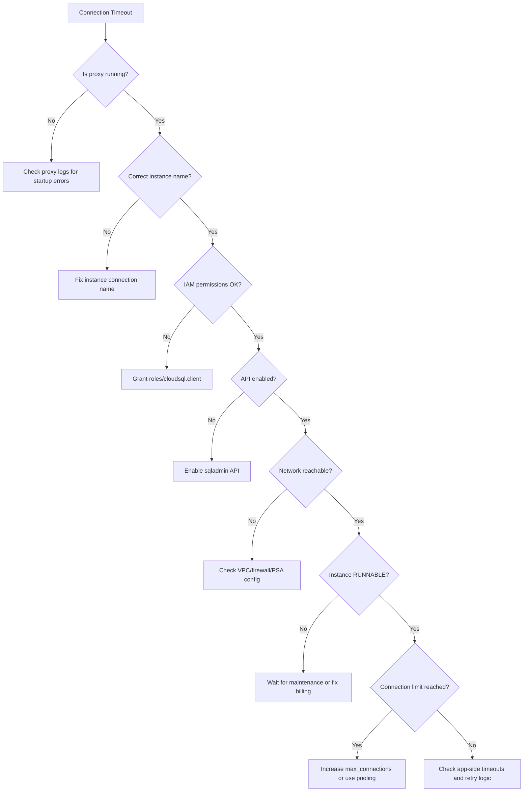

# How to Troubleshoot Cloud SQL Auth Proxy Connection Timeout Errors

Author: [nawazdhandala](https://www.github.com/nawazdhandala)

Tags: GCP, Cloud SQL, Auth Proxy, Troubleshooting, Connection Timeout

Description: A practical troubleshooting guide for diagnosing and fixing Cloud SQL Auth Proxy connection timeout errors, covering common causes and solutions.

---

Connection timeout errors with the Cloud SQL Auth Proxy are frustrating because they can have many root causes - from IAM permissions to network configuration to proxy misconfiguration. I have debugged these issues dozens of times across different environments, and in this post I will walk through a systematic approach to finding and fixing the problem.

## The Symptoms

Timeout errors from the Auth Proxy typically look like one of these:

```
dial tcp 127.0.0.1:5432: connect: connection refused
```

```
failed to connect to instance: connection timed out
```

```
googleapi: Error 403: Access Not Configured
```

```
error: connect ETIMEDOUT
```

Let me work through each category of cause.

## Step 1: Check If the Proxy Is Running

The most common "timeout" is actually the proxy not running at all. Your application tries to connect to localhost, and nothing is listening.

```bash
# Check if the proxy process is running
ps aux | grep cloud-sql-proxy

# Check if anything is listening on the expected port
ss -tlnp | grep 5432

# Or on macOS
lsof -i :5432
```

If the proxy is not running, check why it exited:

```bash
# Check systemd service status (if running as a service)
sudo systemctl status cloud-sql-proxy

# Check recent logs
sudo journalctl -u cloud-sql-proxy --since "10 minutes ago" --no-pager
```

In Kubernetes, check the sidecar container status:

```bash
# Check pod status - look for the proxy container state
kubectl describe pod my-app-pod-xyz

# Check proxy container logs
kubectl logs my-app-pod-xyz -c cloud-sql-proxy --tail=50
```

## Step 2: Verify IAM Permissions

The proxy needs the `roles/cloudsql.client` role. This is the most frequent cause of "Access denied" errors that manifest as timeouts.

```bash
# Check what roles the service account has
gcloud projects get-iam-policy my-project \
    --flatten="bindings[].members" \
    --format="table(bindings.role)" \
    --filter="bindings.members:my-sa@my-project.iam.gserviceaccount.com"
```

You should see `roles/cloudsql.client` in the output. If not:

```bash
# Grant the required role
gcloud projects add-iam-policy-binding my-project \
    --member="serviceAccount:my-sa@my-project.iam.gserviceaccount.com" \
    --role="roles/cloudsql.client"
```

If using Workload Identity in GKE, verify the binding:

```bash
# Check Workload Identity binding
gcloud iam service-accounts get-iam-policy \
    my-sa@my-project.iam.gserviceaccount.com \
    --format="json(bindings)"

# Verify the Kubernetes SA annotation
kubectl get serviceaccount my-ksa -o yaml | grep iam.gke.io
```

## Step 3: Verify the Instance Connection Name

A wrong instance connection name causes the proxy to fail silently or time out trying to connect to a non-existent instance.

```bash
# List all Cloud SQL instances and their connection names
gcloud sql instances list --format="table(name, connectionName, state)"
```

Make sure the connection name in your proxy configuration matches exactly - including project ID, region, and instance name. Common mistakes:

- Wrong project ID (especially in multi-project setups)
- Wrong region
- Typo in the instance name
- Using the instance name instead of the full connection name

## Step 4: Check API Enablement

The Cloud SQL Admin API must be enabled:

```bash
# Check if the API is enabled
gcloud services list --enabled --filter="name:sqladmin.googleapis.com"

# Enable it if missing
gcloud services enable sqladmin.googleapis.com
```

## Step 5: Network Connectivity

### Public IP Issues

If your Cloud SQL instance uses public IP, the proxy connects over the internet. Firewall rules, corporate proxies, or network configuration can block this.

Test basic connectivity:

```bash
# Test if you can reach the Cloud SQL Admin API
curl -s -o /dev/null -w "%{http_code}" https://sqladmin.googleapis.com/

# The proxy communicates via the API, so this should return 200 or 401
```

### Private IP Issues

If using private IP (`--private-ip` flag), the proxy needs network access to the Cloud SQL private IP range.

```bash
# Check that the Private Service Access peering exists
gcloud services vpc-peerings list --network=my-vpc

# Verify the instance has a private IP
gcloud sql instances describe my-instance \
    --format="json(ipAddresses)"

# Test connectivity from a VM in the same VPC
ping -c 3 PRIVATE_IP_ADDRESS
```

Common private IP issues:

- Private Service Access not configured
- VM/GKE node not in the same VPC as Cloud SQL
- Firewall rules blocking egress to the Cloud SQL IP range
- VPC peering routes not propagated

Check firewall rules:

```bash
# List egress firewall rules that might block Cloud SQL traffic
gcloud compute firewall-rules list \
    --filter="direction=EGRESS AND network=my-vpc" \
    --format="table(name, direction, action, targetTags, destinationRanges)"
```

### GKE-Specific Network Issues

In GKE, make sure:

```bash
# Verify the GKE cluster is in the same VPC as Cloud SQL
gcloud container clusters describe my-cluster \
    --format="json(network, subnetwork, privateClusterConfig)"

# Check if the GKE nodes can reach the Cloud SQL private IP
kubectl run debug --rm -it --image=busybox -- sh
# Inside the pod:
ping CLOUD_SQL_PRIVATE_IP
```

## Step 6: Debug the Proxy Directly

Run the proxy with debug logging to get detailed output:

```bash
# Run the proxy with debug logs
cloud-sql-proxy \
    --debug-logs \
    --structured-logs \
    my-project:us-central1:my-instance
```

Debug logs show:

- Authentication steps (what credentials it found)
- Connection establishment to the Cloud SQL API
- The specific point where the connection fails

## Step 7: Check Instance State

The Cloud SQL instance itself might be the problem:

```bash
# Check instance state
gcloud sql instances describe my-instance --format="value(state)"
```

Possible states:

- `RUNNABLE` - Normal, instance is available
- `SUSPENDED` - Billing issue
- `MAINTENANCE` - Being updated
- `FAILED` - Something went wrong

If the instance is in maintenance, wait for it to complete. If suspended, check your billing.

## Step 8: Connection Limit Issues

If the proxy connects but your application gets timeouts, the instance might be out of connections:

```bash
# Check current connections
gcloud sql instances describe my-instance \
    --format="json(settings.tier)"
```

Connect directly (if possible) and check:

```sql
-- PostgreSQL: Check active connections
SELECT count(*) FROM pg_stat_activity;
SELECT max_conn FROM (SELECT setting::int as max_conn FROM pg_settings WHERE name='max_connections') t;

-- MySQL: Check active connections
SHOW STATUS LIKE 'Threads_connected';
SHOW VARIABLES LIKE 'max_connections';
```

If you are hitting connection limits:

- Reduce application connection pool sizes
- Implement connection pooling (PgBouncer)
- Increase `max_connections` database flag
- Scale up the instance tier (higher tiers support more connections)

## Step 9: Proxy Version Issues

Older proxy versions may have bugs or compatibility issues:

```bash
# Check your proxy version
cloud-sql-proxy --version

# Download the latest version
curl -o cloud-sql-proxy \
    https://storage.googleapis.com/cloud-sql-connectors/cloud-sql-proxy/v2.8.0/cloud-sql-proxy.linux.amd64
chmod +x cloud-sql-proxy
```

Always use the v2 proxy (v2.x.x). The v1 proxy is deprecated.

## Step 10: Application-Side Timeouts

Sometimes the proxy is working fine, but your application's connection timeout is too short:

```python
# Python - Increase connection timeout
import psycopg2

# Default connect_timeout is often very short
conn = psycopg2.connect(
    host="127.0.0.1",
    port=5432,
    dbname="mydb",
    user="myuser",
    password="mypass",
    connect_timeout=10  # Increase to 10 seconds
)
```

```javascript
// Node.js - Increase connection timeout
const { Pool } = require('pg');

const pool = new Pool({
  host: '127.0.0.1',
  port: 5432,
  database: 'mydb',
  user: 'myuser',
  password: 'mypass',
  connectionTimeoutMillis: 10000, // 10 seconds
});
```

## Diagnostic Flowchart



## Quick Checklist

When you hit a timeout, run through this checklist:

1. Proxy process is running and listening on the expected port
2. Instance connection name is correct (project:region:instance)
3. Service account has `roles/cloudsql.client`
4. Cloud SQL Admin API is enabled
5. Network path exists (VPC, firewall, Private Service Access)
6. Cloud SQL instance is in RUNNABLE state
7. Connection limit is not reached
8. Proxy version is current (v2.x)
9. Application connection timeout is adequate
10. No corporate proxy or firewall blocking outbound connections

## Summary

Troubleshooting Auth Proxy timeouts is a process of elimination. Start with the basics - is the proxy running and properly configured? Then move to permissions, network connectivity, and instance health. The debug logs from the proxy are your best friend here - they show exactly where the connection process fails. Most issues come down to IAM permissions, wrong instance connection names, or network configuration, and all three are straightforward to fix once identified.
