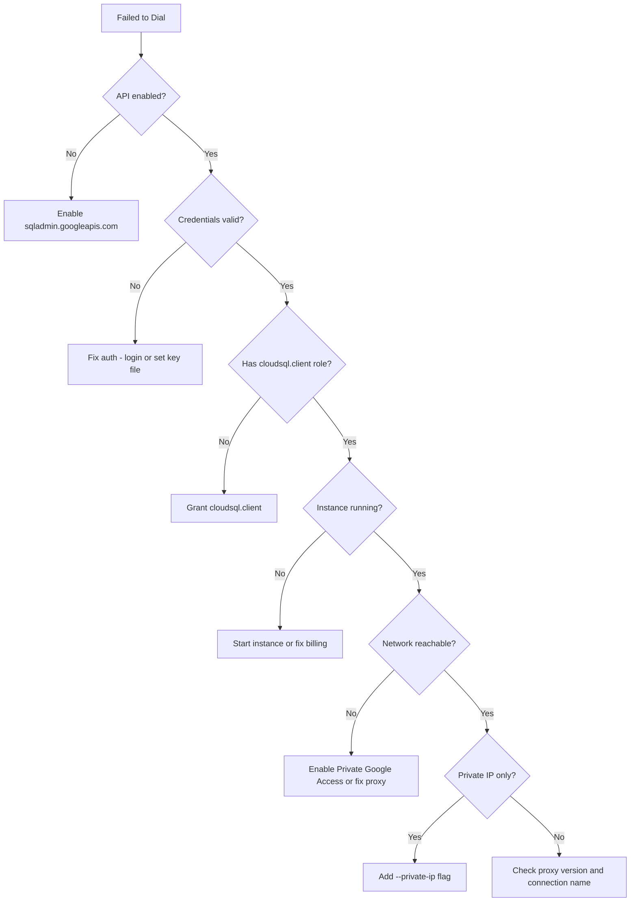

# How to Troubleshoot Cloud SQL Auth Proxy Dial Error Failed to Dial Connection Issues

Author: [nawazdhandala](https://www.github.com/nawazdhandala)

Tags: GCP, Cloud SQL, Auth Proxy, Connection Errors, Troubleshooting

Description: Diagnose and fix Cloud SQL Auth Proxy dial errors and failed to dial connection issues, covering network configuration, authentication, instance status, and proxy setup.

---

The Cloud SQL Auth Proxy is supposed to make database connections simple and secure. But when it throws a "failed to dial" error, it can feel anything but simple. The error is frustratingly vague - it could mean a dozen different things from wrong credentials to network issues to the Cloud SQL instance being down.

Here is how to systematically track down the cause.

## The Error

The typical error from the proxy looks like:

```
failed to dial: failed to create ephemeral certificate: googleapi: Error 403:
Access Not Configured. Cloud SQL Admin API has not been used in project 123456789
before or it is disabled.
```

Or:

```
failed to dial: dial tcp: lookup sqladmin.googleapis.com: no such host
```

Or the most generic version:

```
failed to dial: failed to connect to instance: dial error
```

Each variation points to a different root cause. Let me cover them all.

## Cause 1: Cloud SQL Admin API Not Enabled

The proxy uses the Cloud SQL Admin API to create ephemeral certificates and look up instance metadata. If this API is not enabled, the proxy cannot connect.

```bash
# Check if the API is enabled
gcloud services list --enabled --filter="name:sqladmin.googleapis.com" --project=my-project

# Enable it if it is not listed
gcloud services enable sqladmin.googleapis.com --project=my-project
```

This is the most common cause of "failed to dial" errors, especially on new projects.

## Cause 2: Wrong Instance Connection Name

The connection name must be in the exact format `project:region:instance`. Any variation will cause a dial error.

```bash
# Get the correct connection name
gcloud sql instances describe my-db \
    --project=my-project \
    --format="value(connectionName)"
```

Make sure you are using this exact string. Common mistakes:
- Using the instance name instead of the full connection name
- Wrong region
- Wrong project
- Extra spaces or characters

```bash
# Correct usage with the full connection name
./cloud-sql-proxy my-project:us-central1:my-db

# Wrong - using just the instance name
./cloud-sql-proxy my-db

# Wrong - using slashes instead of colons
./cloud-sql-proxy my-project/us-central1/my-db
```

## Cause 3: Authentication Issues

The proxy needs valid credentials with the `cloudsql.client` role. There are several ways authentication can fail.

### No Credentials Found

```bash
# Check if Application Default Credentials are set
gcloud auth application-default print-access-token 2>/dev/null && echo "ADC configured" || echo "ADC not configured"

# Check if GOOGLE_APPLICATION_CREDENTIALS is set
echo $GOOGLE_APPLICATION_CREDENTIALS
```

Fix by authenticating:

```bash
# For local development
gcloud auth application-default login

# Or specify a service account key
export GOOGLE_APPLICATION_CREDENTIALS=/path/to/key.json
./cloud-sql-proxy my-project:us-central1:my-db

# Or use the --credentials-file flag
./cloud-sql-proxy \
    --credentials-file=/path/to/key.json \
    my-project:us-central1:my-db
```

### Service Account Missing Cloud SQL Client Role

```bash
# Check the service account's roles
SA_EMAIL=$(cat /path/to/key.json | python3 -c "import json,sys; print(json.load(sys.stdin)['client_email'])")
echo "Service Account: $SA_EMAIL"

gcloud projects get-iam-policy my-project \
    --flatten="bindings[].members" \
    --filter="bindings.members:serviceAccount:$SA_EMAIL" \
    --format="table(bindings.role)"

# Grant the required role if missing
gcloud projects add-iam-binding my-project \
    --member="serviceAccount:$SA_EMAIL" \
    --role="roles/cloudsql.client"
```

### Expired or Revoked Credentials

If you are using Application Default Credentials, they might have expired:

```bash
# Re-authenticate
gcloud auth application-default login

# Verify the credentials work
gcloud auth application-default print-access-token
```

## Cause 4: Network Connectivity

The proxy needs to reach Google APIs over HTTPS (port 443). If your machine cannot reach `sqladmin.googleapis.com`, the proxy will fail to dial.

```bash
# Test connectivity to the Cloud SQL Admin API
curl -v https://sqladmin.googleapis.com/ 2>&1 | head -20

# Test DNS resolution
dig sqladmin.googleapis.com A +short

# If DNS fails, try Google's DNS
dig @8.8.8.8 sqladmin.googleapis.com A +short
```

If you are on a VM without an external IP:

```bash
# Check if Private Google Access is enabled on the subnet
gcloud compute networks subnets describe my-subnet \
    --region=us-central1 \
    --format="value(privateIpGoogleAccess)"

# Enable it if false
gcloud compute networks subnets update my-subnet \
    --region=us-central1 \
    --enable-private-ip-google-access
```

If you are behind a corporate firewall or proxy:

```bash
# Set HTTPS proxy for the Cloud SQL Auth Proxy
export HTTPS_PROXY=http://corporate-proxy:8080
./cloud-sql-proxy my-project:us-central1:my-db
```

## Cause 5: Cloud SQL Instance Not Running

If the Cloud SQL instance is stopped, under maintenance, or suspended, the proxy cannot connect:

```bash
# Check instance status
gcloud sql instances describe my-db \
    --format="value(state)"
```

Expected states:
- `RUNNABLE` - Instance is running and accepting connections
- `SUSPENDED` - Instance is suspended (billing issue)
- `MAINTENANCE` - Instance is undergoing maintenance
- `FAILED` - Instance is in an error state

If suspended, check billing. If in maintenance, wait for it to complete.

## Cause 6: Private IP Without the Flag

If your Cloud SQL instance only has a private IP (no public IP), you need to tell the proxy:

```bash
# Check IP configuration
gcloud sql instances describe my-db \
    --format="yaml(ipAddresses)"

# If only private IP, use the --private-ip flag
./cloud-sql-proxy \
    --private-ip \
    my-project:us-central1:my-db
```

Without the `--private-ip` flag, the proxy tries to connect via the public path, which fails when there is no public IP.

## Cause 7: Proxy Version Issues

An outdated proxy version might have bugs or be incompatible with newer Cloud SQL features:

```bash
# Check the current proxy version
./cloud-sql-proxy --version

# Download the latest version
curl -o cloud-sql-proxy \
    https://storage.googleapis.com/cloud-sql-connectors/cloud-sql-proxy/v2.8.0/cloud-sql-proxy.linux.amd64
chmod +x cloud-sql-proxy
```

## Debugging with Verbose Logging

The most useful debugging tool is verbose logging:

```bash
# Run the proxy with structured JSON logs
./cloud-sql-proxy \
    --structured-logs \
    --debug-logs \
    my-project:us-central1:my-db
```

The debug output shows each step of the connection process:
1. Reading credentials
2. Calling the Cloud SQL Admin API
3. Getting instance metadata
4. Creating an ephemeral certificate
5. Establishing the encrypted tunnel

Whatever step fails tells you exactly what to fix.

## Complete Diagnostic Script

```bash
#!/bin/bash
# Diagnose Cloud SQL Auth Proxy dial errors
# Usage: ./diagnose-dial.sh <project> <instance>

PROJECT=$1
INSTANCE=$2
CONN_NAME="$PROJECT:$(gcloud sql instances describe $INSTANCE --project=$PROJECT --format='value(region)'):$INSTANCE"

echo "=== Connection Name ==="
echo "$CONN_NAME"

echo ""
echo "=== Instance Status ==="
gcloud sql instances describe $INSTANCE --project=$PROJECT \
    --format="table(state, ipAddresses.type, ipAddresses.ipAddress)" 2>&1

echo ""
echo "=== SQL Admin API ==="
gcloud services list --enabled \
    --filter="name:sqladmin.googleapis.com" \
    --project=$PROJECT --format="value(name)" 2>&1 || echo "NOT ENABLED"

echo ""
echo "=== Current Credentials ==="
gcloud auth application-default print-access-token > /dev/null 2>&1 \
    && echo "ADC: valid" || echo "ADC: not configured"
echo "GOOGLE_APPLICATION_CREDENTIALS: ${GOOGLE_APPLICATION_CREDENTIALS:-not set}"

echo ""
echo "=== Network Connectivity ==="
curl -s -o /dev/null -w "sqladmin.googleapis.com: HTTP %{http_code}\n" \
    https://sqladmin.googleapis.com/ 2>&1

echo ""
echo "=== DNS Resolution ==="
dig sqladmin.googleapis.com A +short 2>&1
```

## Debugging Flowchart



The "failed to dial" error has many possible causes, but the diagnostic script above checks all of them in seconds. Run it first, and it will point you to the specific issue.
