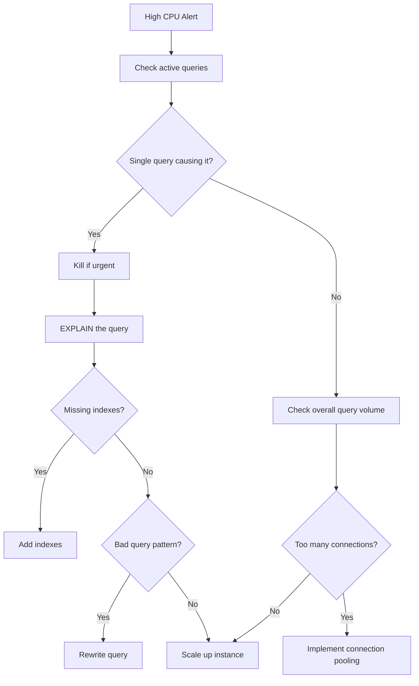

# How to Troubleshoot Cloud SQL Instance High CPU Utilization from Runaway Queries

Author: [nawazdhandala](https://www.github.com/nawazdhandala)

Tags: GCP, Cloud SQL, CPU, Performance, Database, Query Optimization

Description: A hands-on guide to identifying and fixing high CPU utilization on Cloud SQL instances caused by runaway queries, including immediate actions and long-term fixes.

---

Your Cloud SQL instance CPU is pegged at 100% and your application is crawling. Before you blindly scale up the instance, let us figure out what is actually consuming all that CPU. In most cases, it is one or two runaway queries that are doing way more work than they should. Here is how to find and fix them.

## Immediate Triage: Is It Really the Queries?

First, confirm that CPU usage is the bottleneck and that it correlates with query activity.

```bash
# Check current CPU utilization
gcloud monitoring time-series list \
    --filter='resource.type="cloudsql_database" AND resource.labels.database_id="my-project:my-instance" AND metric.type="cloudsql.googleapis.com/database/cpu/utilization"' \
    --interval-start-time=$(date -u -v-1H +%Y-%m-%dT%H:%M:%SZ) \
    --format="table(points.value.doubleValue, points.interval.endTime)"
```

Also check memory and disk I/O. High CPU sometimes is a secondary symptom of memory pressure causing excessive swapping.

```bash
# Check memory utilization alongside CPU
gcloud monitoring time-series list \
    --filter='resource.type="cloudsql_database" AND resource.labels.database_id="my-project:my-instance" AND metric.type="cloudsql.googleapis.com/database/memory/utilization"' \
    --interval-start-time=$(date -u -v-1H +%Y-%m-%dT%H:%M:%SZ) \
    --format="table(points.value.doubleValue, points.interval.endTime)"
```

## Step 1: Find the Offending Queries

### For MySQL

Connect to your Cloud SQL MySQL instance and look for long-running queries:

```sql
-- Show all currently running queries sorted by execution time
SELECT
  id,
  user,
  host,
  db,
  command,
  time AS seconds_running,
  state,
  LEFT(info, 200) AS query_preview
FROM information_schema.processlist
WHERE command != 'Sleep'
  AND time > 5
ORDER BY time DESC;
```

Check the slow query log:

```sql
-- If slow query log is enabled, check recent slow queries
SELECT
  start_time,
  query_time,
  lock_time,
  rows_sent,
  rows_examined,
  LEFT(sql_text, 200) AS query
FROM mysql.slow_log
WHERE start_time > NOW() - INTERVAL 1 HOUR
ORDER BY query_time DESC
LIMIT 20;
```

### For PostgreSQL

```sql
-- Find active queries consuming the most resources
SELECT
  pid,
  now() - query_start AS duration,
  state,
  wait_event_type,
  wait_event,
  LEFT(query, 200) AS query_preview
FROM pg_stat_activity
WHERE state = 'active'
  AND query NOT LIKE '%pg_stat_activity%'
ORDER BY duration DESC;
```

Check for queries with high buffer usage (an indicator of CPU-intensive work):

```sql
-- Top queries by total execution time (requires pg_stat_statements extension)
SELECT
  LEFT(query, 150) AS query,
  calls,
  total_exec_time::numeric(12,2) AS total_ms,
  mean_exec_time::numeric(12,2) AS mean_ms,
  rows,
  shared_blks_hit + shared_blks_read AS total_blocks
FROM pg_stat_statements
ORDER BY total_exec_time DESC
LIMIT 15;
```

## Step 2: Kill the Runaway Query (If Needed)

If a single query is burning all your CPU and you need immediate relief, kill it.

For MySQL:

```sql
-- Kill a specific query by its process ID
KILL 12345;

-- Or kill just the query but keep the connection
KILL QUERY 12345;
```

For PostgreSQL:

```sql
-- Cancel the query (graceful)
SELECT pg_cancel_backend(12345);

-- Terminate the connection if cancel does not work (forceful)
SELECT pg_terminate_backend(12345);
```

## Step 3: Analyze the Problem Query

Once you have identified the expensive query, run EXPLAIN to understand why it is expensive.

For MySQL:

```sql
-- Get the query execution plan
EXPLAIN FORMAT=JSON
SELECT o.order_id, c.customer_name, p.product_name
FROM orders o
JOIN customers c ON o.customer_id = c.id
JOIN products p ON o.product_id = p.id
WHERE o.order_date > '2026-01-01'
  AND c.country = 'US';
```

Look for these red flags in the output:
- `type: ALL` means a full table scan
- `rows` showing millions when you expect thousands
- `Using filesort` on large result sets
- `Using temporary` for GROUP BY or ORDER BY operations

For PostgreSQL:

```sql
-- Get detailed execution plan with actual timing
EXPLAIN (ANALYZE, BUFFERS, FORMAT TEXT)
SELECT o.order_id, c.customer_name, p.product_name
FROM orders o
JOIN customers c ON o.customer_id = c.id
JOIN products p ON o.product_id = p.id
WHERE o.order_date > '2026-01-01'
  AND c.country = 'US';
```

Look for:
- Sequential scans on large tables
- Nested loop joins with high row counts
- Sort operations on large datasets
- Hash joins using excessive memory

## Step 4: Fix the Query

The most common fixes for CPU-intensive queries:

### Add Missing Indexes

```sql
-- MySQL: Add indexes for the columns used in WHERE and JOIN clauses
CREATE INDEX idx_orders_date ON orders(order_date);
CREATE INDEX idx_orders_customer ON orders(customer_id);
CREATE INDEX idx_customers_country ON customers(country);

-- PostgreSQL: Same concept, add indexes for filter and join columns
CREATE INDEX CONCURRENTLY idx_orders_date ON orders(order_date);
CREATE INDEX CONCURRENTLY idx_customers_country ON customers(country);
```

### Rewrite Inefficient Queries

```sql
-- Bad: Subquery runs for every row in the outer query
SELECT o.*, (SELECT COUNT(*) FROM order_items WHERE order_id = o.id) AS item_count
FROM orders o
WHERE o.order_date > '2026-01-01';

-- Good: Use a JOIN instead of a correlated subquery
SELECT o.*, COALESCE(oi.item_count, 0) AS item_count
FROM orders o
LEFT JOIN (
    SELECT order_id, COUNT(*) AS item_count
    FROM order_items
    GROUP BY order_id
) oi ON o.id = oi.order_id
WHERE o.order_date > '2026-01-01';
```

### Limit Result Sets

```sql
-- Bad: Fetching all matching rows when you only need the first page
SELECT * FROM events WHERE event_type = 'login' ORDER BY created_at DESC;

-- Good: Always paginate large result sets
SELECT * FROM events WHERE event_type = 'login'
ORDER BY created_at DESC
LIMIT 50 OFFSET 0;
```

## Step 5: Enable Query Insights

Cloud SQL Query Insights gives you ongoing visibility into query performance without having to connect to the database manually.

```bash
# Enable Query Insights on your Cloud SQL instance
gcloud sql instances patch my-instance \
    --insights-config-query-insights-enabled \
    --insights-config-query-string-length=1024 \
    --insights-config-record-application-tags \
    --insights-config-record-client-address \
    --project=my-project
```

Once enabled, you can see the top queries by CPU, I/O, and lock wait time directly in the Cloud Console.

## Step 6: Set Up Connection and Query Timeouts

Prevent runaway queries from consuming CPU indefinitely.

For MySQL:

```bash
# Set query timeout to 300 seconds
gcloud sql instances patch my-instance \
    --database-flags=max_execution_time=300000 \
    --project=my-project
```

For PostgreSQL:

```bash
# Set statement timeout to 5 minutes
gcloud sql instances patch my-instance \
    --database-flags=statement_timeout=300000 \
    --project=my-project
```

## Monitoring Dashboard



High CPU on Cloud SQL is almost never solved by throwing more hardware at it. Find the bad queries first, fix them, and then scale if you still need to. You will be surprised how often one missing index or one poorly written query is responsible for 90% of the CPU usage.
