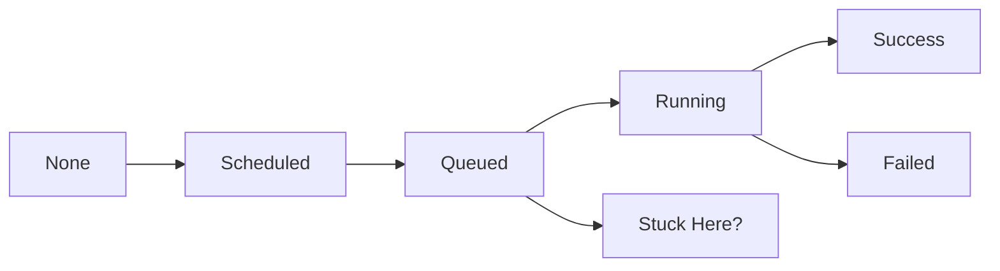

# How to Troubleshoot DAGs Stuck in Queued State in Cloud Composer

Author: [nawazdhandala](https://www.github.com/nawazdhandala)

Tags: GCP, Cloud Composer, Airflow, Troubleshooting, Performance

Description: Diagnose and fix the common causes of Airflow tasks getting stuck in the queued state in Cloud Composer environments.

---

Few things are more frustrating than watching your Airflow tasks sit in the "queued" state indefinitely. The scheduler has determined they should run, but they are not being picked up by any worker. Your pipeline is stalled, and the downstream tasks are waiting.

This is one of the most common issues in Cloud Composer, and it usually comes down to one of a few root causes. This guide walks through a systematic debugging process to identify and fix the problem.

## Understanding the Task Lifecycle

Before debugging, it helps to understand how a task moves through its states:



The key transition is from **Queued** to **Running**. This happens when a Celery worker picks up the task from the message queue. If tasks are stuck in Queued, something is preventing workers from picking them up.

## Cause 1: Not Enough Workers

The most common cause is simply not having enough worker capacity.

### Diagnosis

Check how many workers are running and how many tasks they are handling:

```bash
# Check worker status
gcloud composer environments describe my-composer-env \
  --location=us-central1 \
  --format="yaml(config.workloadsConfig.worker)"

# Check active tasks and concurrency
gcloud composer environments run my-composer-env \
  --location=us-central1 \
  celery inspect active
```

In the Airflow UI, go to **Admin** > **Pools** and check the default pool. If slots are fully utilized, tasks will queue.

### Fix

Scale up your worker count and concurrency:

```bash
# Increase worker count and concurrency
gcloud composer environments update my-composer-env \
  --location=us-central1 \
  --min-workers=3 \
  --max-workers=15 \
  --update-airflow-configs="celery-worker_concurrency=16"
```

## Cause 2: Pool Slots Exhausted

Airflow pools limit how many tasks of a certain type can run concurrently. If all slots in a pool are occupied, additional tasks queue.

### Diagnosis

Check pool usage in the Airflow UI under **Admin** > **Pools**, or via the CLI:

```bash
# List all pools and their slot usage
gcloud composer environments run my-composer-env \
  --location=us-central1 \
  pools list
```

Look for pools where `running_slots` equals `slots`. That pool is saturated.

### Fix

Increase the pool size or move tasks to a different pool:

```bash
# Increase the default pool size
gcloud composer environments run my-composer-env \
  --location=us-central1 \
  pools set -- default_pool 256 "Default pool"

# Create a dedicated pool for heavy tasks
gcloud composer environments run my-composer-env \
  --location=us-central1 \
  pools set -- heavy_tasks 32 "Pool for resource-intensive tasks"
```

In your DAG, assign tasks to specific pools:

```python
# Assign a task to a specific pool
heavy_task = PythonOperator(
    task_id="heavy_computation",
    python_callable=compute_function,
    pool="heavy_tasks",  # Use the dedicated pool
    pool_slots=2,        # This task uses 2 slots instead of the default 1
    dag=dag,
)
```

## Cause 3: Parallelism Limit Reached

The `core.parallelism` setting caps the total number of tasks that can run simultaneously across the entire environment.

### Diagnosis

Check your current parallelism setting:

```bash
# Check the parallelism configuration
gcloud composer environments describe my-composer-env \
  --location=us-central1 \
  --format="yaml(config.softwareConfig.airflowConfigOverrides)" | grep parallelism
```

If your total running tasks equal the parallelism limit, new tasks queue even if workers have capacity.

### Fix

```bash
# Increase the parallelism limit
gcloud composer environments update my-composer-env \
  --location=us-central1 \
  --update-airflow-configs="core-parallelism=128"
```

Also check `max_active_tasks_per_dag` - this can limit parallelism per DAG:

```bash
# Increase per-DAG task limits
gcloud composer environments update my-composer-env \
  --location=us-central1 \
  --update-airflow-configs="\
core-max_active_tasks_per_dag=64,\
core-max_active_runs_per_dag=5"
```

## Cause 4: Celery Broker Issues

Cloud Composer uses Redis or RabbitMQ as the Celery broker. If the broker is unhealthy, tasks cannot be dispatched to workers.

### Diagnosis

Check if the broker is responding:

```bash
# Ping the Celery workers
gcloud composer environments run my-composer-env \
  --location=us-central1 \
  celery inspect ping
```

If workers do not respond, the broker may be down or overloaded.

Check Cloud Logging for broker-related errors:

```bash
# Search for Celery-related errors in the logs
gcloud logging read 'resource.type="cloud_composer_environment" AND textPayload=~"celery|broker|redis"' \
  --project=my-project \
  --limit=20 \
  --format="table(timestamp, textPayload)"
```

### Fix

If the broker is overloaded, reduce the message rate by lowering concurrency or adding more workers. For persistent broker issues, you may need to restart the environment:

```bash
# Restart the Airflow components
gcloud composer environments restart-web-server my-composer-env \
  --location=us-central1
```

## Cause 5: Worker Pods Not Scaling Up

In Composer 2, workers run as GKE pods. If the GKE autoscaler cannot provision new nodes, worker pods stay in Pending state and tasks queue.

### Diagnosis

Check if worker pods are pending:

```bash
# For Composer 2, check the GKE cluster
CLUSTER_NAME=$(gcloud composer environments describe my-composer-env \
  --location=us-central1 \
  --format="value(config.gkeCluster)")

# Get the cluster credentials
gcloud container clusters get-credentials $CLUSTER_NAME \
  --region=us-central1

# Check pod status
kubectl get pods -n composer-user-workloads -o wide | grep worker
```

### Fix

For GKE scaling issues:
- Check node pool resource quotas
- Verify the GKE autoscaler is enabled
- Increase the maximum node count
- Check for resource quota exhaustion in your GCP project

```bash
# Check GCP resource quotas
gcloud compute project-info describe --project=my-project \
  --format="table(quotas.metric, quotas.limit, quotas.usage)" | grep -i cpu
```

## Cause 6: DAG Concurrency Settings

Individual DAGs can have concurrency limits that block tasks:

### Diagnosis

Check the DAG's concurrency setting:

```python
# This DAG only allows 2 tasks to run at once
dag = DAG(
    dag_id="limited_dag",
    max_active_tasks=2,  # Only 2 tasks can run at a time
    max_active_runs=1,   # Only 1 DAG run at a time
    ...
)
```

### Fix

Increase the per-DAG limits or remove them:

```python
# Allow more concurrent tasks
dag = DAG(
    dag_id="flexible_dag",
    max_active_tasks=32,  # Allow up to 32 tasks
    max_active_runs=3,    # Allow up to 3 concurrent runs
    ...
)
```

## Cause 7: Task Dependencies Creating Deadlocks

If you have circular or complex dependencies between DAGs, tasks can block each other indefinitely.

### Diagnosis

Look for ExternalTaskSensor or TriggerDagRunOperator patterns where:
- DAG A waits for DAG B
- DAG B waits for DAG A (circular dependency)
- DAG A fills all pool slots, preventing DAG B from starting (priority inversion)

### Fix

- Break circular dependencies by redesigning your DAG structure
- Use separate pools for independent pipelines
- Set task priorities to ensure critical tasks run first

```python
# Set task priority to ensure critical tasks get slots first
critical_task = PythonOperator(
    task_id="critical_processing",
    python_callable=process_function,
    priority_weight=10,  # Higher value = higher priority
    weight_rule="absolute",
    dag=dag,
)
```

## Systematic Debugging Checklist

When you encounter queued tasks, work through this checklist:

1. Check the **default pool** - are all slots in use?
2. Check **core.parallelism** - is the environment-wide limit reached?
3. Check **worker count** - are workers running and responsive?
4. Check **max_active_tasks_per_dag** - is the per-DAG limit reached?
5. Check **Celery broker** health - can workers receive messages?
6. Check **Cloud Logging** for error messages related to workers or the scheduler
7. Check **GCP quotas** - is the project out of CPU or memory quota?

```bash
# Quick diagnostic script
echo "=== Pool Usage ==="
gcloud composer environments run my-composer-env \
  --location=us-central1 \
  pools list

echo "=== Worker Ping ==="
gcloud composer environments run my-composer-env \
  --location=us-central1 \
  celery inspect ping

echo "=== Environment Config ==="
gcloud composer environments describe my-composer-env \
  --location=us-central1 \
  --format="yaml(config.softwareConfig.airflowConfigOverrides)"
```

## Preventing Future Queueing Issues

Set up monitoring to catch queueing issues before they impact your pipelines:

```bash
# Create an alert for tasks stuck in queued state
gcloud monitoring policies create --policy-from-file=- << 'EOF'
{
  "displayName": "Composer Tasks Queued Alert",
  "conditions": [{
    "displayName": "Tasks queued > 20 for 15 minutes",
    "conditionThreshold": {
      "filter": "resource.type=\"cloud_composer_environment\" AND metric.type=\"composer.googleapis.com/environment/task_queue_length\"",
      "comparison": "COMPARISON_GT",
      "thresholdValue": 20,
      "duration": "900s"
    }
  }]
}
EOF
```

## Wrapping Up

Tasks stuck in the queued state almost always come down to capacity. Either you do not have enough workers, your pools are full, or you have hit a parallelism limit. The fix is usually straightforward once you identify which resource is the bottleneck. Start with pools and parallelism settings (the quickest fixes), then look at worker scaling, and finally investigate broker or infrastructure issues if the simpler causes are ruled out.
