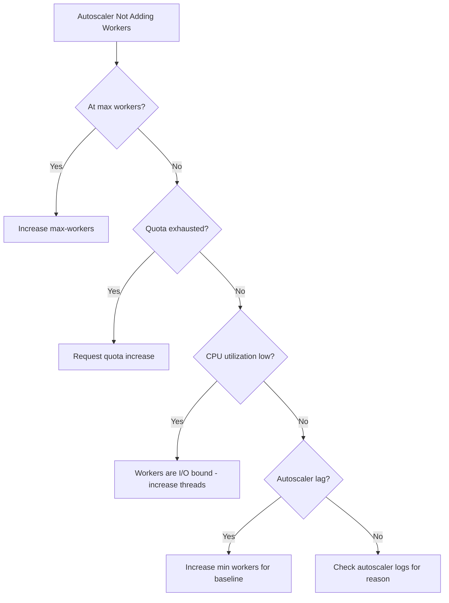

# How to Troubleshoot Dataflow Autoscaling Not Adding Workers During Traffic Spikes

Author: [nawazdhandala](https://www.github.com/nawazdhandala)

Tags: GCP, Dataflow, Autoscaling, Streaming, Google Cloud

Description: Diagnose and fix issues where Google Cloud Dataflow autoscaling fails to add workers during traffic spikes, causing backlog growth and increased latency.

---

Your Dataflow streaming pipeline handles normal traffic fine, but when a spike hits, the autoscaler does not add workers fast enough - or at all. Backlog grows, system lag increases, and by the time workers are finally added, you have minutes or hours of processing delay. Dataflow's autoscaler is sophisticated, but it has behaviors and limits that can prevent it from scaling when you need it most. This post explains how to debug and fix these issues.

## How Dataflow Autoscaling Works

Dataflow's autoscaler for streaming jobs monitors several signals:

- Backlog (unprocessed bytes in the input source)
- CPU utilization across workers
- Throughput per worker
- System lag and data freshness

Based on these signals, it calculates the optimal number of workers and scales up or down. The scaling algorithm is conservative - it avoids rapid oscillation by adding workers gradually and waiting to observe the effect before adding more.

## Step 1: Check the Current Autoscaling Configuration

Verify that autoscaling is actually enabled and see the configured bounds:

```bash
# Check the job's autoscaling settings
gcloud dataflow jobs describe JOB_ID \
    --region=us-central1 \
    --format="json(environment.workerPools[0].autoscalingSettings, environment.workerPools[0].numWorkers)"
```

Key fields:
- `algorithm`: Should be `AUTOSCALING_ALGORITHM_BASIC` for the default autoscaler
- `maxNumWorkers`: The upper bound on worker count
- `numWorkers`: The initial (and current minimum) worker count

If `maxNumWorkers` is set too low, the autoscaler hits the ceiling before meeting demand.

## Step 2: Check if You Hit the Max Workers Limit

The most common reason the autoscaler "stops scaling" is that it has reached `maxNumWorkers`:

```bash
# Check current worker count vs max
gcloud dataflow jobs describe JOB_ID \
    --region=us-central1 \
    --format="json(currentNumWorkers, environment.workerPools[0].autoscalingSettings.maxNumWorkers)"
```

If the current count equals the max, increase it:

```bash
# Update max workers on a running job (streaming only)
gcloud dataflow jobs update-options JOB_ID \
    --region=us-central1 \
    --max-num-workers=100
```

## Step 3: Understand the Autoscaling Lag

Dataflow autoscaling does not react instantly. There is a deliberate lag built in:

1. The autoscaler evaluates every 1-2 minutes
2. After deciding to scale up, it requests new workers
3. New workers take 2-5 minutes to start and begin processing
4. The autoscaler waits to observe the effect before adding more

So from the moment a spike starts to the moment new workers are processing, you could be looking at 5-10 minutes of lag. For spikes that are shorter than this, the autoscaler may never catch up.

To handle this, increase the minimum number of workers to absorb spikes without scaling:

```bash
# Set a higher minimum worker count for the job
gcloud dataflow jobs run your-job \
    --gcs-location=gs://your-bucket/templates/your-template \
    --region=us-central1 \
    --num-workers=10 \
    --max-workers=50
```

The `num-workers` value acts as the starting point and effective minimum.

## Step 4: Check for Quota Limitations

Even if the autoscaler wants more workers, it cannot get them if you do not have enough quota:

```bash
# Check relevant compute quotas
gcloud compute project-info describe \
    --format="json(quotas)" | python3 -c "
import sys, json
data = json.load(sys.stdin)
for q in data.get('quotas', []):
    metric = q.get('metric', '')
    if any(k in metric.lower() for k in ['cpu', 'instance', 'ip', 'disk']):
        usage = q.get('usage', 0)
        limit = q.get('limit', 0)
        if limit > 0:
            pct = (usage / limit) * 100
            print(f'{metric}: {usage}/{limit} ({pct:.0f}%)')
"
```

Key quotas that can block scaling:
- `CPUS` (or `CPUS_ALL_REGIONS`)
- `IN_USE_ADDRESSES` (if using external IPs)
- `SSD_TOTAL_GB` or `DISKS_TOTAL_GB`
- `INSTANCES` per zone

If any of these are near their limit, request an increase through the Quotas page in the Console.

## Step 5: Check for Disk Space Bottleneck

Each Dataflow worker needs a persistent disk. If the disk quota is exhausted, new workers cannot be created:

```bash
# Check disk quota usage
gcloud compute regions describe us-central1 \
    --format="json(quotas)" | python3 -c "
import sys, json
data = json.load(sys.stdin)
for q in data.get('quotas', []):
    if 'DISK' in q.get('metric', '').upper() or 'SSD' in q.get('metric', '').upper():
        print(f\"{q['metric']}: {q.get('usage', 0)}/{q.get('limit', 0)}\")
"
```

Reduce per-worker disk size if you do not need large disks:

```bash
# Launch with smaller disk size
gcloud dataflow jobs run your-job \
    --gcs-location=gs://your-bucket/templates/your-template \
    --region=us-central1 \
    --disk-size-gb=30 \
    --max-workers=50
```

## Step 6: Investigate the Autoscaler Decision Log

Dataflow logs autoscaling decisions. Check these logs to understand why the autoscaler is not adding workers:

```bash
# Search for autoscaling decision logs
gcloud logging read 'resource.type="dataflow_step" AND resource.labels.job_id="JOB_ID" AND textPayload:"Autoscaler"' \
    --limit=30 \
    --format="table(timestamp, textPayload)"
```

Look for messages like:
- "Autoscaler: Current number of workers (N) is sufficient"
- "Autoscaler: Scaling from N to M workers"
- "Autoscaler: Unable to scale - quota exceeded"
- "Autoscaler: Backlog is decreasing, no scale-up needed"

The autoscaler might decide not to scale if it thinks the current workers can catch up. This happens when the backlog is growing slowly or when individual workers have low CPU.

## Step 7: Fix the CPU Signal

The autoscaler relies heavily on CPU utilization. If your workers are waiting on external I/O (database calls, API requests, network transfers) instead of using CPU, they appear underutilized and the autoscaler does not scale up.

This is a common issue with pipelines that read from or write to external systems:

```python
# Problem: Workers wait on external calls, CPU appears low
class SlowExternalCallDoFn(beam.DoFn):
    def process(self, element):
        # This blocks for 500ms but uses almost no CPU
        response = requests.get(f"https://api.example.com/process/{element}")
        yield response.json()
```

Solutions:
- Use async I/O if supported by your runner
- Batch external calls to improve throughput per worker
- Increase the number of threads per worker

```bash
# Increase SDK harness threads to improve utilization
gcloud dataflow jobs run your-job \
    --gcs-location=gs://your-bucket/templates/your-template \
    --region=us-central1 \
    --additional-experiments=use_runner_v2 \
    --number-of-worker-harness-threads=24
```

## Step 8: Use Horizontal Autoscaling Hints

For streaming jobs, you can provide hints to the autoscaler by setting the target throughput:

```bash
# Set autoscaling algorithm parameters
gcloud dataflow jobs run your-job \
    --gcs-location=gs://your-bucket/templates/your-template \
    --region=us-central1 \
    --num-workers=5 \
    --max-workers=100 \
    --additional-experiments=min_num_workers=5
```

## Scaling Decision Flowchart



## Proactive Monitoring

Set up alerts with [OneUptime](https://oneuptime.com) on Dataflow system lag, backlog size, and worker count. When system lag exceeds your SLA threshold, you want to know immediately - not after the autoscaler eventually catches up. Proactive monitoring lets you manually intervene when the autoscaler is too slow for your needs.

The key insight is that Dataflow's autoscaler is designed for steady-state optimization, not instant spike response. Plan your minimum worker count to handle expected spikes, and use the autoscaler for handling growth beyond that baseline.
