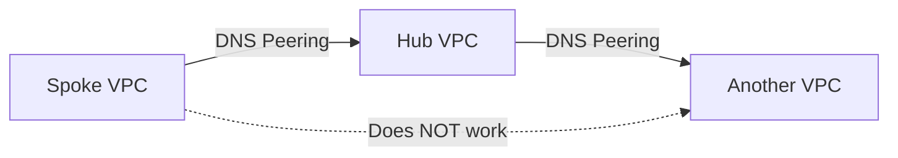

# How to Troubleshoot DNS Peering Between VPC Networks Not Resolving Records

Author: [nawazdhandala](https://www.github.com/nawazdhandala)

Tags: GCP, Cloud DNS, VPC Peering, DNS Resolution, Networking

Description: Troubleshoot DNS peering issues between Google Cloud VPC networks when DNS records are not resolving across peered networks as expected.

---

DNS peering in Google Cloud lets one VPC network forward DNS queries to another VPC network's Cloud DNS. It is commonly used when you have a hub-and-spoke architecture where a central VPC handles DNS resolution and spoke VPCs need to use it. When it works, it is seamless. When it does not, you get mysterious resolution failures that can be hard to trace because DNS peering has some non-obvious requirements and limitations.

## How DNS Peering Differs from VPC Peering

This is the first thing to clarify because people confuse the two constantly. VPC network peering connects two VPCs so instances can communicate using internal IPs. DNS peering is a separate configuration that lets one VPC use another VPC's DNS resolution. You can have DNS peering without VPC peering, and you can have VPC peering without DNS peering.

DNS peering creates a peering zone in the consumer VPC that forwards queries for a specific domain to the producer VPC's Cloud DNS. The producer VPC then resolves the query using its own private DNS zones, forwarding zones, or any other DNS configuration it has.

## Step 1: Verify the DNS Peering Zone Configuration

Check that the DNS peering zone exists and is configured correctly:

```bash
# List all DNS managed zones and look for peering zones
gcloud dns managed-zones list \
    --format="table(name, dnsName, visibility, peeringConfig)"

# Describe the specific peering zone
gcloud dns managed-zones describe your-peering-zone \
    --format="json(dnsName, peeringConfig, visibility)"
```

The output should show:
- `visibility` set to `private`
- `peeringConfig.targetNetwork` pointing to the producer VPC
- The `dnsName` matching the domain you want to resolve

If any of these are wrong, delete and recreate the peering zone:

```bash
# Create a DNS peering zone
gcloud dns managed-zones create your-peering-zone \
    --dns-name="internal.example.com." \
    --description="DNS peering to hub VPC" \
    --visibility=private \
    --networks=spoke-vpc-network \
    --target-network=hub-vpc-network \
    --target-project=hub-project-id
```

Note the trailing dot on the DNS name - it is required.

## Step 2: Check That the Target VPC Has the DNS Records

DNS peering forwards queries to the target VPC, but the target VPC still needs to be able to resolve those queries. If the target VPC does not have a private zone with the records you are looking for, the query will fail.

```bash
# List private zones in the target (hub) VPC project
gcloud dns managed-zones list \
    --project=hub-project-id \
    --format="table(name, dnsName, visibility)"

# List records in the target zone
gcloud dns record-sets list \
    --zone=hub-private-zone \
    --project=hub-project-id \
    --format="table(name, type, rrdatas)"
```

Make sure the domain you are querying matches the zone in the target VPC.

## Step 3: Verify Network Authorization on the Target Zone

This is a commonly missed step. The private DNS zone in the target VPC must be authorized for the target VPC network. If the private zone is authorized only for specific networks and the target VPC network is not included, DNS peering will not be able to resolve against it.

```bash
# Check which networks the private zone is authorized for
gcloud dns managed-zones describe hub-private-zone \
    --project=hub-project-id \
    --format="json(privateVisibilityConfig)"
```

The output should list the hub VPC network. If it does not, update the zone:

```bash
# Update the private zone to include the hub VPC network
gcloud dns managed-zones update hub-private-zone \
    --project=hub-project-id \
    --networks=hub-vpc-network
```

## Step 4: Understand the DNS Peering Chain Limitation

Here is a critical limitation that the documentation mentions but people still miss: DNS peering does not support chaining. If VPC-A peers to VPC-B, and VPC-B has a peering zone that forwards to VPC-C, VPC-A cannot resolve records through that chain. The query stops at VPC-B.

This means if your hub VPC uses DNS peering to reach another VPC, spoke VPCs that peer to the hub will not be able to use that transitive resolution.



The workaround is to set up DNS forwarding zones in the hub VPC that forward to an actual DNS server (like an on-premises resolver) rather than using DNS peering chains.

## Step 5: Check for Conflicting DNS Zones

If the consumer VPC has its own private zone for the same domain that the peering zone covers, the local private zone takes precedence over the peering zone. This is the resolution order in Cloud DNS:

1. Private zones authorized for the VPC
2. Peering zones
3. Forwarding zones
4. Public DNS

So if your spoke VPC has a private zone for `internal.example.com.` and also a peering zone for the same domain pointing to the hub, the local private zone wins and the peering zone is never consulted.

```bash
# Check for conflicting zones in the consumer VPC
gcloud dns managed-zones list \
    --filter="dnsName:internal.example.com." \
    --format="table(name, dnsName, visibility, peeringConfig)"
```

If there is a conflict, delete the local private zone or narrow its scope.

## Step 6: Test DNS Resolution from a VM

SSH into a VM in the consumer VPC and test DNS resolution:

```bash
# Test DNS resolution using dig
dig internal-service.internal.example.com

# Query the metadata server directly (Google's internal resolver)
dig @169.254.169.254 internal-service.internal.example.com

# Check which DNS server is being used
cat /etc/resolv.conf
```

The metadata server at `169.254.169.254` is the DNS resolver for GCE instances. All DNS queries from VMs go through this server, which then applies the Cloud DNS configuration (private zones, peering zones, forwarding zones).

If `dig` against `169.254.169.254` does not resolve but the record exists in the target VPC, the peering configuration is the issue.

## Step 7: Check DNS Logging

Enable DNS query logging to see what is happening with your queries:

```bash
# Create a DNS policy with logging enabled
gcloud dns policies create dns-logging-policy \
    --networks=spoke-vpc-network \
    --enable-logging \
    --description="Enable DNS query logging for debugging"
```

After enabling logging, make a DNS query and then check the logs:

```bash
# View DNS query logs
gcloud logging read 'resource.type="dns_query"' \
    --project=spoke-project-id \
    --limit=20 \
    --format="table(jsonPayload.queryName, jsonPayload.responseCode, jsonPayload.serverLatency)"
```

Look at the `responseCode` field. An `NXDOMAIN` means the name was not found, while `SERVFAIL` suggests a configuration problem in the resolution chain.

## Step 8: Verify Cross-Project Permissions

If the consumer and producer VPCs are in different projects, the account creating the peering zone needs the `dns.peer` role on the target project, or more specifically, the `dns.networks.targetWithPeeringZone` permission.

```bash
# Check IAM permissions on the target project
gcloud projects get-iam-policy hub-project-id \
    --flatten="bindings[].members" \
    --filter="bindings.role:roles/dns.peer" \
    --format="table(bindings.members)"
```

If the permission is missing, grant it:

```bash
# Grant DNS peer role for the spoke project's service account
gcloud projects add-iam-policy-binding hub-project-id \
    --member="serviceAccount:service-SPOKE_PROJECT_NUMBER@gcp-sa-dns.iam.gserviceaccount.com" \
    --role="roles/dns.peer"
```

## Debugging Checklist

Run through this when DNS peering is not resolving:

1. Does the peering zone exist with the correct target network?
2. Does the target VPC have a private zone with the records?
3. Is the target VPC network authorized for that private zone?
4. Are there conflicting local private zones in the consumer VPC?
5. Is there a DNS peering chain (which is not supported)?
6. Are cross-project IAM permissions in place?
7. What do DNS query logs show for the failed resolution?

DNS peering issues are almost always configuration problems. The system works correctly once all the pieces are in place. Use [OneUptime](https://oneuptime.com) to monitor DNS resolution times and failures across your VPC networks so you catch issues before they cause service disruptions.
