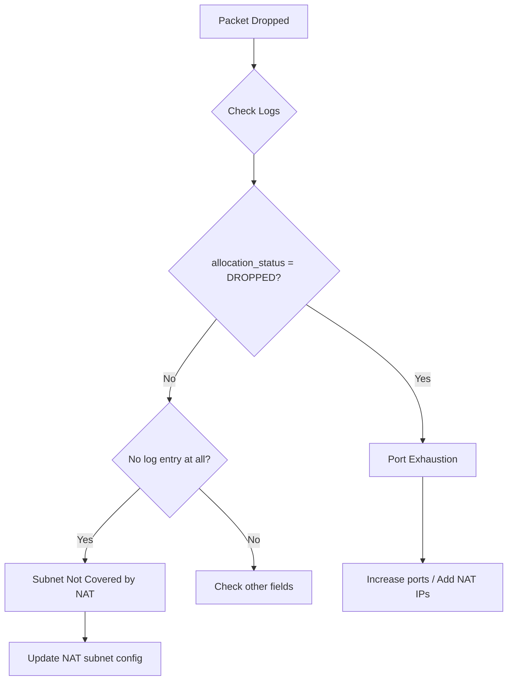

# How to Troubleshoot Dropped Packets and OUT_OF_RESOURCES Errors on Cloud NAT in GCP

Author: [nawazdhandala](https://www.github.com/nawazdhandala)

Tags: GCP, Cloud NAT, Troubleshooting, Packet Loss, Networking

Description: Diagnose and fix dropped packets and OUT_OF_RESOURCES errors on Cloud NAT caused by port exhaustion, misconfiguration, and capacity limits in your GCP environment.

---

When Cloud NAT starts dropping packets, the impact is immediate - outbound connections fail, API calls time out, package downloads break, and your applications behave unpredictably. The most common error is `OUT_OF_RESOURCES`, which means Cloud NAT could not find a free port to assign to a new outbound connection. But dropped packets can have other causes too. This guide provides a systematic approach to diagnosing and fixing the problem.

## Understanding Why Packets Get Dropped

Cloud NAT drops packets for several reasons:

1. **Port exhaustion** - No free NAT ports available for the requesting VM
2. **Endpoint-independent conflict** - Two VMs trying to use the same NAT IP:port for connections to the same destination
3. **NAT IP pool exhaustion** - Total ports across all NAT IPs are fully consumed
4. **Rate limiting** - Exceeding the per-VM or per-gateway connection creation rate
5. **Misconfigured subnet ranges** - Traffic from subnets or IP ranges not covered by the NAT configuration



## Step 1: Enable Logging and Check for Drops

First, make sure logging is enabled:

```bash
# Enable comprehensive NAT logging
gcloud compute routers nats update your-nat-gateway \
  --router=your-router \
  --region=us-central1 \
  --enable-logging \
  --log-filter=ALL \
  --project=your-project-id
```

Now look for dropped packets:

```bash
# Search for DROPPED allocation events
gcloud logging read \
  'resource.type="nat_gateway" AND resource.labels.gateway_name="your-nat-gateway" AND jsonPayload.allocation_status="DROPPED"' \
  --project=your-project-id \
  --freshness=1h \
  --format="table(timestamp, jsonPayload.connection.src_ip, jsonPayload.connection.dest_ip, jsonPayload.connection.dest_port, jsonPayload.connection.protocol)"
```

## Step 2: Identify the Pattern

The pattern of drops tells you a lot about the root cause.

### All Drops from One VM

If drops are concentrated on a single VM:

```bash
# Count drops per source VM
gcloud logging read \
  'resource.type="nat_gateway" AND resource.labels.gateway_name="your-nat-gateway" AND jsonPayload.allocation_status="DROPPED"' \
  --project=your-project-id \
  --freshness=1h \
  --format="value(jsonPayload.connection.src_ip)" | sort | uniq -c | sort -rn
```

If one VM dominates, that VM is exhausting its individual port allocation. The fix is to increase ports for that VM or investigate why it needs so many connections.

### Drops Across Many VMs

If drops are spread across many VMs, the total NAT IP pool is exhausted. You need more NAT IPs.

### Drops to One Specific Destination

If drops all target the same destination IP and port, you might be hitting an endpoint-independent mapping conflict:

```bash
# Check drops by destination
gcloud logging read \
  'resource.type="nat_gateway" AND jsonPayload.allocation_status="DROPPED"' \
  --project=your-project-id \
  --freshness=1h \
  --format="value(jsonPayload.connection.dest_ip)" | sort | uniq -c | sort -rn
```

## Step 3: Check Current Resource Usage

View your NAT gateway's current state:

```bash
# Describe the NAT gateway
gcloud compute routers nats describe your-nat-gateway \
  --router=your-router \
  --region=us-central1 \
  --project=your-project-id \
  --format=yaml
```

Check key fields:
- How many NAT IPs are in the pool
- What is the minimum ports per VM setting
- Is dynamic port allocation enabled
- What subnets are covered

## Step 4: Fix Port Exhaustion (Most Common)

### Option A: Enable Dynamic Port Allocation

If you are using static allocation, switch to dynamic:

```bash
# Enable dynamic port allocation
gcloud compute routers nats update your-nat-gateway \
  --router=your-router \
  --region=us-central1 \
  --enable-dynamic-port-allocation \
  --min-ports-per-vm=128 \
  --max-ports-per-vm=8192 \
  --project=your-project-id
```

### Option B: Increase Static Port Allocation

If you must use static allocation:

```bash
# Increase minimum ports per VM
gcloud compute routers nats update your-nat-gateway \
  --router=your-router \
  --region=us-central1 \
  --min-ports-per-vm=1024 \
  --project=your-project-id
```

### Option C: Add More NAT IPs

Each additional IP adds 64,512 ports to the total pool:

```bash
# Reserve and add new NAT IPs
gcloud compute addresses create nat-ip-new-1 --region=us-central1
gcloud compute addresses create nat-ip-new-2 --region=us-central1

# Update the NAT IP pool (include existing IPs)
gcloud compute routers nats update your-nat-gateway \
  --router=your-router \
  --region=us-central1 \
  --nat-external-ip-pool=nat-ip-1,nat-ip-2,nat-ip-new-1,nat-ip-new-2 \
  --project=your-project-id
```

Or switch to auto-allocated IPs:

```bash
# Let GCP manage IP allocation
gcloud compute routers nats update your-nat-gateway \
  --router=your-router \
  --region=us-central1 \
  --auto-allocate-nat-external-ips \
  --project=your-project-id
```

## Step 5: Fix Timeout-Related Drops

Connections in TIME_WAIT hold ports for 120 seconds by default. Reducing this frees ports faster:

```bash
# Reduce timeouts to free ports faster
gcloud compute routers nats update your-nat-gateway \
  --router=your-router \
  --region=us-central1 \
  --tcp-time-wait-timeout=30 \
  --tcp-established-idle-timeout=600 \
  --project=your-project-id
```

## Step 6: Fix Subnet Configuration Issues

If a VM's traffic is not being NATed at all (no log entries, not even DROPPED), the VM's subnet or IP range might not be covered:

```bash
# Check which subnets the NAT covers
gcloud compute routers nats describe your-nat-gateway \
  --router=your-router \
  --region=us-central1 \
  --format="yaml(sourceSubnetworkIpRangesToNat, subnetworks)" \
  --project=your-project-id
```

If using custom subnet selection, make sure all necessary subnets and their secondary ranges are listed:

```bash
# Update NAT to cover all subnets
gcloud compute routers nats update your-nat-gateway \
  --router=your-router \
  --region=us-central1 \
  --nat-all-subnet-ip-ranges \
  --project=your-project-id
```

Or add the missing subnet:

```bash
# Add a specific subnet including secondary ranges
gcloud compute routers nats update your-nat-gateway \
  --router=your-router \
  --region=us-central1 \
  --nat-custom-subnet-ip-ranges="existing-subnet,missing-subnet,missing-subnet:pods-range" \
  --project=your-project-id
```

## Step 7: Check Firewall Rules

Even with NAT configured, egress firewall rules can block traffic:

```bash
# List egress deny rules that might block NAT traffic
gcloud compute firewall-rules list \
  --filter="direction=EGRESS AND disabled=false" \
  --format="table(name, network, direction, action, targetTags, destinationRanges)" \
  --project=your-project-id
```

If you have egress deny rules, make sure they are not blocking the ports or destinations your applications need.

## Step 8: Monitor After Fixing

After applying fixes, monitor to confirm the issue is resolved:

```bash
# Check for drops in the last 30 minutes (should be zero after fix)
gcloud logging read \
  'resource.type="nat_gateway" AND resource.labels.gateway_name="your-nat-gateway" AND jsonPayload.allocation_status="DROPPED"' \
  --project=your-project-id \
  --freshness=30m \
  --format="table(timestamp, jsonPayload.connection.src_ip)"
```

Set up ongoing monitoring:

```bash
# Create a log-based metric for ongoing monitoring
gcloud logging metrics create nat-dropped-packets \
  --project=your-project-id \
  --description="Packets dropped by Cloud NAT" \
  --log-filter='resource.type="nat_gateway" AND jsonPayload.allocation_status="DROPPED"'
```

## Emergency Response Playbook

When drops are happening right now and impacting production:

1. **Immediate**: Switch to auto-allocated IPs if using static IPs (adds capacity instantly)
2. **Quick**: Enable dynamic port allocation with a high max
3. **Fast**: Reduce TCP TIME_WAIT timeout to 15 seconds
4. **Short-term**: Add more static NAT IPs if auto-allocation is not an option
5. **Long-term**: Fix application connection handling (connection pooling, keep-alive)

```bash
# Emergency fix: maximize capacity quickly
gcloud compute routers nats update your-nat-gateway \
  --router=your-router \
  --region=us-central1 \
  --auto-allocate-nat-external-ips \
  --enable-dynamic-port-allocation \
  --min-ports-per-vm=128 \
  --max-ports-per-vm=16384 \
  --tcp-time-wait-timeout=15 \
  --tcp-established-idle-timeout=300 \
  --project=your-project-id
```

## Prevention

To prevent these issues from recurring:

- Start with dynamic port allocation from day one
- Set up alerting on DROPPED events
- Monitor NAT port utilization in Cloud Monitoring dashboards
- Use connection pooling in your applications
- Plan NAT IP capacity based on peak connection volumes
- Review NAT configuration whenever you add new subnets or workloads

## Wrapping Up

Dropped packets and OUT_OF_RESOURCES errors on Cloud NAT almost always come down to port exhaustion. The fix is usually some combination of enabling dynamic port allocation, adding NAT IPs, reducing timeouts, and improving application-level connection handling. The key is having logging enabled so you can see exactly what is being dropped and why. With proper monitoring and alerting, you can catch these issues before they impact your users and respond with the appropriate fix.
