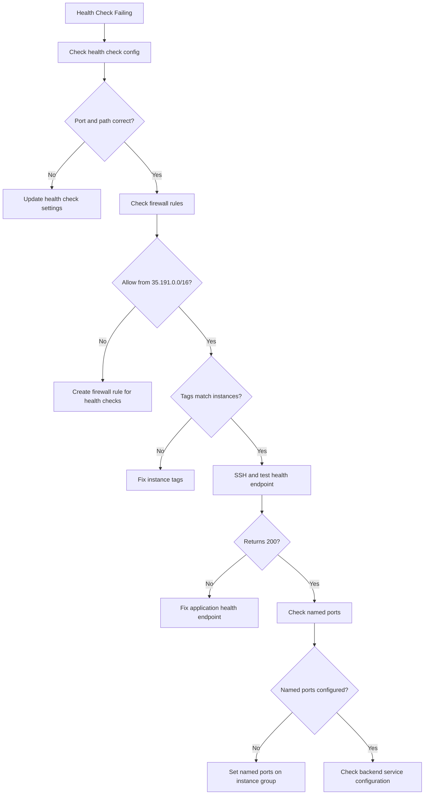

# How to Troubleshoot GCP Load Balancer Health Check Failures

Author: [nawazdhandala](https://www.github.com/nawazdhandala)

Tags: GCP, Load Balancer, Health Checks, Backend Services, Troubleshooting

Description: Diagnose and fix health check failures in Google Cloud load balancers, covering firewall rules, health check configuration, backend service settings, and common misconfigurations.

---

Your GCP load balancer shows backends as unhealthy, and traffic is not reaching your instances. The load balancer health check is failing, which means it cannot verify that your backend instances are ready to serve traffic. This could be a firewall issue, a misconfigured health check, or a problem with the backend application itself.

Let me walk through the systematic debugging process.

## Understanding Health Checks

GCP load balancers periodically send health check probes to backend instances. These probes come from specific Google-owned IP ranges, not from the load balancer's IP. If the backend responds with the expected status code within the timeout, it is marked healthy.

Key detail: Health check probes come from the IP ranges `35.191.0.0/16` and `130.211.0.0/22`. Your firewall rules must allow incoming traffic from these ranges.

## Step 1: Check the Current Health Status

```bash
# Check backend health for a backend service
gcloud compute backend-services get-health my-backend-service \
    --global \
    --format="table(status.healthStatus.instance, status.healthStatus.healthState)"
```

For regional backend services:

```bash
gcloud compute backend-services get-health my-backend-service \
    --region=us-central1 \
    --format="table(status.healthStatus.instance, status.healthStatus.healthState)"
```

If all backends show `UNHEALTHY`, the health check is failing across the board.

## Step 2: Review the Health Check Configuration

Check what the health check is actually doing:

```bash
# Describe the health check
gcloud compute health-checks describe my-health-check \
    --global \
    --format="yaml"
```

Key fields to examine:

```yaml
httpHealthCheck:
  host: ""           # Host header (empty = use instance IP)
  port: 80           # Port to check
  requestPath: "/"   # URL path to probe
checkIntervalSec: 10     # How often to check
timeoutSec: 5             # How long to wait for response
healthyThreshold: 2       # Consecutive successes to mark healthy
unhealthyThreshold: 3     # Consecutive failures to mark unhealthy
```

Common misconfigurations:
- **Wrong port**: The health check probes port 80 but your app listens on 8080
- **Wrong path**: The check hits `/` but your app returns 404 for that path
- **Wrong protocol**: Health check uses HTTP but your app only accepts HTTPS
- **Timeout too short**: Your health endpoint takes 6 seconds but timeout is 5 seconds

Fix the health check:

```bash
# Update the health check to use the correct port and path
gcloud compute health-checks update http my-health-check \
    --global \
    --port=8080 \
    --request-path=/health \
    --check-interval=10 \
    --timeout=10 \
    --healthy-threshold=2 \
    --unhealthy-threshold=3
```

## Step 3: Check Firewall Rules

This is the number one cause of health check failures. The health check probes come from Google's IP ranges, and your firewall must allow them.

```bash
# Check if there is a firewall rule allowing health check traffic
gcloud compute firewall-rules list \
    --filter="network:my-vpc AND direction=INGRESS" \
    --format="table(name, allowed, sourceRanges, targetTags)"
```

Look for a rule that allows traffic from `35.191.0.0/16` and `130.211.0.0/22` on your health check port.

If no such rule exists, create one:

```bash
# Create a firewall rule for load balancer health checks
# This allows Google's health check probes to reach your backends
gcloud compute firewall-rules create allow-health-check \
    --network=my-vpc \
    --direction=INGRESS \
    --action=ALLOW \
    --rules=tcp:8080 \
    --source-ranges=35.191.0.0/16,130.211.0.0/22 \
    --target-tags=lb-backend
```

Make sure the target tags match what your backend instances have:

```bash
# Check the tags on your backend instances
gcloud compute instances describe my-instance \
    --zone=us-central1-a \
    --format="value(tags.items)"

# Add the tag if missing
gcloud compute instances add-tags my-instance \
    --zone=us-central1-a \
    --tags=lb-backend
```

## Step 4: Test the Health Endpoint Directly

SSH into a backend instance and test the health endpoint:

```bash
# SSH into the instance
gcloud compute ssh my-instance --zone=us-central1-a

# Test the health endpoint locally
curl -v http://localhost:8080/health

# Check if the application is actually listening
ss -tlnp | grep 8080

# Test from the instance's internal IP
curl -v http://10.0.1.5:8080/health
```

If the health endpoint returns anything other than a 200 status code (or whatever your health check expects), the health check will fail.

## Step 5: Check the Application's Health Endpoint

Make sure your application has a proper health endpoint:

```javascript
// Simple health endpoint for Node.js/Express
app.get('/health', (req, res) => {
    // Return 200 to indicate the server is healthy
    res.status(200).json({ status: 'ok' });
});
```

For more advanced health checks that verify dependencies:

```python
# Python Flask health endpoint with dependency checks
@app.route('/health')
def health():
    checks = {}

    # Check database connectivity
    try:
        db.session.execute('SELECT 1')
        checks['database'] = 'ok'
    except Exception as e:
        checks['database'] = str(e)
        return jsonify(checks), 503

    # Check cache connectivity
    try:
        redis_client.ping()
        checks['cache'] = 'ok'
    except Exception as e:
        checks['cache'] = str(e)
        return jsonify(checks), 503

    return jsonify(checks), 200
```

Be careful with deep health checks. If your health endpoint checks a database and the database is slow, the health check will time out and mark the instance as unhealthy, even though the instance itself is fine for serving cached content.

## Step 6: Check for Managed Instance Group Issues

If your backends are in a Managed Instance Group (MIG), the MIG uses its own health check for autohealing, which is separate from the load balancer health check:

```bash
# Check MIG health
gcloud compute instance-groups managed list-instances my-mig \
    --zone=us-central1-a \
    --format="table(instance, instanceStatus, currentAction)"

# Check the autohealing policy
gcloud compute instance-groups managed describe my-mig \
    --zone=us-central1-a \
    --format="yaml(autoHealingPolicies)"
```

## Step 7: Check Named Ports

For HTTP(S) load balancers, the backend service uses named ports to route traffic. If the named port is not configured on the instance group, health checks will fail:

```bash
# Check named ports on the instance group
gcloud compute instance-groups describe my-instance-group \
    --zone=us-central1-a \
    --format="value(namedPorts)"

# Set the named port if missing
gcloud compute instance-groups set-named-ports my-instance-group \
    --zone=us-central1-a \
    --named-ports=http:8080
```

## Debugging Flowchart



## Quick Diagnostic Script

```bash
#!/bin/bash
# Diagnose load balancer health check failures
BACKEND_SERVICE=$1
HEALTH_CHECK=$2
NETWORK=$3

echo "=== Backend Health ==="
gcloud compute backend-services get-health $BACKEND_SERVICE --global 2>&1

echo ""
echo "=== Health Check Config ==="
gcloud compute health-checks describe $HEALTH_CHECK --global \
    --format="yaml(httpHealthCheck, checkIntervalSec, timeoutSec)" 2>&1

echo ""
echo "=== Firewall Rules for Health Checks ==="
gcloud compute firewall-rules list \
    --filter="network:$NETWORK AND sourceRanges~35.191" \
    --format="table(name, allowed, sourceRanges, targetTags)" 2>&1

echo ""
echo "=== Named Ports ==="
gcloud compute backend-services describe $BACKEND_SERVICE --global \
    --format="value(backends.group)" 2>&1
```

Health check failures are almost always one of three things: missing firewall rules for Google's health check IPs, wrong port or path in the health check configuration, or the application not responding correctly on the health endpoint. Check those three in order and you will find the issue.
