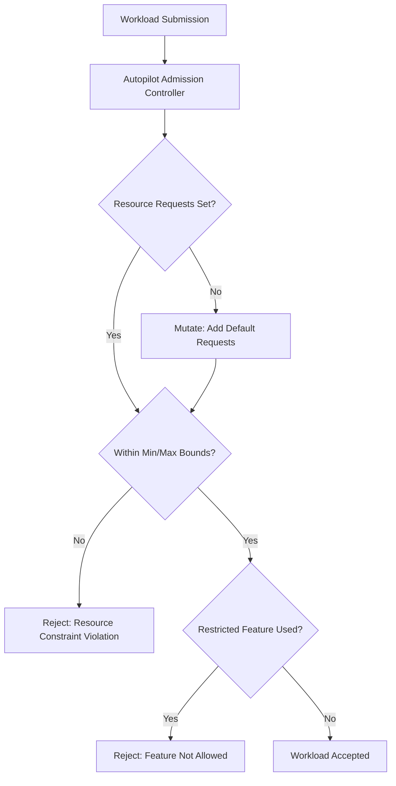

# How to Troubleshoot GKE Autopilot Workload Rejected Due to Resource Constraint Violations

Author: [nawazdhandala](https://www.github.com/nawazdhandala)

Tags: GKE, Kubernetes, Autopilot, Resource Constraints, Workload Management, Troubleshooting, GCP

Description: Diagnose and fix GKE Autopilot workload rejections caused by resource constraint violations, covering minimum and maximum limits, restricted features, and workload adaptation strategies.

---

GKE Autopilot manages the underlying infrastructure for you, but in exchange, it enforces a set of resource constraints and security restrictions. When your workload violates one of these constraints, Autopilot rejects the deployment with an error. The messages can be confusing if you are used to Standard GKE where almost anything goes.

Let's go through the most common Autopilot rejections and how to fix them.

## How Autopilot Constraints Work

Autopilot applies a set of mutating and validating admission webhooks that enforce resource and security constraints:



Autopilot enforces constraints because it provisions nodes automatically based on your workload requests. It needs predictable resource declarations to make node sizing decisions.

## Step 1 - Read the Error Message

The rejection message usually tells you exactly what is wrong:

```bash
# Try to deploy and capture the error
kubectl apply -f your-deployment.yaml 2>&1
```

Common error patterns:

```
autopilot-default-resources-mutator: Autopilot adjusted resources to meet
requirements for Deployment default/your-app: adjusted requests for container
"app" to meet minimum: {"cpu":"250m","ephemeral-storage":"1Gi","memory":"512Mi"}
```

```
GKE Autopilot does not allow containers with privilege escalation.
Set allowPrivilegeEscalation to false.
```

```
GKE Autopilot does not support host namespaces (hostNetwork, hostPID, hostIPC).
```

## Step 2 - Fix Resource Request Violations

Autopilot has minimum and maximum resource requests per container:

| Resource | Minimum | Maximum |
|----------|---------|---------|
| CPU | 250m | 28 vCPU (general), 80 vCPU (performance) |
| Memory | 512Mi | varies by CPU |
| Ephemeral Storage | 1Gi | 10Gi |

If your container requests less than the minimum, Autopilot bumps it up automatically (mutation). But if it exceeds the maximum, the workload is rejected.

Fix your deployment to be within bounds:

```yaml
# Resource requests within Autopilot's allowed range
apiVersion: apps/v1
kind: Deployment
metadata:
  name: your-app
spec:
  template:
    spec:
      containers:
      - name: app
        image: your-app:latest
        resources:
          requests:
            cpu: "500m"                 # at least 250m
            memory: "1Gi"              # at least 512Mi
            ephemeral-storage: "1Gi"   # at least 1Gi
          limits:
            cpu: "500m"                # Autopilot sets limits equal to requests
            memory: "1Gi"
            ephemeral-storage: "1Gi"
```

Important: In Autopilot, if you only set requests, the limits are automatically set to equal the requests. If you set limits higher than requests, Autopilot adjusts both to the limit values. This is different from Standard GKE where burstable resources are common.

## Step 3 - Fix CPU to Memory Ratio Violations

Autopilot enforces a specific ratio between CPU and memory requests. You cannot request 1 vCPU with 256Mi of memory, for example.

The allowed ratios depend on the compute class:

**General-purpose (default):**
- 1 vCPU : 1GiB to 1 vCPU : 6.5GiB

**Balanced:**
- 1 vCPU : 1GiB to 1 vCPU : 8GiB

If your ratio is outside the allowed range, Autopilot adjusts it:

```yaml
# Example: This will be adjusted because the ratio is too low
resources:
  requests:
    cpu: "4"
    memory: "2Gi"  # 0.5 GiB per CPU - below minimum ratio

# Fixed: Memory adjusted to fit the ratio
resources:
  requests:
    cpu: "4"
    memory: "4Gi"  # 1 GiB per CPU - within allowed ratio
```

Check what Autopilot actually applied:

```bash
# See the final resource values after Autopilot mutation
kubectl get pod your-pod -n your-namespace -o yaml | grep -A 10 resources
```

## Step 4 - Fix Security Constraint Violations

Autopilot enforces strict security defaults. The following are not allowed:

**Privileged containers:**

```yaml
# This will be rejected in Autopilot
securityContext:
  privileged: true  # not allowed
```

Fix:

```yaml
# Use specific capabilities instead of privileged mode
securityContext:
  privileged: false
  capabilities:
    add: ["NET_ADMIN"]  # only if in allowed list
```

**Host namespaces:**

```yaml
# Not allowed in Autopilot
spec:
  hostNetwork: true   # rejected
  hostPID: true       # rejected
  hostIPC: true       # rejected
```

There is no workaround for host namespaces in Autopilot. If your workload absolutely needs host-level access, you need to use GKE Standard instead.

**Privilege escalation:**

```yaml
# Fix: explicitly disable privilege escalation
securityContext:
  allowPrivilegeEscalation: false
  runAsNonRoot: true
  seccompProfile:
    type: RuntimeDefault
```

## Step 5 - Fix Volume Type Restrictions

Autopilot restricts certain volume types:

```yaml
# Not allowed in Autopilot
volumes:
- name: host-path
  hostPath:              # rejected - no hostPath volumes
    path: /var/log

# Use emptyDir instead
volumes:
- name: temp-storage
  emptyDir:
    sizeLimit: "1Gi"    # allowed
```

Allowed volume types:
- `emptyDir`
- `configMap`
- `secret`
- `persistentVolumeClaim`
- `projected`
- `downwardAPI`

Not allowed:
- `hostPath`
- `local`
- `nfs` (use Filestore CSI instead)

For persistent storage, use PVCs with supported StorageClasses:

```yaml
# PVC works in Autopilot
volumes:
- name: data
  persistentVolumeClaim:
    claimName: your-pvc
```

## Step 6 - Use Compute Classes for Special Workloads

If your workload needs more resources or specific hardware, use Autopilot compute classes:

```yaml
# Use the Scale-Out compute class for high-CPU workloads
apiVersion: apps/v1
kind: Deployment
metadata:
  name: compute-heavy-app
spec:
  template:
    metadata:
      annotations:
        # Request a specific compute class
        cloud.google.com/compute-class: "Scale-Out"
    spec:
      containers:
      - name: app
        resources:
          requests:
            cpu: "16"
            memory: "64Gi"
```

Available compute classes include:
- **General-purpose** (default) - balanced workloads
- **Balanced** - higher memory-to-CPU ratio
- **Scale-Out** - optimized for horizontal scaling
- **Performance** - highest per-node resources

For GPU workloads:

```yaml
# Request GPU resources in Autopilot
spec:
  nodeSelector:
    cloud.google.com/gke-accelerator: nvidia-tesla-t4
  containers:
  - name: gpu-app
    resources:
      requests:
        cpu: "4"
        memory: "16Gi"
        nvidia.com/gpu: "1"
      limits:
        nvidia.com/gpu: "1"
```

## Step 7 - Handle DaemonSet Restrictions

Autopilot restricts DaemonSets to prevent them from consuming too many resources across all nodes. Custom DaemonSets might be rejected:

```bash
# Check if your DaemonSet was rejected
kubectl describe daemonset your-daemonset -n your-namespace
```

Autopilot allows DaemonSets from allowlisted controllers. For custom DaemonSets, you might need to use a different pattern:

```yaml
# Alternative: Use a Deployment with pod anti-affinity instead of a DaemonSet
apiVersion: apps/v1
kind: Deployment
metadata:
  name: node-agent
spec:
  replicas: 3  # match your node count
  template:
    spec:
      topologySpreadConstraints:
      - maxSkew: 1
        topologyKey: kubernetes.io/hostname
        whenUnsatisfiable: DoNotSchedule
        labelSelector:
          matchLabels:
            app: node-agent
      containers:
      - name: agent
        image: your-agent:latest
        resources:
          requests:
            cpu: "250m"
            memory: "512Mi"
```

## Step 8 - Debug with Dry Run

Before deploying, use server-side dry run to see what Autopilot would do to your workload:

```bash
# Dry run to see Autopilot mutations
kubectl apply -f your-deployment.yaml --dry-run=server -o yaml | grep -A 20 resources
```

This shows you the mutated version of your workload without actually creating it. Very useful for understanding what Autopilot will change.

## Step 9 - Common Migration Patterns from Standard to Autopilot

If you are migrating from GKE Standard, these are the most common changes needed:

1. **Remove all privileged containers** - redesign using unprivileged alternatives
2. **Replace hostPath volumes** - use emptyDir or PVCs
3. **Set resource requests on all containers** - Autopilot requires them
4. **Remove hostNetwork usage** - use regular pod networking
5. **Review DaemonSets** - convert to Deployments where possible
6. **Add securityContext defaults** - runAsNonRoot, allowPrivilegeEscalation: false

```yaml
# Autopilot-compatible pod spec template
spec:
  automountServiceAccountToken: false
  securityContext:
    runAsNonRoot: true
    seccompProfile:
      type: RuntimeDefault
  containers:
  - name: app
    image: your-app:latest
    securityContext:
      allowPrivilegeEscalation: false
      readOnlyRootFilesystem: true
      capabilities:
        drop: ["ALL"]
    resources:
      requests:
        cpu: "500m"
        memory: "1Gi"
        ephemeral-storage: "1Gi"
    volumeMounts:
    - name: tmp
      mountPath: /tmp
  volumes:
  - name: tmp
    emptyDir: {}
```

## Summary

GKE Autopilot rejections are the platform enforcing predictable, secure workload patterns. Most rejections fall into three categories: resource constraints (too low or too high), security violations (privileged access), or unsupported features (host volumes, host networking). Read the error message carefully - it usually tells you exactly what to change. When in doubt, use `--dry-run=server` to preview what Autopilot will do with your workload spec.
