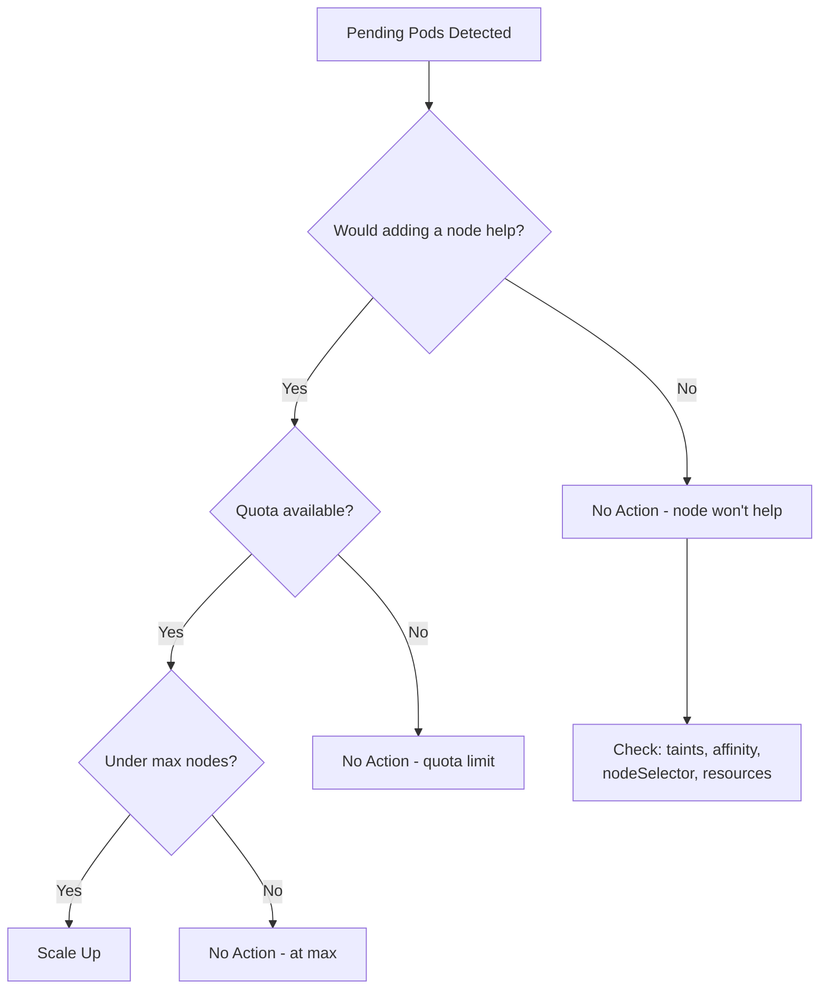

# How to Troubleshoot GKE Cluster Autoscaler Not Scaling Up Nodes

Author: [nawazdhandala](https://www.github.com/nawazdhandala)

Tags: GKE, Kubernetes, Cluster Autoscaler, Scaling, Node Management, Troubleshooting, GCP

Description: Practical troubleshooting guide for GKE cluster autoscaler that refuses to add nodes when pods are pending, covering quota issues, node pool configuration, and scheduling constraints.

---

You have pending pods. You have autoscaling enabled. But the cluster autoscaler just sits there, doing nothing, while your pods stay in Pending state. This is one of the more frustrating GKE issues because the whole point of the autoscaler is to handle this automatically.

The cluster autoscaler does not scale up for every pending pod. It evaluates whether adding a node would actually help, and there are many reasons it might decide the answer is no. Let's go through each possibility.

## How the Cluster Autoscaler Decides to Scale Up

The autoscaler runs a loop roughly every 10 seconds. For each pending pod, it asks: "If I added a node to one of the node pools, would this pod be schedulable on that new node?" If the answer is yes for any pending pod, it triggers a scale-up.



## Step 1 - Confirm Autoscaling Is Enabled

First, verify that autoscaling is actually turned on for your node pool:

```bash
# Check autoscaling configuration for all node pools
gcloud container node-pools list \
  --cluster your-cluster \
  --zone us-central1-a \
  --format="table(name, autoscaling.enabled, autoscaling.minNodeCount, autoscaling.maxNodeCount)"
```

If autoscaling is not enabled:

```bash
# Enable autoscaling on a node pool
gcloud container clusters update your-cluster \
  --enable-autoscaling \
  --min-nodes 1 \
  --max-nodes 10 \
  --node-pool default-pool \
  --zone us-central1-a
```

## Step 2 - Check If You Are Already at Max Nodes

The most obvious reason: you have hit the maximum node count.

```bash
# Check current node count vs max
gcloud container node-pools describe default-pool \
  --cluster your-cluster \
  --zone us-central1-a \
  --format="value(autoscaling.maxNodeCount, initialNodeCount)"

# Count current nodes
kubectl get nodes -l cloud.google.com/gke-nodepool=default-pool --no-headers | wc -l
```

If current nodes equals the max, increase the max:

```bash
# Increase the maximum node count
gcloud container clusters update your-cluster \
  --max-nodes 20 \
  --node-pool default-pool \
  --zone us-central1-a
```

## Step 3 - Check GCP Quota

Even if your max node count is high, GCP project quotas can prevent the autoscaler from creating new VMs. Check the relevant quotas:

```bash
# Check compute quotas in the region
gcloud compute regions describe us-central1 \
  --format="table(quotas[].metric, quotas[].limit, quotas[].usage)" \
  --filter="quotas.metric:CPUS OR quotas.metric:IN_USE_ADDRESSES"
```

The quotas that most commonly block autoscaling:
- **CPUS** - total vCPUs across all VMs in the region
- **IN_USE_ADDRESSES** - external IP addresses
- **INSTANCES** - total VM count
- **SSD_TOTAL_GB or DISKS_TOTAL_GB** - disk capacity

If you are near a quota limit, request an increase through the Cloud Console under IAM & Admin > Quotas.

## Step 4 - Examine the Autoscaler Status

GKE exposes the autoscaler's decision-making through configmap and events:

```bash
# Check the cluster autoscaler status configmap
kubectl get configmap cluster-autoscaler-status -n kube-system -o yaml
```

This shows you the autoscaler's current view of each node pool, including scale-up and scale-down activity.

Also check events:

```bash
# Look for autoscaler events in the cluster
kubectl get events --all-namespaces --field-selector reason=ScaleUp
kubectl get events --all-namespaces --field-selector reason=NotTriggerScaleUp
```

The events often contain the specific reason for not scaling, like "pod didn't trigger scale-up: node group max size reached" or "pod didn't trigger scale-up: no node group could satisfy the pod's requirements."

## Step 5 - Check Node Affinity and Selectors

If your pending pod has a nodeSelector or nodeAffinity that does not match any node pool, the autoscaler will not scale up because it knows a new node from the existing pools will not help.

```bash
# Check the pending pod's scheduling constraints
kubectl get pod your-pending-pod -n your-namespace -o yaml | grep -A 20 "nodeSelector\|nodeAffinity\|tolerations"
```

Common mismatch examples:

```yaml
# Pod requires a specific node pool that does not exist or is not autoscaled
spec:
  nodeSelector:
    cloud.google.com/gke-nodepool: gpu-pool  # does this pool exist?
```

If the pod targets a specific node pool, make sure that pool has autoscaling enabled.

## Step 6 - Check Taints and Tolerations

If a node pool has taints, pods must have matching tolerations. The autoscaler will only add a node from a tainted pool if the pending pod can tolerate the taint.

```bash
# Check taints on existing nodes
kubectl get nodes -o custom-columns=NAME:.metadata.name,TAINTS:.spec.taints

# Check tolerations on the pending pod
kubectl get pod your-pending-pod -o jsonpath='{.spec.tolerations}'
```

If you have a dedicated node pool with taints for specific workloads, make sure those workloads include the right tolerations:

```yaml
# Pod with tolerations matching a tainted node pool
spec:
  tolerations:
  - key: "dedicated"
    operator: "Equal"
    value: "high-memory"
    effect: "NoSchedule"
  nodeSelector:
    cloud.google.com/gke-nodepool: high-memory-pool
```

## Step 7 - Check Resource Requests vs Node Capacity

The autoscaler simulates scheduling on a new node. If the pod's resource requests exceed what a single node can offer (after accounting for system reservations), no scale-up will happen.

For example, if your node pool uses e2-standard-2 machines (2 vCPU, 8GB RAM) and the pod requests 6GB of memory, there is not enough allocatable memory on a single node (GKE reserves about 1.5-2GB for system components).

```bash
# Check the allocatable resources on existing nodes
kubectl get nodes -o custom-columns=\
NAME:.metadata.name,\
CPU:.status.allocatable.cpu,\
MEMORY:.status.allocatable.memory
```

If the pod needs more than what a single node can provide, you need a node pool with larger machines:

```bash
# Create a new node pool with larger machines for resource-heavy pods
gcloud container node-pools create large-pool \
  --cluster your-cluster \
  --machine-type e2-standard-8 \
  --enable-autoscaling \
  --min-nodes 0 \
  --max-nodes 5 \
  --zone us-central1-a
```

## Step 8 - Check for Pod Disruption Budgets Blocking Scale-Down

This is an indirect issue. If PDBs prevent the autoscaler from scaling down underutilized nodes, the autoscaler might hit the max node count sooner than expected, leaving no room to scale up for new workloads.

```bash
# List all PodDisruptionBudgets
kubectl get pdb --all-namespaces
```

Overly restrictive PDBs (like minAvailable equal to the current replica count) prevent any nodes from being drained. Review your PDBs and make sure they allow for reasonable disruption.

## Step 9 - Check Cloud Logging for Autoscaler Decisions

The most detailed information about autoscaler decisions is in Cloud Logging:

```bash
# Query autoscaler logs from Cloud Logging
gcloud logging read 'resource.type="k8s_cluster" AND log_id("container.googleapis.com/cluster-autoscaler-visibility")' \
  --limit 50 \
  --format json \
  --project your-project-id
```

These logs show you exactly why the autoscaler made each decision, including detailed scheduling simulation results.

## Step 10 - Verify Autoscaler Profile

GKE supports autoscaler profiles that change the behavior:

```bash
# Check the current autoscaler profile
gcloud container clusters describe your-cluster \
  --zone us-central1-a \
  --format="value(autoscaling.autoscalingProfile)"
```

The two profiles are:
- **BALANCED** (default) - balances scale-up speed with resource utilization
- **OPTIMIZE_UTILIZATION** - more aggressive scale-down, prioritizes cost savings

For workloads that need faster scale-up:

```bash
# Switch to balanced profile for more responsive scaling
gcloud container clusters update your-cluster \
  --autoscaling-profile optimize-utilization \
  --zone us-central1-a
```

## Quick Diagnostic Summary

When the autoscaler is not scaling up, check these in order:

1. Is autoscaling enabled on the target node pool?
2. Are you at the max node count?
3. Do you have GCP quota available?
4. Does the pending pod's nodeSelector/affinity match a node pool?
5. Does the pod tolerate the node pool's taints?
6. Can a single node from the pool fit the pod's requests?
7. What do the autoscaler events and logs say?

Nine times out of ten, it is one of these issues. The autoscaler logs in Cloud Logging are your best friend for the tricky cases.
