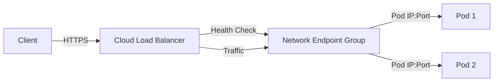

# How to Troubleshoot GKE Ingress Returning 404 or 502 Errors

Author: [nawazdhandala](https://www.github.com/nawazdhandala)

Tags: GKE, Kubernetes, Ingress, Load Balancing, Troubleshooting, HTTP Errors, GCP

Description: A hands-on guide to diagnosing and fixing 404 and 502 errors from GKE Ingress resources, covering health checks, backend configuration, and load balancer setup.

---

You set up a GKE Ingress, pointed your domain at it, and instead of your application you get a blank 404 page or the dreaded "502 Server Error." The GKE Ingress controller creates a Google Cloud HTTP(S) Load Balancer behind the scenes, and there are several places where the wiring can go wrong between the load balancer and your backend pods.

Let's go through the most common causes and how to fix each one.

## Understanding the GKE Ingress Architecture

When you create an Ingress resource in GKE, the ingress controller provisions a Google Cloud HTTP(S) Load Balancer with backend services, URL maps, health checks, and forwarding rules. The traffic flow looks like this:



A 404 or 502 typically means the load balancer cannot find a healthy backend to route traffic to.

## Step 1 - Check Ingress Status

Start by checking the Ingress resource itself:

```bash
# Get the Ingress status and associated IP address
kubectl get ingress your-ingress -n your-namespace
kubectl describe ingress your-ingress -n your-namespace
```

Look at the events section. Common warning messages include:
- "Error syncing to GCP" - the Ingress controller cannot create the load balancer resources
- "Unhealthy backends" - health checks are failing
- No events at all - the Ingress might not be picked up by the controller

Make sure the Ingress has an external IP assigned. If the ADDRESS column is empty, the load balancer is still being created or has failed.

## Step 2 - Verify the Backend Service Exists

Check that the Kubernetes Service referenced in the Ingress actually exists and has endpoints:

```bash
# Confirm the service exists and has endpoints
kubectl get svc your-service -n your-namespace
kubectl get endpoints your-service -n your-namespace
```

If the endpoints list is empty, the service selector does not match any running pods. Check the labels:

```bash
# Compare service selector with pod labels
kubectl get svc your-service -n your-namespace -o jsonpath='{.spec.selector}'
kubectl get pods -n your-namespace --show-labels
```

The labels must match exactly. A typo in the selector is one of the most common causes of empty endpoints.

## Step 3 - Fix Health Check Failures (502 Errors)

The most frequent cause of 502 errors is the load balancer health check failing. When no backends pass the health check, the load balancer returns 502.

By default, the GKE Ingress health check sends requests to the root path `/` on the serving port. If your application does not respond with a 200 on `/`, the health check fails.

Check the health check status in the Cloud Console under Network Services > Load Balancing, or use gcloud:

```bash
# List backend services and their health status
gcloud compute backend-services list --format="table(name, backends[].group, healthChecks)"

# Check health check details
gcloud compute health-checks list

# Get specific health check configuration
gcloud compute health-checks describe HEALTH_CHECK_NAME
```

To fix this, add a health check endpoint to your application or configure the Ingress to use a custom health check path. You can do this with a BackendConfig:

```yaml
# BackendConfig to customize the health check path
apiVersion: cloud.google.com/v1
kind: BackendConfig
metadata:
  name: my-backend-config
  namespace: your-namespace
spec:
  healthCheck:
    checkIntervalSec: 15
    timeoutSec: 5
    healthyThreshold: 1
    unhealthyThreshold: 2
    type: HTTP
    requestPath: /healthz   # your app's health endpoint
    port: 8080              # the port your app listens on
---
# Reference the BackendConfig from your Service
apiVersion: v1
kind: Service
metadata:
  name: your-service
  namespace: your-namespace
  annotations:
    cloud.google.com/backend-config: '{"default": "my-backend-config"}'
spec:
  type: NodePort
  selector:
    app: your-app
  ports:
  - port: 80
    targetPort: 8080
```

## Step 4 - Fix Port Mismatch Issues

Another common cause of 502 errors is a port mismatch. The health check, service, and container must all agree on the port.

Make sure:
- The container listens on the port specified in `containerPort`
- The Service's `targetPort` matches the container's listening port
- The health check hits the correct port

```yaml
# Correct port configuration across all resources
apiVersion: apps/v1
kind: Deployment
metadata:
  name: your-app
spec:
  template:
    spec:
      containers:
      - name: app
        image: your-app:latest
        ports:
        - containerPort: 8080  # app listens here
        readinessProbe:
          httpGet:
            path: /healthz
            port: 8080         # matches containerPort
          initialDelaySeconds: 10
          periodSeconds: 5
---
apiVersion: v1
kind: Service
metadata:
  name: your-service
spec:
  type: NodePort
  selector:
    app: your-app
  ports:
  - port: 80
    targetPort: 8080           # must match containerPort
```

## Step 5 - Fix 404 Errors from URL Map Mismatch

If you get 404s, the load balancer URL map does not have a rule matching your request. This happens when:

- The Ingress path rules do not match the requested URL
- The host header does not match any Ingress rule

Check your Ingress rules:

```bash
# Display Ingress rules in detail
kubectl get ingress your-ingress -n your-namespace -o yaml
```

Common mistakes:

```yaml
# Problem: path prefix does not match
apiVersion: networking.k8s.io/v1
kind: Ingress
metadata:
  name: your-ingress
spec:
  rules:
  - host: example.com
    http:
      paths:
      - path: /api          # only matches /api exactly
        pathType: Exact      # change to Prefix to match /api/*
        backend:
          service:
            name: your-service
            port:
              number: 80
```

If you want to catch all traffic under a path prefix, use `pathType: Prefix`:

```yaml
# Correct: using Prefix pathType to match all subpaths
spec:
  rules:
  - host: example.com
    http:
      paths:
      - path: /api
        pathType: Prefix     # matches /api, /api/users, /api/v2/items, etc
        backend:
          service:
            name: api-service
            port:
              number: 80
      - path: /
        pathType: Prefix     # catch-all for everything else
        backend:
          service:
            name: frontend-service
            port:
              number: 80
```

## Step 6 - Check the Default Backend

If no Ingress rule matches, traffic goes to the GKE default backend, which returns 404. If you want a custom default backend:

```yaml
# Set a default backend to handle unmatched requests
apiVersion: networking.k8s.io/v1
kind: Ingress
metadata:
  name: your-ingress
spec:
  defaultBackend:
    service:
      name: default-service
      port:
        number: 80
  rules:
  - host: example.com
    http:
      paths:
      - path: /api
        pathType: Prefix
        backend:
          service:
            name: api-service
            port:
              number: 80
```

## Step 7 - Handle NEG Sync Issues

GKE uses container-native load balancing with Network Endpoint Groups (NEGs) by default. If the NEG is not syncing properly, backends show as unhealthy even when pods are running fine.

Check NEG status:

```bash
# Check NEG annotations on the service
kubectl get svc your-service -n your-namespace -o jsonpath='{.metadata.annotations.cloud\.google\.com/neg-status}'
```

Verify the NEG exists in GCP:

```bash
# List NEGs and check their member count
gcloud compute network-endpoint-groups list
gcloud compute network-endpoint-groups list-network-endpoints NEG_NAME --zone us-central1-a
```

If the NEG has zero endpoints, the service's endpoint slices might not be syncing. Check the NEG controller logs:

```bash
# Check the GKE ingress controller logs for NEG sync errors
kubectl logs -n kube-system -l k8s-app=glbc --tail=100
```

## Step 8 - Wait for Propagation

One thing that catches people off guard is timing. After creating or updating an Ingress, it can take 5-10 minutes for all the load balancer components to be provisioned and for health checks to pass. Do not panic if you see 502s immediately after deploying.

You can monitor the backend health status:

```bash
# Watch backend health status until all backends are healthy
watch -n 10 'gcloud compute backend-services get-health BACKEND_SERVICE_NAME --global'
```

## Debugging Checklist

When you hit a 404 or 502 from GKE Ingress, work through this list:

1. Does the Ingress have an external IP? If not, check events for sync errors.
2. Does the Service have endpoints? If not, check pod labels vs service selector.
3. Is the health check passing? If not, fix the health check path and port.
4. Does the URL path match an Ingress rule? If not, check pathType and host settings.
5. Are NEGs populated? If not, check NEG controller logs.
6. Has enough time passed? Give it 10 minutes after any change.

Most 502s come from health check failures. Most 404s come from path or host mismatches. Start there and you will resolve the majority of issues.
