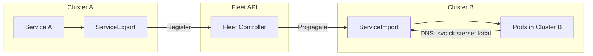

# How to Troubleshoot GKE Multi-Cluster Service Discovery Failures with Fleet

Author: [nawazdhandala](https://www.github.com/nawazdhandala)

Tags: GKE, Kubernetes, Multi-Cluster, Fleet, Service Discovery, Multi-Cluster Services, GCP

Description: Troubleshoot and fix service discovery failures in GKE multi-cluster setups using Fleet and Multi-Cluster Services, covering registration, export, and connectivity issues.

---

You have multiple GKE clusters registered in a Fleet, and you are using Multi-Cluster Services (MCS) to enable cross-cluster service discovery. But services from one cluster are not discoverable from another. The ServiceExport was created, the ServiceImport should have appeared, but pods in the remote cluster cannot resolve or reach the service.

Let's trace through the MCS pipeline and fix it.

## How Multi-Cluster Services Work

When you export a service from one cluster, a corresponding ServiceImport is automatically created in all other Fleet member clusters:



The cross-cluster DNS name follows the format:
```
<service-name>.<namespace>.svc.clusterset.local
```

## Step 1 - Verify Fleet Membership

Both clusters must be registered in the same Fleet:

```bash
# List all Fleet members
gcloud container fleet memberships list

# Check a specific cluster's membership
gcloud container fleet memberships describe cluster-a \
  --format="value(name, state.code)"
```

All clusters should show `READY` state. If a cluster is missing:

```bash
# Register a cluster with the Fleet
gcloud container fleet memberships register cluster-a \
  --gke-cluster=us-central1-a/cluster-a \
  --enable-workload-identity
```

## Step 2 - Verify Multi-Cluster Services Is Enabled

MCS must be enabled as a Fleet feature:

```bash
# Check if MCS feature is enabled
gcloud container fleet multi-cluster-services describe
```

If not enabled:

```bash
# Enable Multi-Cluster Services feature
gcloud container fleet multi-cluster-services enable
```

Also check that the MCS controller is running in each cluster:

```bash
# Check MCS controller pods in the source cluster
kubectl get pods -n gke-mcs -l app=gke-mcs-importer --context cluster-a-context

# Check in the destination cluster
kubectl get pods -n gke-mcs -l app=gke-mcs-importer --context cluster-b-context
```

The MCS importer pods should be in Running state. If they are missing or failing, the MCS feature may not be properly installed.

## Step 3 - Verify the ServiceExport

In the source cluster, check that the ServiceExport exists and is healthy:

```bash
# Check ServiceExport status in the source cluster
kubectl get serviceexport your-service -n your-namespace --context cluster-a-context

# Get detailed status
kubectl describe serviceexport your-service -n your-namespace --context cluster-a-context
```

If the ServiceExport does not exist, create it:

```yaml
# Export a service for multi-cluster discovery
apiVersion: net.gke.io/v1
kind: ServiceExport
metadata:
  name: your-service
  namespace: your-namespace
```

The ServiceExport must have the same name and namespace as the Service you want to export. The underlying Service must also exist:

```bash
# Verify the Service exists with endpoints
kubectl get svc your-service -n your-namespace --context cluster-a-context
kubectl get endpoints your-service -n your-namespace --context cluster-a-context
```

## Step 4 - Check the ServiceImport in the Remote Cluster

After creating a ServiceExport, a ServiceImport should automatically appear in all other Fleet clusters:

```bash
# Check for ServiceImport in the destination cluster
kubectl get serviceimport -n your-namespace --context cluster-b-context

# Get detailed status
kubectl describe serviceimport your-service -n your-namespace --context cluster-b-context
```

If the ServiceImport is missing, there are several possible causes:

1. **MCS controller is not running** in the destination cluster
2. **Namespace does not exist** in the destination cluster - the namespace must exist in both clusters
3. **IAM permissions** are missing for the MCS controller

Create the namespace if it does not exist:

```bash
# Create the namespace in the destination cluster
kubectl create namespace your-namespace --context cluster-b-context
```

## Step 5 - Check IAM Permissions

The MCS controller needs specific IAM permissions to sync across clusters:

```bash
# Check IAM bindings for the MCS service account
gcloud projects get-iam-policy your-project-id \
  --flatten="bindings[].members" \
  --filter="bindings.members:gke-mcs" \
  --format="table(bindings.role)"
```

Grant the required permissions if missing:

```bash
# Grant the MCS importer the necessary role
gcloud projects add-iam-policy-binding your-project-id \
  --member="serviceAccount:your-project-id.svc.id.goog[gke-mcs/gke-mcs-importer]" \
  --role="roles/compute.networkViewer"
```

For cross-project Fleet setups, additional bindings are needed between projects.

## Step 6 - Test DNS Resolution

Once the ServiceImport exists, test DNS from the destination cluster:

```bash
# Launch a debug pod in the destination cluster
kubectl run dns-test --image=busybox:1.36 --rm -it --restart=Never \
  --context cluster-b-context -n your-namespace -- sh
```

Inside the pod:

```bash
# Test the multi-cluster service DNS name
nslookup your-service.your-namespace.svc.clusterset.local

# Compare with the local cluster DNS
nslookup your-service.your-namespace.svc.cluster.local
```

The `clusterset.local` domain should resolve to a VIP managed by MCS. If DNS does not resolve, check if the MCS DNS configuration is in place:

```bash
# Check if CoreDNS/kube-dns has the clusterset.local zone configured
kubectl get configmap coredns -n kube-system --context cluster-b-context -o yaml
```

In GKE, the MCS controller automatically configures DNS. If it is not working, restart the DNS pods:

```bash
# Restart kube-dns to pick up MCS DNS configuration
kubectl rollout restart deployment kube-dns -n kube-system --context cluster-b-context
```

## Step 7 - Check Network Connectivity Between Clusters

For MCS to work, there must be network connectivity between the clusters. The pods in one cluster must be able to reach pod IPs in the other cluster.

**Same VPC**: If both clusters are in the same VPC network, pod-to-pod connectivity should work automatically as long as the pod IP ranges do not overlap.

**Different VPCs**: You need VPC peering or a VPN/Interconnect:

```bash
# Check if VPC peering exists between the networks
gcloud compute networks peerings list --network your-vpc-network
```

**Pod IP range overlap**: If both clusters use the same pod CIDR range (like 10.0.0.0/14), traffic will not route correctly. Each cluster must have unique pod and service CIDR ranges.

```bash
# Check the pod IP range for each cluster
gcloud container clusters describe cluster-a --zone us-central1-a \
  --format="value(clusterIpv4Cidr)"
gcloud container clusters describe cluster-b --zone us-east1-b \
  --format="value(clusterIpv4Cidr)"
```

## Step 8 - Check Firewall Rules

Firewall rules must allow traffic between cluster pod IP ranges:

```bash
# Check existing firewall rules
gcloud compute firewall-rules list --filter="network=your-vpc-network"

# Create a rule allowing traffic between cluster pod ranges
gcloud compute firewall-rules create allow-mcs-traffic \
  --network your-vpc-network \
  --allow tcp,udp,icmp \
  --source-ranges 10.0.0.0/14,10.4.0.0/14 \
  --destination-ranges 10.0.0.0/14,10.4.0.0/14
```

Replace the CIDR ranges with your actual cluster pod and service ranges.

## Step 9 - Verify End-to-End Connectivity

After fixing the above issues, do a full end-to-end test:

```bash
# From a pod in cluster B, try to reach the service in cluster A
kubectl run connectivity-test --image=curlimages/curl --rm -it --restart=Never \
  --context cluster-b-context -n your-namespace -- \
  curl -v http://your-service.your-namespace.svc.clusterset.local:80/healthz
```

If DNS resolves but the connection times out, the network path is broken. If it returns an HTTP response, everything is working.

## Step 10 - Monitor MCS Health

Set up monitoring for MCS to catch issues early:

```bash
# Check MCS controller logs for sync errors
kubectl logs -n gke-mcs -l app=gke-mcs-importer --tail=100 --context cluster-a-context

# Check for MCS-related events
kubectl get events -n gke-mcs --context cluster-a-context
```

## Diagnostic Summary

When multi-cluster service discovery fails:

1. Verify both clusters are Fleet members in READY state
2. Confirm MCS feature is enabled
3. Check ServiceExport exists in the source cluster with a matching Service
4. Verify ServiceImport appears in the destination cluster
5. Ensure the namespace exists in both clusters
6. Test DNS resolution for `clusterset.local`
7. Verify network connectivity between cluster pod ranges
8. Check firewall rules allow cross-cluster traffic
9. Review IAM permissions for the MCS controller

The most common issues are missing namespaces in the destination cluster, IAM permission gaps, and network connectivity between clusters. Work through the list systematically and you will find the break.
