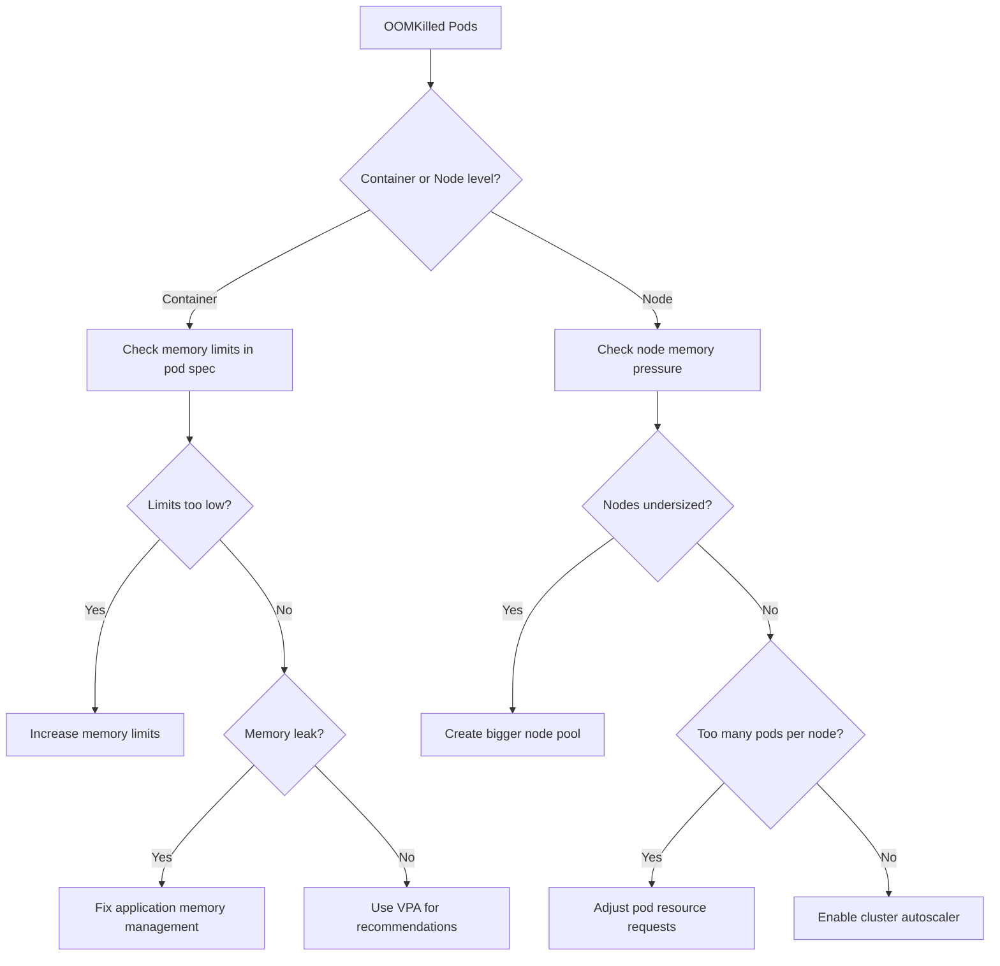

# How to Troubleshoot GKE Node Pool Out of Memory Kills

Author: [nawazdhandala](https://www.github.com/nawazdhandala)

Tags: GCP, GKE, Kubernetes, OOM, Memory Management

Description: Learn how to diagnose and fix out of memory (OOM) kills in Google Kubernetes Engine node pools, including resource limits, node sizing, and monitoring strategies.

---

Your GKE pods keep getting killed and restarted, and when you check the status, you see `OOMKilled`. This means the container exceeded its memory limit and the Linux OOM killer terminated it. It is one of the most common issues in Kubernetes, and in GKE specifically, it can cascade into node-level problems if enough pods get killed simultaneously.

Let me walk through how to find out what is happening and how to fix it.

## Identifying OOM Kills

First, confirm that OOM is actually the problem:

```bash
# Check pod status for OOMKilled
kubectl get pods -n my-namespace -o wide

# Look at the last termination reason
kubectl get pods -n my-namespace -o jsonpath='{range .items[*]}{.metadata.name}{"\t"}{.status.containerStatuses[0].lastState.terminated.reason}{"\n"}{end}'

# Get detailed info on a specific pod
kubectl describe pod my-pod-abc123 -n my-namespace
```

In the `describe` output, look for:

```
Last State:     Terminated
  Reason:       OOMKilled
  Exit Code:    137
```

Exit code 137 is the signature of an OOM kill (128 + signal 9 SIGKILL).

## Understanding the Two Types of OOM

There are two different OOM scenarios in Kubernetes:

### Container-Level OOM

The container exceeds its memory `limit` defined in the pod spec. Kubernetes kills just that container.

### Node-Level OOM

The node itself runs out of memory. The kubelet starts evicting pods based on their QoS class (BestEffort first, then Burstable, then Guaranteed last).

```bash
# Check if node-level pressure is occurring
kubectl describe node NODE_NAME | grep -A 5 "Conditions"

# Look for MemoryPressure: True
kubectl get nodes -o jsonpath='{range .items[*]}{.metadata.name}{"\t"}{.status.conditions[?(@.type=="MemoryPressure")].status}{"\n"}{end}'
```

## Step 1: Check Current Resource Usage

See how much memory your pods are actually using:

```bash
# Check current memory usage for pods in a namespace
kubectl top pods -n my-namespace --sort-by=memory

# Check node-level memory usage
kubectl top nodes

# Get detailed resource usage for a specific pod
kubectl top pod my-pod-abc123 -n my-namespace --containers
```

Compare this to the limits in your deployment:

```bash
# Check the resource limits defined for a pod
kubectl get pod my-pod-abc123 -n my-namespace \
    -o jsonpath='{.spec.containers[0].resources}' | python3 -m json.tool
```

## Step 2: Fix Container Memory Limits

If the container is getting OOM killed, it needs a higher memory limit:

```yaml
# Deployment with properly configured memory resources
apiVersion: apps/v1
kind: Deployment
metadata:
  name: my-app
spec:
  template:
    spec:
      containers:
      - name: my-app
        image: my-app:latest
        resources:
          requests:
            memory: "256Mi"   # Scheduler uses this for placement
            cpu: "100m"
          limits:
            memory: "512Mi"   # OOM kill threshold
            cpu: "500m"       # CPU is throttled, not killed
```

Guidelines for setting memory limits:
- Set `requests` to the typical memory usage
- Set `limits` to 1.5-2x the typical usage to handle spikes
- Never set `limits` equal to `requests` unless you want Guaranteed QoS (which prevents bursting)

## Step 3: Use Vertical Pod Autoscaler

If you are not sure what the right memory limits are, use the Vertical Pod Autoscaler (VPA) to get recommendations:

```bash
# Install VPA if not already installed
gcloud container clusters update my-cluster \
    --enable-vertical-pod-autoscaling \
    --region=us-central1
```

Create a VPA resource in recommendation mode first:

```yaml
# VPA in recommendation mode - does not change anything, just suggests
apiVersion: autoscaling.k8s.io/v1
kind: VerticalPodAutoscaler
metadata:
  name: my-app-vpa
spec:
  targetRef:
    apiVersion: apps/v1
    kind: Deployment
    name: my-app
  updatePolicy:
    updateMode: "Off"  # Just recommend, do not auto-update
```

After a few hours, check the recommendations:

```bash
# Get VPA recommendations
kubectl get vpa my-app-vpa -o jsonpath='{.status.recommendation}' | python3 -m json.tool
```

The VPA will tell you the recommended requests and limits based on actual usage patterns.

## Step 4: Fix Node Pool Sizing

If multiple pods are getting evicted due to node-level memory pressure, the nodes are undersized.

```bash
# Check node capacity and allocatable resources
kubectl describe node NODE_NAME | grep -A 10 "Allocatable"

# See what is running on a specific node
kubectl get pods --all-namespaces --field-selector spec.nodeName=NODE_NAME \
    -o custom-columns=NAMESPACE:.metadata.namespace,NAME:.metadata.name,MEMORY:.spec.containers[0].resources.requests.memory
```

To increase node size:

```bash
# Create a new node pool with bigger machines
gcloud container node-pools create bigger-pool \
    --cluster=my-cluster \
    --region=us-central1 \
    --machine-type=e2-standard-8 \
    --num-nodes=3 \
    --enable-autoscaling \
    --min-nodes=1 \
    --max-nodes=10

# Cordon and drain the old node pool
kubectl cordon -l cloud.google.com/gke-nodepool=old-pool
kubectl drain -l cloud.google.com/gke-nodepool=old-pool \
    --ignore-daemonsets --delete-emptydir-data

# Delete the old node pool
gcloud container node-pools delete old-pool \
    --cluster=my-cluster \
    --region=us-central1
```

## Step 5: Check for Memory Leaks

If memory usage grows steadily over time until OOM kill, you probably have a memory leak:

```bash
# Watch memory usage over time for a specific pod
# Run this periodically to spot a trend
kubectl top pod my-pod-abc123 -n my-namespace
```

For Java applications, check heap settings:

```yaml
# Java apps need explicit heap configuration
containers:
- name: my-java-app
  image: my-java-app:latest
  env:
  - name: JAVA_OPTS
    # Set max heap to 75% of the container memory limit
    # Leave room for native memory, thread stacks, etc.
    value: "-Xmx384m -Xms256m"
  resources:
    limits:
      memory: "512Mi"
```

For Node.js applications:

```yaml
# Node.js has a default heap limit that may be too low or too high
containers:
- name: my-node-app
  image: my-node-app:latest
  env:
  - name: NODE_OPTIONS
    value: "--max-old-space-size=384"  # In MB
  resources:
    limits:
      memory: "512Mi"
```

## Step 6: Set Up Monitoring and Alerts

Configure alerts so you know about OOM kills before they cascade:

```bash
# Create a log-based metric for OOM kills
gcloud logging metrics create oom-kills \
    --description="Count of OOM killed containers" \
    --log-filter='resource.type="k8s_container" AND jsonPayload.message=~"OOMKilled"'
```

You can also set up GKE monitoring in the Cloud Console to track memory utilization per node pool and get alerts when nodes are above 80% memory usage.

## Debugging Flowchart



## GKE Autopilot Consideration

If you are running GKE Autopilot, resource management is different. Autopilot enforces minimum resource requests and automatically provisions nodes to match. If your pods are getting OOM killed on Autopilot, the issue is almost certainly that your memory limits are too low - the node sizing is handled for you.

```bash
# On Autopilot, just adjust the pod resource requests and limits
kubectl patch deployment my-app -n my-namespace --type=json \
    -p='[{"op": "replace", "path": "/spec/template/spec/containers/0/resources/limits/memory", "value": "1Gi"}]'
```

OOM kills are a signal that your resource configuration does not match your workload's actual needs. Use VPA recommendations, monitor memory trends, and set alerts. The fix is usually straightforward - increase the memory limit or fix the application's memory management.
