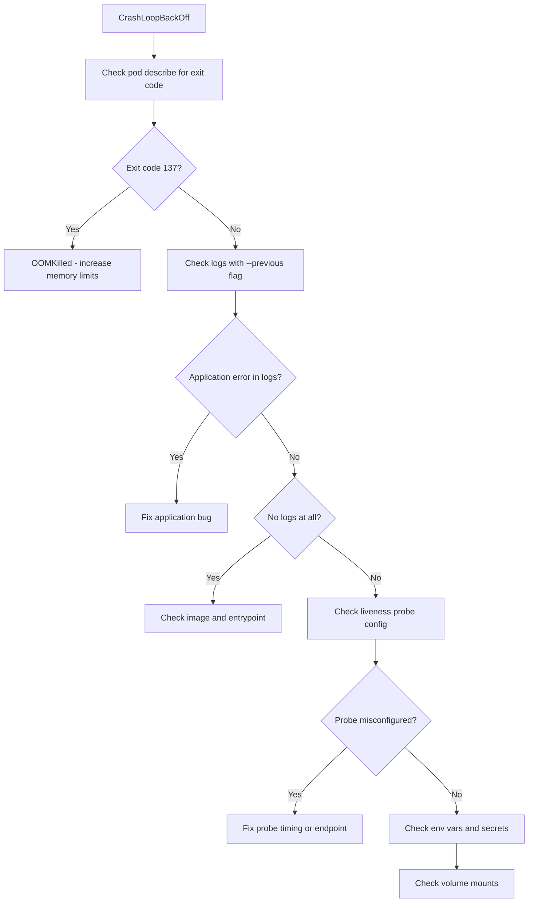

# How to Troubleshoot GKE Pod CrashLoopBackOff Errors Step by Step

Author: [nawazdhandala](https://www.github.com/nawazdhandala)

Tags: GCP, GKE, Kubernetes, CrashLoopBackOff, Troubleshooting

Description: A step-by-step guide to diagnosing and fixing CrashLoopBackOff errors in Google Kubernetes Engine pods, covering common causes like application crashes, resource limits, and configuration issues.

---

CrashLoopBackOff is Kubernetes telling you that your container starts, crashes, gets restarted, crashes again, and keeps repeating this cycle. Each restart comes with an exponentially increasing backoff delay (10s, 20s, 40s, up to 5 minutes). It is one of the most common issues in GKE and also one of the most varied in terms of root causes.

The error itself is not very informative - it is a symptom, not a diagnosis. Your job is to figure out why the container keeps crashing. Here is the systematic approach.

## Step 1: Get the Pod Status

Start by looking at the pod's status and event history:

```bash
# Get pod status with details
kubectl get pods -n my-namespace

# Describe the pod to see events and container status
kubectl describe pod my-pod-abc123 -n my-namespace
```

The `describe` output gives you critical information:

- **Last State** - Shows the exit code from the last crash
- **Restart Count** - How many times the pod has restarted
- **Events** - Any warnings or errors from the scheduler or kubelet

Pay attention to the exit code:
- **Exit code 0** - Container exited successfully (unusual for CrashLoopBackOff, might indicate the process completes too quickly)
- **Exit code 1** - Application error or unhandled exception
- **Exit code 137** - Container was killed (OOMKilled or SIGKILL)
- **Exit code 139** - Segmentation fault
- **Exit code 143** - Container received SIGTERM (graceful shutdown)

## Step 2: Check Container Logs

The logs from the crashing container are your best diagnostic tool:

```bash
# Get logs from the current container instance
kubectl logs my-pod-abc123 -n my-namespace

# Get logs from the previous crashed container
# This is crucial because the current container might have just started
kubectl logs my-pod-abc123 -n my-namespace --previous

# If the pod has multiple containers, specify the container
kubectl logs my-pod-abc123 -n my-namespace -c my-container --previous
```

The `--previous` flag is key. Without it, you might see the startup logs of the newest instance, which has not crashed yet. The previous container's logs will show you the actual error.

## Step 3: Check for OOMKilled

One of the most common causes of CrashLoopBackOff is running out of memory. The container gets killed by the OOM killer before it can even log an error.

```bash
# Check if the last termination was OOMKilled
kubectl get pod my-pod-abc123 -n my-namespace \
    -o jsonpath='{.status.containerStatuses[0].lastState.terminated.reason}'
```

If it says `OOMKilled`, your container needs more memory:

```yaml
# Increase the memory limit in your deployment
apiVersion: apps/v1
kind: Deployment
metadata:
  name: my-app
spec:
  template:
    spec:
      containers:
      - name: my-app
        image: my-app:latest
        resources:
          requests:
            memory: "256Mi"  # What the scheduler uses for placement
            cpu: "100m"
          limits:
            memory: "512Mi"  # Maximum before OOM kill
            cpu: "500m"
```

To figure out how much memory your application actually needs, check the metrics:

```bash
# Check current memory usage of pods
kubectl top pods -n my-namespace

# Check node-level memory usage
kubectl top nodes
```

## Step 4: Check Application Configuration

Many CrashLoopBackOff issues come from misconfigured environment variables, missing secrets, or wrong configuration.

```bash
# Check the pod's environment variables
kubectl get pod my-pod-abc123 -n my-namespace -o jsonpath='{.spec.containers[0].env}' | python3 -m json.tool

# Check if referenced ConfigMaps exist
kubectl get configmaps -n my-namespace

# Check if referenced Secrets exist
kubectl get secrets -n my-namespace
```

If a ConfigMap or Secret referenced by the pod does not exist, the pod will fail to start. The `describe` output will show an event like:

```
Warning  Failed  configmap "my-config" not found
```

## Step 5: Check Health Probes

Misconfigured liveness probes can cause CrashLoopBackOff. If the liveness probe fails, Kubernetes restarts the container, which triggers the same loop.

```bash
# Check probe configuration
kubectl get pod my-pod-abc123 -n my-namespace \
    -o jsonpath='{.spec.containers[0].livenessProbe}' | python3 -m json.tool
```

Common probe issues:
- **Wrong port** - The probe checks a port that the application does not listen on
- **Too aggressive timing** - The probe fires before the app finishes starting
- **Wrong path** - The HTTP probe hits a path that does not exist

Fix by adjusting the probe parameters:

```yaml
# Properly configured liveness and readiness probes
# Give the app enough time to start before checking
containers:
- name: my-app
  livenessProbe:
    httpGet:
      path: /health
      port: 8080
    initialDelaySeconds: 30   # Wait 30s before first check
    periodSeconds: 10          # Check every 10 seconds
    failureThreshold: 3        # Allow 3 failures before restart
    timeoutSeconds: 5          # Timeout for each check
  readinessProbe:
    httpGet:
      path: /ready
      port: 8080
    initialDelaySeconds: 10
    periodSeconds: 5
  startupProbe:               # Use startup probe for slow-starting apps
    httpGet:
      path: /health
      port: 8080
    failureThreshold: 30      # Allow up to 5 minutes to start
    periodSeconds: 10
```

## Step 6: Check Image and Entrypoint

Sometimes the issue is with the container image itself:

```bash
# Check which image is being used
kubectl get pod my-pod-abc123 -n my-namespace \
    -o jsonpath='{.spec.containers[0].image}'

# Check if the image exists and is pullable
# (ImagePullBackOff is different from CrashLoopBackOff, but worth checking)
kubectl get events -n my-namespace --field-selector reason=Failed
```

Try running the container locally to reproduce the issue:

```bash
# Pull and run the image locally to test
docker run --rm -it my-app:latest /bin/sh

# Check if the entrypoint works
docker run --rm my-app:latest
```

## Step 7: Check Volume Mounts

Missing or misconfigured volume mounts can cause crashes if the application expects certain files or directories to exist:

```bash
# Check volume mounts
kubectl get pod my-pod-abc123 -n my-namespace \
    -o jsonpath='{.spec.containers[0].volumeMounts}' | python3 -m json.tool

# Check if the volumes are properly defined
kubectl get pod my-pod-abc123 -n my-namespace \
    -o jsonpath='{.spec.volumes}' | python3 -m json.tool
```

## Debugging Flowchart



## GKE-Specific Considerations

A few things specific to GKE that can cause CrashLoopBackOff:

1. **Workload Identity misconfiguration** - If your pod expects to authenticate using Workload Identity but the annotation or binding is wrong, any GCP API call will fail.

2. **Node pool resources** - If your node pool uses e2-micro or e2-small instances, the limited CPU can cause applications to start too slowly and fail health checks.

3. **Autopilot resource enforcement** - GKE Autopilot enforces minimum resource requests. If your deployment specifies resources below the minimum, Autopilot adjusts them, which might cause unexpected behavior.

```bash
# Check if running on Autopilot
gcloud container clusters describe my-cluster \
    --region=us-central1 \
    --format="value(autopilot.enabled)"
```

The key to debugging CrashLoopBackOff is getting the logs from the previous container. Start there, and the error messages will guide you to the fix. If there are no logs, it is almost certainly an OOM kill, a missing entrypoint, or a probe killing the container before it finishes starting.
