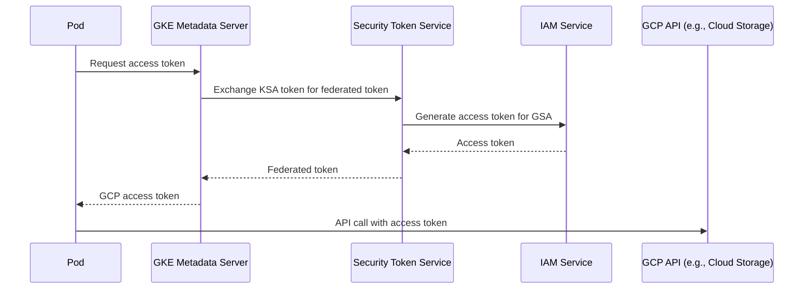

# How to Troubleshoot GKE Workload Identity Federation Token Exchange Failures

Author: [nawazdhandala](https://www.github.com/nawazdhandala)

Tags: GKE, Kubernetes, Workload Identity, IAM, Authentication, Troubleshooting, GCP

Description: Diagnose and fix token exchange failures in GKE Workload Identity Federation, covering service account bindings, annotation mismatches, and metadata server connectivity.

---

Workload Identity is the recommended way for GKE pods to authenticate with GCP services. Instead of managing service account keys, your pods get short-lived tokens automatically. But when the token exchange fails, your application gets cryptic errors like "could not retrieve token" or "403 Forbidden" when calling GCP APIs.

Let's walk through the common failure modes and how to fix each one.

## How Workload Identity Works

The Workload Identity flow involves a token exchange between a Kubernetes service account (KSA) and a GCP service account (GSA):



If any link in this chain is broken, the token exchange fails.

## Step 1 - Verify Workload Identity Is Enabled

First, confirm Workload Identity is enabled on the cluster and node pool:

```bash
# Check if Workload Identity is enabled on the cluster
gcloud container clusters describe your-cluster \
  --zone us-central1-a \
  --format="value(workloadIdentityConfig.workloadPool)"
```

This should return `your-project-id.svc.id.goog`. If it is empty, Workload Identity is not enabled:

```bash
# Enable Workload Identity on the cluster
gcloud container clusters update your-cluster \
  --workload-pool=your-project-id.svc.id.goog \
  --zone us-central1-a
```

Also check that the node pool uses the GKE metadata server:

```bash
# Check node pool metadata configuration
gcloud container node-pools describe default-pool \
  --cluster your-cluster \
  --zone us-central1-a \
  --format="value(config.workloadMetadataConfig.mode)"
```

It should return `GKE_METADATA`. If not:

```bash
# Enable GKE metadata server on the node pool
gcloud container node-pools update default-pool \
  --cluster your-cluster \
  --workload-metadata=GKE_METADATA \
  --zone us-central1-a
```

## Step 2 - Check the KSA to GSA Binding

The Kubernetes service account must be annotated with the GCP service account, and the GCP service account must have an IAM binding allowing the KSA to impersonate it.

Check the KSA annotation:

```bash
# Check the KSA annotation for Workload Identity
kubectl get serviceaccount your-ksa -n your-namespace -o yaml
```

The annotation should look like:

```yaml
apiVersion: v1
kind: ServiceAccount
metadata:
  name: your-ksa
  namespace: your-namespace
  annotations:
    iam.gke.io/gcp-service-account: your-gsa@your-project-id.iam.gserviceaccount.com
```

If the annotation is missing, add it:

```bash
# Annotate the KSA with the target GCP service account
kubectl annotate serviceaccount your-ksa \
  --namespace your-namespace \
  iam.gke.io/gcp-service-account=your-gsa@your-project-id.iam.gserviceaccount.com
```

## Step 3 - Verify the IAM Binding

The GCP service account must have an IAM policy binding that allows the KSA to use it:

```bash
# Check IAM bindings on the GCP service account
gcloud iam service-accounts get-iam-policy \
  your-gsa@your-project-id.iam.gserviceaccount.com \
  --format json
```

Look for a binding with role `roles/iam.workloadIdentityUser` and member `serviceAccount:your-project-id.svc.id.goog[your-namespace/your-ksa]`.

If it is missing:

```bash
# Create the IAM binding to allow the KSA to impersonate the GSA
gcloud iam service-accounts add-iam-policy-binding \
  your-gsa@your-project-id.iam.gserviceaccount.com \
  --role roles/iam.workloadIdentityUser \
  --member "serviceAccount:your-project-id.svc.id.goog[your-namespace/your-ksa]"
```

The member format is critical. It must be exactly:
```
serviceAccount:PROJECT_ID.svc.id.goog[NAMESPACE/KSA_NAME]
```

A typo in any part - project ID, namespace, or KSA name - will cause the binding to not match.

## Step 4 - Verify the Pod Uses the Right Service Account

Check that the pod is actually using the annotated KSA:

```bash
# Check which service account the pod is using
kubectl get pod your-pod -n your-namespace -o jsonpath='{.spec.serviceAccountName}'
```

If it returns `default`, the pod is using the default service account, which likely does not have the Workload Identity annotation. Fix the deployment:

```yaml
# Specify the correct service account in the pod spec
apiVersion: apps/v1
kind: Deployment
metadata:
  name: your-app
spec:
  template:
    spec:
      serviceAccountName: your-ksa  # must match the annotated KSA
      containers:
      - name: app
        image: your-app:latest
```

## Step 5 - Test from Inside the Pod

Run a test from inside the pod to see if token exchange works:

```bash
# Exec into the pod and test the metadata server
kubectl exec -it your-pod -n your-namespace -- sh
```

Inside the pod:

```bash
# Check the identity the pod is using
curl -H "Metadata-Flavor: Google" \
  http://169.254.169.254/computeMetadata/v1/instance/service-accounts/default/email

# Try to get an access token
curl -H "Metadata-Flavor: Google" \
  http://169.254.169.254/computeMetadata/v1/instance/service-accounts/default/token
```

If the email endpoint returns the GCP service account email, the binding is correct. If it returns the node's service account, Workload Identity is not active for this pod.

If the token endpoint returns an error, check the specific error message. Common errors:

- "unable to generate access token" - IAM binding is wrong
- "connection refused" to metadata server - GKE metadata server not enabled on node pool

## Step 6 - Fix Metadata Server Connectivity

The GKE metadata server runs on each node and intercepts calls to 169.254.169.254. If the pod cannot reach it, Workload Identity will not work.

Test connectivity:

```bash
# Test metadata server connectivity from the pod
curl -v -H "Metadata-Flavor: Google" \
  http://169.254.169.254/computeMetadata/v1/
```

If this times out or fails, check:

1. **Network policies** blocking egress to the metadata server IP:

```yaml
# Allow egress to the metadata server in network policies
apiVersion: networking.k8s.io/v1
kind: NetworkPolicy
metadata:
  name: allow-metadata-server
  namespace: your-namespace
spec:
  podSelector: {}
  policyTypes:
  - Egress
  egress:
  - to:
    - ipBlock:
        cidr: 169.254.169.254/32
    ports:
    - protocol: TCP
      port: 80
    - protocol: TCP
      port: 988
```

2. **The node pool is not using GKE_METADATA mode** (checked in Step 1)

3. **Pod is using hostNetwork: true** - Workload Identity does not work with host networking

## Step 7 - Check GSA Permissions

Even if the token exchange succeeds, the GCP service account might not have the right IAM roles for the API you are trying to call:

```bash
# Check what roles the GSA has
gcloud projects get-iam-policy your-project-id \
  --flatten="bindings[].members" \
  --filter="bindings.members:your-gsa@your-project-id.iam.gserviceaccount.com" \
  --format="table(bindings.role)"
```

Grant the necessary roles:

```bash
# Example: grant Cloud Storage access
gcloud projects add-iam-policy-binding your-project-id \
  --member="serviceAccount:your-gsa@your-project-id.iam.gserviceaccount.com" \
  --role="roles/storage.objectViewer"
```

## Step 8 - Handle Propagation Delays

IAM changes can take up to 5-7 minutes to propagate. If you just created the binding and it is not working, wait and retry. Also, existing pods might cache the old token. Restart the pod to force a fresh token:

```bash
# Restart the deployment to pick up new IAM bindings
kubectl rollout restart deployment your-app -n your-namespace
```

## Step 9 - Debug with a Dedicated Test Pod

If you are still stuck, deploy a test pod with the Google Cloud SDK to isolate the problem:

```yaml
# Test pod for debugging Workload Identity
apiVersion: v1
kind: Pod
metadata:
  name: wi-test
  namespace: your-namespace
spec:
  serviceAccountName: your-ksa
  containers:
  - name: test
    image: google/cloud-sdk:slim
    command: ["sleep", "infinity"]
```

Then test from inside:

```bash
kubectl exec -it wi-test -n your-namespace -- bash

# Check which identity gcloud sees
gcloud auth list

# Try a GCP API call
gsutil ls gs://your-bucket/

# Check the token directly
gcloud auth print-access-token
```

## Common Mistakes Checklist

1. KSA annotation has a typo in the GSA email
2. IAM binding member has wrong namespace or KSA name
3. Pod uses `default` service account instead of the annotated one
4. Node pool does not have GKE_METADATA mode enabled
5. Network policy blocks metadata server access
6. GSA exists but lacks permissions for the target API
7. IAM changes have not propagated yet (wait 5-7 minutes)

Workload Identity eliminates the security risk of key files, but the setup has several moving parts that must all align. When things go wrong, work through the chain systematically: cluster config, node pool config, KSA annotation, IAM binding, pod spec, metadata server access, and GSA permissions.
