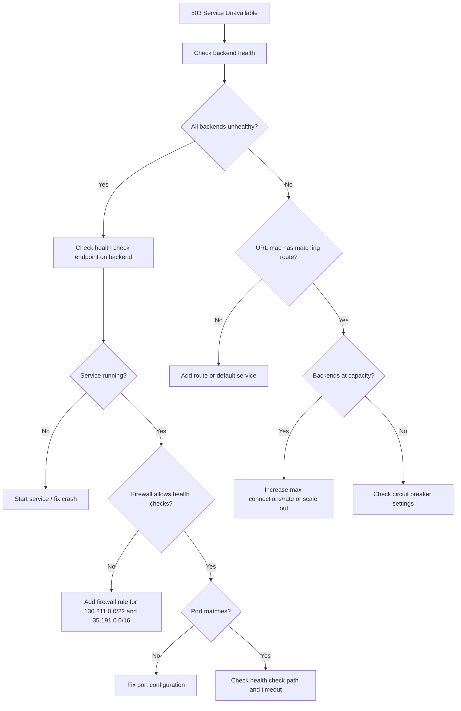

# How to Troubleshoot Google Cloud Load Balancer 503 Backend Service Unavailable Errors

Author: [nawazdhandala](https://www.github.com/nawazdhandala)

Tags: GCP, Load Balancer, 503, Backend Service, Health Checks, Troubleshooting

Description: How to diagnose and resolve 503 Service Unavailable errors from Google Cloud Load Balancers, including backend capacity, health check, and configuration issues.

---

A 503 Service Unavailable from your Google Cloud Load Balancer typically means none of your backends can handle the request. Unlike a 502 (which indicates the backend gave a bad response), a 503 means the load balancer could not even attempt to send the request to a backend. Here is how to find out why and fix it.

## What Causes 503 Errors

The main reasons the load balancer returns 503:

1. All backends are unhealthy
2. All backends are at maximum capacity (connection or rate limits reached)
3. No backends are configured in the backend service
4. The backend service has no instances in the requested region
5. Circuit breaker thresholds have been exceeded
6. The URL map does not have a matching backend for the request

## Step 1: Check Backend Health Status

```bash
# Check health of all backends
gcloud compute backend-services get-health my-backend-service \
    --global \
    --project=my-project
```

The output shows each backend instance and its health status. If everything says `UNHEALTHY`, that is your problem.

```bash
# Get detailed health check configuration
gcloud compute health-checks describe my-health-check \
    --project=my-project \
    --format=json
```

## Step 2: Diagnose Why Backends Are Unhealthy

### Check the Health Check Endpoint

The health check needs to return HTTP 200 within the timeout period.

```bash
# SSH into a backend and test the health check endpoint
gcloud compute ssh my-backend-vm --zone=us-central1-a --project=my-project

# Test the health check endpoint from the backend itself
curl -v -o /dev/null -w "%{http_code}" http://localhost:8080/health

# Check response time (must be under the health check timeout)
curl -w "Total time: %{time_total}s\n" -o /dev/null -s http://localhost:8080/health
```

### Verify the Service Is Running

```bash
# Check if the application process is running
systemctl status my-app

# Check if it is listening on the right port
ss -tlnp | grep 8080

# Check for any crash loops
journalctl -u my-app --since "1 hour ago" | tail -50
```

### Check Firewall Rules for Health Checks

Google Cloud health checks come from specific IP ranges. If your firewall blocks these, health checks will fail.

```bash
# Verify firewall allows health check traffic
gcloud compute firewall-rules list \
    --filter="network=my-vpc AND direction=INGRESS" \
    --format="table(name, sourceRanges, allowed, targetTags)" \
    --project=my-project | grep -E "130.211|35.191"
```

The required source ranges are `130.211.0.0/22` and `35.191.0.0/16`. If no rule allows these:

```bash
# Create firewall rule to allow health check traffic
gcloud compute firewall-rules create allow-health-checks \
    --network=my-vpc \
    --direction=INGRESS \
    --action=ALLOW \
    --rules=tcp:8080 \
    --source-ranges=130.211.0.0/22,35.191.0.0/16 \
    --target-tags=web-backend \
    --project=my-project
```

## Step 3: Check Backend Service Configuration

```bash
# Verify the backend service has backends attached
gcloud compute backend-services describe my-backend-service \
    --global \
    --format="json(backends, healthChecks, port, portName, protocol, capacityScaler)" \
    --project=my-project
```

Common misconfigurations:

### Port Mismatch

The backend service port must match where your application is listening.

```bash
# Check the named port on the instance group
gcloud compute instance-groups managed describe my-ig \
    --zone=us-central1-a \
    --format="json(namedPorts)" \
    --project=my-project

# If the named port is wrong, update it
gcloud compute instance-groups managed set-named-ports my-ig \
    --zone=us-central1-a \
    --named-ports=http:8080 \
    --project=my-project
```

### Protocol Mismatch

If the backend service is configured for HTTPS but your backend only serves HTTP (or vice versa), connections will fail.

```bash
# Check the backend service protocol
gcloud compute backend-services describe my-backend-service \
    --global \
    --format="value(protocol)" \
    --project=my-project

# Update if needed
gcloud compute backend-services update my-backend-service \
    --global \
    --protocol=HTTP \
    --project=my-project
```

### Capacity Scaler Set Too Low

If the capacity scaler is set to 0, no traffic will be sent to that backend.

```bash
# Check capacity scaler for each backend
gcloud compute backend-services describe my-backend-service \
    --global \
    --format="json(backends[].capacityScaler)" \
    --project=my-project
```

## Step 4: Check the URL Map

A 503 can also happen when the URL map does not have a matching route for the requested URL.

```bash
# Check the URL map configuration
gcloud compute url-maps describe my-url-map \
    --global \
    --format=json \
    --project=my-project
```

Look at the `defaultService`, `hostRules`, and `pathMatchers`. If a request does not match any host or path rule and there is no default service, the load balancer returns 503.

```bash
# Make sure a default backend service is configured
gcloud compute url-maps set-default-service my-url-map \
    --default-service=my-backend-service \
    --global \
    --project=my-project
```

## Step 5: Check for Capacity Issues

If backends are healthy but the load balancer is still returning 503, backends might be at capacity.

```bash
# Check the max connections or max rate settings
gcloud compute backend-services describe my-backend-service \
    --global \
    --format="json(backends[].maxConnections, backends[].maxRate, backends[].maxRatePerInstance)" \
    --project=my-project
```

If `maxConnections` or `maxRate` is set too low, the load balancer may reject requests even though backends are healthy.

```bash
# Remove connection limits or increase them
gcloud compute backend-services update-backend my-backend-service \
    --global \
    --instance-group=my-ig \
    --instance-group-zone=us-central1-a \
    --max-rate-per-instance=500 \
    --project=my-project
```

## Step 6: Check Circuit Breaker Settings

If you have circuit breaker policies configured, they might be tripping and causing 503s.

```bash
# Check circuit breaker configuration
gcloud compute backend-services describe my-backend-service \
    --global \
    --format="json(circuitBreakers)" \
    --project=my-project
```

If circuit breakers are too aggressive, increase the thresholds:

```bash
# Update circuit breaker settings via the REST API
gcloud compute backend-services update my-backend-service \
    --global \
    --connection-draining-timeout=300 \
    --project=my-project
```

## Step 7: Check Load Balancer Logs for Details

```bash
# Query logs for 503 errors with status details
gcloud logging read \
    'resource.type="http_load_balancer" AND httpRequest.status=503' \
    --project=my-project \
    --limit=20 \
    --format="json(httpRequest.requestUrl, jsonPayload.statusDetails, jsonPayload)"
```

The `statusDetails` field will tell you the exact reason:

- `backend_connection_closed_after_partial_response_sent` - backend died mid-response
- `backend_early_response_with_non_error_status` - premature response
- `no_healthy_backends` - all backends are down
- `rate_limited` - hit rate limits

## Debugging Flowchart



Most 503 errors come down to either unhealthy backends or missing firewall rules for health checks. Fix those two things first, and you will resolve the majority of cases.
