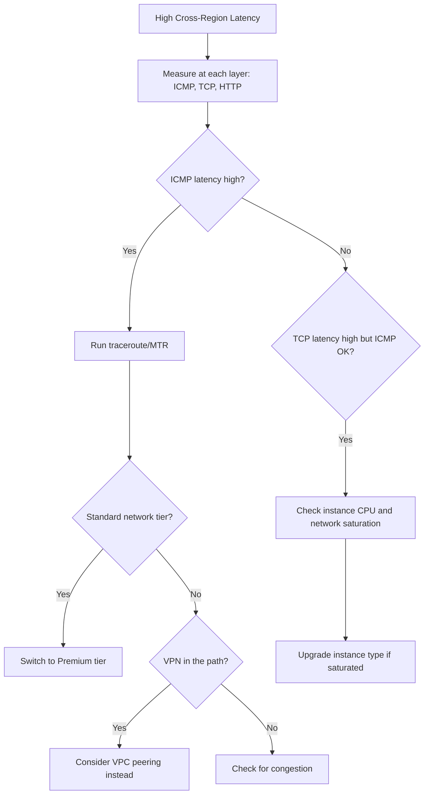

# How to Troubleshoot High Latency Between Compute Engine Instances Across Regions

Author: [nawazdhandala](https://www.github.com/nawazdhandala)

Tags: GCP, Compute Engine, Latency, Networking, Cross-Region, Performance

Description: How to diagnose and reduce high network latency between Google Cloud Compute Engine instances in different regions using practical troubleshooting techniques.

---

Cross-region latency is expected - you are dealing with the speed of light and physical distance between data centers. But when latency is higher than it should be for the distance, or when it suddenly increases, something else is going on. This post covers how to measure, diagnose, and reduce latency between Compute Engine instances in different regions.

## Establishing a Baseline

Before troubleshooting, you need to know what normal looks like. Google publishes expected inter-region latencies, but you should also measure from your own instances.

```bash
# Basic latency test using ping (ICMP)
ping -c 20 10.0.1.50

# More accurate TCP-based latency test using hping3
# Install hping3 first: sudo apt-get install hping3
sudo hping3 -S -p 443 -c 20 10.0.1.50
```

Expected round-trip latencies between common GCP regions:

| Route | Expected RTT |
|-------|-------------|
| us-central1 to us-east1 | 20-30ms |
| us-central1 to europe-west1 | 90-110ms |
| us-central1 to asia-east1 | 140-170ms |
| europe-west1 to asia-east1 | 200-250ms |

If your latency is significantly higher than these baselines, something is adding extra delay.

## Step 1: Measure Latency at Multiple Layers

Network latency has multiple components. Measure each layer separately.

### ICMP Latency (Network Layer)

```bash
# Simple ping test - measures network layer round trip
ping -c 50 -i 0.2 <remote-instance-ip>

# Record the output for analysis
ping -c 100 -i 0.5 <remote-instance-ip> | tee /tmp/ping_results.txt

# Get statistics summary
tail -3 /tmp/ping_results.txt
```

### TCP Connection Latency (Transport Layer)

```bash
# Measure TCP handshake time - often more relevant than ICMP
# This measures the time to establish a TCP connection
curl -o /dev/null -s -w "time_connect: %{time_connect}s\ntime_starttransfer: %{time_starttransfer}s\ntotal: %{time_total}s\n" http://<remote-instance-ip>:8080/health
```

### Application Latency (Full Stack)

```bash
# Measure full HTTP request/response cycle
curl -o /dev/null -s -w "DNS: %{time_namelookup}s\nConnect: %{time_connect}s\nTLS: %{time_appconnect}s\nTTFB: %{time_starttransfer}s\nTotal: %{time_total}s\n" https://<remote-instance-ip>/api/health
```

If TCP latency is much higher than ICMP latency, the issue is likely at the application or load balancer level, not the network.

## Step 2: Run a Traceroute to Find Where Latency Is Added

```bash
# TCP traceroute to see the path and where delays occur
sudo traceroute -T -p 443 -n <remote-instance-ip>

# MTR provides continuous monitoring and is better for intermittent issues
# Install: sudo apt-get install mtr
sudo mtr -n -c 50 --report <remote-instance-ip>
```

MTR output shows you packet loss and latency at each hop. Look for:
- Large latency jumps between specific hops (indicates that hop is adding delay)
- Packet loss at intermediate hops (might indicate congestion)
- Unexpected routing through external networks

## Step 3: Check If Traffic Is Taking an Unexpected Route

Within Google Cloud, traffic between instances should stay on Google's private network. But misconfigurations can cause traffic to exit to the public internet and come back in.

```bash
# Check if the instance is using Premium or Standard network tier
gcloud compute instances describe my-instance \
    --zone=us-central1-a \
    --format="json(networkInterfaces[0].accessConfigs[0].networkTier)" \
    --project=my-project
```

Premium tier routes traffic over Google's private backbone. Standard tier uses the public internet for cross-region traffic, which adds latency.

```bash
# Ensure Premium tier is used (check at the project level)
gcloud compute project-info describe \
    --format="value(defaultNetworkTier)" \
    --project=my-project

# Set to Premium if it is not
gcloud compute project-info update \
    --default-network-tier=PREMIUM \
    --project=my-project
```

## Step 4: Check for VPC Peering or VPN Adding Latency

If your instances are in peered VPCs or connected via Cloud VPN, the extra hop can add latency.

```bash
# Check VPC peering configuration
gcloud compute networks peerings list \
    --network=my-vpc \
    --project=my-project

# Check VPN tunnels
gcloud compute vpn-tunnels list \
    --project=my-project \
    --format="table(name, region, status, peerIp)"
```

VPN tunnels add encryption overhead and route through VPN gateways, which can add 2-10ms of latency. If low latency is critical, consider using VPC peering or Shared VPC instead of VPN.

## Step 5: Check Instance-Level Issues

High CPU or network saturation on either instance can increase latency.

```bash
# Check network throughput on the instance
gcloud monitoring time-series list \
    --filter='resource.type="gce_instance" AND resource.labels.instance_id="1234567890" AND metric.type="compute.googleapis.com/instance/network/sent_bytes_count"' \
    --interval-start-time=$(date -u -v-1H +%Y-%m-%dT%H:%M:%SZ) \
    --format="table(points.value.int64Value, points.interval.endTime)" \
    --project=my-project
```

Check if the instance is hitting its network bandwidth limit. Each machine type has a maximum egress bandwidth:

- e2-small: 1 Gbps
- n2-standard-4: 10 Gbps
- n2-standard-8: 16 Gbps
- n2-standard-16+: 32 Gbps

If you are saturating the network interface, latency will increase significantly.

```bash
# Check CPU utilization - high CPU can cause network processing delays
gcloud monitoring time-series list \
    --filter='resource.type="gce_instance" AND resource.labels.instance_id="1234567890" AND metric.type="compute.googleapis.com/instance/cpu/utilization"' \
    --interval-start-time=$(date -u -v-1H +%Y-%m-%dT%H:%M:%SZ) \
    --format="table(points.value.doubleValue)" \
    --project=my-project
```

## Step 6: Optimize for Low Latency

### Use Placement Proximity for Same-Region Instances

If both instances can be in the same region, use placement policies:

```bash
# Create a compact placement policy
gcloud compute resource-policies create group-placement low-latency-policy \
    --collocation=COLLOCATED \
    --region=us-central1 \
    --project=my-project
```

### Enable Jumbo Frames

VPC networks support MTU up to 8896 bytes. Larger MTU reduces packet overhead and can improve throughput and latency for large transfers.

```bash
# Update VPC MTU to use jumbo frames
gcloud compute networks update my-vpc \
    --mtu=8896 \
    --project=my-project
```

Make sure both the source and destination instances are in the same VPC or peered VPCs that both support the larger MTU.

### Use gRPC Instead of REST

For application-level communication, gRPC with HTTP/2 multiplexing can reduce latency compared to REST over HTTP/1.1 because it reuses connections and sends smaller payloads.

### Use TCP Keepalive Tuning

Long-lived connections between regions benefit from tuned TCP settings:

```bash
# On the Compute Engine instance, tune TCP keepalive
# These settings detect dead connections faster
sudo sysctl -w net.ipv4.tcp_keepalive_time=60
sudo sysctl -w net.ipv4.tcp_keepalive_intvl=10
sudo sysctl -w net.ipv4.tcp_keepalive_probes=5
```

## Continuous Monitoring

Set up a synthetic monitoring probe to track cross-region latency over time:

```bash
# Use Cloud Monitoring uptime checks for continuous latency measurement
gcloud monitoring uptime create my-latency-check \
    --display-name="Cross-region latency check" \
    --resource-type=gce-instance \
    --resource-labels="project_id=my-project,instance_id=1234567890,zone=europe-west1-b" \
    --protocol=TCP \
    --port=443 \
    --timeout=10s \
    --period=60s \
    --project=my-project
```



Cross-region latency will always exist, but it should be predictable. When it is not, the problem is usually the network tier, routing through a VPN, or instance-level resource exhaustion. Start by establishing your baseline, then work through each layer to find where the extra latency is being added.
