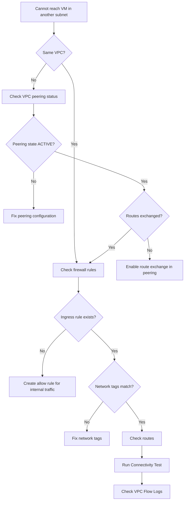

# How to Troubleshoot Network Connectivity Issues Between GCP VPC Subnets

Author: [nawazdhandala](https://www.github.com/nawazdhandala)

Tags: GCP, VPC, Networking, Firewall Rules, Troubleshooting

Description: A detailed guide to troubleshooting network connectivity issues between Google Cloud VPC subnets, covering firewall rules, routes, VPC peering, and diagnostic tools.

---

Network connectivity problems between VPC subnets in GCP can be maddening to debug. Everything looks correct in the configuration, but packets just are not getting through. The issue is usually one of three things: firewall rules, routing, or VPC peering misconfiguration. Let me walk through a systematic debugging approach.

## Start with the Symptoms

Before diving into configurations, document what exactly is failing. Can you ping? Can you reach a specific port? Is it one direction or both? These details narrow down the cause significantly.

```bash
# From a VM in subnet-a, test connectivity to a VM in subnet-b
# First, test basic ICMP (ping)
ping -c 4 10.0.2.5

# Test a specific TCP port
nc -zv 10.0.2.5 8080

# Test with a timeout to avoid hanging
timeout 5 bash -c 'echo > /dev/tcp/10.0.2.5/8080' && echo "Port open" || echo "Port closed"
```

## Step 1: Check Firewall Rules

Firewall rules are the number one cause of connectivity issues between subnets. GCP firewalls are stateful and operate at the VPC level, not the subnet level.

Every VPC has two implied rules:
- An implied allow for egress to any destination
- An implied deny for ingress from any source

If you have not created explicit ingress allow rules, traffic between subnets will be blocked.

```bash
# List all firewall rules for your VPC network
gcloud compute firewall-rules list \
    --filter="network:my-vpc" \
    --format="table(name, direction, allowed, sourceRanges, targetTags)"
```

Check if there is a rule that allows traffic between your subnets:

```bash
# Check for rules that would allow traffic from subnet-a (10.0.1.0/24)
# to subnet-b (10.0.2.0/24)
gcloud compute firewall-rules list \
    --filter="network:my-vpc AND direction=INGRESS" \
    --format="table(name, allowed, sourceRanges, sourceTags, targetTags)"
```

If no rule allows the traffic, create one:

```bash
# Create a firewall rule allowing internal traffic between subnets
# This allows all protocols between the two subnet CIDR ranges
gcloud compute firewall-rules create allow-internal \
    --network=my-vpc \
    --direction=INGRESS \
    --action=ALLOW \
    --rules=all \
    --source-ranges=10.0.1.0/24,10.0.2.0/24
```

For more targeted rules, specify ports and protocols:

```bash
# Allow only specific ports between subnets
gcloud compute firewall-rules create allow-app-traffic \
    --network=my-vpc \
    --direction=INGRESS \
    --action=ALLOW \
    --rules=tcp:8080,tcp:443,icmp \
    --source-ranges=10.0.1.0/24 \
    --target-tags=app-server
```

## Step 2: Check Routes

Within a single VPC, GCP automatically creates subnet routes so that traffic between subnets is routed correctly. But custom routes or route priorities can override this behavior.

```bash
# List all routes in the VPC
gcloud compute routes list \
    --filter="network:my-vpc" \
    --format="table(name, destRange, nextHopGateway, nextHopInstance, nextHopIp, priority)"
```

Look for:
- Missing subnet routes (these should exist automatically)
- Custom routes with a higher priority that might be diverting traffic
- Routes pointing to a network appliance that might be dropping packets

```bash
# Check if specific subnet routes exist
gcloud compute routes list \
    --filter="network:my-vpc AND destRange=10.0.2.0/24" \
    --format="table(name, destRange, nextHopGateway, priority)"
```

## Step 3: Verify VPC Peering (If Applicable)

If your subnets are in different VPCs connected via VPC peering, additional checks are needed.

```bash
# List VPC peering connections
gcloud compute networks peerings list \
    --network=my-vpc \
    --format="table(name, network, state, exchangeSubnetRoutes)"
```

Key things to verify in peering:
- The peering state should be ACTIVE
- `exchangeSubnetRoutes` should be true
- Both sides of the peering must be configured

```bash
# Check peering details for route exchange
gcloud compute networks peerings list \
    --network=my-vpc \
    --format="yaml"
```

If routes are not being exchanged, update the peering:

```bash
# Update peering to export and import custom routes
gcloud compute networks peerings update my-peering \
    --network=my-vpc \
    --export-custom-routes \
    --import-custom-routes
```

## Step 4: Use Connectivity Tests

GCP has a built-in Network Intelligence tool called Connectivity Tests that traces the path between two endpoints and tells you exactly where traffic is being dropped.

```bash
# Create a connectivity test between two VMs
gcloud network-management connectivity-tests create my-test \
    --source-instance=projects/my-project/zones/us-central1-a/instances/vm-a \
    --source-ip-address=10.0.1.5 \
    --destination-instance=projects/my-project/zones/us-central1-b/instances/vm-b \
    --destination-ip-address=10.0.2.5 \
    --destination-port=8080 \
    --protocol=TCP

# Check the test results
gcloud network-management connectivity-tests describe my-test \
    --format="yaml(reachabilityDetails)"
```

The test result tells you:
- Whether the path is reachable, unreachable, or ambiguous
- Which firewall rule is blocking (if any)
- Which route is being used
- If there is a VPC peering issue

## Step 5: Check VPC Flow Logs

If you have VPC Flow Logs enabled, they show you actual traffic patterns and can reveal what is happening to your packets:

```bash
# Enable flow logs on a subnet (if not already enabled)
gcloud compute networks subnets update subnet-a \
    --region=us-central1 \
    --enable-flow-logs \
    --logging-flow-log-interval=INTERVAL_5_SEC

# Query flow logs in Cloud Logging
gcloud logging read \
    'resource.type="gce_subnetwork" AND jsonPayload.connection.dest_ip="10.0.2.5"' \
    --project=my-project \
    --limit=10 \
    --format="table(jsonPayload.connection.src_ip, jsonPayload.connection.dest_ip, jsonPayload.connection.dest_port, jsonPayload.disposition)"
```

The `disposition` field in flow logs tells you whether traffic was ALLOWED or DENIED.

## Step 6: Check for Network Tags Mismatch

Firewall rules can target VMs using network tags. If your firewall rule specifies a target tag but the VM does not have that tag, the rule will not apply.

```bash
# Check tags on a VM
gcloud compute instances describe vm-b \
    --zone=us-central1-b \
    --format="value(tags.items)"

# Check which firewall rules target a specific tag
gcloud compute firewall-rules list \
    --filter="targetTags:app-server" \
    --format="table(name, allowed, sourceRanges)"
```

Add the missing tag if needed:

```bash
# Add a network tag to a VM
gcloud compute instances add-tags vm-b \
    --zone=us-central1-b \
    --tags=app-server
```

## Debugging Flowchart



## Common Gotchas

A few things that consistently catch people:

1. **Default deny on ingress** - Unlike some other cloud providers, GCP does not automatically allow traffic between subnets in the same VPC. You need explicit firewall rules.
2. **Firewall rule priority** - Lower numbers mean higher priority. A deny rule with priority 100 will override an allow rule with priority 1000.
3. **Hierarchical firewall policies** - Organization or folder-level firewall policies can override project-level rules.
4. **Private Google Access** - If a VM has no external IP, it cannot reach Google APIs unless Private Google Access is enabled on the subnet.

Always work through these checks systematically. Network debugging is tedious but methodical - if you check firewall rules, routes, peering, and tags in order, you will find the issue.
