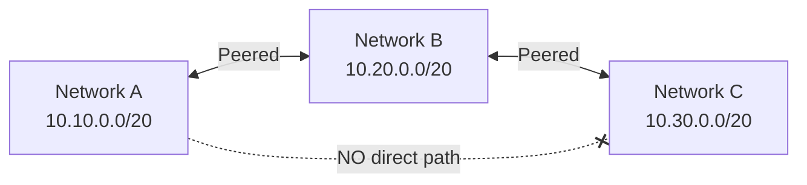

# How to Troubleshoot Non-Transitive Routing Issues with VPC Peering in GCP

Author: [nawazdhandala](https://www.github.com/nawazdhandala)

Tags: GCP, VPC Peering, Networking, Troubleshooting, Routing

Description: Understand why VPC peering in GCP is non-transitive and learn practical solutions for achieving multi-network connectivity when direct peering between all networks is not feasible.

---

You have three VPC networks: A, B, and C. Network A is peered with Network B, and Network B is peered with Network C. You expect VMs in Network A to reach VMs in Network C through Network B. But they cannot. Traffic from A destined for C's subnets gets dropped, even though B can reach both A and C just fine.

This is the non-transitive nature of VPC peering in GCP. It catches many engineers off guard, and working around it requires understanding why it exists and what your options are.

## Why VPC Peering Is Non-Transitive

When you peer Network A with Network B, GCP exchanges subnet routes between the two networks. VMs in A get routes to B's subnets, and VMs in B get routes to A's subnets. But B does not advertise A's routes to C, and it does not advertise C's routes to A.



This is by design. Transitive routing would mean that peering with one network could unexpectedly give you access to every other network it peers with. From a security perspective, that would be dangerous - you could end up with connectivity to networks you do not control or even know about.

## Diagnosing the Problem

When VMs in Network A cannot reach VMs in Network C, verify that the issue is actually non-transitive routing:

```bash
# Check routes in Network A - you should NOT see routes to Network C's subnets
gcloud compute routes list \
  --project=project-a \
  --filter="network=network-a" \
  --format="table(name, destRange, nextHopPeering, nextHopGateway)"
```

If you only see routes for Network B's subnets (10.20.0.0/20) and no routes for Network C (10.30.0.0/20), the issue is confirmed as non-transitive peering.

Run a connectivity test to confirm:

```bash
# Test connectivity from a VM in Network A to a VM in Network C
gcloud network-management connectivity-tests create test-a-to-c \
  --source-instance=projects/project-a/zones/us-central1-a/instances/vm-a \
  --destination-instance=projects/project-c/zones/us-central1-a/instances/vm-c \
  --protocol=TCP \
  --destination-port=80
```

The test result will likely show "No route found" for the destination.

## Solution 1: Direct Peering Between All Networks

The simplest fix is to create direct peering between every pair of networks that needs to communicate. For three networks, that means three peering connections:

```bash
# Peer A with B (already done)
# Peer B with C (already done)

# Add direct peering between A and C
gcloud compute networks peerings create peer-a-to-c \
  --project=project-a \
  --network=network-a \
  --peer-project=project-c \
  --peer-network=network-c

gcloud compute networks peerings create peer-c-to-a \
  --project=project-c \
  --network=network-c \
  --peer-project=project-a \
  --peer-network=network-a
```

This works for small numbers of networks, but the number of peering connections grows quadratically. For N networks, you need N*(N-1)/2 peering pairs:

| Networks | Peering Connections Needed |
|----------|--------------------------|
| 3 | 3 |
| 5 | 10 |
| 10 | 45 |
| 20 | 190 |

With a default limit of 25 peerings per network, full mesh becomes impractical beyond a handful of networks.

## Solution 2: Hub-and-Spoke with a Proxy VM

Place a VM with IP forwarding in the hub network (B) that acts as a router between spoke networks:

```bash
# Create a router VM in Network B with IP forwarding enabled
gcloud compute instances create router-vm \
  --project=project-b \
  --zone=us-central1-a \
  --machine-type=e2-standard-2 \
  --subnet=subnet-b \
  --can-ip-forward \
  --image-family=debian-12 \
  --image-project=debian-cloud
```

Configure the router VM to forward traffic:

```bash
# SSH into the router VM and enable IP forwarding
gcloud compute ssh router-vm --project=project-b --zone=us-central1-a

# Enable IP forwarding in the kernel
sudo sysctl -w net.ipv4.ip_forward=1
echo "net.ipv4.ip_forward=1" | sudo tee -a /etc/sysctl.conf

# Set up iptables to forward traffic between networks
sudo iptables -A FORWARD -i eth0 -o eth0 -j ACCEPT
```

Then create custom routes in Networks A and C pointing to the router VM:

```bash
# In Network A: route traffic for Network C through the router VM
gcloud compute routes create route-a-to-c-via-router \
  --project=project-a \
  --network=network-a \
  --destination-range=10.30.0.0/20 \
  --next-hop-address=10.20.0.X \
  --priority=800
```

```bash
# In Network C: route traffic for Network A through the router VM
gcloud compute routes create route-c-to-a-via-router \
  --project=project-c \
  --network=network-c \
  --destination-range=10.10.0.0/20 \
  --next-hop-address=10.20.0.X \
  --priority=800
```

Wait - this does not actually work. Custom routes with a next-hop in a peered network are not followed when the next-hop IP belongs to a different network. You would need the router VM to have network interfaces in all three networks.

## Solution 2b: Multi-NIC Router VM

Create a VM with network interfaces in multiple VPCs:

```bash
# Create a multi-NIC VM that bridges Network A, B, and C
gcloud compute instances create multi-nic-router \
  --project=project-b \
  --zone=us-central1-a \
  --machine-type=e2-standard-4 \
  --network-interface=network=network-a,subnet=subnet-a \
  --network-interface=network=network-b,subnet=subnet-b \
  --network-interface=network=network-c,subnet=subnet-c \
  --can-ip-forward \
  --image-family=debian-12 \
  --image-project=debian-cloud
```

Then add routes in each network pointing to the router's interface in that network:

```bash
# In Network A: route to Network C via the router's NIC in Network A
gcloud compute routes create a-to-c-via-router \
  --project=project-a \
  --network=network-a \
  --destination-range=10.30.0.0/20 \
  --next-hop-instance=multi-nic-router \
  --next-hop-instance-zone=us-central1-a \
  --priority=800

# In Network C: route to Network A via the router's NIC in Network C
gcloud compute routes create c-to-a-via-router \
  --project=project-c \
  --network=network-c \
  --destination-range=10.10.0.0/20 \
  --next-hop-instance=multi-nic-router \
  --next-hop-instance-zone=us-central1-a \
  --priority=800
```

This approach works but introduces a single point of failure and a bandwidth bottleneck.

## Solution 3: Network Connectivity Center

For a managed solution, use Network Connectivity Center (NCC) with a hub-and-spoke topology:

```bash
# Create a Network Connectivity Center hub
gcloud network-connectivity hubs create transit-hub \
  --description="Hub for connecting spoke VPCs"

# Add VPC spokes
gcloud network-connectivity spokes linked-vpc-network create spoke-a \
  --hub=transit-hub \
  --vpc-network=projects/project-a/global/networks/network-a \
  --location=global

gcloud network-connectivity spokes linked-vpc-network create spoke-c \
  --hub=transit-hub \
  --vpc-network=projects/project-c/global/networks/network-c \
  --location=global
```

NCC handles the route exchange between spoke networks, providing transitive connectivity without manual routing.

## Solution 4: HA VPN Between Non-Adjacent Networks

For networks that cannot be directly peered (overlapping ranges with intermediate networks), use HA VPN:

```bash
# Create HA VPN gateways in both networks
gcloud compute vpn-gateways create vpn-gw-a \
  --project=project-a \
  --network=network-a \
  --region=us-central1

gcloud compute vpn-gateways create vpn-gw-c \
  --project=project-c \
  --network=network-c \
  --region=us-central1
```

HA VPN with Cloud Router provides dynamic route exchange via BGP, giving you transitive-like connectivity.

## Choosing the Right Solution

| Approach | Complexity | Scalability | Cost | SLA |
|----------|-----------|-------------|------|-----|
| Full mesh peering | Low | Low (25 limit) | Free | Built-in |
| Multi-NIC router VM | Medium | Low | VM costs | Self-managed |
| Network Connectivity Center | Low | High | NCC pricing | Google-managed |
| HA VPN | Medium | Medium | VPN pricing | 99.99% |

For most organizations, Network Connectivity Center is the best option for connecting more than a handful of networks. For simple three-network setups, direct peering between all pairs is the easiest.

## Wrapping Up

Non-transitive peering is not a bug - it is a security feature. Understanding this constraint early in your network design saves you from hitting dead ends later. Plan your connectivity topology before creating VPCs, and choose the right approach based on how many networks you need to connect and how much operational overhead you are willing to manage. If you find yourself building increasingly complex workarounds for transitive routing, it might be time to consolidate networks or adopt Network Connectivity Center.
