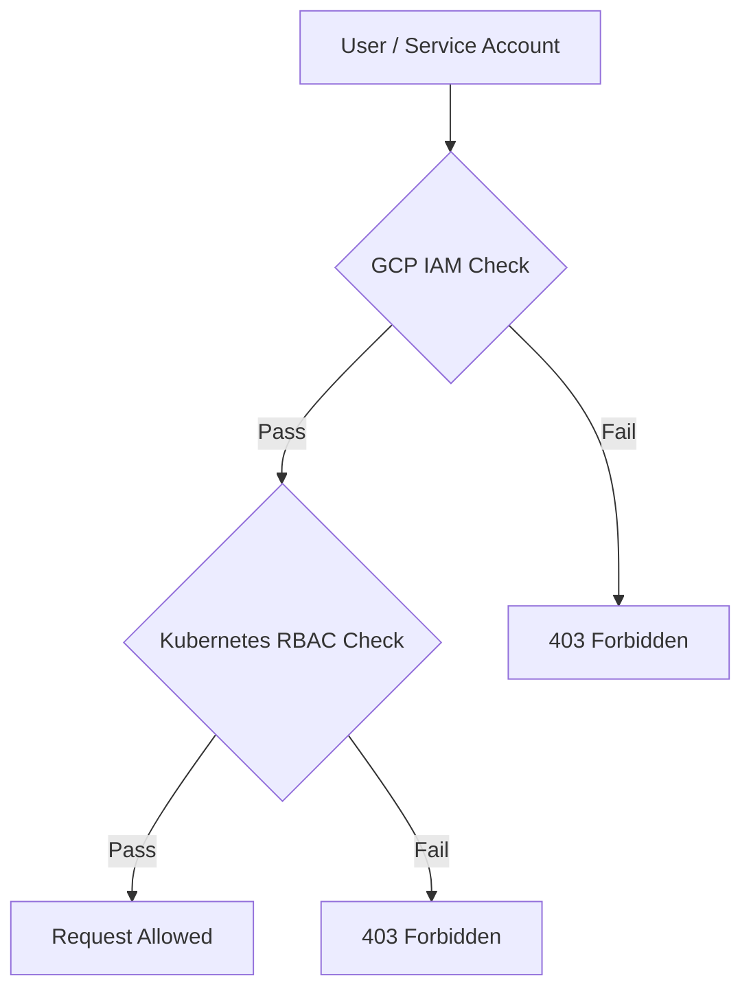

# How to Troubleshoot RBAC Access Denied Errors in GKE Clusters

Author: [nawazdhandala](https://www.github.com/nawazdhandala)

Tags: GKE, Kubernetes, RBAC, Access Control, Security, Troubleshooting, GCP

Description: A practical guide to diagnosing and resolving RBAC permission denied errors in GKE clusters, covering role bindings, service accounts, and IAM integration.

---

You run a kubectl command and get hit with "Error from server (Forbidden): pods is forbidden: User cannot list resource pods in API group in the namespace." RBAC errors are one of the most common stumbling blocks in GKE, and the error messages can be misleading about what is actually wrong.

Let's work through how to diagnose RBAC issues and set up the right permissions.

## How RBAC Works in GKE

GKE uses two layers of authorization. Your request must pass both:



1. **GCP IAM** - Determines if you can access the GKE API at all. You need at minimum the `container.clusters.get` permission (typically via the `roles/container.clusterViewer` role).

2. **Kubernetes RBAC** - Determines what you can do within the cluster. This is where Roles, ClusterRoles, RoleBindings, and ClusterRoleBindings come in.

A common source of confusion is that you can have the right IAM permissions but wrong RBAC permissions, or vice versa.

## Step 1 - Identify the Failing User or Service Account

First, figure out who is making the request. The error message usually includes the identity:

```
User "user@example.com" cannot list resource "pods" in API group "" in the namespace "production"
```

Or for a Kubernetes service account:

```
User "system:serviceaccount:default:my-app" cannot get resource "secrets" in API group "" in the namespace "default"
```

If you are not sure what identity kubectl is using:

```bash
# Check which identity kubectl is using
kubectl auth whoami

# Or check the kubeconfig
kubectl config view --minify -o jsonpath='{.users[0].name}'
```

## Step 2 - Test Permissions Explicitly

Use `kubectl auth can-i` to test specific permissions:

```bash
# Test if the current user can list pods in a namespace
kubectl auth can-i list pods -n production

# Test for a specific service account
kubectl auth can-i list pods -n production \
  --as=system:serviceaccount:default:my-app

# Test all permissions in a namespace
kubectl auth can-i --list -n production
```

This tells you definitively whether the permission is granted before you start digging into role bindings.

## Step 3 - Check Existing Role Bindings

Look at what RBAC bindings exist for the user or service account:

```bash
# Find all ClusterRoleBindings for a specific user
kubectl get clusterrolebindings -o json | \
  python3 -c "
import json, sys
data = json.load(sys.stdin)
for item in data['items']:
    for subject in item.get('spec', {}).get('subjects', []) or item.get('subjects', []):
        if 'user@example.com' in str(subject):
            print(f\"{item['metadata']['name']} -> {item['roleRef']['name']}\")
"
```

```bash
# Find RoleBindings in a specific namespace
kubectl get rolebindings -n production -o wide
```

If there are no bindings for the user, that is your problem. The user has no permissions in that namespace.

## Step 4 - Create the Right Role and Binding

For a user who needs to view resources in a specific namespace:

```yaml
# Role granting read access to common resources in a namespace
apiVersion: rbac.authorization.k8s.io/v1
kind: Role
metadata:
  name: namespace-viewer
  namespace: production
rules:
- apiGroups: [""]
  resources: ["pods", "services", "configmaps", "secrets", "endpoints"]
  verbs: ["get", "list", "watch"]
- apiGroups: ["apps"]
  resources: ["deployments", "replicasets", "statefulsets", "daemonsets"]
  verbs: ["get", "list", "watch"]
- apiGroups: ["batch"]
  resources: ["jobs", "cronjobs"]
  verbs: ["get", "list", "watch"]
---
# Bind the role to the user
apiVersion: rbac.authorization.k8s.io/v1
kind: RoleBinding
metadata:
  name: viewer-binding
  namespace: production
subjects:
- kind: User
  name: user@example.com
  apiGroup: rbac.authorization.k8s.io
roleRef:
  kind: Role
  name: namespace-viewer
  apiGroup: rbac.authorization.k8s.io
```

For broader access across all namespaces, use a ClusterRole and ClusterRoleBinding:

```yaml
# ClusterRoleBinding for cluster-wide view access
apiVersion: rbac.authorization.k8s.io/v1
kind: ClusterRoleBinding
metadata:
  name: cluster-viewer-binding
subjects:
- kind: User
  name: user@example.com
  apiGroup: rbac.authorization.k8s.io
roleRef:
  kind: ClusterRole
  name: view  # built-in ClusterRole that grants read-only access
  apiGroup: rbac.authorization.k8s.io
```

Kubernetes ships with several built-in ClusterRoles: `view`, `edit`, `admin`, and `cluster-admin`. Use these when possible instead of creating custom roles.

## Step 5 - Fix Service Account Permissions

For pods that need to interact with the Kubernetes API (like operators, controllers, or CI/CD tools), you need to set up service account RBAC:

```yaml
# Service account with specific permissions
apiVersion: v1
kind: ServiceAccount
metadata:
  name: deployment-manager
  namespace: production
---
# Role allowing the service account to manage deployments
apiVersion: rbac.authorization.k8s.io/v1
kind: Role
metadata:
  name: deployment-manager-role
  namespace: production
rules:
- apiGroups: ["apps"]
  resources: ["deployments"]
  verbs: ["get", "list", "watch", "create", "update", "patch"]
- apiGroups: [""]
  resources: ["pods"]
  verbs: ["get", "list", "watch"]
---
# Bind the role to the service account
apiVersion: rbac.authorization.k8s.io/v1
kind: RoleBinding
metadata:
  name: deployment-manager-binding
  namespace: production
subjects:
- kind: ServiceAccount
  name: deployment-manager
  namespace: production
roleRef:
  kind: Role
  name: deployment-manager-role
  apiGroup: rbac.authorization.k8s.io
```

Then reference the service account in your pod:

```yaml
# Pod using the custom service account
apiVersion: v1
kind: Pod
metadata:
  name: deployer
  namespace: production
spec:
  serviceAccountName: deployment-manager
  containers:
  - name: deployer
    image: bitnami/kubectl
    command: ["sleep", "infinity"]
```

## Step 6 - Fix GCP IAM Issues

If the error occurs before you even get to RBAC (like "unable to connect to the server"), the problem might be at the IAM level. Check the user's IAM roles:

```bash
# Check IAM bindings for the project
gcloud projects get-iam-policy your-project-id \
  --flatten="bindings[].members" \
  --filter="bindings.members:user@example.com" \
  --format="table(bindings.role)"
```

Minimum IAM roles needed to access GKE:
- `roles/container.clusterViewer` - to get cluster credentials
- `roles/container.viewer` - to view GKE resources in Console

For developers who need to deploy:
- `roles/container.developer` - full access to Kubernetes API objects

```bash
# Grant the container developer role
gcloud projects add-iam-policy-binding your-project-id \
  --member="user:user@example.com" \
  --role="roles/container.developer"
```

Note that `roles/container.admin` grants cluster-admin equivalent permissions, which bypasses RBAC entirely. Use this sparingly.

## Step 7 - Debug with Audit Logs

For tricky cases where you cannot figure out why access is denied, check the GKE audit logs:

```bash
# Search audit logs for RBAC denials
gcloud logging read 'resource.type="k8s_cluster" AND protoPayload.status.code=403' \
  --limit 20 \
  --format json \
  --project your-project-id
```

The audit logs show the exact request that was denied, including the user, the resource, and the verb. This is invaluable when the kubectl error message is vague.

## Step 8 - Handle GKE-Specific RBAC Gotchas

A few GKE-specific issues that catch people:

**Google Groups for RBAC**: If you want to manage RBAC via Google Groups, enable the feature on the cluster:

```bash
# Enable Google Groups for RBAC
gcloud container clusters update your-cluster \
  --enable-managed-config-connector-identity \
  --security-group="gke-security-groups@yourdomain.com" \
  --zone us-central1-a
```

**Default service account**: Pods use the `default` service account in their namespace if none is specified. This account has no permissions by default. Always create and specify a dedicated service account.

**Workload Identity**: When using Workload Identity, the Kubernetes service account is mapped to a GCP service account. RBAC controls what the pod can do in Kubernetes, while IAM controls what it can do in GCP. Both need to be configured.

```bash
# Check Workload Identity mapping
kubectl get serviceaccount my-ksa -n my-namespace -o yaml | grep iam.gke.io
```

## Quick Reference

Common RBAC combinations for different team roles:

| Team Role | ClusterRole | Scope |
|-----------|------------|-------|
| Observer | view | Namespace |
| Developer | edit | Namespace |
| Namespace Admin | admin | Namespace |
| Cluster Admin | cluster-admin | Cluster |
| CI/CD Pipeline | Custom (deploy only) | Namespace |

Start with the least privilege needed and add permissions as required. The built-in ClusterRoles cover most use cases, so check those before creating custom roles.
