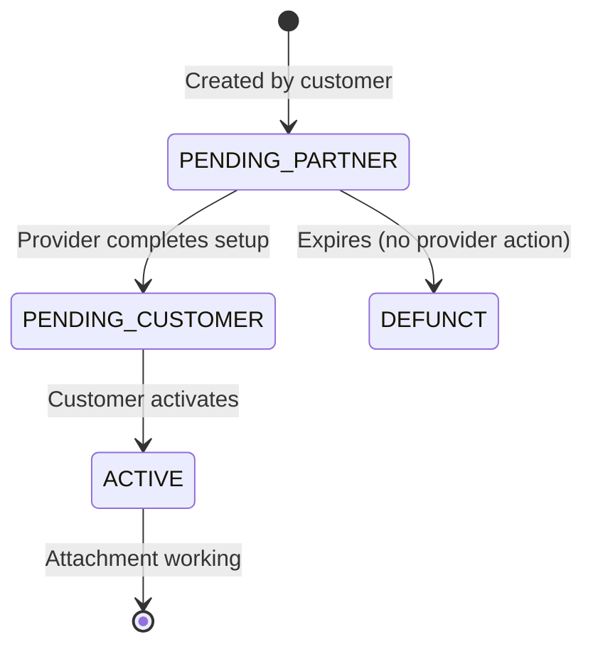

# How to Troubleshoot VLAN Attachment Stuck in PENDING_PARTNER State in GCP

Author: [nawazdhandala](https://www.github.com/nawazdhandala)

Tags: GCP, Cloud Interconnect, VLAN Attachment, Partner Interconnect, Troubleshooting

Description: How to diagnose and resolve the common issue of VLAN attachments getting stuck in PENDING_PARTNER state when setting up Partner Interconnect in GCP.

---

You have created your Partner Interconnect VLAN attachment in GCP, given the pairing key to your service provider, and now you are waiting. The attachment state shows PENDING_PARTNER, and it has been there for way too long. This is one of the most common frustrations with Partner Interconnect setup, and it has several possible causes.

In this post, I will walk through the systematic troubleshooting steps to get your VLAN attachment unstuck and into an active state.

## Understanding the VLAN Attachment States

Before diving into troubleshooting, let us understand the lifecycle of a Partner Interconnect VLAN attachment:



- **PENDING_PARTNER**: You created the attachment and are waiting for the service provider to complete their side.
- **PENDING_CUSTOMER**: The provider has done their part. Now you need to activate the attachment.
- **ACTIVE**: Both sides are configured and the attachment is operational.
- **DEFUNCT**: The attachment expired because the provider never completed the setup (typically after 14 days).

If you are stuck at PENDING_PARTNER, the provider has not yet finished their configuration.

## Step 1: Verify the Attachment Details

First, confirm the attachment exists and check its current state:

```bash
# Check the attachment state and details
gcloud compute interconnects attachments describe my-partner-attachment \
    --region=us-east4 \
    --format="yaml(name, state, pairingKey, edgeAvailabilityDomain, type, creationTimestamp)"
```

Make sure:
- The state is indeed `PENDING_PARTNER`
- Note the creation timestamp (attachments expire after approximately 14 days in this state)
- The edge availability domain is what you intended

## Step 2: Verify the Pairing Key

The pairing key is the critical piece of information that links your GCP attachment to the provider's configuration. Verify you have the correct one:

```bash
# Get the pairing key
gcloud compute interconnects attachments describe my-partner-attachment \
    --region=us-east4 \
    --format="value(pairingKey)"
```

The pairing key format looks like:
```
a]7e51371e-72a3-40b5-b844-2e3efefaee59/us-east4/1
```

Common pairing key issues:

- **Typos**: The key is long and easy to transcribe incorrectly. Copy and paste it - do not retype it.
- **Wrong key**: If you created multiple attachments, make sure you sent the right key for the right attachment.
- **Expired key**: If too much time has passed, the pairing key may have expired. You would need to delete and recreate the attachment.

## Step 3: Contact the Service Provider

Nine times out of ten, the fix involves the service provider. Here is what to communicate to them:

1. **The exact pairing key** - send it in plain text, not a screenshot
2. **The region** - e.g., us-east4
3. **The edge availability domain** - e.g., availability-domain-1
4. **When you created the attachment** - so they can check their logs

Ask the provider these questions:

- Did they receive and process the pairing key?
- Did their system report any errors when trying to provision?
- Is there a pending order on their side that needs approval?
- Is their connection to Google in the correct metro/facility active?

## Step 4: Check for Common Provider-Side Issues

Based on experience, here are the most frequent reasons a provider cannot complete the pairing:

### Wrong Metro or Region

The provider might be trying to provision in a different metro than where your attachment is. The pairing key includes the region, so a mismatch will not work. If you need `us-east4` (Northern Virginia), the provider must have connectivity to a Google edge in that metro.

### Provider Capacity Issues

The provider might not have available capacity on their connection to Google. This is more common with smaller providers or during periods of high demand. They may need to provision additional capacity or move you to a different port.

### Edge Availability Domain Mismatch

If you specified a particular edge availability domain, the provider must provision on a connection that reaches that domain. If they only have connectivity to domain 1 and your attachment requires domain 2, it will not work.

### Order Not Processed

Many providers have an order management system. The pairing key request might be queued, pending internal approval, or stuck in a workflow. Ask them to check their order status.

## Step 5: Check the GCP Side

While most issues are on the provider side, verify these things on your end:

```bash
# Verify the Cloud Router exists and is healthy
gcloud compute routers describe my-router \
    --region=us-east4 \
    --format="yaml(name, network, bgp)"

# Verify the VPC network is properly configured
gcloud compute networks describe my-vpc \
    --format="yaml(name, routingConfig)"

# Check if there are any organization policy constraints
gcloud resource-manager org-policies list \
    --project=my-project \
    --format="table(constraint, listPolicy)"
```

Organization policies might restrict which regions or services can be used, potentially blocking the partner from completing the connection.

## Step 6: Check for Quota Issues

Verify you have not hit any quotas:

```bash
# Check Interconnect-related quotas
gcloud compute project-info describe \
    --format="yaml(quotas)" | grep -i interconnect
```

If you have hit the quota for VLAN attachments, the creation might have succeeded on the GCP side but the pairing process could be affected.

## Step 7: Delete and Recreate (If Needed)

If the attachment has been stuck for more than a week and the provider confirms they cannot pair with the current key, delete it and start fresh:

```bash
# Delete the stuck attachment
gcloud compute interconnects attachments delete my-partner-attachment \
    --region=us-east4

# Recreate it
gcloud compute interconnects attachments partner create my-partner-attachment \
    --router=my-router \
    --region=us-east4 \
    --edge-availability-domain=availability-domain-1

# Get the new pairing key
gcloud compute interconnects attachments describe my-partner-attachment \
    --region=us-east4 \
    --format="value(pairingKey)"
```

Send the new pairing key to the provider.

## Step 8: After the Provider Completes (PENDING_CUSTOMER)

Once the provider successfully pairs, the state changes to PENDING_CUSTOMER. Now you need to activate:

```bash
# Check that state is now PENDING_CUSTOMER
gcloud compute interconnects attachments describe my-partner-attachment \
    --region=us-east4 \
    --format="value(state)"

# Verify the provider metadata looks correct
gcloud compute interconnects attachments describe my-partner-attachment \
    --region=us-east4 \
    --format="yaml(partnerMetadata)"

# Activate the attachment
gcloud compute interconnects attachments partner update my-partner-attachment \
    --region=us-east4 \
    --admin-enabled
```

Before activating, check the `partnerMetadata` field. It should show your provider's name and the interconnect name. If it looks wrong, contact the provider before activating.

## Preventing Future Issues

To avoid the PENDING_PARTNER problem next time:

1. **Coordinate timing with the provider**: Create the attachment and send the key at a time when the provider's NOC can act on it promptly.
2. **Use the right region and domain**: Double check that your attachment matches the provider's available connectivity.
3. **Automate key delivery**: If you are setting up multiple attachments, use scripts to extract and send keys accurately.
4. **Set a reminder**: If the attachment is not paired within 3 business days, escalate with the provider.

```bash
# Script to create attachment and output all info the provider needs
REGION="us-east4"
ATTACHMENT_NAME="partner-attachment-$(date +%Y%m%d)"

gcloud compute interconnects attachments partner create $ATTACHMENT_NAME \
    --router=my-router \
    --region=$REGION \
    --edge-availability-domain=availability-domain-1

# Output everything the provider needs in one block
echo "=== Provider Information ==="
echo "Pairing Key: $(gcloud compute interconnects attachments describe $ATTACHMENT_NAME --region=$REGION --format='value(pairingKey)')"
echo "Region: $REGION"
echo "Edge Domain: availability-domain-1"
echo "Created: $(date)"
echo "=========================="
```

## Wrapping Up

A VLAN attachment stuck in PENDING_PARTNER is almost always a provider-side issue. The fix usually involves verifying the pairing key was communicated correctly, confirming the provider is provisioning in the right metro and availability domain, and waiting for them to complete their work. If you are stuck for more than a few days, escalate with the provider and, if needed, delete and recreate the attachment with a fresh pairing key. The process is straightforward once both sides are communicating clearly.
