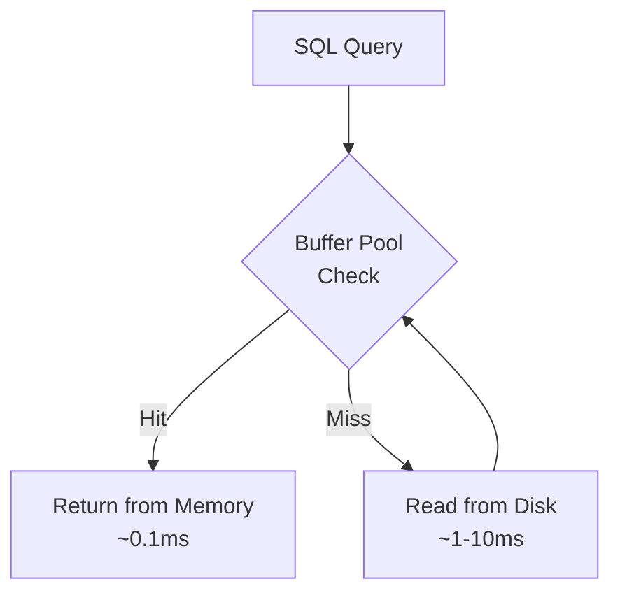

# How to Tune InnoDB Buffer Pool and Redo Log for Cloud SQL MySQL Performance

Author: [nawazdhandala](https://www.github.com/nawazdhandala)

Tags: GCP, Cloud SQL, MySQL, InnoDB, Buffer Pool, Performance Tuning, Database

Description: A practical guide to tuning InnoDB buffer pool size, redo log configuration, and related settings on Cloud SQL for MySQL to maximize database performance.

---

The InnoDB buffer pool is the single most important performance setting in MySQL. It is a memory area where InnoDB caches table data and index pages. When a query needs a row, MySQL checks the buffer pool first. If the data is there (a buffer pool hit), the response is fast - memory speed. If not (a miss), MySQL reads from disk, which is orders of magnitude slower.

On Cloud SQL for MySQL, you control the buffer pool size and related InnoDB settings through database flags. Getting these right can be the difference between a database that handles your workload comfortably and one that chokes under load.

## Understanding the Buffer Pool

Think of the buffer pool as a cache. The larger it is, the more of your data fits in memory, and the fewer disk reads you need. For a database where the working set (frequently accessed data) fits in the buffer pool, nearly all reads come from memory.



## Step 1: Check Your Current Buffer Pool Status

Connect to your Cloud SQL instance and check how the buffer pool is performing.

```sql
-- Check buffer pool size and hit ratio
SHOW GLOBAL STATUS LIKE 'Innodb_buffer_pool%';
```

The key metrics to look at:

```sql
-- Calculate the buffer pool hit ratio
SELECT
  (1 - (
    (SELECT VARIABLE_VALUE FROM performance_schema.global_status
     WHERE VARIABLE_NAME = 'Innodb_buffer_pool_reads') /
    (SELECT VARIABLE_VALUE FROM performance_schema.global_status
     WHERE VARIABLE_NAME = 'Innodb_buffer_pool_read_requests')
  )) * 100 AS buffer_pool_hit_ratio;
```

A hit ratio below 99% means the buffer pool is too small for your workload. Anything above 99.5% is good. Above 99.9% is excellent.

```sql
-- Check how much data and how many pages are in the buffer pool
SELECT
  CONCAT(ROUND(@@innodb_buffer_pool_size / 1073741824, 2), ' GB') AS buffer_pool_size,
  (SELECT VARIABLE_VALUE FROM performance_schema.global_status
   WHERE VARIABLE_NAME = 'Innodb_buffer_pool_pages_total') AS total_pages,
  (SELECT VARIABLE_VALUE FROM performance_schema.global_status
   WHERE VARIABLE_NAME = 'Innodb_buffer_pool_pages_data') AS data_pages,
  (SELECT VARIABLE_VALUE FROM performance_schema.global_status
   WHERE VARIABLE_NAME = 'Innodb_buffer_pool_pages_free') AS free_pages,
  (SELECT VARIABLE_VALUE FROM performance_schema.global_status
   WHERE VARIABLE_NAME = 'Innodb_buffer_pool_pages_dirty') AS dirty_pages;
```

If `free_pages` is 0, the buffer pool is full and evicting data. You likely need more memory.

## Step 2: Size the Buffer Pool

The general guideline is to set the buffer pool to 70-80% of available RAM. On Cloud SQL, the available RAM depends on your machine type.

| Machine Type | RAM | Recommended Buffer Pool |
|---|---|---|
| db-n1-standard-1 | 3.75 GB | 2.5 GB |
| db-n1-standard-2 | 7.5 GB | 5.5 GB |
| db-n1-standard-4 | 15 GB | 11 GB |
| db-n1-standard-8 | 30 GB | 22 GB |
| db-n1-standard-16 | 60 GB | 45 GB |
| db-n1-highmem-8 | 52 GB | 40 GB |
| db-n1-highmem-16 | 104 GB | 80 GB |

Cloud SQL reserves some memory for the OS and MySQL overhead. Do not set the buffer pool to 100% of RAM - leave room for connection buffers, temporary tables, and OS caches.

```bash
# Set the buffer pool size to 22 GB on a db-n1-standard-8
gcloud sql instances patch MY_INSTANCE \
  --database-flags=innodb_buffer_pool_size=23622320128
```

The value is in bytes. 22 GB = 22 x 1024 x 1024 x 1024 = 23622320128.

## Step 3: Configure Buffer Pool Instances

For buffer pools larger than 1 GB, split them into multiple instances to reduce contention. Each instance has its own mutex, so parallel threads do not block each other.

```bash
# Use 8 buffer pool instances (good for 16+ GB buffer pools)
gcloud sql instances patch MY_INSTANCE \
  --database-flags=innodb_buffer_pool_instances=8
```

The recommended formula is 1 instance per 1-2 GB of buffer pool. For a 22 GB buffer pool, 8-16 instances is appropriate.

Note: This flag requires a restart in some Cloud SQL configurations.

## Step 4: Tune the Redo Log

The redo log (also called the InnoDB log or write-ahead log) records every write operation before it is applied to the data files. A larger redo log reduces the frequency of checkpoints, which reduces I/O spikes and improves write performance.

```bash
# Increase the redo log size
# MySQL 8.0.30+ uses innodb_redo_log_capacity
gcloud sql instances patch MY_INSTANCE \
  --database-flags=innodb_redo_log_capacity=4294967296
```

This sets the total redo log capacity to 4 GB. For high-write workloads, this prevents frequent checkpoint flushes.

For older MySQL versions (before 8.0.30), use the two-parameter approach:

```bash
# For MySQL versions before 8.0.30
gcloud sql instances patch MY_INSTANCE \
  --database-flags=innodb_log_file_size=1073741824,innodb_log_files_in_group=4
```

This creates 4 log files of 1 GB each, for 4 GB total.

### How to Size the Redo Log

The redo log should be large enough to hold about 1-2 hours of write volume. Check your write rate:

```sql
-- Calculate write rate to the redo log
SELECT
  (SELECT VARIABLE_VALUE FROM performance_schema.global_status
   WHERE VARIABLE_NAME = 'Innodb_os_log_written') AS bytes_written;
-- Run this query twice, 60 seconds apart, and calculate the difference
-- Multiply by 3600 to get the hourly rate
```

If you write 500 MB per hour, a 2 GB redo log gives you about 4 hours of headroom, which is plenty.

## Step 5: Tune Flush Settings

InnoDB periodically flushes dirty pages from the buffer pool to disk. How aggressively it does this affects both write performance and recovery time.

```bash
# Configure flushing behavior
gcloud sql instances patch MY_INSTANCE \
  --database-flags=\
innodb_flush_method=O_DIRECT,\
innodb_io_capacity=2000,\
innodb_io_capacity_max=4000,\
innodb_flush_neighbors=0
```

Explanation of each setting:

- **innodb_flush_method=O_DIRECT**: Bypasses the OS file cache, reducing double buffering. This is usually the best choice on Cloud SQL.
- **innodb_io_capacity=2000**: Tells InnoDB the IOPS available for background operations like flushing. Cloud SQL SSDs can handle thousands of IOPS.
- **innodb_io_capacity_max=4000**: Upper limit for aggressive flushing during heavy write periods.
- **innodb_flush_neighbors=0**: Do not flush neighboring pages. This is an optimization for spinning disks that hurts SSD performance.

## Step 6: Optimize the Change Buffer

The change buffer caches changes to secondary index pages when those pages are not in the buffer pool. This avoids random I/O for index updates.

```bash
# Enable change buffering for all applicable operations
gcloud sql instances patch MY_INSTANCE \
  --database-flags=innodb_change_buffer_max_size=25
```

The default is 25% of the buffer pool, which is usually fine. For insert-heavy workloads with many secondary indexes, you might increase this to 30-40%.

## Step 7: Monitor After Tuning

After applying changes, monitor the impact.

```sql
-- Comprehensive InnoDB performance check
SELECT
  'Buffer Pool Hit Ratio' AS metric,
  CONCAT(
    ROUND((1 - (
      (SELECT VARIABLE_VALUE FROM performance_schema.global_status
       WHERE VARIABLE_NAME = 'Innodb_buffer_pool_reads') /
      NULLIF((SELECT VARIABLE_VALUE FROM performance_schema.global_status
       WHERE VARIABLE_NAME = 'Innodb_buffer_pool_read_requests'), 0)
    )) * 100, 3), '%'
  ) AS value
UNION ALL
SELECT
  'Buffer Pool Usage',
  CONCAT(
    ROUND(
      (SELECT VARIABLE_VALUE FROM performance_schema.global_status
       WHERE VARIABLE_NAME = 'Innodb_buffer_pool_pages_data') /
      (SELECT VARIABLE_VALUE FROM performance_schema.global_status
       WHERE VARIABLE_NAME = 'Innodb_buffer_pool_pages_total') * 100, 1
    ), '%'
  )
UNION ALL
SELECT
  'Dirty Page Ratio',
  CONCAT(
    ROUND(
      (SELECT VARIABLE_VALUE FROM performance_schema.global_status
       WHERE VARIABLE_NAME = 'Innodb_buffer_pool_pages_dirty') /
      NULLIF((SELECT VARIABLE_VALUE FROM performance_schema.global_status
       WHERE VARIABLE_NAME = 'Innodb_buffer_pool_pages_total'), 0) * 100, 1
    ), '%'
  )
UNION ALL
SELECT
  'Log Writes/sec',
  (SELECT VARIABLE_VALUE FROM performance_schema.global_status
   WHERE VARIABLE_NAME = 'Innodb_log_writes');
```

## Cloud SQL Specific Considerations

A few things specific to Cloud SQL:

- **Not all flags are available.** Cloud SQL restricts some InnoDB settings. Check the supported flags documentation before trying to set a flag.
- **Flag changes may require restart.** Some flags (like buffer pool instances) require a restart. Cloud SQL handles this automatically but you will see a brief outage.
- **Scaling the instance is sometimes easier.** If your buffer pool hit ratio is low, sometimes upgrading to a larger machine type (more RAM) is simpler than aggressive tuning.
- **Use Cloud Monitoring.** Cloud SQL exports InnoDB metrics to Cloud Monitoring. Set up dashboards and alerts for buffer pool hit ratio and disk I/O.

## Wrapping Up

The InnoDB buffer pool is the foundation of MySQL performance. Size it as large as practical (70-80% of RAM), split it into multiple instances for concurrency, and configure the redo log large enough to avoid frequent checkpoints. On Cloud SQL, these settings are controlled through database flags and can be adjusted without data loss. The most important metric to track is the buffer pool hit ratio - keep it above 99%, and your database will handle its workload with room to spare. Let it drop significantly, and every query pays the price of disk I/O.
