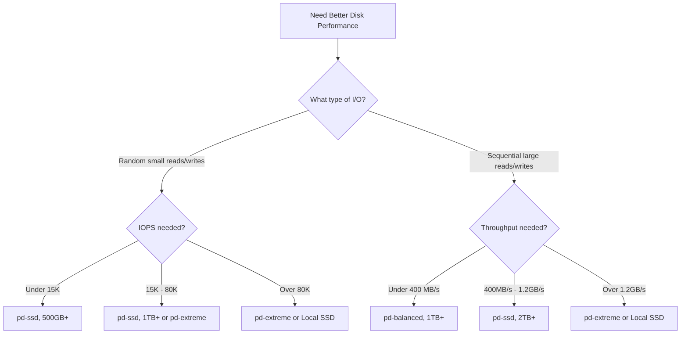

# How to Tune Persistent Disk IOPS and Throughput by Selecting Correct Disk Type and Size

Author: [nawazdhandala](https://www.github.com/nawazdhandala)

Tags: GCP, Persistent Disk, Storage, Performance, Compute Engine

Description: Optimize Google Cloud Persistent Disk IOPS and throughput by selecting the right disk type and size for your workload requirements.

---

You deployed a database or application on Compute Engine and the disk performance is not what you expected. The application feels sluggish, queries are slow, and disk I/O metrics show that you are hitting limits. The issue is almost always that the disk type, size, or the instance type is not matched correctly to your workload's needs. Persistent Disk performance in Google Cloud is not arbitrary - it follows specific rules based on disk type and size. Understanding these rules lets you get exactly the performance you need without overspending.

## How Persistent Disk Performance Scales

This is the most important concept: Persistent Disk performance scales with disk size. A larger disk provides more IOPS and more throughput, up to the maximums for that disk type. This means a 100 GB pd-ssd provides less performance than a 500 GB pd-ssd, even if you do not need the extra storage space.

Each disk type has a per-GB rate and a maximum cap:

| Disk Type | Read IOPS/GB | Write IOPS/GB | Max Read IOPS | Max Write IOPS | Max Read Throughput | Max Write Throughput |
|---|---|---|---|---|---|---|
| pd-standard | 0.75 | 1.5 | 7,500 | 15,000 | 1,200 MB/s | 400 MB/s |
| pd-balanced | 6 | 6 | 80,000 | 80,000 | 1,200 MB/s | 1,200 MB/s |
| pd-ssd | 30 | 30 | 100,000 | 100,000 | 1,200 MB/s | 1,200 MB/s |
| pd-extreme | Configurable | Configurable | 120,000 | 120,000 | 2,400 MB/s | 2,400 MB/s |

Note: These numbers are approximate and can vary. Always check the current documentation for exact values.

## Step 1: Measure Your Current Disk Performance

Before making changes, understand your current I/O patterns:

```bash
# Install fio for benchmarking
sudo apt-get update && sudo apt-get install -y fio

# Test random read IOPS (simulates database reads)
fio --name=randread --ioengine=libaio --iodepth=32 --rw=randread \
    --bs=4k --direct=1 --size=4G --numjobs=4 --runtime=60 \
    --group_reporting --filename=/dev/sdb

# Test random write IOPS (simulates database writes)
fio --name=randwrite --ioengine=libaio --iodepth=32 --rw=randwrite \
    --bs=4k --direct=1 --size=4G --numjobs=4 --runtime=60 \
    --group_reporting --filename=/dev/sdb

# Test sequential read throughput (simulates large file reads)
fio --name=seqread --ioengine=libaio --iodepth=16 --rw=read \
    --bs=1M --direct=1 --size=4G --numjobs=4 --runtime=60 \
    --group_reporting --filename=/dev/sdb

# Test sequential write throughput (simulates large file writes)
fio --name=seqwrite --ioengine=libaio --iodepth=16 --rw=write \
    --bs=1M --direct=1 --size=4G --numjobs=4 --runtime=60 \
    --group_reporting --filename=/dev/sdb
```

Important: Run these on a test disk, not a production disk. The write tests will destroy data.

Compare the results with the expected performance for your disk type and size.

## Step 2: Calculate the Disk Size You Need for Target IOPS

Given the per-GB rates, you can calculate the minimum disk size to reach your target IOPS.

For example, if you need 30,000 random read IOPS:
- pd-standard: 30,000 / 0.75 = 40,000 GB (impractical)
- pd-balanced: 30,000 / 6 = 5,000 GB
- pd-ssd: 30,000 / 30 = 1,000 GB

Here is a script to calculate the disk size for your needs:

```python
# Calculate minimum disk size for target IOPS
def calc_disk_size(target_iops, disk_type):
    """Calculate minimum disk size in GB for target IOPS."""
    rates = {
        'pd-standard': {'read': 0.75, 'write': 1.5},
        'pd-balanced': {'read': 6, 'write': 6},
        'pd-ssd': {'read': 30, 'write': 30},
    }
    maxes = {
        'pd-standard': {'read': 7500, 'write': 15000},
        'pd-balanced': {'read': 80000, 'write': 80000},
        'pd-ssd': {'read': 100000, 'write': 100000},
    }

    if disk_type not in rates:
        return "Unknown disk type"

    results = {}
    for op in ['read', 'write']:
        if target_iops > maxes[disk_type][op]:
            results[op] = f"Exceeds max ({maxes[disk_type][op]})"
        else:
            size_gb = target_iops / rates[disk_type][op]
            results[op] = f"{int(size_gb)} GB"

    return results

# Example: Need 30,000 IOPS
print(calc_disk_size(30000, 'pd-ssd'))
# Output: {'read': '1000 GB', 'write': '1000 GB'}
```

## Step 3: Choose the Right Disk Type for Your Workload

Different workloads have different I/O patterns. Match the disk type to the pattern:

**pd-standard (HDD)**: Good for sequential reads/writes, cold storage, logs, and backups. Bad for random I/O. Use when cost is the primary concern and latency is not critical.

**pd-balanced**: The sweet spot for most workloads. Good random and sequential performance at a moderate price. Use for general-purpose VMs, moderate database workloads, and application servers.

**pd-ssd**: High random IOPS and low latency. Use for databases (PostgreSQL, MySQL, MongoDB), caching layers, and latency-sensitive applications.

**pd-extreme**: The highest performance tier. Configurable IOPS independent of disk size. Use for large databases, SAP HANA, and workloads that need guaranteed IOPS regardless of storage size.

**Hyperdisk Extreme**: Even higher performance than pd-extreme, with configurable IOPS and throughput. For the most demanding workloads.

## Step 4: Resize a Disk to Improve Performance

You can resize a Persistent Disk without detaching it or stopping the instance:

```bash
# Resize a disk to increase performance
gcloud compute disks resize your-disk \
    --size=500GB \
    --zone=us-central1-a
```

After resizing, extend the filesystem to use the new space:

```bash
# For ext4 filesystems
sudo resize2fs /dev/sdb

# For xfs filesystems
sudo xfs_growfs /mnt/data
```

The performance increase takes effect immediately after the resize - you do not need to wait for the filesystem resize.

## Step 5: Use pd-extreme for Decoupled IOPS

pd-extreme lets you specify the IOPS independently from the disk size. This is ideal when you need high IOPS but not a lot of storage:

```bash
# Create a pd-extreme disk with specific IOPS
gcloud compute disks create high-iops-disk \
    --zone=us-central1-a \
    --type=pd-extreme \
    --size=500GB \
    --provisioned-iops=50000 \
    --provisioned-throughput=1200
```

With pd-extreme, a 500 GB disk can provide 50,000 IOPS, whereas a 500 GB pd-ssd only provides 15,000 IOPS.

Note that pd-extreme is only available on certain machine types (typically N2 and C3 with sufficient vCPUs).

## Step 6: Account for Instance-Level Bandwidth Limits

Even with a fast disk, the instance itself has a maximum disk bandwidth. The instance bandwidth limit depends on the machine type and vCPU count.

```bash
# Check the machine type's disk bandwidth capability
gcloud compute machine-types describe n2-standard-8 \
    --zone=us-central1-a
```

As a general rule:
- Small instances (2-4 vCPUs): Limited to about 800 MB/s disk bandwidth
- Medium instances (8-16 vCPUs): Up to about 1,200 MB/s
- Large instances (32+ vCPUs): Up to 2,400 MB/s or more

If your disk can do 1,200 MB/s but your instance only supports 800 MB/s, the instance is the bottleneck. Either use a larger instance or reduce your expectations.

## Step 7: Use Local SSDs for Maximum Performance

If you need the absolute highest IOPS and lowest latency, Local SSDs provide up to 2,400,000 read IOPS per instance (with multiple disks). The tradeoff is that Local SSD data is ephemeral - it is lost when the instance stops.

```bash
# Create an instance with Local SSDs
gcloud compute instances create high-perf-vm \
    --zone=us-central1-a \
    --machine-type=c3-standard-44 \
    --local-ssd=interface=NVME \
    --local-ssd=interface=NVME \
    --local-ssd=interface=NVME \
    --local-ssd=interface=NVME \
    --image-family=ubuntu-2204-lts \
    --image-project=ubuntu-os-cloud
```

Each Local SSD provides 375 GB and approximately 170,000 read IOPS. Combine them with RAID for more performance:

```bash
# Create a RAID 0 array from Local SSDs for maximum throughput
sudo mdadm --create /dev/md0 --level=0 --raid-devices=4 \
    /dev/nvme0n1 /dev/nvme0n2 /dev/nvme0n3 /dev/nvme0n4

# Format and mount
sudo mkfs.ext4 -F /dev/md0
sudo mkdir -p /mnt/local-ssd
sudo mount /dev/md0 /mnt/local-ssd
```

Use Local SSDs for temporary data, caching, and scratch space. Keep persistent data on Persistent Disks.

## Step 8: Monitor Disk Performance

Set up monitoring to track disk IOPS and throughput:

```bash
# Check disk I/O metrics
gcloud monitoring time-series list \
    --filter='metric.type="compute.googleapis.com/instance/disk/read_ops_count" AND resource.labels.instance_id="INSTANCE_ID"' \
    --interval-start-time=$(date -u -d '1 hour ago' +%Y-%m-%dT%H:%M:%SZ)
```

Key metrics:
- `disk/read_ops_count` and `disk/write_ops_count` - IOPS
- `disk/read_bytes_count` and `disk/write_bytes_count` - Throughput
- `disk/queue_depth` - I/O queue depth (high values indicate saturation)

## Performance Decision Guide



## Monitoring Disk Health

Use [OneUptime](https://oneuptime.com) to monitor disk IOPS, throughput, and latency in real time. Setting up alerts for when IOPS utilization approaches the disk's maximum helps you proactively resize disks before performance degradation impacts your applications.

The fundamental rule is that Persistent Disk performance scales with size. If you need more IOPS or throughput, the first thing to try is a bigger disk. If that is not enough, move to a higher-performance disk type. And if you need the absolute best performance, Local SSDs are unmatched.
