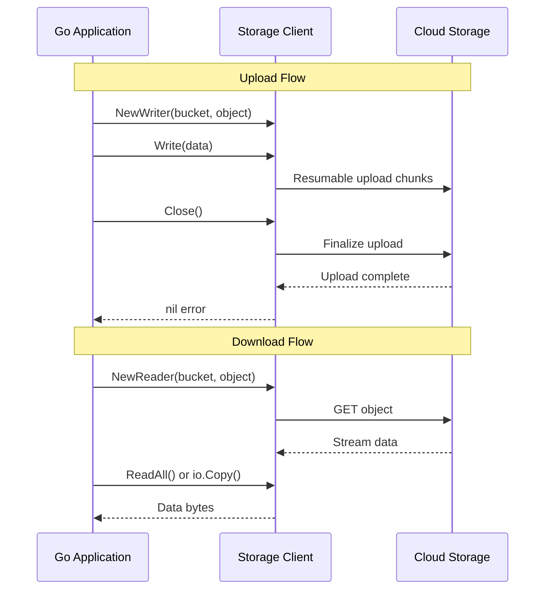

# How to Upload and Download Objects from Cloud Storage Using the Go Cloud Storage Client Library

Author: [nawazdhandala](https://www.github.com/nawazdhandala)

Tags: GCP, Cloud Storage, Go, Google Cloud, Object Storage

Description: A practical guide to uploading and downloading objects from Google Cloud Storage using the Go client library with production-ready patterns.

---

Google Cloud Storage is the go-to object store on GCP. Whether you are storing user uploads, application logs, or ML training data, the Go client library makes it straightforward to interact with buckets and objects. But there are some nuances around streaming, error handling, and performance that are worth getting right from the start.

This post covers the essential operations - uploading and downloading objects - with patterns that work well in production.

## Setting Up

First, install the Cloud Storage client library for Go.

```bash
# Initialize your module and add the storage dependency
go mod init storage-demo
go get cloud.google.com/go/storage
```

Make sure you have a bucket ready. You can create one through the console or the CLI:

```bash
# Create a bucket in a specific region
gsutil mb -l us-central1 gs://my-demo-bucket-12345
```

## Creating the Client

The storage client should be created once and reused across your application. It handles connection pooling internally.

```go
package main

import (
    "context"
    "fmt"
    "io"
    "log"
    "os"
    "time"

    "cloud.google.com/go/storage"
)

// newStorageClient creates a reusable storage client
func newStorageClient(ctx context.Context) (*storage.Client, error) {
    client, err := storage.NewClient(ctx)
    if err != nil {
        return nil, fmt.Errorf("failed to create storage client: %w", err)
    }
    return client, nil
}
```

## Uploading Objects

There are two common patterns for uploading: writing from a byte slice and streaming from a reader.

### Upload from Bytes

This is the simplest case - you have data in memory and want to write it to a bucket.

```go
// uploadFromBytes writes a byte slice to a Cloud Storage object
func uploadFromBytes(client *storage.Client, bucket, object string, data []byte) error {
    ctx := context.Background()

    // Create a writer for the target object
    writer := client.Bucket(bucket).Object(object).NewWriter(ctx)

    // Set content type and metadata before writing
    writer.ContentType = "application/octet-stream"
    writer.Metadata = map[string]string{
        "uploaded-by": "go-demo",
        "timestamp":   time.Now().UTC().Format(time.RFC3339),
    }

    // Write the data
    if _, err := writer.Write(data); err != nil {
        return fmt.Errorf("failed to write data: %w", err)
    }

    // Close flushes the data and finalizes the upload
    // This is where errors most commonly occur
    if err := writer.Close(); err != nil {
        return fmt.Errorf("failed to close writer: %w", err)
    }

    log.Printf("Uploaded %d bytes to gs://%s/%s", len(data), bucket, object)
    return nil
}
```

One thing that catches people off guard: the `Close()` call is not optional. That is where the data actually gets committed to Cloud Storage. If you skip it, your upload will be incomplete.

### Upload from a File (Streaming)

For larger files, you do not want to load everything into memory. Instead, stream directly from disk.

```go
// uploadFromFile streams a local file to Cloud Storage
func uploadFromFile(client *storage.Client, bucket, object, filePath string) error {
    ctx := context.Background()

    // Open the local file for reading
    file, err := os.Open(filePath)
    if err != nil {
        return fmt.Errorf("failed to open file: %w", err)
    }
    defer file.Close()

    writer := client.Bucket(bucket).Object(object).NewWriter(ctx)
    writer.ChunkSize = 8 * 1024 * 1024 // 8 MB chunks for resumable uploads

    // io.Copy streams data from the file to the writer
    // without loading the entire file into memory
    if _, err := io.Copy(writer, file); err != nil {
        return fmt.Errorf("failed to copy data: %w", err)
    }

    if err := writer.Close(); err != nil {
        return fmt.Errorf("failed to finalize upload: %w", err)
    }

    log.Printf("Uploaded file %s to gs://%s/%s", filePath, bucket, object)
    return nil
}
```

The `ChunkSize` setting controls how large each chunk is for resumable uploads. The client library automatically uses resumable uploads for objects larger than the chunk size. Setting this to 8 MB is a reasonable default.

## Downloading Objects

Downloading follows a similar pattern. You get a reader from the object and either read it into memory or stream it somewhere.

### Download to Memory

Good for small objects like configuration files or JSON documents.

```go
// downloadToBytes reads an entire object into memory
func downloadToBytes(client *storage.Client, bucket, object string) ([]byte, error) {
    ctx := context.Background()

    // Create a reader for the object
    reader, err := client.Bucket(bucket).Object(object).NewReader(ctx)
    if err != nil {
        return nil, fmt.Errorf("failed to create reader: %w", err)
    }
    defer reader.Close()

    // Read the entire object into a byte slice
    data, err := io.ReadAll(reader)
    if err != nil {
        return nil, fmt.Errorf("failed to read object: %w", err)
    }

    log.Printf("Downloaded %d bytes from gs://%s/%s", len(data), bucket, object)
    return data, nil
}
```

### Download to a File

For large objects, stream directly to disk.

```go
// downloadToFile streams a Cloud Storage object to a local file
func downloadToFile(client *storage.Client, bucket, object, filePath string) error {
    ctx := context.Background()

    reader, err := client.Bucket(bucket).Object(object).NewReader(ctx)
    if err != nil {
        return fmt.Errorf("failed to create reader: %w", err)
    }
    defer reader.Close()

    // Create the local destination file
    file, err := os.Create(filePath)
    if err != nil {
        return fmt.Errorf("failed to create file: %w", err)
    }
    defer file.Close()

    // Stream from Cloud Storage to the local file
    if _, err := io.Copy(file, reader); err != nil {
        return fmt.Errorf("failed to copy data: %w", err)
    }

    log.Printf("Downloaded gs://%s/%s to %s", bucket, object, filePath)
    return nil
}
```

### Download a Range

Sometimes you only need part of an object. The library supports range reads.

```go
// downloadRange reads a specific byte range from an object
func downloadRange(client *storage.Client, bucket, object string, offset, length int64) ([]byte, error) {
    ctx := context.Background()

    // NewRangeReader accepts offset and length parameters
    reader, err := client.Bucket(bucket).Object(object).NewRangeReader(ctx, offset, length)
    if err != nil {
        return nil, fmt.Errorf("failed to create range reader: %w", err)
    }
    defer reader.Close()

    data, err := io.ReadAll(reader)
    if err != nil {
        return nil, fmt.Errorf("failed to read range: %w", err)
    }

    return data, nil
}
```

## Handling Errors

Cloud Storage operations can fail for various reasons - permissions, network issues, object not found. Here is how to handle the common cases.

```go
import (
    "errors"
    "cloud.google.com/go/storage"
)

// handleStorageError provides specific handling for common error types
func handleStorageError(err error) {
    if errors.Is(err, storage.ErrObjectNotExist) {
        log.Println("Object does not exist")
    } else if errors.Is(err, storage.ErrBucketNotExist) {
        log.Println("Bucket does not exist")
    } else {
        log.Printf("Storage error: %v", err)
    }
}
```

## Upload and Download Flow

Here is how the data flows during upload and download operations.



## Setting Object Metadata and Conditions

You can attach metadata and use preconditions for safer operations.

```go
// uploadWithConditions uploads an object only if it does not already exist
func uploadWithConditions(client *storage.Client, bucket, object string, data []byte) error {
    ctx := context.Background()

    // DoesNotExist precondition prevents overwriting existing objects
    obj := client.Bucket(bucket).Object(object).If(storage.Conditions{
        DoesNotExist: true,
    })

    writer := obj.NewWriter(ctx)
    writer.ContentType = "application/json"

    if _, err := writer.Write(data); err != nil {
        return err
    }
    return writer.Close()
}
```

## Performance Tips

A few things I have learned from running Cloud Storage operations in production:

1. **Reuse the client** - Creating a new client for every request adds connection setup overhead. Create one client and share it.

2. **Use appropriate chunk sizes** - For uploads over 100 MB, consider increasing `ChunkSize` to 16 MB or 32 MB. Fewer chunks means fewer round trips.

3. **Set timeouts** - Always use a context with a deadline for operations, especially downloads of large objects.

4. **Use signed URLs for user-facing uploads** - If users are uploading directly, generate signed URLs instead of proxying through your service.

5. **Enable retries** - The client library retries idempotent operations by default, but you can configure retry settings for more control.

## Wrapping Up

The Go Cloud Storage client library is well-designed and handles a lot of complexity for you - connection pooling, resumable uploads, automatic retries. The main things to remember are to always close your writers, use streaming for large objects, and handle the common error cases.

For monitoring your Cloud Storage operations in production - tracking upload latencies, download error rates, and storage usage - consider setting up observability with OneUptime to catch issues before they affect your users.
