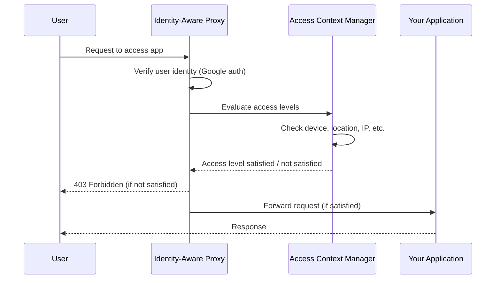

# How to Use Access Context Manager with Identity-Aware Proxy for Zero Trust Access

Author: [nawazdhandala](https://www.github.com/nawazdhandala)

Tags: GCP, Access Context Manager, Identity-Aware Proxy, Zero Trust, Security

Description: A practical guide to combining GCP Access Context Manager with Identity-Aware Proxy to implement zero trust access controls for your applications and resources.

---

The traditional security model of trusting everything inside the corporate network does not work anymore. People work from home, from coffee shops, from airports. The network perimeter has dissolved. Zero trust is the answer - verify every request regardless of where it comes from.

GCP gives you two services that work together beautifully for zero trust: Access Context Manager and Identity-Aware Proxy (IAP). Access Context Manager defines the conditions a request must meet, and IAP enforces those conditions at the application layer. In this post, I will show you how to wire them together.

## How the Two Services Fit Together

Identity-Aware Proxy sits in front of your applications (App Engine, Compute Engine, GKE) and verifies the identity of every request. By default, IAP checks who you are - your Google identity. But identity alone is not enough for zero trust. You also need to know the context of the request: where is it coming from, what device is being used, what time is it.

That is where Access Context Manager comes in. You define access levels with conditions like IP range, device posture, geographic location, and then reference those access levels as IAM conditions on your IAP-protected resources.

The flow looks like this:



## Prerequisites

You will need:

- A GCP organization with Access Context Manager enabled
- BeyondCorp Enterprise license (for device-based conditions)
- An application behind IAP (App Engine, Compute Engine, or GKE)
- Organization-level admin permissions

## Step 1: Enable Identity-Aware Proxy

If you have not already, enable IAP for your application. Here is how to do it for an App Engine service:

```bash
# Enable the IAP API
gcloud services enable iap.googleapis.com

# Enable IAP for App Engine
gcloud iap web enable --resource-type=app-engine
```

For a Compute Engine backend service behind a load balancer:

```bash
# Enable IAP for a specific backend service
gcloud compute backend-services update my-backend-service \
  --iap=enabled \
  --global
```

## Step 2: Create Access Levels for Zero Trust Conditions

Now define the contextual conditions you want to enforce. Let us create several access levels that address different aspects of zero trust.

First, an access level for corporate network access:

```yaml
# corporate-network.yaml
# Allow access from known corporate IP ranges
- ipSubnetworks:
    - 198.51.100.0/24
    - 203.0.113.0/24
```

```bash
# Create the corporate network access level
gcloud access-context-manager levels create corporate-network \
  --policy=POLICY_ID \
  --title="Corporate Network" \
  --basic-level-spec=corporate-network.yaml
```

Next, an access level that requires managed devices with specific security posture:

```yaml
# managed-device.yaml
# Require company-managed devices with disk encryption and screen lock
- devicePolicy:
    requireScreenlock: true
    requireCorpOwned: true
    allowedEncryptionStatuses:
      - ENCRYPTED
    osConstraints:
      - osType: DESKTOP_MAC
        minimumVersion: "12.0.0"
      - osType: DESKTOP_WINDOWS
        minimumVersion: "10.0.0"
      - osType: DESKTOP_CHROME_OS
```

```bash
# Create the managed device access level
gcloud access-context-manager levels create managed-device \
  --policy=POLICY_ID \
  --title="Managed Device" \
  --basic-level-spec=managed-device.yaml
```

## Step 3: Create a Combined Access Level

For true zero trust, you often want to combine multiple conditions. You can create a composite access level that requires other access levels to be met:

```yaml
# zero-trust-combined.yaml
# Both conditions must be met: managed device AND corporate network
- devicePolicy:
    requireScreenlock: true
    requireCorpOwned: true
    allowedEncryptionStatuses:
      - ENCRYPTED
  ipSubnetworks:
    - 198.51.100.0/24
    - 203.0.113.0/24
```

Or you can use a custom access level with CEL (Common Expression Language) for more flexibility:

```bash
# Create a custom access level using CEL expression
gcloud access-context-manager levels create zero-trust-full \
  --policy=POLICY_ID \
  --title="Full Zero Trust" \
  --custom-level-spec=zero-trust-cel.yaml
```

Where `zero-trust-cel.yaml` contains:

```yaml
# zero-trust-cel.yaml
# CEL expression requiring both managed device and approved location
expression: "device.is_corp_owned_device && device.encryption_status == DeviceEncryptionStatus.ENCRYPTED && origin.region_code in ['US', 'CA']"
```

## Step 4: Bind Access Levels to IAP Resources

Now comes the key step - connecting the access levels to your IAP-protected resources. You do this through IAM conditions.

Grant a group access to your app but only when the zero trust conditions are met:

```bash
# Bind IAP access with zero trust access level conditions
gcloud iap web add-iam-policy-binding \
  --resource-type=app-engine \
  --member="group:engineering@example.com" \
  --role="roles/iap.httpsResourceAccessor" \
  --condition="expression=accessPolicies/POLICY_ID/accessLevels/managed-device in request.auth.access_levels,title=require-managed-device"
```

For a backend service on Compute Engine:

```bash
# Apply access level condition to a Compute Engine backend
gcloud iap web add-iam-policy-binding \
  --resource-type=backend-services \
  --service=my-backend-service \
  --member="group:engineering@example.com" \
  --role="roles/iap.httpsResourceAccessor" \
  --condition="expression=accessPolicies/POLICY_ID/accessLevels/zero-trust-full in request.auth.access_levels,title=zero-trust-required"
```

## Step 5: Configure BeyondCorp Endpoint Verification

For device-based access levels to work, you need endpoint verification installed on client machines. This is a Chrome extension that reports device attributes to GCP.

Install Endpoint Verification through Google Workspace admin console or deploy it via your MDM solution. Once installed, it reports device attributes like:

- OS version
- Disk encryption status
- Screen lock enabled
- Corporate ownership
- Presence of specific security software

These attributes are what Access Context Manager evaluates when checking device policy conditions.

## Step 6: Implement Tiered Access

A practical zero trust setup often uses tiered access levels. Not every app needs the same level of security. Here is a pattern I have used:

```bash
# Tier 1: Basic - just identity verification (default IAP)
# No access level needed, IAP handles identity

# Tier 2: Standard - managed device required
gcloud iap web add-iam-policy-binding \
  --resource-type=app-engine \
  --service=internal-wiki \
  --member="group:all-employees@example.com" \
  --role="roles/iap.httpsResourceAccessor" \
  --condition="expression=accessPolicies/POLICY_ID/accessLevels/managed-device in request.auth.access_levels,title=tier2-standard"

# Tier 3: High - managed device AND corporate network
gcloud iap web add-iam-policy-binding \
  --resource-type=app-engine \
  --service=admin-dashboard \
  --member="group:ops-team@example.com" \
  --role="roles/iap.httpsResourceAccessor" \
  --condition="expression=accessPolicies/POLICY_ID/accessLevels/zero-trust-full in request.auth.access_levels,title=tier3-high"
```

## Terraform Configuration

Here is how to manage this setup with Terraform:

```hcl
# Define a managed device access level
resource "google_access_context_manager_access_level" "managed_device" {
  parent = "accessPolicies/${var.policy_id}"
  name   = "accessPolicies/${var.policy_id}/accessLevels/managed_device"
  title  = "Managed Device"

  basic {
    conditions {
      device_policy {
        require_screen_lock    = true
        require_corp_owned     = true
        allowed_encryption_statuses = ["ENCRYPTED"]
      }
    }
  }
}

# Bind IAP access with the access level condition
resource "google_iap_web_iam_member" "iap_access" {
  project = var.project_id
  role    = "roles/iap.httpsResourceAccessor"
  member  = "group:engineering@example.com"

  condition {
    title      = "require-managed-device"
    expression = "${google_access_context_manager_access_level.managed_device.name} in request.auth.access_levels"
  }
}
```

## Monitoring and Troubleshooting

Zero trust setups will generate access denials, and you need visibility into them.

**Enable IAP audit logging** to see who is being blocked and why:

```bash
# Check IAP audit logs for denied access attempts
gcloud logging read 'resource.type="gce_backend_service" AND protoPayload.status.code=7' \
  --project=PROJECT_ID \
  --limit=50
```

**Common issues I have run into:**

- Users with outdated Endpoint Verification extensions get blocked even on corporate devices. Keep the extension auto-updated.
- Personal devices that are enrolled in company MDM may not report as "corp owned" unless specifically flagged.
- VPN traffic can cause geographic access levels to fail if the exit node is in an unexpected country.

## Summary

Combining Access Context Manager with Identity-Aware Proxy gives you a solid zero trust foundation on GCP. Define your access levels based on device posture, network location, and other contextual attributes, then bind them to IAP-protected resources. Start with a tiered approach so that not every application requires the strictest controls, and make sure you have good logging in place to catch and diagnose access denials.
