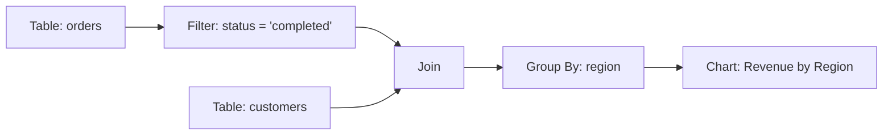

# How to Use BigQuery Data Canvas for Visual Data Exploration and Analysis

Author: [nawazdhandala](https://www.github.com/nawazdhandala)

Tags: GCP, BigQuery, Data Canvas, Data Exploration, Data Analysis, SQL, Visualization

Description: Learn how to use BigQuery Data Canvas to visually explore datasets, build queries through a graphical interface, and create charts without writing SQL from scratch.

---

Not everyone who needs insights from data wants to write SQL. And even experienced SQL users sometimes want a faster way to explore an unfamiliar dataset before committing to a query. BigQuery Data Canvas provides a visual, node-based interface for data exploration. You can browse tables, filter data, join datasets, aggregate results, and create charts - all through a drag-and-drop canvas that generates SQL under the hood.

This guide covers how to use Data Canvas effectively, from basic exploration to building multi-step analysis workflows.

## What Is Data Canvas?

Data Canvas is a visual query builder within the BigQuery console. It represents data operations as nodes on a canvas, connected by edges that show data flow. Each node performs an operation: select a table, filter rows, join tables, group and aggregate, or visualize results.



The canvas generates standard SQL that you can copy, modify, and use anywhere. Think of it as a visual IDE for data exploration that produces SQL as its output.

## Getting Started

### Accessing Data Canvas

1. Open the BigQuery console at console.cloud.google.com/bigquery
2. Click the "Data Canvas" button in the top toolbar (next to the SQL editor tabs)
3. A new canvas workspace opens

### Adding Your First Table

Click "Add Data" or the "+" button on the canvas. You can:

- Browse your project's datasets and tables
- Search for tables by name
- Use a public dataset to experiment

Select a table and it appears as a node on the canvas. Click the node to see a preview of the data - the first 100 rows are shown automatically.

## Basic Exploration Workflow

Let me walk through a practical example: analyzing sales data.

### Step 1: Add the Sales Table

Add your `analytics.sales` table to the canvas. The node shows the table schema and a data preview.

### Step 2: Filter the Data

Click the "+" on the table node and select "Filter." This adds a filter node connected to the table.

Configure the filter:
- Column: `order_date`
- Condition: `>=`
- Value: `2026-01-01`

Add another filter condition:
- Column: `status`
- Condition: `=`
- Value: `completed`

The preview updates to show only matching rows.

### Step 3: Group and Aggregate

Click "+" on the filter node and select "Aggregate." Configure:
- Group by: `product_category`
- Aggregations:
  - `SUM(revenue)` as `total_revenue`
  - `COUNT(*)` as `order_count`
  - `AVG(revenue)` as `avg_order_value`

The result shows one row per product category with the aggregated values.

### Step 4: Visualize

Click "+" on the aggregate node and select "Chart." Choose:
- Chart type: Bar chart
- X-axis: `product_category`
- Y-axis: `total_revenue`
- Sort: Descending by `total_revenue`

The chart renders directly on the canvas.

## Joining Multiple Tables

Data Canvas really shines when you need to join data from multiple sources without writing join syntax manually.

### Example: Orders with Customer Details

1. Add the `orders` table to the canvas
2. Add the `customers` table to the canvas
3. Drag a connection from the `orders` node to the `customers` node
4. The join configuration panel opens:
   - Join type: LEFT JOIN
   - Join condition: `orders.customer_id = customers.customer_id`
5. Select which columns to include from each table

The join node shows the combined data. You can chain additional operations (filters, aggregations, charts) from the join result.

## Using Natural Language Queries

Data Canvas supports natural language input. Instead of configuring each node manually, you can type a question and let the system generate the operations.

For example, type: "Show me the top 10 customers by total spending in January 2026"

Data Canvas creates the necessary nodes: table selection, date filter, group by customer, sum of spending, sort, and limit. You can inspect each node to verify the logic and modify it if needed.

This is particularly useful when you are exploring an unfamiliar dataset and do not know the exact column names or relationships.

## Working with the Generated SQL

Every canvas workflow generates standard BigQuery SQL. Click the "SQL" tab to see it.

```sql
-- Example SQL generated by Data Canvas
SELECT
  c.customer_name,
  c.region,
  SUM(o.revenue) AS total_revenue,
  COUNT(o.order_id) AS order_count,
  AVG(o.revenue) AS avg_order_value
FROM `analytics.orders` AS o
LEFT JOIN `analytics.customers` AS c
  ON o.customer_id = c.customer_id
WHERE o.order_date >= '2026-01-01'
  AND o.status = 'completed'
GROUP BY c.customer_name, c.region
ORDER BY total_revenue DESC
LIMIT 10
```

You can:
- Copy the SQL to use in scheduled queries, dashboards, or applications
- Modify the SQL directly and re-run it
- Save the SQL as a view for reuse

## Advanced Features

### Branching Workflows

A single canvas can have multiple branches. For example, start with a sales table, then branch into two paths: one that aggregates by region and another that aggregates by time period. Both branches share the same source data but produce different views.

### Parameterized Exploration

Use Data Canvas parameters to make your exploration dynamic. Set a parameter for date range, and all nodes that reference it update together when you change the value.

### Saving and Sharing Canvases

Save your canvas as a named resource in your project. Share it with team members who can open it, run it with current data, and fork it for their own analysis.

## When Data Canvas Is the Right Tool

Data Canvas works well for:

- **Initial data exploration**: Understanding the shape, distribution, and relationships in a new dataset
- **Ad-hoc analysis**: Quick one-off questions that do not justify writing a full query
- **Non-SQL users**: Business analysts, product managers, and others who need data but do not write SQL daily
- **Prototyping queries**: Building complex queries visually before refining the SQL

Data Canvas is less appropriate for:

- **Production pipelines**: Use SQL views, scheduled queries, or Dataform
- **Complex transformations**: Multi-CTE queries, recursive queries, or UDFs are better written in SQL
- **Programmatic access**: If you need to call queries from code, use the SQL directly

## Tips for Effective Use

1. **Start with a preview**. Before building a complex workflow, preview the table to understand the data types and value distributions.

2. **Use filters early**. Filtering before aggregation reduces the data processed and makes previews faster. This also keeps your BigQuery costs lower during exploration.

3. **Name your nodes**. Give meaningful names to nodes so the canvas is readable. "Completed Orders Q1" is better than "Filter 3."

4. **Export the SQL when done**. Once you have found the insight you need, export the generated SQL and save it as a view or scheduled query for ongoing use.

5. **Use the schema panel**. The schema panel shows column names, types, and descriptions. Refer to it when building filter and join conditions to avoid type mismatches.

## Wrapping Up

BigQuery Data Canvas lowers the barrier to data exploration on GCP. It does not replace SQL for production workloads, but it gives everyone on the team - not just the SQL experts - a way to explore data, test hypotheses, and build visualizations quickly. The generated SQL serves as a bridge: start visual, verify the results, then take the SQL into your production workflow. For teams that spend a lot of time fielding ad-hoc data requests, enabling self-service exploration through Data Canvas can free up significant engineering time.
