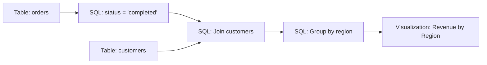

# How to Use BigQuery Data Canvas for Visual Data Exploration and Analysis

Author: [nawazdhandala](https://www.github.com/nawazdhandala)

Tags: GCP, BigQuery, Data Canvas, Data Exploration, Data Analysis, SQL, Visualization

Description: Learn how to use BigQuery Data Canvas to visually explore datasets, build queries through a graphical interface, and create charts without writing SQL from scratch.

---

Not everyone who needs insights from data wants to write SQL from scratch. And even experienced SQL users sometimes want a faster way to explore an unfamiliar dataset before committing to a query. BigQuery Data Canvas provides a visual, node-based interface for data exploration. You can search for tables, inspect schemas and previews, use natural language to generate SQL, join datasets, persist query results, and create charts - all through a canvas that helps generate SQL and visualizations.

This guide covers how to use Data Canvas effectively, from basic exploration to building multi-step analysis workflows.

## What Is Data Canvas?

Data Canvas is a Gemini in BigQuery feature within the BigQuery console. It represents analysis workflows as nodes on a canvas, connected by edges that show data flow. Node types include search, table, SQL, destination, visualization, text, and insights nodes.


```mermaid
graph LR
    T1[Table: orders] --> Q1[SQL: status = 'completed']
    Q1 --> J1[SQL: Join customers]
    T2[Table: customers] --> J1
    J1 --> G1[SQL: Group by region]
    G1 --> V1[Visualization: Revenue by Region]
```

The canvas can generate standard BigQuery SQL that you can inspect, edit, and export from SQL nodes. Think of it as a visual workspace for data exploration that helps you find data, generate queries, and visualize results.

## Getting Started

### Accessing Data Canvas

1. Open the BigQuery console at console.cloud.google.com/bigquery
2. In the query editor, next to "SQL query," click "Create new," and then click "Data canvas"
3. A new canvas workspace opens

### Adding Your First Table

Click "Search for data" or add a search node on the canvas. You can:

- Browse your project's datasets and tables
- Search for tables by name, keyword, or natural language
- Use a public dataset to experiment

Select a table and it appears as a node on the canvas. Click the node to view schema information, table details, and a data preview.

## Basic Exploration Workflow

Let me walk through a practical example: analyzing sales data.

### Step 1: Add the Sales Table

Add your `analytics.sales` table to the canvas. The node shows the table schema and a data preview.

### Step 2: Filter the Data

Click "Query" on the table node and use a SQL prompt or SQL editor to filter the table.

Configure the filter:
- Column: `order_date`
- Condition: `>=`
- Value: `2026-01-01`

Add another filter condition:
- Column: `status`
- Condition: `=`
- Value: `completed`

Run the SQL node to see only matching rows.

### Step 3: Group and Aggregate

In the SQL node, extend the query to aggregate the filtered rows. Configure or generate:
- Group by: `product_category`
- Aggregations:
  - `SUM(revenue)` as `total_revenue`
  - `COUNT(*)` as `order_count`
  - `AVG(revenue)` as `avg_order_value`

The query result shows one row per product category with the aggregated values.

### Step 4: Visualize

Click "Visualize" from the query result and create a chart. Choose:
- Chart type: Bar chart
- X-axis: `product_category`
- Y-axis: `total_revenue`
- Sort: Descending by `total_revenue`

The visualization node renders the chart directly on the canvas.

## Joining Multiple Tables

Data Canvas really shines when you need to join data from multiple sources without writing join syntax manually.

### Example: Orders with Customer Details

1. Add the `orders` table to the canvas
2. Add the `customers` table to the canvas
3. From the `orders` table node, click "Join"
4. Select or search for the `customers` table
5. Use a natural language prompt or edit the generated SQL to create the join:
   - Join type: LEFT JOIN
   - Join condition: `orders.customer_id = customers.customer_id`
6. Select or edit which columns to include from each table in the SQL

The SQL node shows the combined data after you run it. You can chain additional SQL nodes, destination nodes, or visualization nodes from the join result.

## Using Natural Language Queries

Data Canvas supports natural language input. Instead of configuring each node manually, you can type a question and let the system generate the operations.

For example, type: "Show me the top 10 customers by total spending in January 2026"

Data Canvas can generate a SQL node that selects the relevant table, filters by date, groups by customer, sums spending, sorts, and limits the result. You can inspect the generated SQL to verify the logic and modify it if needed.

This is particularly useful when you are exploring an unfamiliar dataset and want Data Canvas to use catalog metadata, table descriptions, and column names to help find relevant assets.

## Working with the Generated SQL

SQL nodes generate standard BigQuery SQL. Open the SQL node to see and edit it.

```sql
-- Example SQL generated by Data Canvas
SELECT
  c.customer_name,
  c.region,
  SUM(o.revenue) AS total_revenue,
  COUNT(o.order_id) AS order_count,
  AVG(o.revenue) AS avg_order_value
FROM `analytics.orders` AS o
LEFT JOIN `analytics.customers` AS c
  ON o.customer_id = c.customer_id
WHERE o.order_date >= '2026-01-01'
  AND o.status = 'completed'
GROUP BY c.customer_name, c.region
ORDER BY total_revenue DESC
LIMIT 10
```

You can:
- Copy the SQL to use in scheduled queries, dashboards, or applications
- Modify the SQL directly and re-run it
- Save the SQL as a view for reuse

## Advanced Features

### Branching Workflows

A single canvas can have multiple branches. For example, start with a sales table, then branch into two paths: one that aggregates by region and another that aggregates by time period. Both branches share the same source data but produce different views.

### Persisting Results

Use a destination node to persist the result of a SQL node to a BigQuery table. This is useful when you want to reuse an intermediate result or keep the output of an exploratory query.

### Saving and Sharing Canvases

Save your canvas as a resource in your project. Share it with team members who have the right permissions so they can open it, review comments, and use the canvas for their own analysis.

## When Data Canvas Is the Right Tool

Data Canvas works well for:

- **Initial data exploration**: Understanding the shape, distribution, and relationships in a new dataset
- **Ad-hoc analysis**: Quick one-off questions that do not justify writing a full query
- **Data professionals who prefer visual exploration**: Analysts, engineers, and others who are comfortable validating SQL but do not want to write every query from scratch
- **Prototyping queries**: Building complex queries visually before refining the SQL

Data Canvas is less appropriate for:

- **Production pipelines**: Use SQL views, scheduled queries, or Dataform
- **Complex transformations**: Multi-CTE queries, recursive queries, or UDFs are better written in SQL
- **Programmatic access**: If you need to call queries from code, use the SQL directly

## Tips for Effective Use

1. **Start with a preview**. Before building a complex workflow, preview the table and schema to understand the data types and available fields.

2. **Use filters early**. Filtering before aggregation reduces the data processed and makes previews faster. This also keeps your BigQuery costs lower during exploration.

3. **Use text nodes for context**. Add short notes near important branches so the canvas is readable.

4. **Export the SQL when done**. Once you have found the insight you need, export the generated SQL from the SQL node or export it as a scheduled query for ongoing use.

5. **Use the schema tab**. The table node shows column names, types, and descriptions. Refer to it when building filter and join conditions to avoid type mismatches.

## Wrapping Up

BigQuery Data Canvas lowers the barrier to data exploration on GCP. It does not replace SQL for production workloads, but it gives data teams a way to explore data, test hypotheses, and build visualizations quickly. The generated SQL serves as a bridge: start visual, verify the results, then take the SQL into your production workflow. For teams that spend a lot of time fielding ad-hoc data requests, enabling guided exploration through Data Canvas can free up significant engineering time.
