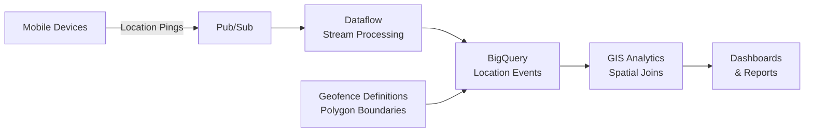

# How to Use BigQuery GIS to Analyze Geofence Events from Mobile Device Location Data

Author: [nawazdhandala](https://www.github.com/nawazdhandala)

Tags: GCP, BigQuery, GIS, Geofencing, Mobile Location, Analytics, Google Cloud

Description: Analyze geofence events from mobile device location data using BigQuery GIS to track visits, measure dwell time, and understand customer movement patterns.

---

Geofencing is the practice of defining virtual geographic boundaries and detecting when mobile devices enter or exit those boundaries. It is used everywhere - retail stores tracking foot traffic, logistics companies monitoring fleet vehicles, event organizers counting attendees, and real estate firms measuring property visits. While the geofence trigger logic typically runs on the mobile device or a streaming service, the real analytics value comes from analyzing the accumulated geofence events at scale.

BigQuery GIS is perfectly suited for this analysis. You can define geofences as polygons, match location pings to those polygons using spatial joins, calculate dwell times, identify movement patterns, and build visit attribution models. In this post, I will build a complete geofence analytics pipeline in BigQuery.

## Architecture



## Prerequisites

- Location event data in BigQuery (device ID, latitude, longitude, timestamp)
- BigQuery GIS functions available
- Geofence boundary definitions (lat/lng polygon coordinates)

## Step 1: Set Up the Location Events Table

Create the table for raw location events coming from mobile devices.

This creates the events table with proper partitioning for query performance:

```sql
-- Create the location events table partitioned by event date
CREATE TABLE `MY_PROJECT.geo_analytics.location_events` (
  event_id STRING NOT NULL,
  device_id STRING NOT NULL,
  event_timestamp TIMESTAMP NOT NULL,
  latitude FLOAT64,
  longitude FLOAT64,
  location GEOGRAPHY,
  accuracy_meters FLOAT64,
  speed_mps FLOAT64,
  battery_level FLOAT64,
  app_state STRING  -- foreground, background
)
PARTITION BY DATE(event_timestamp)
CLUSTER BY device_id, location
OPTIONS (
  partition_expiration_days = 365
);
```

Load data with geography points:

```sql
-- Insert location events with computed geography
INSERT INTO `MY_PROJECT.geo_analytics.location_events`
SELECT
  event_id,
  device_id,
  event_timestamp,
  latitude,
  longitude,
  ST_GEOGPOINT(longitude, latitude) as location,
  accuracy_meters,
  speed_mps,
  battery_level,
  app_state
FROM `MY_PROJECT.raw_data.mobile_events`
WHERE latitude IS NOT NULL AND longitude IS NOT NULL
  AND latitude BETWEEN -90 AND 90
  AND longitude BETWEEN -180 AND 180;
```

## Step 2: Define Geofences

Create the geofence definitions table with polygon boundaries.

This creates geofences for retail store locations with custom radii:

```sql
-- Create geofence definitions table
CREATE OR REPLACE TABLE `MY_PROJECT.geo_analytics.geofences` AS
SELECT * FROM UNNEST([
  -- Circular geofences around store locations
  STRUCT(
    'GF001' as geofence_id,
    'Downtown Store' as geofence_name,
    'store' as geofence_type,
    -- 200 meter radius circle
    ST_BUFFER(ST_GEOGPOINT(-122.4194, 37.7749), 200) as boundary
  ),
  STRUCT(
    'GF002',
    'Mall Location',
    'store',
    ST_BUFFER(ST_GEOGPOINT(-122.1430, 37.4419), 150) as boundary
  ),
  STRUCT(
    'GF003',
    'Airport Store',
    'store',
    ST_BUFFER(ST_GEOGPOINT(-122.3790, 37.6213), 300) as boundary
  )
]);

-- For complex geofences (buildings, parking lots), use polygon definitions
INSERT INTO `MY_PROJECT.geo_analytics.geofences`
SELECT
  'GF004' as geofence_id,
  'Shopping Center' as geofence_name,
  'mall' as geofence_type,
  ST_GEOGFROMGEOJSON('{
    "type": "Polygon",
    "coordinates": [[
      [-122.420, 37.775],
      [-122.418, 37.775],
      [-122.418, 37.773],
      [-122.420, 37.773],
      [-122.420, 37.775]
    ]]
  }') as boundary;
```

## Step 3: Detect Geofence Entry and Exit Events

The core analysis is matching location pings to geofences and detecting when a device enters or exits a boundary.

This query detects entry and exit events by comparing consecutive location pings:

```sql
-- Detect geofence entry and exit events
WITH location_with_geofence AS (
  -- Join each location ping with all geofences it falls within
  SELECT
    le.device_id,
    le.event_timestamp,
    le.location,
    gf.geofence_id,
    gf.geofence_name,
    gf.geofence_type,
    -- Check if this ping is inside the geofence
    ST_CONTAINS(gf.boundary, le.location) as is_inside
  FROM `MY_PROJECT.geo_analytics.location_events` le
  CROSS JOIN `MY_PROJECT.geo_analytics.geofences` gf
  WHERE le.event_timestamp >= TIMESTAMP_SUB(CURRENT_TIMESTAMP(), INTERVAL 7 DAY)
    -- Pre-filter: only check geofences within 1km of the ping
    AND ST_DWITHIN(le.location, gf.boundary, 1000)
),
with_previous AS (
  -- Get the previous inside/outside state for each device-geofence pair
  SELECT
    *,
    LAG(is_inside) OVER (
      PARTITION BY device_id, geofence_id
      ORDER BY event_timestamp
    ) as was_inside,
    LAG(event_timestamp) OVER (
      PARTITION BY device_id, geofence_id
      ORDER BY event_timestamp
    ) as previous_timestamp
  FROM location_with_geofence
)
SELECT
  device_id,
  geofence_id,
  geofence_name,
  event_timestamp,
  CASE
    WHEN is_inside AND (was_inside IS NULL OR NOT was_inside) THEN 'ENTER'
    WHEN NOT is_inside AND was_inside THEN 'EXIT'
    ELSE NULL
  END as event_type,
  previous_timestamp
FROM with_previous
WHERE
  (is_inside AND (was_inside IS NULL OR NOT was_inside))  -- Entry
  OR (NOT is_inside AND was_inside)  -- Exit
ORDER BY device_id, event_timestamp;
```

## Step 4: Calculate Visit Duration and Dwell Time

Once you have entry and exit events, compute how long each device stayed in each geofence.

This query calculates visit metrics:

```sql
-- Calculate visit duration for each geofence visit
WITH entry_exit_pairs AS (
  SELECT
    device_id,
    geofence_id,
    geofence_name,
    event_timestamp as entry_time,
    -- Find the next exit event for this device-geofence pair
    LEAD(event_timestamp) OVER (
      PARTITION BY device_id, geofence_id
      ORDER BY event_timestamp
    ) as exit_time,
    event_type
  FROM `MY_PROJECT.geo_analytics.geofence_events`
)
SELECT
  device_id,
  geofence_id,
  geofence_name,
  entry_time,
  exit_time,
  TIMESTAMP_DIFF(exit_time, entry_time, MINUTE) as dwell_time_minutes,
  -- Classify the visit type based on dwell time
  CASE
    WHEN TIMESTAMP_DIFF(exit_time, entry_time, MINUTE) < 2 THEN 'pass_through'
    WHEN TIMESTAMP_DIFF(exit_time, entry_time, MINUTE) < 15 THEN 'quick_visit'
    WHEN TIMESTAMP_DIFF(exit_time, entry_time, MINUTE) < 60 THEN 'standard_visit'
    ELSE 'extended_visit'
  END as visit_type
FROM entry_exit_pairs
WHERE event_type = 'ENTER'
  AND exit_time IS NOT NULL
  AND TIMESTAMP_DIFF(exit_time, entry_time, MINUTE) < 480;  -- Cap at 8 hours
```

## Step 5: Analyze Foot Traffic Patterns

Use the visit data to understand traffic patterns across your geofenced locations.

This query shows hourly foot traffic patterns:

```sql
-- Hourly foot traffic pattern by day of week
SELECT
  geofence_name,
  FORMAT_TIMESTAMP('%A', entry_time) as day_of_week,
  EXTRACT(HOUR FROM entry_time) as hour_of_day,
  COUNT(*) as visit_count,
  AVG(dwell_time_minutes) as avg_dwell_minutes,
  COUNTIF(visit_type = 'standard_visit' OR visit_type = 'extended_visit') as meaningful_visits
FROM `MY_PROJECT.geo_analytics.geofence_visits`
WHERE entry_time >= TIMESTAMP_SUB(CURRENT_TIMESTAMP(), INTERVAL 30 DAY)
GROUP BY geofence_name, day_of_week, hour_of_day
ORDER BY geofence_name,
  CASE FORMAT_TIMESTAMP('%A', entry_time)
    WHEN 'Monday' THEN 1
    WHEN 'Tuesday' THEN 2
    WHEN 'Wednesday' THEN 3
    WHEN 'Thursday' THEN 4
    WHEN 'Friday' THEN 5
    WHEN 'Saturday' THEN 6
    WHEN 'Sunday' THEN 7
  END,
  hour_of_day;
```

## Step 6: Cross-Visit Analysis

Understand how customers move between geofenced locations.

This query identifies common visit sequences:

```sql
-- Find common sequences of visits between geofences
WITH visit_sequences AS (
  SELECT
    device_id,
    geofence_name as current_location,
    entry_time as current_visit_time,
    LEAD(geofence_name) OVER (
      PARTITION BY device_id ORDER BY entry_time
    ) as next_location,
    LEAD(entry_time) OVER (
      PARTITION BY device_id ORDER BY entry_time
    ) as next_visit_time
  FROM `MY_PROJECT.geo_analytics.geofence_visits`
  WHERE entry_time >= TIMESTAMP_SUB(CURRENT_TIMESTAMP(), INTERVAL 30 DAY)
    AND visit_type IN ('standard_visit', 'extended_visit')
)
SELECT
  current_location,
  next_location,
  COUNT(*) as transition_count,
  AVG(TIMESTAMP_DIFF(next_visit_time, current_visit_time, MINUTE)) as avg_gap_minutes
FROM visit_sequences
WHERE next_location IS NOT NULL
  -- Only consider transitions within 4 hours
  AND TIMESTAMP_DIFF(next_visit_time, current_visit_time, HOUR) < 4
GROUP BY current_location, next_location
HAVING transition_count >= 5
ORDER BY transition_count DESC;
```

## Step 7: Visit Attribution and Conversion

Connect geofence visits to business outcomes by joining with transaction data.

```sql
-- Attribute store visits to purchases
SELECT
  gv.geofence_name as store_visited,
  COUNT(DISTINCT gv.device_id) as unique_visitors,
  COUNT(DISTINCT t.transaction_id) as transactions,
  ROUND(COUNT(DISTINCT t.transaction_id) / COUNT(DISTINCT gv.device_id) * 100, 1) as conversion_rate,
  SUM(t.amount) as total_revenue,
  ROUND(SUM(t.amount) / COUNT(DISTINCT gv.device_id), 2) as revenue_per_visitor
FROM `MY_PROJECT.geo_analytics.geofence_visits` gv
LEFT JOIN `MY_PROJECT.sales.transactions` t
  ON gv.device_id = t.device_id
  AND t.transaction_time BETWEEN gv.entry_time AND TIMESTAMP_ADD(gv.exit_time, INTERVAL 30 MINUTE)
WHERE gv.entry_time >= TIMESTAMP_SUB(CURRENT_TIMESTAMP(), INTERVAL 30 DAY)
  AND gv.visit_type IN ('standard_visit', 'extended_visit')
GROUP BY store_visited
ORDER BY unique_visitors DESC;
```

## Data Privacy Considerations

When working with mobile location data, privacy must be a top priority:

- Always aggregate data before reporting - never expose individual device movements
- Hash device IDs so they cannot be traced back to individuals
- Implement data retention policies (the 365-day partition expiration in Step 1)
- Comply with GDPR, CCPA, and other applicable regulations
- Ensure users have opted in to location sharing

## Summary

BigQuery GIS turns raw mobile location pings into actionable geofence analytics. The spatial join between location events and geofence polygons is the foundation, and from there you can calculate dwell time, detect visit patterns, analyze cross-location movement, and attribute visits to business outcomes. The key technical decisions are choosing the right geofence radius (too small misses visitors, too large catches passersby), setting appropriate dwell time thresholds to distinguish real visits from pass-throughs, and pre-filtering with ST_DWITHIN for query performance. Always prioritize user privacy by aggregating results and implementing proper data retention policies.
