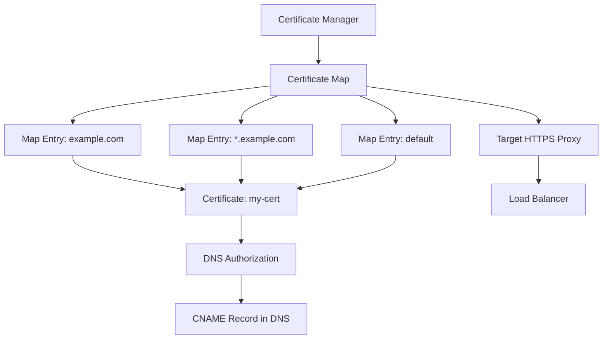

# How to Use Certificate Manager to Manage SSL Certificates for GCP Load Balancers

Author: [nawazdhandala](https://www.github.com/nawazdhandala)

Tags: GCP, Certificate Manager, SSL, TLS, Load Balancer

Description: Learn how to use Google Cloud Certificate Manager to provision, manage, and rotate SSL/TLS certificates for GCP load balancers with DNS and LB authorization.

---

Managing SSL certificates at scale gets complicated fast. When you have dozens of domains, multiple load balancers, and certificates that need renewal, the old approach of creating individual `compute ssl-certificates` resources starts to feel fragile. Google Cloud Certificate Manager is the newer, more robust way to handle certificates for GCP load balancers. It supports DNS-based authorization (so certificates provision even before the load balancer is set up), wildcard certificates, certificate maps that can be shared across load balancers, and automatic renewal.

This post covers the full Certificate Manager workflow, from creating your first certificate to managing a complex multi-domain setup.

## Certificate Manager vs Classic SSL Certificates

Before diving in, here is how Certificate Manager compares to the classic approach:

| Feature | Classic ssl-certificates | Certificate Manager |
|---------|------------------------|-------------------|
| Authorization method | HTTP-01 only | DNS authorization or LB authorization |
| Wildcard certificates | Not supported | Supported (with DNS auth) |
| Certificate maps | Not available | Yes - group and manage certificates together |
| Multi-load-balancer sharing | Manual per-proxy attachment | Certificate maps shared across proxies |
| Renewal | Automatic | Automatic |
| Self-managed certs | Upload per resource | Upload once, reference by map |

## Prerequisites

- A GCP project with billing enabled
- The Certificate Manager API enabled
- DNS access for your domain (if using DNS authorization)
- An existing load balancer or plans to create one

Enable the API:

```bash
# Enable the Certificate Manager API
gcloud services enable certificatemanager.googleapis.com
```

## Approach 1: DNS Authorization (Recommended)

DNS authorization is the preferred method. It works by adding a CNAME record to your DNS, which proves domain ownership. The big advantage is that certificates can be provisioned before the load balancer even exists, and you can get wildcard certificates.

### Step 1: Create a DNS Authorization

```bash
# Create a DNS authorization for your domain
gcloud certificate-manager dns-authorizations create my-dns-auth \
    --domain="example.com"
```

Get the CNAME record you need to add to DNS:

```bash
# Retrieve the DNS record to add
gcloud certificate-manager dns-authorizations describe my-dns-auth \
    --format="yaml(dnsResourceRecord)"
```

This outputs something like:

```
dnsResourceRecord:
  data: abc123.authorize.certificatemanager.goog.
  name: _acme-challenge.example.com.
  type: CNAME
```

Add this CNAME record at your DNS provider. The record must be in place before the certificate can be provisioned.

### Step 2: Create a Certificate

Create a Google-managed certificate using DNS authorization:

```bash
# Create a certificate with DNS authorization
gcloud certificate-manager certificates create my-cert \
    --domains="example.com,*.example.com" \
    --dns-authorizations=my-dns-auth
```

Notice the wildcard domain `*.example.com` - this is only possible with DNS authorization, not with the classic HTTP-01 method.

For multiple domains with different authorizations:

```bash
# Create DNS authorizations for each base domain
gcloud certificate-manager dns-authorizations create auth-example \
    --domain="example.com"

gcloud certificate-manager dns-authorizations create auth-api \
    --domain="api.example.com"

# Create a certificate covering both
gcloud certificate-manager certificates create multi-domain-cert \
    --domains="example.com,api.example.com" \
    --dns-authorizations=auth-example,auth-api
```

### Step 3: Check Certificate Status

```bash
# Check if the certificate has been provisioned
gcloud certificate-manager certificates describe my-cert \
    --format="yaml(managed)"
```

Look for `state: ACTIVE`. If it shows `PROVISIONING`, make sure the DNS CNAME record is in place and give it up to an hour.

## Approach 2: Load Balancer Authorization

If you cannot modify DNS records or prefer a simpler setup, you can use load balancer authorization. This works similarly to the classic HTTP-01 challenge.

```bash
# Create a certificate with load balancer authorization
gcloud certificate-manager certificates create my-lb-cert \
    --domains="app.example.com" \
    --issuance-config=my-issuance-config
```

The domain must resolve to the load balancer's IP, and the load balancer must be serving traffic on port 80 or 443.

## Step 4: Create a Certificate Map

Certificate maps are the primary way to organize certificates and attach them to load balancers. A map contains entries that match hostnames to certificates.

```bash
# Create a certificate map
gcloud certificate-manager maps create my-cert-map
```

### Step 5: Add Certificate Map Entries

Map entries define which certificate serves which hostname:

```bash
# Add an entry for the primary domain
gcloud certificate-manager maps entries create primary-entry \
    --map=my-cert-map \
    --certificates=my-cert \
    --hostname="example.com"

# Add an entry for the wildcard
gcloud certificate-manager maps entries create wildcard-entry \
    --map=my-cert-map \
    --certificates=my-cert \
    --hostname="*.example.com"

# Add a default entry (serves when no hostname matches)
gcloud certificate-manager maps entries create default-entry \
    --map=my-cert-map \
    --certificates=my-cert
```

## Step 6: Attach the Certificate Map to the Load Balancer

```bash
# Attach the certificate map to the target HTTPS proxy
gcloud compute target-https-proxies update my-https-proxy \
    --certificate-map=my-cert-map \
    --global
```

Once attached, the load balancer uses the certificate map instead of individual SSL certificates. You can still have classic SSL certificates attached, but the certificate map takes priority.

## Managing Self-Managed Certificates

If you have certificates from another CA (like Let's Encrypt or a commercial CA), you can upload them to Certificate Manager:

```bash
# Upload a self-managed certificate
gcloud certificate-manager certificates create my-custom-cert \
    --certificate-file=server.crt \
    --private-key-file=server.key
```

Then add it to a certificate map like any other certificate:

```bash
# Add the self-managed cert to the map
gcloud certificate-manager maps entries create custom-entry \
    --map=my-cert-map \
    --certificates=my-custom-cert \
    --hostname="custom.example.com"
```

Self-managed certificates are not automatically renewed. You need to update them before they expire.

## Certificate Rotation Without Downtime

One of the biggest advantages of Certificate Manager is zero-downtime certificate rotation. To update a certificate:

```bash
# Create a new certificate
gcloud certificate-manager certificates create my-cert-v2 \
    --domains="example.com,*.example.com" \
    --dns-authorizations=my-dns-auth

# Update the map entry to use the new certificate
gcloud certificate-manager maps entries update primary-entry \
    --map=my-cert-map \
    --certificates=my-cert-v2

# After verifying, delete the old certificate
gcloud certificate-manager certificates delete my-cert
```

The transition is seamless. The load balancer starts serving the new certificate immediately after the map entry is updated.

## Monitoring Certificate Expiry

Keep track of certificate expiration:

```bash
# List all certificates with their expiry dates
gcloud certificate-manager certificates list \
    --format="table(name,managed.state,expireTime)"

# Describe a specific certificate for details
gcloud certificate-manager certificates describe my-cert
```

Set up monitoring alerts in Cloud Monitoring for certificates approaching expiry:

```bash
# Check certificates expiring within 30 days
gcloud certificate-manager certificates list \
    --filter="expireTime<$(date -d '+30 days' --iso-8601)T00:00:00Z" \
    --format="table(name,expireTime)"
```

## Architecture with Certificate Manager



## Terraform Example

Here is a complete Terraform setup:

```hcl
# DNS Authorization
resource "google_certificate_manager_dns_authorization" "default" {
  name   = "my-dns-auth"
  domain = "example.com"
}

# Google-managed certificate
resource "google_certificate_manager_certificate" "default" {
  name = "my-cert"
  managed {
    domains            = ["example.com", "*.example.com"]
    dns_authorizations = [google_certificate_manager_dns_authorization.default.id]
  }
}

# Certificate map
resource "google_certificate_manager_certificate_map" "default" {
  name = "my-cert-map"
}

# Certificate map entry
resource "google_certificate_manager_certificate_map_entry" "default" {
  name         = "primary-entry"
  map          = google_certificate_manager_certificate_map.default.name
  certificates = [google_certificate_manager_certificate.default.id]
  hostname     = "example.com"
}
```

## Common Mistakes

**Forgetting the DNS CNAME record**: Without the CNAME, DNS authorization cannot validate ownership and the certificate stays in PROVISIONING forever.

**Mismatched hostnames in map entries**: The hostname in the map entry must exactly match what clients request. `www.example.com` and `example.com` are different hostnames.

**Not creating a default map entry**: Without a default entry, requests for hostnames not explicitly listed will fail TLS negotiation.

**Attaching both certificate map and classic SSL certs**: While this works, the certificate map takes priority. Remove classic SSL certificate references to avoid confusion.

## Wrapping Up

Certificate Manager is the recommended way to manage SSL/TLS certificates for GCP load balancers. DNS authorization support means you can provision certificates (including wildcards) before the load balancer is even set up. Certificate maps give you a clean way to organize certificates across multiple domains and share them between load balancers. And automatic renewal means one less thing to worry about in production.
