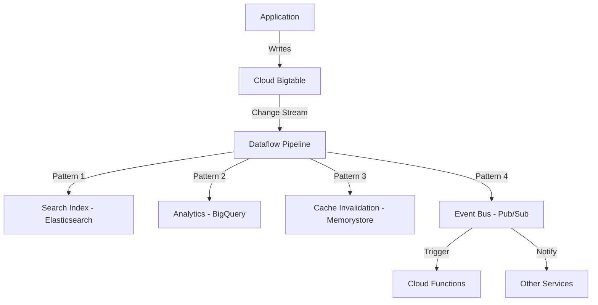

# How to Use Change Streams in Cloud Bigtable to Capture Data Changes

Author: [nawazdhandala](https://www.github.com/nawazdhandala)

Tags: GCP, Cloud Bigtable, Change Streams, CDC, Event-Driven Architecture

Description: Learn how to enable and consume Cloud Bigtable change streams to capture real-time data changes for event-driven architectures and data synchronization.

---

Change Data Capture (CDC) is one of those capabilities that transforms how you build data pipelines. Instead of polling your database for changes or maintaining complex dual-write logic, you get a stream of exactly what changed, when it changed, and what the new values are. Cloud Bigtable's change streams give you exactly that.

I started using Bigtable change streams when I needed to sync data from Bigtable to a search index in near real-time. Before change streams, I had a cron job that scanned the entire table every five minutes looking for updates. It was slow, expensive, and always lagged behind. With change streams, I get notified of every mutation within seconds. In this post, I will show you how to set up and consume Bigtable change streams.

## What Are Change Streams?

Change streams are a feature of Cloud Bigtable that captures mutations (inserts, updates, deletes) as they happen and makes them available as a stream of change records. Each record contains:

- The row key that was modified
- The column family and qualifier that changed
- The new cell value
- The timestamp of the mutation
- The type of mutation (set cell, delete cells, delete row)

Change streams work at the table level. You enable them on a specific table and then consume the stream of changes using Dataflow or a custom client.

## Enabling Change Streams

First, enable change streams on your Bigtable table:

```bash
# Enable change streams on an existing Bigtable table
gcloud bigtable tables update my-table \
  --instance=my-instance \
  --change-stream-retention-period=7d
```

The `--change-stream-retention-period` controls how long change records are kept. You can set this from 1 day up to 7 days. If your consumer goes down and comes back up within the retention period, it can resume from where it left off.

You can also enable change streams when creating a new table:

```bash
# Create a new table with change streams enabled from the start
gcloud bigtable tables create my-new-table \
  --instance=my-instance \
  --column-families="cf1,cf2" \
  --change-stream-retention-period=7d
```

## Consuming Change Streams with Dataflow

The most common way to process change streams is with an Apache Beam pipeline running on Dataflow. Google provides a built-in Bigtable change stream connector.

Here is a Python pipeline that reads changes and writes them to Pub/Sub:

```python
# change_stream_pipeline.py - Process Bigtable change stream with Dataflow
import apache_beam as beam
from apache_beam.options.pipeline_options import PipelineOptions, StandardOptions
from apache_beam.io.gcp.bigtableio import ReadFromBigtableChangeStream
import json
import datetime

class FormatChangeRecord(beam.DoFn):
    """Convert Bigtable change records into JSON for downstream processing."""

    def process(self, record):
        # Extract key fields from the change record
        change_event = {
            "row_key": record.row_key.decode("utf-8"),
            "timestamp": record.commit_timestamp.isoformat(),
            "mutation_type": record.mutation_type,
            "changes": []
        }

        # Process each cell change in the record
        for entry in record.entries:
            change = {
                "family": entry.column_family,
                "qualifier": entry.column_qualifier.decode("utf-8"),
                "value": entry.value.decode("utf-8") if entry.value else None,
                "timestamp": entry.timestamp.isoformat()
            }
            change_event["changes"].append(change)

        yield json.dumps(change_event).encode("utf-8")

def run_change_stream_pipeline():
    """Run a Dataflow pipeline that processes Bigtable change streams."""

    options = PipelineOptions([
        "--project=my-project",
        "--region=us-central1",
        "--runner=DataflowRunner",
        "--temp_location=gs://my-bucket/temp",
        "--staging_location=gs://my-bucket/staging",
        "--job_name=bigtable-change-stream",
        "--max_num_workers=5",
    ])
    options.view_as(StandardOptions).streaming = True

    with beam.Pipeline(options=options) as pipeline:
        (
            pipeline
            # Read from the Bigtable change stream
            | "ReadChangeStream" >> ReadFromBigtableChangeStream(
                project_id="my-project",
                instance_id="my-instance",
                table_id="my-table",
                # Start reading from the beginning of retained changes
                start_time=datetime.datetime.now(datetime.timezone.utc)
            )
            # Format each change record as JSON
            | "FormatChanges" >> beam.ParDo(FormatChangeRecord())
            # Publish to Pub/Sub for downstream consumers
            | "WriteToPubSub" >> beam.io.WriteToPubSub(
                topic="projects/my-project/topics/bigtable-changes"
            )
        )

if __name__ == "__main__":
    run_change_stream_pipeline()
```

## Change Stream Architecture Patterns

Change streams unlock several powerful architecture patterns:



### Pattern 1: Search Index Synchronization

Keep a search index in sync with Bigtable data. Every mutation in Bigtable triggers an update to your Elasticsearch or other search service.

### Pattern 2: Analytics Pipeline

Stream changes into BigQuery for analytical queries. Bigtable handles the operational workload while BigQuery handles the analytical one.

### Pattern 3: Cache Invalidation

Invalidate cached entries in Memorystore whenever the underlying Bigtable data changes. No more stale cache problems.

### Pattern 4: Event-Driven Microservices

Publish changes to Pub/Sub and let downstream microservices react to data changes independently.

## Filtering Change Records

Not every change is relevant to every consumer. You can filter change records in your pipeline:

```python
# Filter change records to only process specific column families or row key patterns
class FilterChanges(beam.DoFn):
    """Filter change records to only relevant mutations."""

    def __init__(self, family_filter=None, key_prefix=None):
        self.family_filter = family_filter
        self.key_prefix = key_prefix

    def process(self, record):
        # Filter by row key prefix if specified
        if self.key_prefix:
            row_key = record.row_key.decode("utf-8")
            if not row_key.startswith(self.key_prefix):
                return

        # Filter by column family if specified
        if self.family_filter:
            relevant_entries = [
                e for e in record.entries
                if e.column_family == self.family_filter
            ]
            if not relevant_entries:
                return

        yield record

# Use the filter in your pipeline
(
    changes
    | "FilterToUserEvents" >> beam.ParDo(
        FilterChanges(family_filter="events", key_prefix="user#"))
    | "ProcessFilteredChanges" >> beam.ParDo(ProcessChanges())
)
```

## Handling Late Data and Ordering

Change streams provide records in approximately commit-timestamp order, but there are some nuances:

**Within a single row:** Changes to the same row are guaranteed to arrive in order.

**Across rows:** Changes to different rows may arrive slightly out of order. If ordering across rows matters, use the commit timestamp to reorder in your consumer.

**Partition changes:** Bigtable may split or merge stream partitions as the table scales. Your consumer needs to handle partition changes gracefully. The Dataflow connector handles this automatically.

## Monitoring Change Stream Processing

Set up monitoring to make sure your change stream consumer keeps up:

```bash
# Create a dashboard to monitor change stream lag
# Key metrics to track:

# 1. Processing lag - how far behind is your consumer?
# Metric: dataflow.googleapis.com/job/system_lag

# 2. Change stream throughput
# Metric: bigtable.googleapis.com/table/change_stream/read_rows_count

# 3. Error rate in your pipeline
# Metric: dataflow.googleapis.com/job/error_count
```

You should alert on system lag exceeding your acceptable threshold. For real-time use cases like cache invalidation, you might alert if lag exceeds 30 seconds. For analytics pipelines, a few minutes of lag might be acceptable.

## Resuming After Failures

One of the best features of change streams is the ability to resume from a checkpoint. If your Dataflow pipeline crashes or needs to be redeployed, it can pick up from where it left off.

The Dataflow connector stores checkpoints automatically. When you restart the pipeline, it resumes from the last committed checkpoint. As long as the gap is within your retention period (up to 7 days), you will not miss any changes.

For custom consumers, you need to store checkpoints yourself:

```python
# Store and retrieve stream continuation tokens for resumable reading
import json
from google.cloud import storage

def save_checkpoint(bucket_name, token):
    """Save the stream continuation token to Cloud Storage."""
    client = storage.Client()
    bucket = client.bucket(bucket_name)
    blob = bucket.blob("bigtable-change-stream-checkpoint.json")
    blob.upload_from_string(json.dumps({
        "token": token,
        "saved_at": datetime.datetime.now().isoformat()
    }))

def load_checkpoint(bucket_name):
    """Load the last saved stream continuation token."""
    client = storage.Client()
    bucket = client.bucket(bucket_name)
    blob = bucket.blob("bigtable-change-stream-checkpoint.json")

    if blob.exists():
        data = json.loads(blob.download_as_text())
        return data["token"]
    return None
```

## Cost Considerations

Change streams add some overhead to your Bigtable costs:

- **Storage:** Change records consume storage during the retention period
- **Read throughput:** Reading the change stream uses read capacity
- **Dataflow costs:** Running a Dataflow pipeline to consume the stream has its own cost

To manage costs, set the retention period to the minimum you need. If your consumer processes changes within minutes and you have good monitoring, 1 day of retention may be sufficient. Only use 7 days if you expect extended downtime scenarios.

## Disabling Change Streams

If you no longer need change streams, disable them to stop incurring costs:

```bash
# Disable change streams on a table
gcloud bigtable tables update my-table \
  --instance=my-instance \
  --clear-change-stream-retention-period
```

## Wrapping Up

Change streams turn Cloud Bigtable from a simple key-value store into a source of truth that actively notifies downstream systems about data changes. Whether you are keeping a search index in sync, feeding an analytics pipeline, or building event-driven microservices, change streams eliminate the need for polling and dual-write patterns. Enable them on your tables, connect a Dataflow pipeline, and let the data flow where it needs to go.
