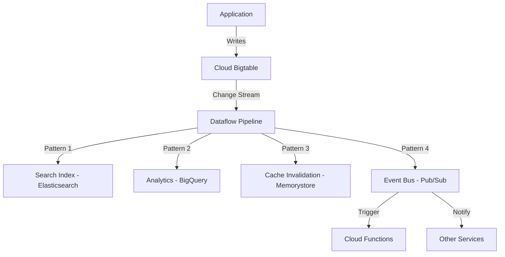

# How to Use Change Streams in Cloud Bigtable to Capture Data Changes

Author: [nawazdhandala](https://www.github.com/nawazdhandala)

Tags: GCP, Cloud Bigtable, Change Stream, CDC, Event-Driven Architecture

Description: Learn how to enable and consume Cloud Bigtable change streams to capture real-time data changes for event-driven architectures and data synchronization.

---

Change Data Capture (CDC) is one of those capabilities that transforms how you build data pipelines. Instead of polling your database for changes or maintaining complex dual-write logic, you get a stream of what changed, when it changed, and what the new values are. Cloud Bigtable's change streams give you that.

I started using Bigtable change streams when I needed to sync data from Bigtable to a search index in near real-time. Before change streams, I had a cron job that scanned the entire table every five minutes looking for updates. It was slow, expensive, and always lagged behind. With change streams, I get notified of every mutation within seconds. In this post, I will show you how to set up and consume Bigtable change streams.

## What Are Change Streams?

Change streams are a feature of Cloud Bigtable that captures mutations (inserts, updates, deletes) as they happen and makes them available as a stream of change records. Garbage collection changes are also captured. Each record contains:

- The row key that was modified
- The column family and qualifier that changed
- The new cell value
- The timestamp of the mutation
- The type of mutation (set cell, delete cells, delete family)

Change streams work at the table level. You enable them on a specific table and then consume the stream of changes using a Google-provided Dataflow template, the Bigtable Beam connector, or the Cloud Bigtable client library for Java.

## Enabling Change Streams

First, enable change streams on your Bigtable table:

```bash
# Enable change streams on an existing Bigtable table

gcloud bigtable tables update my-table \
  --instance=my-instance \
  --change-stream-retention-period=7d
```

The `--change-stream-retention-period` controls how long change records are kept. You can set this from 1 day up to 7 days. If your consumer goes down and comes back up within the retention period, it can resume from where it left off.

You can also enable change streams when creating a new table:

```bash
# Create a new table with change streams enabled from the start
gcloud bigtable tables create my-new-table \
  --instance=my-instance \
  --column-families="cf1,cf2" \
  --change-stream-retention-period=7d
```

## Consuming Change Streams with Dataflow

The most common way to process change streams is with a Dataflow pipeline. Google provides Dataflow templates for common sinks and a Java Bigtable Beam connector for custom pipelines.

If all you need is to publish changes to Pub/Sub, use the Google-provided Dataflow template:

```bash
gcloud dataflow flex-template run bigtable-change-stream \
  --region=us-central1 \
  --template-file-gcs-location=gs://dataflow-templates-us-central1/latest/flex/Bigtable_Change_Streams_to_PubSub \
  --parameters \
bigtableReadInstanceId=my-instance,\
bigtableReadTableId=my-table,\
bigtableChangeStreamAppProfile=my-single-cluster-app-profile,\
pubSubTopic=projects/my-project/topics/bigtable-changes
```

## Change Stream Architecture Patterns

Change streams unlock several powerful architecture patterns:


```mermaid
graph TD
    A[Application] -->|Writes| B[Cloud Bigtable]
    B -->|Change Stream| C[Dataflow Pipeline]
    C -->|Pattern 1| D[Search Index - Elasticsearch]
    C -->|Pattern 2| E[Analytics - BigQuery]
    C -->|Pattern 3| F[Cache Invalidation - Memorystore]
    C -->|Pattern 4| G[Event Bus - Pub/Sub]
    G -->|Trigger| H[Cloud Functions]
    G -->|Notify| I[Other Services]
```

### Pattern 1: Search Index Synchronization

Keep a search index in sync with Bigtable data. Every mutation in Bigtable triggers an update to your Elasticsearch or other search service.

### Pattern 2: Analytics Pipeline

Stream changes into BigQuery for analytical queries. Bigtable handles the operational workload while BigQuery handles the analytical one.

### Pattern 3: Cache Invalidation

Invalidate cached entries in Memorystore whenever the underlying Bigtable data changes. No more stale cache problems.

### Pattern 4: Event-Driven Microservices

Publish changes to Pub/Sub and let downstream microservices react to data changes independently.

## Filtering Change Records

Not every change is relevant to every consumer. With the Google-provided Pub/Sub template, you can ignore specific column families or columns using template parameters. If you build your own Java Beam pipeline, you can filter the `KV<ByteString, ChangeStreamMutation>` records before flattening the entries:

```java
static class FilterChanges
    extends DoFn<KV<ByteString, ChangeStreamMutation>, KV<ByteString, ChangeStreamMutation>> {
  private final String familyFilter;
  private final String keyPrefix;

  FilterChanges(String familyFilter, String keyPrefix) {
    this.familyFilter = familyFilter;
    this.keyPrefix = keyPrefix;
  }

  @ProcessElement
  public void process(
      @Element KV<ByteString, ChangeStreamMutation> record,
      OutputReceiver<KV<ByteString, ChangeStreamMutation>> out) {
    if (keyPrefix != null && !record.getKey().toStringUtf8().startsWith(keyPrefix)) {
      return;
    }

    if (familyFilter == null || hasFamily(record.getValue(), familyFilter)) {
      out.output(record);
    }
  }

  private boolean hasFamily(ChangeStreamMutation mutation, String family) {
    for (Entry entry : mutation.getEntries()) {
      if (entry instanceof SetCell && ((SetCell) entry).getFamilyName().equals(family)) {
        return true;
      }
      if (entry instanceof DeleteCells && ((DeleteCells) entry).getFamilyName().equals(family)) {
        return true;
      }
      if (entry instanceof DeleteFamily && ((DeleteFamily) entry).getFamilyName().equals(family)) {
        return true;
      }
    }
    return false;
  }
}

PCollection<KV<ByteString, ChangeStreamMutation>> filteredChanges =
    changes.apply(
        "FilterToUserEvents",
        ParDo.of(new FilterChanges("events", "user#")));
```

## Handling Late Data and Ordering

Change streams provide records in approximately commit-timestamp order, but there are some nuances:

**Within a single row and cluster:** Changes for the same row key and cluster are streamed in commit timestamp order.

**Across rows or clusters:** There is no ordering guarantee for records from different row keys or different clusters. If ordering across rows matters, use the commit timestamp to reorder in your consumer.

**Partition changes:** Bigtable may split or merge stream partitions as the table scales. Your consumer needs to handle partition changes gracefully. The Dataflow connector handles this automatically.

## Monitoring Change Stream Processing

Set up monitoring to make sure your change stream consumer keeps up:

```bash
# Create a dashboard to monitor change stream lag
# Key metrics to track:

# 1. Data freshness - how far behind is the Dataflow watermark?
# Metric: Dataflow data freshness

# 2. Mean processing delay from commit timestamp
# Metric: processing_delay_from_commit_timestamp_MEAN

# 3. Change stream storage usage
# Metric: bigtable.googleapis.com/table/change_stream_log_used_bytes

# 4. CPU utilization by change streams
# Metric: bigtable.googleapis.com/cluster/cpu_load_by_app_profile_by_method_by_table
```

You should alert on data freshness exceeding your acceptable threshold. For real-time use cases like cache invalidation, you might alert if lag exceeds 30 seconds. For analytics pipelines, a few minutes of lag might be acceptable.

## Resuming After Failures

One of the best features of change streams is the ability to resume from a checkpoint. If your Dataflow pipeline crashes or needs to be redeployed, it can pick up from where it left off.

The Dataflow connector stores operational state in its metadata table. When you resume a compatible pipeline, it resumes from the stored state. The connector can emit duplicate records, so downstream processing should be idempotent. If a pipeline has been stopped long enough that records fall outside the retention period, Bigtable fails the pipeline instead of silently skipping those changes.

For custom Java consumers, you need to store continuation tokens for each stream partition yourself:

```python
# Store and retrieve serialized stream continuation tokens for resumable reading.
import json
import datetime
from google.cloud import storage

def save_checkpoint(bucket_name, partition_id, serialized_token):
    """Save a partition's stream continuation token to Cloud Storage."""
    client = storage.Client()
    bucket = client.bucket(bucket_name)
    blob = bucket.blob("bigtable-change-stream-checkpoint.json")
    checkpoints = load_checkpoints(bucket_name)
    checkpoints[partition_id] = {
        "token": serialized_token,
        "saved_at": datetime.datetime.now(datetime.timezone.utc).isoformat()
    }
    blob.upload_from_string(json.dumps(checkpoints))

def load_checkpoints(bucket_name):
    """Load saved stream continuation tokens by partition."""
    client = storage.Client()
    bucket = client.bucket(bucket_name)
    blob = bucket.blob("bigtable-change-stream-checkpoint.json")

    if blob.exists():
        return json.loads(blob.download_as_text())
    return {}
```

## Cost Considerations

Change streams add some overhead to your Bigtable costs:

- **Storage:** Change records consume storage during the retention period
- **Compute:** Reading change streams uses Bigtable cluster CPU
- **Dataflow costs:** Running a Dataflow pipeline to consume the stream has its own cost

To manage costs, set the retention period to the minimum you need. If your consumer processes changes within minutes and you have good monitoring, 1 day of retention may be sufficient. Only use 7 days if you expect extended downtime scenarios.

## Disabling Change Streams

If you no longer need change streams, disable them to stop incurring costs:

```bash
# Disable change streams on a table
gcloud bigtable tables update my-table \
  --instance=my-instance \
  --clear-change-stream-retention-period
```

## Wrapping Up

Change streams turn Cloud Bigtable from a simple key-value store into a source of truth that actively notifies downstream systems about data changes. Whether you are keeping a search index in sync, feeding an analytics pipeline, or building event-driven microservices, change streams eliminate the need for polling and dual-write patterns. Enable them on your tables, connect a Dataflow pipeline, and let the data flow where it needs to go.
