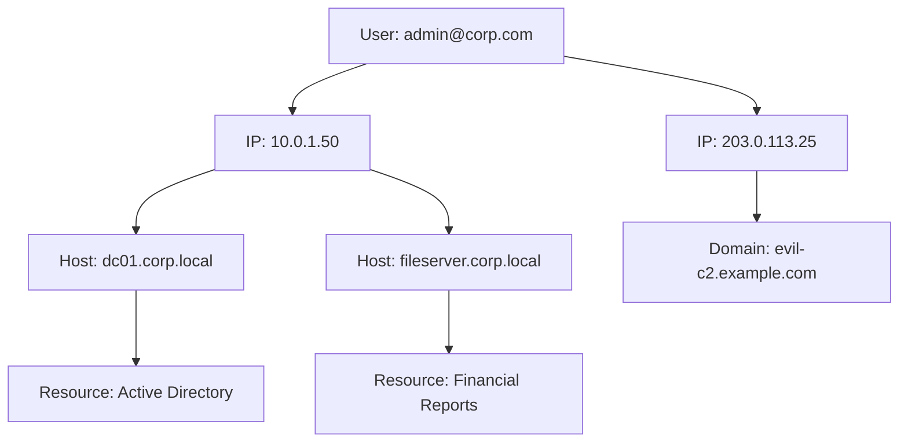

# How to Use Chronicle Entity Graph for Threat Investigation and Hunting

Author: [nawazdhandala](https://www.github.com/nawazdhandala)

Tags: GCP, Chronicle SIEM, Entity Graph, Threat Hunting, Security Investigation

Description: Learn how to use the Chronicle Entity Graph to visually investigate threats, map relationships between entities, and conduct proactive threat hunting across your environment.

---

When you are investigating a security incident, understanding the relationships between entities - users, IPs, hostnames, files, and domains - is just as important as the individual events themselves. Chronicle's Entity Graph provides a visual, interactive way to explore these relationships. Instead of writing query after query, you can see how a suspicious IP connects to users, which machines those users accessed, and what resources were touched, all in a single view.

In this guide, I will show you how to use the Entity Graph effectively for both reactive investigations and proactive threat hunting.

## What Is the Entity Graph

The Entity Graph is a knowledge graph built from all the UDM events in your Chronicle instance. Every event creates relationships between entities. A login event creates a relationship between a user and an IP address. A network connection creates a relationship between a source IP and a destination IP. A file access event links a user to a resource.

Chronicle builds and maintains this graph continuously. When you open the Entity Graph view, you are querying this pre-built graph rather than scanning raw events, which makes it fast even across months of data.

## Navigating the Entity Graph

### Starting an Investigation

You can enter the Entity Graph from multiple starting points:

1. **From an alert** - Click on any entity in an alert to open its graph view
2. **From search results** - Click on an entity in UDM search results
3. **Direct lookup** - Enter an IP, domain, user, or file hash in the Entity Graph search bar

When you load an entity, Chronicle shows its first-degree connections - everything directly related to that entity. You can expand any connected entity to see its connections, building out the graph progressively.

### Understanding the Graph View

The graph displays entities as nodes and relationships as edges. Different entity types have different icons:

- Users appear as person icons
- IP addresses appear as network icons
- Hostnames appear as server icons
- Domains appear as globe icons
- Files appear as document icons

Edge labels tell you the type of relationship (logged in from, connected to, accessed, etc.) and the time range over which that relationship existed.

## Investigation Workflow: Compromised Account

Let me walk through a real investigation scenario using the Entity Graph.

### Step 1: Start with the Alert

You receive an alert about a suspicious login for `jsmith@company.com` from an IP in a country where your company does not operate. Open the Entity Graph for this user.

The graph immediately shows you:

- All IP addresses the user has logged in from recently
- All machines the user has accessed
- All resources the user has interacted with

### Step 2: Identify the Suspicious IP

You spot the foreign IP `203.0.113.50` in the graph. Click on it to expand its connections.

Now you can see:

- Other users who have also authenticated from this IP (if any)
- Domains that this IP has connected to
- Other internal machines this IP has reached

If you see other compromised users connecting from the same IP, you know the scope is larger than one account.

### Step 3: Trace Lateral Movement

From the foreign IP, you see a connection to `dc01.corp.local` (a domain controller). Expand that node.

This shows you:

- All users who have authenticated to the domain controller
- What authentication methods were used (Kerberos, NTLM)
- What other servers the domain controller communicated with

If the compromised account authenticated to the domain controller and then you see new authentication events to other servers using that account, you have evidence of lateral movement.

### Step 4: Map the Blast Radius

Continue expanding nodes to trace every system and resource the attacker touched. The Entity Graph makes this visual and intuitive compared to running dozens of individual queries.

## Threat Hunting with the Entity Graph

Beyond reactive investigations, the Entity Graph is powerful for proactive threat hunting. Here are hunting techniques that work well.

### Hunt 1: Find Anomalous Relationships

Look for entities with unexpected connections. For example, search for a sensitive server and examine all users who have connected to it.

1. Enter the hostname of a sensitive server in the Entity Graph
2. Look at all user connections
3. Flag any users who should not have access to that system
4. Investigate how those connections were established

### Hunt 2: Identify Beaconing Behavior

Beaconing (regular callbacks to a command-and-control server) creates distinctive patterns in the Entity Graph.

1. Start with an internal host
2. Look at its external domain connections
3. Click on each domain to see if multiple internal hosts connect to it
4. If a domain has connections from many internal hosts at regular intervals, that is a potential C2 indicator

### Hunt 3: Track Service Account Usage

Service accounts should follow predictable patterns. Anomalies in service account behavior often indicate compromise.

1. Enter a service account in the Entity Graph
2. Examine the IPs it authenticates from
3. Look at the resources it accesses
4. Compare against the expected behavior for that service account
5. Any new IPs or unexpected resource access warrants investigation

### Hunt 4: Find Shared Credentials

If multiple users authenticate from the same unusual IP or share other entity connections that should not exist, it could indicate credential sharing or a compromised credential database.

1. Start with a suspicious IP address
2. Expand to see all user connections
3. If you see many distinct users from the same non-corporate IP, investigate further
4. Check if these users share a common role, department, or access pattern

## Filtering and Customizing the Graph

Chronicle provides several controls to refine the Entity Graph view.

### Time Range Selection

Narrow the graph to a specific time range. This is critical during investigations where you need to see what happened during a specific attack window versus what normally happens.

Set the time range to the period of interest (for example, the hour surrounding the initial alert) to filter out noise from normal activity.

### Entity Type Filters

When the graph gets dense, filter by entity type. If you are focused on network connections, hide user and resource entities. If you are tracking user activity, hide IP-to-IP network connections.

### Relationship Type Filters

Filter by relationship type (authentication, network connection, resource access) to focus on the aspect of the investigation you care about.

### Prevalence Indicators

Chronicle shows prevalence data for entities - how commonly an IP, domain, or file hash is seen across your environment and across all Chronicle customers. Low-prevalence entities (rare IPs, uncommon domains) are more likely to be malicious.

## Exporting Investigation Findings

After building your investigation graph, you can:

1. **Take snapshots** - Save the current graph state for reports or handoffs
2. **Export to cases** - Push findings to a Chronicle SOAR case for response
3. **Generate IOC lists** - Extract IPs, domains, and file hashes as indicators of compromise
4. **Create detection rules** - Turn your hunting findings into automated YARA-L detection rules

## Tips for Effective Graph-Based Investigation

**Start narrow, expand selectively.** Loading too many entities at once makes the graph unreadable. Start with your primary indicator and expand only the nodes that look relevant.

**Use time filtering aggressively.** The graph can show relationships spanning months. During an investigation, you usually care about a specific window. Filter accordingly.

**Combine with UDM search.** The graph shows relationships, but sometimes you need the raw event details. Use UDM search to dig into specific connections you find interesting in the graph.

**Look for patterns, not just entities.** A single suspicious connection might be noise. A pattern of connections - multiple users from the same unusual source, or regular intervals between connections - is signal.

**Document as you go.** As you expand the graph and find relevant connections, add notes to your case. The graph view is ephemeral - your notes persist.

The Entity Graph transforms security investigation from a text-based, query-by-query process into a visual exploration of relationships. It is especially valuable for complex incidents involving multiple systems and users, where the relationships between entities tell a more complete story than any individual event.
